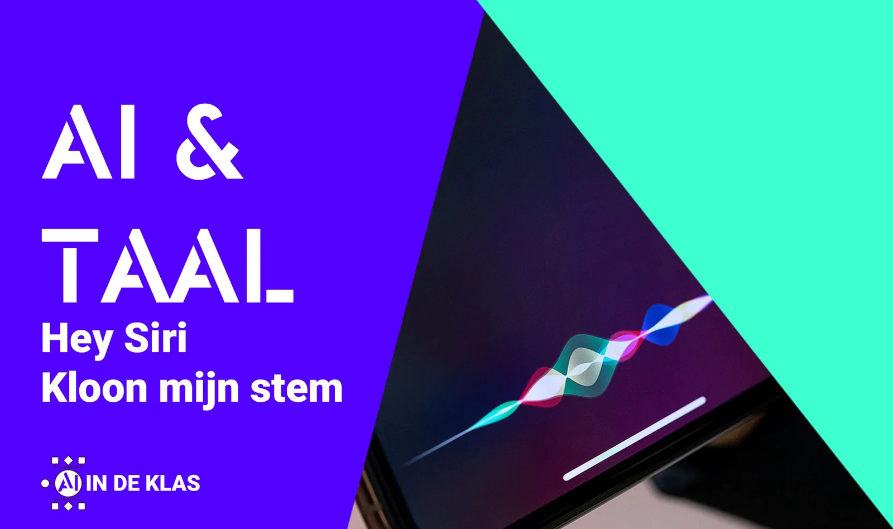
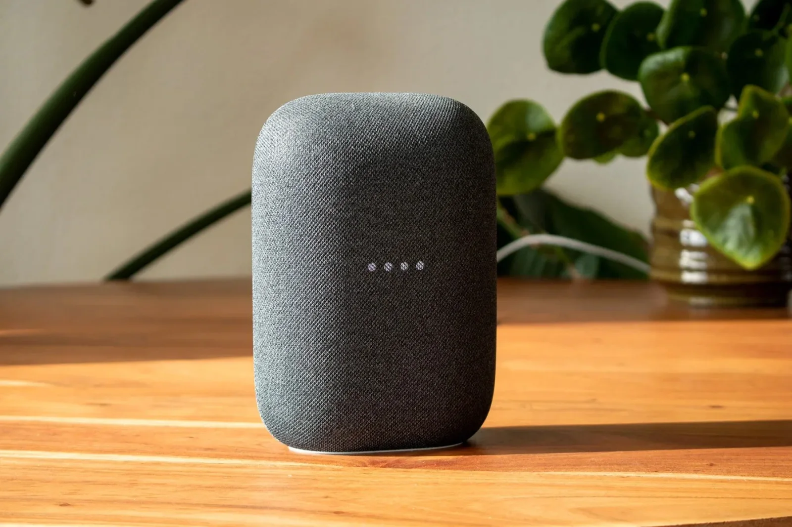
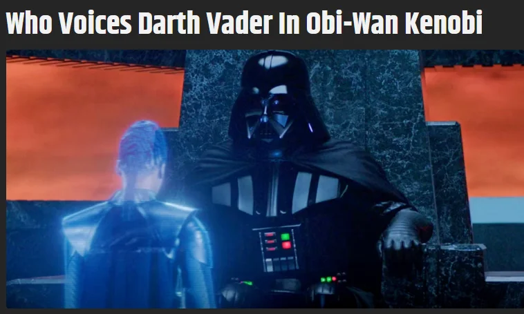
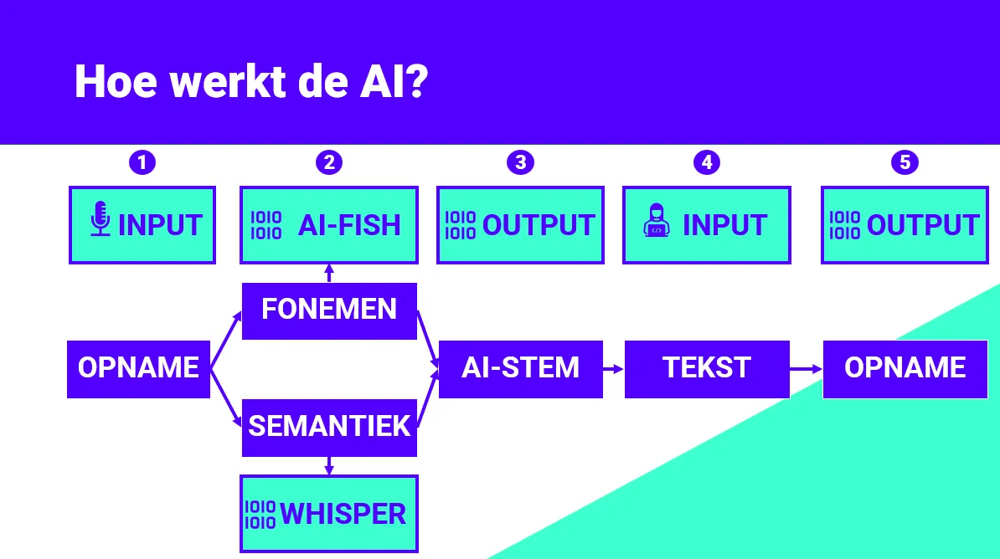
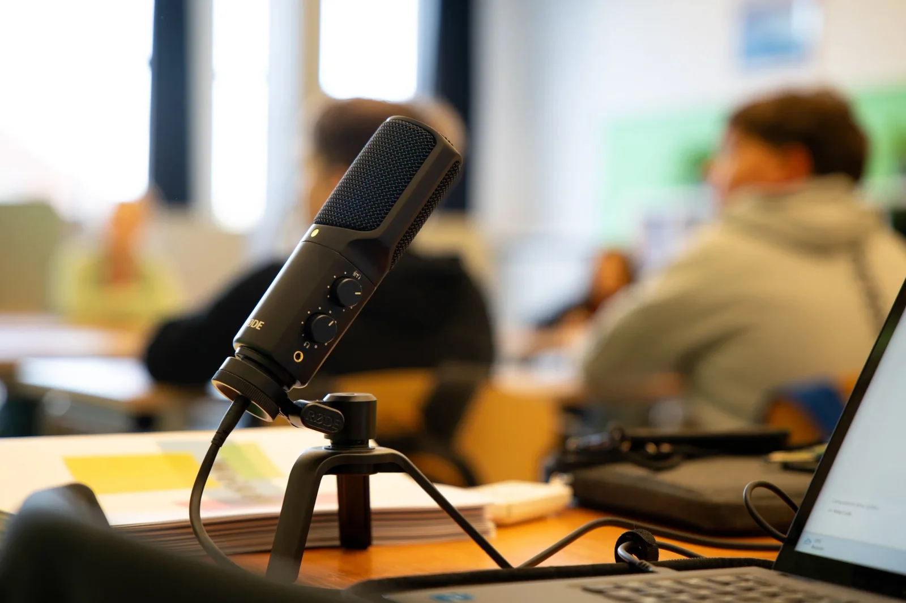
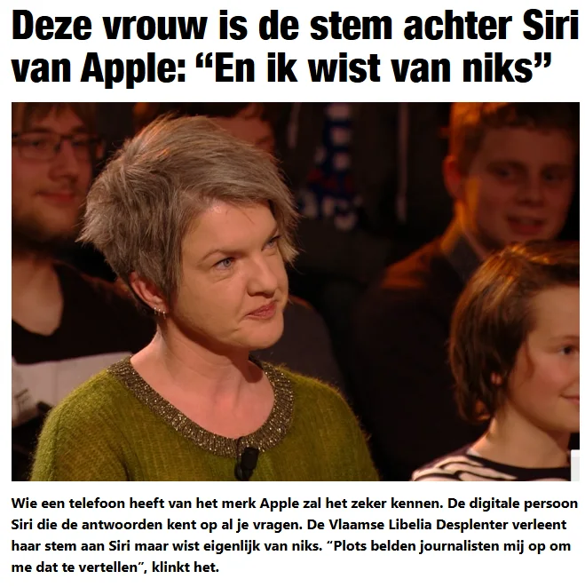
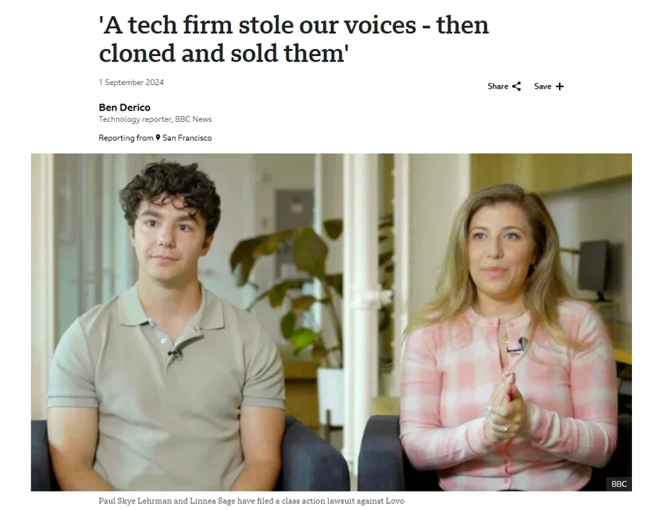
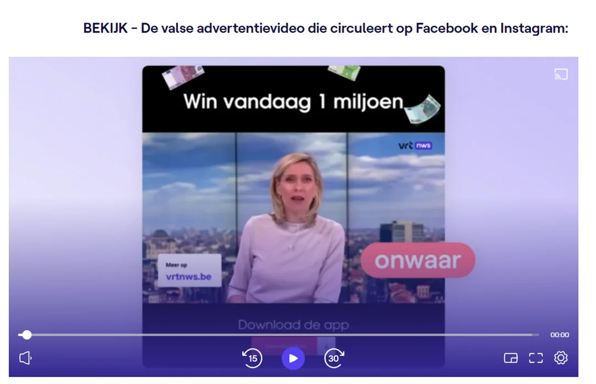
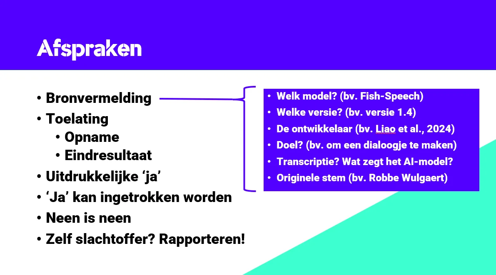
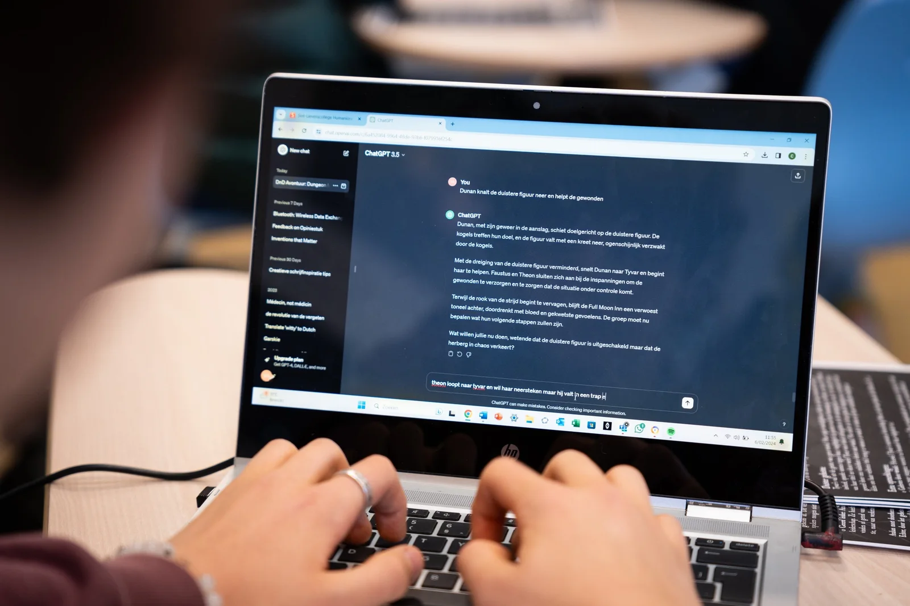

### Sprekende robots en digitale assistenten zijn geen toekomstmuziek meer. Met Siri, Alexa en de Google Assistant zijn we inmiddels vertrouwd. In België herinneren sommigen zich nog de innovaties van L&H en de Flanders Language Valley (RIP), maar anno 2025 staat de technologie mijlen verder. Wat als een digitale assistent niet alleen met je kon praten, maar dat ook kon doen met jouw eigen stem? Of stel je voor dat uitspraakoefeningen Engels veranderen in een dynamisch dialoog, waarbij geen van beide sprekers ‘echt’ aan het woord is. Dit lesmateriaal neemt je mee in de wereld van AI-stemklonen: wat is er nodig om jouw stem na te bootsen? Welke mogelijkheden biedt dit voor het onderwijs? En wat zijn de risico’s en ethische vraagstukken? Ontdek het zelf. Hey Siri, aan de slag!

### Spraakcomputers in ons leven

Digitale assistenten zijn niet meer weg te denken uit ons dagelijks leven. Siri, Google Assistant en Amazon Echo (Alexa) hebben hun weg gevonden naar smartphones, smartwatches en zelfs onze huiskamers. Ze beheren onze agenda, stellen herinneringen in, bedienen domotica, starten afspeellijsten en lezen zelfs het weerbericht voor.

Maar naast deze alledaagse functies worden AI-gegenereerde stemmen ook gebruikt in andere domeinen. Van Hollywood tot podcasts en de medische wereld: AI-modellen maken menselijke stemklonen mogelijk voor uiteenlopende toepassingen. Deze technologie is veel geavanceerder dan een simpele 'Hey Siri' of 'Okay Google,' maar biedt interessante inzichten in de werking van AI en taaltechnologie. We duiken even in die voorbeelden en ontdekken hoe we deze kunnen gebruiken in onze klaspraktijk. 

### Luke, I’m your AI father …

Darth Vader is niet alleen iconisch vanwege zijn verschijning, maar vooral door zijn stem. Sinds 1977 bracht James Earl Jones dit personage tot leven met zijn diepe, dreigende toon. Ook in de serie _Obi-Wan Kenobi_ klonk zijn stem opnieuw, maar deze keer werd ze gereconstrueerd met AI. Respeecher, een bedrijf gespecialiseerd in stemtechnologie, gebruikte oude opnames en een AI-model om de Vader-stem van de originele trilogie te recreëren.

Bron: ScreenRant - [https://screenrant.com/who-voices-darth-vader-in-obi-wan-kenobi/](https://screenrant.com/who-voices-darth-vader-in-obi-wan-kenobi/)

In 2024 overleed James Earl Jones, wat de rol van AI in het behoud van stemmen extra relevant maakt. Deze technologie maakt het mogelijk om iconische stemmen ook na iemands overlijden te blijven gebruiken. Tegelijk roept dit belangrijke ethische vragen op: van wie is een stem, mag en kan je die verkopen, en hoever mogen we gaan in het digitaal ‘verder leven’ van een artiest? 

### Geneeskunde

Ook in de medische sector wordt AI gebruikt, en dit niet enkel als ondersteuning bij de medische beeldvorming. Een voorbeeld hiervan is Google's _Project Euphonia_. Dit project ondersteunt mensen met spraakbeperkingen, zoals ALS-patiënten, door hen te helpen communiceren en zelfs hun eigen stem te behouden.

Het filmfragment met voormalig NFL-speler Tim Shaw illustreert de impact van deze aanpak. Door oude radio- en tv-opnames van Tim te analyseren, trainde Google een AI-model dat zijn stem digitaal reconstrueerde. Nu kan Tim teksten typen die de AI met zijn authentieke stem uitspreekt. Voor Tim en zijn familie was het emotioneel moment om zijn stem opnieuw te horen, terwijl het leek alsof hij een brief die hij eerder aan zichzelf had geschreven kon opdragen. 

Naast het praktische voordeel van verbeterde communicatie raakt deze technologie ook een meer gevoeliger punt, namelijk het behoud van persoonlijke identiteit. Met AI kunnen mensen, zelfs in de meest uitdagende omstandigheden, zichzelf blijven herkennen en hun eigen stem laten horen. 

[Video on YouTube](https://www.youtube.com/embed/pPPXY-fpcI8?feature=oembed)

### Hoe werkt voice cloning?

Om een stem te klonen met een AI-model, moeten we begrijpen welke eigenschappen van onze stem en taal nodig zijn voor een geslaagde imitatie. In het filmfragment met Tim zien we hoe hij zinnen hardop leest in verschillende stijlen en over uiteenlopende onderwerpen. Hoewel de inhoud van de tekst minder belangrijk is, let het model vooral op de semantiek (welke letters worden gebruikt) en de fonemen (hoe die klinken). Deze aanpak biedt een kans om met leerlingen te praten over taalverwerving, een proces dat doet denken aan lesjes zoals Aap-Noot-Mies, waarin klanken en letters worden gekoppeld.

Schematische voorstelling van de workflow en gebruikte AI-modellen.

### Invoer

Om een stemkloon te maken, kunnen we twee soorten audiobronnen gebruiken: eigen opnames of een YouTube-fragment. Eigen opnames kunnen eenvoudig worden geüpload via de Notebook, mits je een Google Chrome-browser gebruikt. Voor YouTube-fragmenten kopieer je de URL en plak je deze in de Notebook. De code scheidt het audiospoor van de video en bewaart alleen de eerste minuut audio om technische beperkingen van de server te respecteren. Langere fragmenten kunnen leiden tot ‘out-of-memory errors’. 

### Semantiek

Net als in het Euphonia-project beginnen we met het vaststellen van wat er precies is gezegd in de opname. Hiervoor gebruiken we Whisper, een _speech-to-text_ AI-model. Whisper zet het audiobestand automatisch om in tekst, wat veel tijd bespaart. 

### Fonemen

Met de transcriptie op zak kan het AI-model de letters en woorden koppelen aan klanken, oftewel fonemen. Door te leren hoe een spreker individuele klanken uitspreekt, bootst het model de stem na. Het eindresultaat is een text-to-speech-model dat tekst omzet naar audio. Wanneer je een tekst invoert, splitst het model deze in zinnen en tokens. Vervolgens koppelt het de tokens aan de klanken van de originele spreker en combineert alles tot een audiobestand. Dit bestand kun je direct beluisteren en downloaden. 

### Aan de slag met Python!

[Video on YouTube](https://www.youtube.com/embed/hgGD32kjBfU?feature=oembed)

### Tips voor een goede opname

Wil je het beste eindresultaat bereiken, dan heb ik hieronder enkele praktische tips:

-   Zorg dat er maar 1 spreker hoorbaar is. Een opname van een podcast, een druk gesprek of middenin een klaslokaal is dus **niet ideaal**. Het maakt het koppelen van de tekst aan de correcte klank, die van de doelspreker dus, heel ingewikkeld.

-   Hanteer een vrij constant volume, toon en intonatie.

-   Spreek rustig en houd kleine pauzes tussen zinnen.

-   Vermijd achtergrondlawaai!

-   Gebruik de microfoon van de laptop of, indien mogelijk, een aparte microfoon.

-   Neem de opname op via een applicatie op de laptop.

-   Vermijd opnames in ruimtes met echo!

### Resultaten

[Video on YouTube](https://www.youtube.com/embed/RtOPnER6oNM?feature=oembed)

[Originele Opname Robbe Wulgaert](/media/b8782313a39361456e2e935f47882c7a300b1efe9b1892acde7c27833c79312c.m4a)

[Scary Story, Kloon van Robbe Wulgaert](/media/d77eb9eee17c0b5fea76bee7286744cfe66ef4c695e9df846f6fe8e543d454db.mp3)

[Originele Opname Donald J. Trump](/media/fe7d59516b57cebf037ab8ba9a4e0d9e82c19cd1989dc77790f2ee32c264788f.mp3)

[Inleiding Odyssee door Kloon Donald J. Trump (Engels)](/media/76c1c79fa0eac06f00503af6fea943cdafbaaf919c6f670db7bda97af1cc0e25.mp3)

[Originele Opname Emmanuel Macron](/media/bcc14d76ad7bc9020b2917ca8389167207ece66db9a8cab18dc3d2b3f8f74d04.mp3)

[Inleiding Odyssee door Kloon Emmanuel Macron (FR)](/media/5983be9d130b56c275650be727f63e21a1962f3b76cbe9d21af71b6bb31b9220.mp3)

### Lesfasen en opdrachten

Hieronder vind je een voorbeeld van het verloop van dit lesproject.

### **Stap 1 - uitspraakopdracht**

We starten met een opname van een tekst in een rustige omgeving, bijvoorbeeld thuis of in een opnameruimte. Deze opname kan gekoppeld worden aan een leerlijn Engels of Frans en worden voorzien van formatieve feedback of summatieve beoordeling. Het doel is om leerlingen bekend te maken met het opnemen van duidelijke spraak en articulatie, een vrij essentiële basis voor voice cloning.

### Stap 2 - klassikale verkenning van de Notebook 

In deze stap leren leerlingen werken met de Notebook, waarin Pythoncode en AI-modellen worden gebruikt. Voor veel leerlingen is dit hun eerste kennismaking met programmeercode. We starten met modelleren: we laten zien hoe je een Notebook opstart en wat een codecel is. Ook bespreken we privacy en dataretentie. Dit is belangrijk omdat de opnames en stemklonen in ‘de cloud’ worden verwerkt, maar na de sessie automatisch worden gewist.

### Stap 3 - Uitspraak door AI

Met de opname uit Stap 1 maken we een nieuw audiofragment. We gebruiken een gemeenschappelijk tekstfragment voor de klas, bijvoorbeeld een passage uit de Odyssee. Het eindresultaat wordt voorzien van een referentie volgens een vast sjabloon:

-   _Welk model? (bv. Fish-Speech)_

-   _Welke versie? (bv. versie 1.4)_

-   _De ontwikkelaar (bv. Liao et al., 2024, Robbe W., 2025)_

-   _Doel? (bv. om een dialoogje te maken)_

-   _Transcriptie? (bv. wat zegt het AI-model?)_

-   _Originele stem? (bv. Robbe Wulgaert)_

### **Stap 4 - Dichter met AI**

In deze stap geven we de leerlingen meer vrijheid. Ze kiezen namelijk zelf welke tekst ze willen genereren met het text-to-speech-model van hun eigen stem. Maar probeer deze stap te koppelen aan een ander vak of project! Zo kan je hier een mooie brug maken naar de gedichtenweek door de leerlingen op zoek te laten gaan naar een gedicht dat hen echt aanspreekt. Dit zal de basis vormen van ons nieuw bestand. Ook dit bestand dienen ze in en voorzien ze van de gepaste referenties volgens bovenstaand schema.

### Stap 5 - Dialoogje onder AI’s 

Verdeel de klasgroep in duo’s en laat hen een dialoogje bedenken. Je kan hiervoor vertrekken van een dialoogje dat ze hebben moeten verzorgen in een ander vak. Ze kunnen dit dialoogje opnieuw gebruiken, of gebruikmaken van een large language model zoals Gemini, ChatGPT, CoPilot … om een variant te maken op dat dialoogje. Zorg er weliswaar voor dat er twee sprekers zijn.

Eenmaal het dialoogje is uitgeschreven, gaan beide leerlingen aan de slag. Ze maken elk apart een stemkloon op basis van de opname uit stap 1 en genereren zo zin per zin hun deel van het dialoogje. Deze zinnen downloaden ze naar hun computer en verwerken ze in een gedeelde PowerPoint-presentatie. Door de audiobestanden in sequentie te laten afspelen, simuleren we een dialoogje tussen twee stemklonen. Ook dit dienen de leerlingen waarbij ze opnieuw de afspraken rond referenties opvolgen.

### Valkuilen en gevaren

Deze technologie wordt jaar na jaar beter in het imiteren van stemmen. Ook de toegankelijkheid tot de AI-modellen en code gaat met rasse schreden vooruit … maar dat leidt ons ook tot enkele bezorgdheden en gevaren. Gevaren waar we het met de leerlingen best over hebben als we hen willen voorbereiden op deze steeds meer digitale wereld.

### Libelia Desplenter 

Het was even schrikken toen Libelia Desplenter de telefoon opnam. Journalisten belden haar op om haar te vertellen dat ze de nieuwe stem was van … Siri. De spraakassistent van Apple. Libelia was in een vorig leven stemacteur bij het ter ziele gegane Ternout en Hauspie. Daar had ze een hele resem opnames gemaakt die gebruikt worden door Stad Gent, de trams in Brussel en blijkbaar ook Siri. Apple had de rechten op haar stem kunnen kopen. Je stelt plotseling vast dat je in een digitale wereld leeft waarin niet alleen Darth Vader postuum voortleeft, maar je ook de rechten op jouw eigen stem kan verkopen en kwijtspelen.

Bron: [https://www.nieuwsblad.be/cnt/dmf20180213\_03355605](https://www.nieuwsblad.be/cnt/dmf20180213_03355605)

### Hollywood

Bovenstaande is vrij nieuw in Vlaanderen, maar in Hollywood ligt men er al lang wakker van. De protesten in de filmindustrie in 2023 en 2024 stonden deels in het teken van auteursrechten en de opkomst van dit soort AI-technologie. Zo overkwam het Paul Skye en Linnea Sage toen ze, na enkele freelance-opdrachten, merkten dat hun stemopnames gebruikt werden om stemklonen te maken voor podcasts. Iets waar ze nooit mee hadden ingestemd en waarvoor ze niet betaald werden. Helaas staan de auteursrechten op bijvoorbeeld jouw stem in veel landen nog in de kinderschoenen. In veel landen kan je hier juridisch weinig tot niks tegen ondernemen. Je stem kan niet alleen gekocht worden, maar dus blijkbaar ook ‘gestolen’.

Bron: BBC

### Phishing en fraude

Sommige kregen misschien al eens een verdacht WhatsApp-bericht. “Hoi mam en pap, ik ben mijn GSM verloren en heb dringend geld nodig …”. Daar trappen de meesten natuurlijk niet meer in. Maar wat als dit bericht wordt verzonden met de stem van jouw zoon of dochter? Want blijkbaar is een opname van pakwag 60 seconden voldoende om zoiets te maken. Het overkomt bekende TV-gezichten, waar er dus veel bronmateriaal van is, geregeld. 

Bron: [**https://www.vrt.be/vrtnws/nl/2024/01/16/deepfake-reclame-game/**](https://www.vrt.be/vrtnws/nl/2024/01/16/deepfake-reclame-game/)

### **Afspraken met leerlingen**

Doorheen dit lesproject gingen we aan de slag met onze eigen stem en eigen opnames, of fragmenten van YouTube van Macron of Trump … maar deze technologie kan ook misbruikt worden. Leerlingen kunnen opnames maken van elkaar of de docent en deze gebruiken als basis voor een stemkloon. Wellicht ondeugend bedoeld, maar dat is het heus niet altijd. Daarom hebben we het in dit lesproject ook over toelating geven, wanneer je deze kan intrekken en wat je kan doen als slachtoffer van deze technologie.

### AI-geletterdheid en leerdoelen

Dit lesproject kunnen we koppelen aan competenties uit het **EU DigComp Framework**, maar ook aan leerplandoelen Taaltechnologie & Taalredactie, Engels, Frans of zelfs Spaans. Die koppeling aan de leerplandoelstelling is afhankelijk van de uitspraakopdracht die we gebruiken als input of de opdracht rond gedichtenweek. Maar op vlak van AI-geletterdheid sluit dit lesproject aan bij volgende competenties:

-   Weet signalen te herkennen die aangeven of men communiceert met een mens of met een AI-gebaseerde gespreksagent (bv. bij het gebruik van tekst- of spraakgebaseerde chatbots).

-   Weet dat AI-systemen gebruikt kunnen worden om automatisch digitale inhoud te creëren (bv. teksten, nieuws, essays, tweets, muziek, afbeeldingen) met bestaande digitale inhoud als bron. Dergelijke inhoud kan moeilijk te onderscheiden zijn van menselijke creaties.

-   Weet hoe je AI-bewerkte/gemanipuleerde digitale inhoud in het ei gen werk kan verwerken (bv. verwerken van AI-gegenereerde melodieën in een eigen muzikale compositie). Dit gebruik van AI kan controversieel zijn omdat het vragen oproept over de rol van AI in kunstwerken, en bijvoorbeeld wie er gecrediteerd moet worden.

-   Overweeg de voor- en nadelen zorgvuldig voordat je toestemming geeft aan derden om persoonlijke gegevens te verwerken. Bijvoorbeeld, als je een digitale assistent op je smartphone gebruikt om bevelen te geven aan een robotstofzuiger, is het belangrijk om te beseffen dat die gegevens mogelijk toegankelijk zijn voor bedrijven, overheden en cybercriminelen. Dat risico bestaat vooral wan neer de verwerking van natuurlijke taal plaatsvindt op een externe server, in plaats van rechtstreeks op het apparaat zelf.

-   Je bewust zijn hoe AI-taal technologieën de toegang tot tools en diensten kunnen verbeteren, maar tegelijkertijd erkennen dat minder gesproken talen vaak ondervertegenwoordigd blijven.

Je kan dit lesproject koppelen aan volgende leerplandoelstellingen uit het leerplan **Taalredactie en Taaltechnologie uit de derde graad (leerplan KOV):**

-   LPD 4: De leerlingen gaan kritisch en doelgericht om met taaltechnologische hulpmiddelen.

-   LPD 5: De leerlingen lichten het maatschappelijk en wetenschappelijk belang van taaltechnologie toe.

-   LPD 6: De leerlingen illustreren hoe taaltechnologie hen in hun werk als taalprofessional kan ondersteunen.

### Benodigdheden

Tijdens het verloop van dit lesproject heb je volgende zaken nodig:

-   laptops met toegang tot een Google Chrome-browser;

-   stabiele internetverbinding;

-   toegang tot Google Colab via Google Workspaces (dit **_moet_** je aftoetsen met de ICT-coördinatie op school);

-   vaardigheid met het gebruiken van een webbrowser en de verkenner op de computer;

-   microfoon (ingebouwd, maar bij voorkeur een externe microfoon).

_Alternatieve browsers, besturingssystemen en devices kunnen werken, maar worden niet door mij ondersteund._

### Ik wil dit in mijn klas! Wat moet ik doen?

Wil je hier zelf mee aan de slag in jouw klaslokaal? Super! Samen met jongeren werken rond AI-geletterdheid en hen tegelijk tonen dat taaltechnologie ruimer is dan GPT-modellen gebruiken, is een leerzame activiteit. Met de knoppen hieronder kan je informatie opvragen rond nascholingen (Centrum Nascholing Onderwijs - Universiteit Antwerpen) over dit thema en de code inkijken. Je vindt er ook een link naar het boek ‘AI in de Klas - Praktische Gids voor Onderwijsprofessionals’. 

-   ### Nascholing: AI en taaltechnologie

    Type: Workshop - Duurtijd: 2 maal 2.5 uur (voormiddag en namiddag)

    Artificiële Intelligentie is niet meer weg te denken uit ons leven en uit ons onderwijs. Onderzoeksresultaten uit de digimeter van imec doopten generatieve AI als de snelstgroeiende technologie in onze gehele samenleving. Willens nillens drukken tools zoals ChatGPT ons op de feiten, ook in de klas.

    Aan het einde van deze volledige lesdag schrijf je zelf prompts om je te helpen bij het schrijven van formatieve feedback of lesontwerpen, bouw je jouw eigen AI-tutor en kan je jouw eigen stem klonen. Natuurlijk telkens met de bedenking: hoe koppelen we dit aan leerdoelen? Welke leerwinst kunnen we verwachten in deze AI-tijden? 

-   ### Nascholing: Doelen

    **Na deze nascholing kan je:**

    **Kennis:**

    -   **AI-geletterdheid**: Je kan in eigen woorden een AI-voorbeeld uit het dagelijks leven duiden.

    -   **AI-geletterdheid**: Je kan de werking van een GPT-model duiden.

    -   **AI-geletterdheid**: Je kan een praktijkvoorbeeld geven van hoe je AI in de klas brengt.

    -   **AI-geletterdheid**: Je kan een praktijkvoorbeeld geven van gewenst gebruik van de technologie.

    -   **Valkuilen**: Je kan bekende valkuilen duiden binnen de technologie (zoals hallucinaties, ecologie en privacy).

    -   **AI-Toepassingen**: Je kan volgende begrippen in eigen woorden duiden: context, prompt, system prompt.

    -   **Sentimentsanalyse**: Je kan de werking van een NLP en lexicon in eigen woorden duiden.

    -   **Stemklonen**: Je kan duiden hoe een AI-model op basis van speech-to-text en fonemen aan voice cloning kan doen. Je kan tevens duiden wat de maatschappelijke meerwaarde en gevaren zijn van deze technologie.

    **Vaardigheden:**

    -   ·       **Lesmateriaal** **maken**: Je kan zelf concreet en relevant lesmateriaal maken met AI-ondersteuning.

    -   **Verbeteren** **van** de **output**: Je kan via een structuur werken aan betere verwerking van input en output voor docenten en studenten.

    -   **Schrijfopdrachten**: Je kan een prompt uitwerken met een evaluatiematrix om te gebruiken bij formatieve feedback.

    -   **Schrijfopdrachten**: Je kan een eigen AI-tutor maken met system prompt voor het verkrijgen van formatieve feedback bij schrijfopdrachten.

    -   **Sentimentsanalyse**: Je kan een NLP en lexicon aanwenden om een tekst (recensie, motivatiebrief …) te analyseren.

    -   **Transcriptie**: Je kan een speech-to-tekst-model gebruiken om een audiofragment te transcriberen.

    -   **Stemklonen**: Je kan een TTS en STT model gebruiken om het uitwerken van stemklonen te koppelen aan een uitspraakopdracht (Engels, Duits …)

-   ### Nascholing: Doelgroep

    Dit is een specifieke en verdiepende sessie gericht op leerkrachten secundair en hoger onderwijs uit de tweede graad en derde graad. Deze nascholing is primair gericht op docenten taalredactie en taaltechnologie, vervolgens op leerkrachten moderne (vreemde) talen en pedagogisch ICT-coördinatoren met een talige achtergrond.

    Ben je geen taalleerkracht en/of op zoek naar een inleidende of brede nascholing over GPT-technologie? Dan verwijs ik je graag door naar de sessie ‘_ChatGPT: een (vergiftigd?) geschenk voor leraar en leerling?’_.

-   ### Nascholing: Praktische Informatie

    **Duurtijd:**

    -   Deze nascholing duurt tweemaal 2.5 uur en wordt herhaaldelijk ingericht via het [Centrum Nascholing Onderwijs van de Universiteit Antwerpen.](https://cno.uantwerpen.be/nl/opleiding/ai-en-taaltechnologie-hoe-ga-je-er-effectief-mee-aan-de-slag-in-je-taalles-79755)

    **Locatie:**

    -   Deze nascholing kan ook georganiseerd worden op een individuele school.

    **Prijs:**

    -   132 euro per deelnemer via het CNO;

    -   800 euro (exclusief verplaatsingskosten) indien ingericht op locatie.

-   ### Nascholing: Feedback Deelnemers

    Er namen reeds meer dan 154 cursisten deel aan deze nascholing. De deelnemers via het CNO gaven deze nascholing een **score van 4.32/5.**

    Enkele voorbeelden van hun feedback:

    -   _De concrete taak waarbij een podcast door leerlingen samengevat wordt, vervolgens door AI en dan de combinatie van beide. Toegankelijke oefening._

    -   _De kennis, helderheid, vlotheid en humoristische aanpak van de spreker._

    -   _Interessant, Wulgaert is een absolute expert in zijn vak!_

    -   _Heel sterke lesgever die complexe materie bevattelijk en concreet wist te maken. Met een directe link naar de lespraktijk. Ik volgde enkel het namiddagprogramma maar had spijt dat ik niet had ingeschreven voor de voormiddag ook._

    -   _Het lesmateriaal was concreet en in principe gebruiksklaar. Het oog voor detail en de kwaliteit van het materiaal waren erg hoog._

    -   _Het inzicht dat ik verkreeg door de deskundige uitleg van de lesgever. De werking van ChatGPT werd me duidelijk. De lesgever was heel onderlegd in het onderwerp._

    -   _De sessie heeft voor mij aangetoond dat wat ik ken en doe met AI, taaltechnologie, slechts het tipje van de ijsberg is. Een eye-opener._

    -   _De inhoud werd enthousiast gebracht en als leek kon je prima instappen. Aanschouwelijk lesmateriaal met leuke didactische tips die haalbaar zijn en gemakkelijk te vertalen zijn naar de eigen lespraktijk. Topervaring!_

    -   _Meteen hoog niveau en uitgaan van voorkennis. Geen onnodig gepamper bij aanvang._

    -   _“Alles werd heel duidelijk uitgelegd. Ook werden er veel concrete toepassingen van AI gegeven waar we effectief in de les met onze leerlingen mee aan de slag kunnen.”_

    -   _“De uitstekende balans tussen de theoretische achtergrond en de praktische voorbeelden/uitwerkigen.”_

    -   _“Er werd heel veel informatie gegeven die relevant en begrijpelijk was, zelfs als je niet veel van AI kent.”_

    -   _“De praktische toepassingen die meteen in de les Nederlands of een vreemde taal konden ingezet worden.”_

    -   _“De lesgever was zeer enthousiast over het onderwerp en wist de stof ook op een interessante manier te brengen. Ook op vragen had hij altijd een snel en duidelijk antwoord klaar.”_

    -   _“Een ontzettend inspirerende lesgever, cursusmateriaal waar je ook echt iets mee bent en massa's inspiratie die je mee naar huis neemt!”_

-   ### Lesmateriaal

    [Dit lesmateriaal kan je vinden via onze Discord Community.](https://discord.gg/U77FKEQfC6)

-   ### AI in de Klas (boek)

    Je kan meer informatie vinden over mijn boek via [deze link!](/boek)
