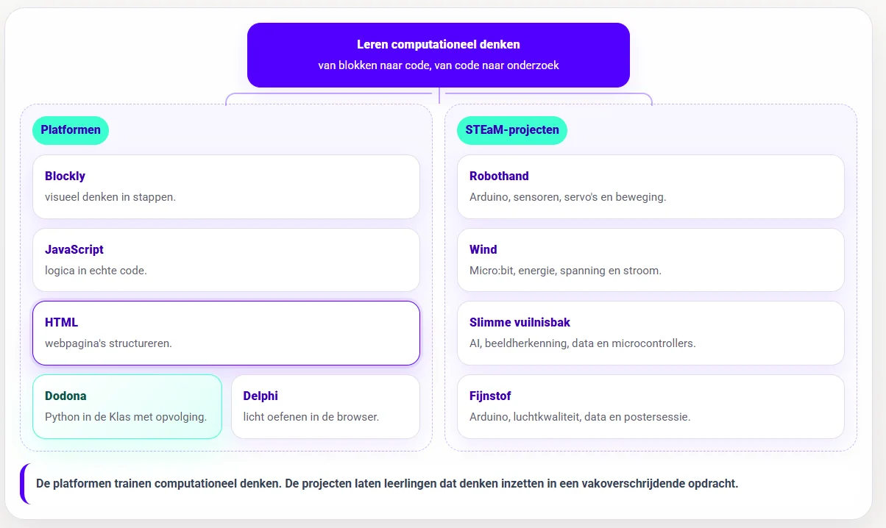

### Een webpagina lijkt op het eerste gezicht eenvoudig. Je ziet een titel, wat tekst, misschien een afbeelding en een paar links. Voor leerlingen voelt dat vaak minder technisch dan programmeren. Er beweegt niets. Er wordt niets berekend. Er is geen if, geen lus en geen variabele die plots roet in het eten gooit.

### Toch vraagt HTML nauwkeurig denken. Een webpagina is geen losse tekst op een scherm. Het is een gestructureerd document waarin elk onderdeel een plaats en functie heeft. Sommige informatie hoort in head, andere informatie hoort in body. Een title verschijnt niet op dezelfde plaats als een kop. Een afbeelding heeft een bestand nodig, maar ook attributen die betekenis geven.

### Daar wilde ik een kleine oefenomgeving voor bouwen. Leerlingen schrijven HTML, renderen de pagina, vergelijken het resultaat en onderzoeken wat er gebeurt wanneer de structuur niet klopt. Daarom bouwde ik **HTML in de Klas**: een browsertool met een opdracht links, een editor in het midden, een live preview rechts en automatische checks die leerlingen helpen om hun eerste webpagina’s stap voor stap op te bouwen.

### Wat is het?

**HTML in de Klas** helpt leerlingen om hun eerste webpagina’s te maken en vooral te begrijpen hoe die pagina’s opgebouwd zijn. Ik denk daarbij vooral aan leerlingen van ongeveer 12 tot 14 jaar, maar de tool kan ook dienen als korte herhaling of instapopdracht in andere jaren.

De oefeningen vertrekken niet vanuit mooie effecten of afgewerkte websites. Eerst komt de structuur. Leerlingen leren hoe je een webpagina beschrijft met HTML. Ze oefenen met de basisopbouw van een document, met tags, met attributen en met eigen inhoud. Ze ontdekken hoe belangrijk een duidelijke structuur is in jouw document.

In de oefeningen werken leerlingen onder meer aan een geldige basisstructuur met <!DOCTYPE html>, html, head en body. Ze gebruiken een passende title, schrijven koppen en alinea’s, voegen afbeeldingen toe met zinvolle attributen zoals src, alt en width, maken geordende en ongeordende lijsten, sluiten inhoud in via iframe en combineren verschillende bouwstenen in een eigen webpagina.

HTML is daarmee een interessante eerste stap richting webontwikkeling. Leerlingen leren eerst de structuur van een pagina lezen en schrijven. Daarna kan **JavaScript in de Klas** daar gedrag en interactie aan toevoegen.

### Hoe werkt de leeromgeving?

Leerlingen kiezen bovenaan een oefening. Elke oefening bevat een korte opdracht en startcode. Daarna schrijven ze HTML in de editor en klikken ze op **Render website**. Hun pagina verschijnt meteen in de live preview.

Leerlingen zien dus niet alleen code, maar ook wat hun code doet. Een nieuwe kop verschijnt op de pagina. Een afbeelding laadt wel of niet. Een lijst krijgt structuur. Een fout geplaatste tag zorgt voor een resultaat dat niet helemaal klopt. Zo kan je meteen debuggen!

De tool controleert ondertussen een aantal veelvoorkomende zaken. Hij kijkt of de basisstructuur aanwezig is: staat de doctype bovenaan en gebruiken leerlingen html, head en body? Hij controleert ook of de gevraagde elementen voorkomen, zoals koppen, alinea’s, lijsten, afbeeldingen of iframes. Daarnaast kijkt hij naar attributen en inhoud: heeft een afbeelding een src en alt, zijn er genoeg li-items en staat er zichtbare tekst in de body?

De feedback lost de oefening niet op. Als een attribuut ontbreekt, zegt de tool welk attribuut nodig is. Als er nog plaatsaanduidingen zoals <...> in de code staan, krijgt de leerling dat te zien. Als de structuur onvolledig is, wijst de feedback naar het probleem. Debuggen blijft een essentiële stap in het computationeel denken.

  

### **Feedback en syntaxhulp**

In de tool zit ook een klein formularium met syntaxhulp. Leerlingen kunnen dit openen wanneer ze de structuur begrijpen, maar nog zoeken naar de juiste schrijfwijze.

Daarin vinden ze snel terug hoe de basisstructuur van een HTML-pagina eruitziet, hoe je tags opent en sluit, wat attributen doen, hoe je koppen, alinea’s en lijsten schrijft, hoe je een afbeelding toevoegt, hoe je een iframe gebruikt en welke fouten vaak voorkomen.

Dat helpt vooral leerlingen die het concept begrijpen, maar struikelen over de exacte vorm. Ze weten wat ze willen doen, maar nog niet altijd hoe ze het correct noteren. Dan wil je niet dat de volledige oefening stilvalt op één vergeten sluitingsteken of attribuut.

Bij een evaluatie kan de leerkracht de syntaxhulp uitschakelen. Zo kan dezelfde omgeving eerst dienen om te oefenen en later om gerichter te controleren wat leerlingen zelfstandig beheersen.

### **Exporteren!**

Leerlingen kunnen hun webpagina exporteren als HTML-bestand. Dat bestand kunnen ze lokaal openen, verder bewerken of indienen. Daarmee blijft de oefening niet opgesloten in de tool. Het resultaat is ook echt een webbestand.

Daarnaast bevat de tool een PDF-export. Die bundelt de belangrijkste informatie over het werk van de leerling: naam, klas, gekozen oefening, conceptfocus, geschreven code en tekst uit de preview. Ook pogingen, tijd, verificatiegegevens en ruimte voor feedback van de leerkracht krijgen een plaats.

Die PDF is geen volwaardig leerlingvolgsysteem. Ik zie die export vooral als praktisch bewijs van werk bij opdrachten, korte evaluaties of portfolio’s. Wie meerdere oefeningen laat maken, kan de reeks ook bundelen in één PDF. Dat is handig wanneer leerlingen tijdens een les of studie zelfstandig door verschillende opdrachten werken en achteraf één bestand moeten indienen.

## **Hoe ziet de leerlijn er uit?**

Eerst verdiepen leerlingen via de **platformen** in de wereld van het computationeel denken. Ze leren de decompositie toepassen, leren programmeerconcepten herkennen, ontwerpen algoritmes en slaan aan het debuggen. Hiervoor hanteren we volgende **platformen**:

-   **Blockly in de Klas** helpt leerlingen eerst visueel redeneren. Ze oefenen daar met sequentie, selectie, begrensde herhaling en voorwaardelijke herhaling zonder dat syntax meteen met alle aandacht gaat lopen. Dit onderdeel zit in het begin van de leerlijn.

-   **JavaScript in de Klas** zit op een interessante plek in de reeks. Het komt na visueel redeneren met blokken, maar blijft dichter bij de browser dan Python. Daardoor kan het tegelijk programmeerconcepten oefenen en webgedrag zichtbaar maken.

-   **HTML in de Klas** zit in de webtak. Daar leren leerlingen hoe webpagina’s opgebouwd zijn met structuur, tags, attributen en inhoud. HTML beslist niets en herhaalt niets. **JavaScript** verbindt die werelden. De taal voegt gedrag toe aan webpagina’s en laat leerlingen dezelfde denkpatronen uit Blockly verder oefenen: variabelen, voorwaarden, lussen, functies, invoer, uitvoer en debugging.

-   **Project Delphi** neemt daarna Python op als tekstuele programmeertaal met een grotere oefencatalogus en testcases.

-   **Dodona blijft de allersterkste keuze voor volledige trajecten, dashboards, deadlines, evaluaties, klasopvolging, toetsen en zelfs examens!**

Daarna komen de **STEaM-projecten**. Die projecten gebruiken de opgebouwde concepten in grotere opdrachten waarin leerlingen bouwen, meten, testen en besluiten. De platformen trainen de bouwstenen van het computationeel denken. De projecten zetten tonen hoe we met die bouwstenen en digitale systemen een impact kunnen hebben op onze eigen leefwereld en samenleving.

-   Bij **Project Robothand** brengen leerlingen Arduino, sensoren, servo’s, seriële data en mechaniek samen in één werkend systeem. Dit past later in de leerlijn, na een eerste traject rond Arduino en fysieke computing. Leerlingen sturen niet alleen code naar een bordje, maar zien hoe sensorwaarden beweging veroorzaken.

-   Bij **Project Wind** verschuift de focus naar meten en onderzoeken. Leerlingen bouwen een windmolenopstelling, gebruiken de micro:bit om spanning en stroom te meten, berekenen vermogen en energie, vergelijken proeven en schrijven een besluit op basis van data. Hier wordt code een onderzoeksinstrument.

-   Bij **Slimme Vuilnisbak** komt daar artificiële intelligentie bij. Leerlingen verzamelen voorbeelden, kennen labels toe, trainen een model, testen voorspellingen, bekijken confidence-scores en koppelen de voorspelling aan een microcontroller. Zo wordt AI geen magische doos, maar een systeem dat werkt met data, labels, fouten en bijsturing.

-   **Fijnstof** hoort in dezelfde projectlaag. Tijdens dit STEaM-project gaan we aan de slag met Arduino, luchtkwaliteit, data en een postersessie. Leerlingen meten een verschijnsel uit de echte wereld, verwerken data en communiceren hun bevindingen.

Zo ontstaat er een overzichtelijk en duidelijk **curriculum**: eerst leren leerlingen redeneren, structureren en programmeren in kleine oefenomgevingen. Daarna gebruiken ze die kennis in projecten waarin code gekoppeld wordt aan fysieke systemen, meetgegevens, onderzoeksvragen en ontwerpkeuzes.

### **Ik wil dit in mijn klas! Wat moet ik doen?**

Wil je hier zelf mee aan de slag in jouw klaslokaal? Super! Samen met jongeren werken rond computationeel denken en programmeren is fantastisch, maar ik ben wellicht een bevooroordeelde bron. Met de knoppen hieronder kan je de tool zelf uittesten. Vind je een bug in mijn code? Laat het gerust weten via het contactformulier of via de Discord-server! 

<a class="content-button content-button--primary content-button--medium" href="https://robbew.github.io/htmlindeklas/" target="_blank" rel="noreferrer">Ga naar HTML in de Klas!</a>

<a class="content-button content-button--primary content-button--medium" href="/contact">Contacteer Robbe!</a>

