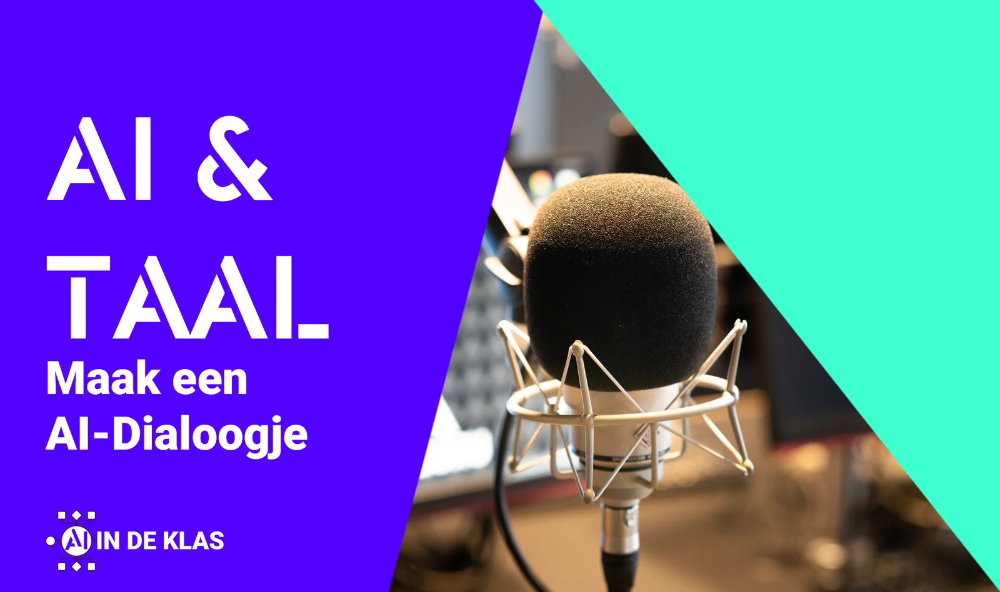
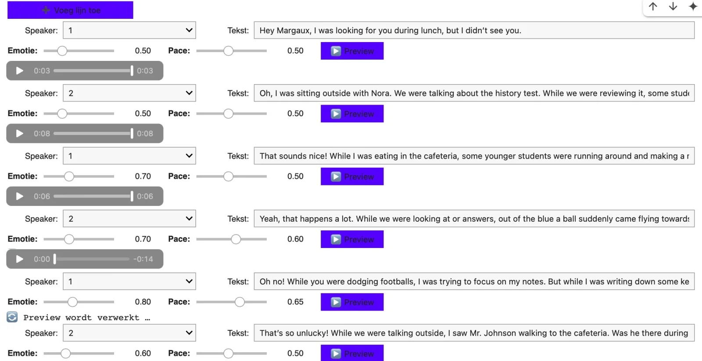

[Afgelopen schooljaar publiceerde ik lesmateriaal over het gebruik van AI-stemklonen in de klas.](/onderwijs/hey-siri-kloon-mijn-stem-2025) In dat lesmateriaal leren leerlingen over taalmodellen in onze samenleving (van Darth Vader tot ALS), over fonemen en voeren ze een spreek- en schrijfopdracht uit voor een taalvak. We gingen volop aan de slag: eerst maakten ze een geluidsopname van de bekende fabel "The North Wind and the Sun" van Aesopos om hun uitspraak Engels te beoordelen. Die opname gebruikten ze vervolgens als basis voor hun stemkloon.

Daarna schreven ze in duo’s korte dialoogjes waarbij ze grammaticale structuren uit hun recente Engelse les moesten gebruiken. Denk bijvoorbeeld aan de past continuous. De dialogen werden opgedeeld tussen twee sprekers en vervolgens gebruikten de leerlingen de aangeleerde aanpak om zin per zin in audiofragmenten te gieten. Elk fragment moest apart worden gedownload en vervolgens via PowerPoint-animaties na elkaar worden afgespeeld. Zo ontstond een simulatie van een dialoog.

### **Vorig resultaat:**

<!-- p08-deferred:media-d907dd16c6aa8822 -->

### Reflectie

Deze oefening werkte prima, maar we liepen ook tegen enkele problemen aan:

-   Het genereren van audio zin per zin kostte veel tijd omdat Fish-Speech versie 1.5 nogal traag werkte.

-   Leerlingen konden hun fragmenten niet vooraf beluisteren, waardoor ze de inferentiefase meerdere keren moesten herhalen als de audio niet goed genoeg was.

-   Bovendien was er geen mogelijkheid om de emotie of het spreektempo van de audiofragmenten aan te passen. Je zat vast aan de toon van de originele opname. (merk op: in bovenstaande fragmentje hoor je niet veel variatie)

-   Het werken met PowerPoint-animaties was een handige oplossing omdat leerlingen het programma kenden en dus geen nieuwe audioverwerker moesten leren gebruiken. Maar het was verre van ideaal om vloeiende dialogen mee te creëren.

**Tijd voor verbetering dus!**

### **Chatterbox**

Tijd om die pijnpunten aan te pakken. Of toch alleszins te proberen. We gaan hieronder aan de slag met Chatterbox. Dit is een open-source AI-model ontwikkeld door Resemble AI. Chatterbox heeft enkele duidelijke voordelen ten opzichte van ons vorige systeem:

-   Je kan meerdere sprekers tegelijk inladen en dus meteen dialogen maken zonder handmatig knip- en plakwerk.

-   Dankzij handige schuifregelaars kunnen leerlingen gemakkelijk het tempo en de emotie van elke zin aanpassen.

-   Leerlingen kunnen direct luisteren naar een voorbeeld voordat ze het definitieve audiobestand genereren. Zo moet je niet het gehele dialoogje maken om een eerste oordeel te vellen. Dit scheelt tijd.

-   Uiteindelijk genereert de code automatisch een samengevoegd audiobestand met beide stemmen keurig in de juiste volgorde.

### Nieuw resultaat

[Dialoogje met nieuw AI-model](/media/48b4a86192d0815217137bb21499f4533b4f08aa321465f46d8c00f57050fc89.mp3)

### Zut alors!

Toch is er één aandachtspunt: voorlopig werkt deze AI-aanpak alleen goed met Engels. De meertalige ondersteuning die Fish-Speech v1.5 bood, hebben we dus nog even niet. Begrijp me niet verkeerd, er komt bijvoorbeeld iets uit wat lijkt op Duits … maar de kwaliteit laat echt de wensen over. Dat is iets waar ik momenteel aan werk en waar ik zeker op terugkom.

Samenvattend: elk goed plan overleeft het eerste contact met de vijand niet. Zo gaat het ook met lesplannen en lesmateriaal. Na gebruik in de klas merkten mijn collega’s en ik enkele verbeterpunten op. Dit is een eerste poging om die op te lossen en zo volgend schooljaar betere eindresultaten te bereiken binnen dit lespakket rond AI-geletterdheid en taaltechnologie. Meer informatie over het volledige lespakket met aandacht voor ethiek, privacy en hoe deze technologie nu reeds wordt toegepast in onze samenleving [vind je hier.](/onderwijs/hey-siri-kloon-mijn-stem-2025) 

### Leerdoelen en benodigdheden

Dit lesmateriaal hoort bij een uitgebreider lespakket. Dat lespakket kan je [hier](/onderwijs/hey-siri-kloon-mijn-stem-2025) lezen. De doelen en benodigdheden hieronder slaan dus ook op inhouden die daarin dieper worden verkend.

-   ### Leerdoelen

    Dit lesproject kunnen we koppelen aan competenties uit het **EU DigComp Framework**, maar ook aan leerplandoelen Taaltechnologie & Taalredactie, Engels, Frans of zelfs Spaans. Die koppeling aan de leerplandoelstelling is afhankelijk van de uitspraakopdracht die we gebruiken als input of de opdracht rond gedichtenweek. Maar op vlak van AI-geletterdheid sluit dit lesproject aan bij volgende competenties:

    -   Weet signalen te herkennen die aangeven of men communiceert met een mens of met een AI-gebaseerde gespreksagent (bv. bij het gebruik van tekst- of spraakgebaseerde chatbots).

    -   Weet dat AI-systemen gebruikt kunnen worden om automatisch digitale inhoud te creëren (bv. teksten, nieuws, essays, tweets, muziek, afbeeldingen) met bestaande digitale inhoud als bron. Dergelijke inhoud kan moeilijk te onderscheiden zijn van menselijke creaties.

    -   Weet hoe je AI-bewerkte/gemanipuleerde digitale inhoud in het ei gen werk kan verwerken (bv. verwerken van AI-gegenereerde melodieën in een eigen muzikale compositie). Dit gebruik van AI kan controversieel zijn omdat het vragen oproept over de rol van AI in kunstwerken, en bijvoorbeeld wie er gecrediteerd moet worden.

    -   Overweeg de voor- en nadelen zorgvuldig voordat je toestemming geeft aan derden om persoonlijke gegevens te verwerken. Bijvoorbeeld, als je een digitale assistent op je smartphone gebruikt om bevelen te geven aan een robotstofzuiger, is het belangrijk om te beseffen dat die gegevens mogelijk toegankelijk zijn voor bedrijven, overheden en cybercriminelen. Dat risico bestaat vooral wan neer de verwerking van natuurlijke taal plaatsvindt op een externe server, in plaats van rechtstreeks op het apparaat zelf.

    -   Je bewust zijn hoe AI-taal technologieën de toegang tot tools en diensten kunnen verbeteren, maar tegelijkertijd erkennen dat minder gesproken talen vaak ondervertegenwoordigd blijven.

    Je kan dit lesproject koppelen aan volgende leerplandoelstellingen uit het leerplan **Taalredactie en Taaltechnologie uit de derde graad (leerplan KOV):**

    -   LPD 4: De leerlingen gaan kritisch en doelgericht om met taaltechnologische hulpmiddelen.

    -   LPD 5: De leerlingen lichten het maatschappelijk en wetenschappelijk belang van taaltechnologie toe.

    -   LPD 6: De leerlingen illustreren hoe taaltechnologie hen in hun werk als taalprofessional kan ondersteunen.

-   ### Benodigdheden

    Benodigdheden

    Tijdens het verloop van dit lesproject heb je volgende zaken nodig:

    -   laptops met toegang tot een Google Chrome-browser;

    -   stabiele internetverbinding;

    -   toegang tot Google Colab via Google Workspaces (dit **_moet_** je aftoetsen met de ICT-coördinatie op school);

    -   vaardigheid met het gebruiken van een webbrowser en de verkenner op de computer;

    -   microfoon (ingebouwd, maar bij voorkeur een externe microfoon).

    _Alternatieve browsers, besturingssystemen en devices kunnen werken, maar worden niet door mij ondersteund._

### Ik wil dit in mijn klas! Wat moet ik doen?

Wil je hier zelf mee aan de slag in jouw klaslokaal? Super! Samen met jongeren werken rond AI-geletterdheid en hen tegelijk tonen dat taaltechnologie ruimer is dan GPT-modellen gebruiken, is een leerzame activiteit. Met de knoppen hieronder kan je informatie opvragen rond nascholingen (Centrum Nascholing Onderwijs - Universiteit Antwerpen) over dit thema en de code inkijken. Je vindt er ook een link naar het boek ‘AI in de Klas - Praktische Gids voor Onderwijsprofessionals’. 

-   ### Nascholing: AI & Taaltechnologie

    Type: Workshop - Duurtijd: 2 maal 2.5 uur (voormiddag en namiddag)

    Artificiële Intelligentie is niet meer weg te denken uit ons leven en uit ons onderwijs. Onderzoeksresultaten uit de digimeter van imec doopten generatieve AI als de snelstgroeiende technologie in onze gehele samenleving. Willens nillens drukken tools zoals ChatGPT ons op de feiten, ook in de klas.

    Aan het einde van deze volledige lesdag schrijf je zelf prompts om je te helpen bij het schrijven van formatieve feedback of lesontwerpen, bouw je jouw eigen AI-tutor en kan je jouw eigen stem klonen. Natuurlijk telkens met de bedenking: hoe koppelen we dit aan leerdoelen? Welke leerwinst kunnen we verwachten in deze AI-tijden? 

-   ### Nascholing: doelen

    **Na deze nascholing kan je:**

    **Kennis:**

    -   **AI-geletterdheid**: Je kan in eigen woorden een AI-voorbeeld uit het dagelijks leven duiden.

    -   **AI-geletterdheid**: Je kan de werking van een GPT-model duiden.

    -   **AI-geletterdheid**: Je kan een praktijkvoorbeeld geven van hoe je AI in de klas brengt.

    -   **AI-geletterdheid**: Je kan een praktijkvoorbeeld geven van gewenst gebruik van de technologie.

    -   **Valkuilen**: Je kan bekende valkuilen duiden binnen de technologie (zoals hallucinaties, ecologie en privacy).

    -   **AI-Toepassingen**: Je kan volgende begrippen in eigen woorden duiden: context, prompt, system prompt.

    -   **Sentimentsanalyse**: Je kan de werking van een NLP en lexicon in eigen woorden duiden.

    -   **Stemklonen**: Je kan duiden hoe een AI-model op basis van speech-to-text en fonemen aan voice cloning kan doen. Je kan tevens duiden wat de maatschappelijke meerwaarde en gevaren zijn van deze technologie.

    **Vaardigheden:**

    -   ·       **Lesmateriaalmaken**: Je kan zelf concreet en relevant lesmateriaal maken met AI-ondersteuning.

    -   **Verbeterenvan** de **output**: Je kan via een structuur werken aan betere verwerking van input en output voor docenten en studenten.

    -   **Schrijfopdrachten**: Je kan een prompt uitwerken met een evaluatiematrix om te gebruiken bij formatieve feedback.

    -   **Schrijfopdrachten**: Je kan een eigen AI-tutor maken met system prompt voor het verkrijgen van formatieve feedback bij schrijfopdrachten.

    -   **Sentimentsanalyse**: Je kan een NLP en lexicon aanwenden om een tekst (recensie, motivatiebrief …) te analyseren.

    -   **Transcriptie**: Je kan een speech-to-tekst-model gebruiken om een audiofragment te transcriberen.

    -   **Stemklonen**: Je kan een TTS en STT model gebruiken om het uitwerken van stemklonen te koppelen aan een uitspraakopdracht (Engels, Duits …)

-   ### Nascholing: doelgroep

    Dit is een specifieke en verdiepende sessie gericht op leerkrachten secundair en hoger onderwijs uit de tweede graad en derde graad. Deze nascholing is primair gericht op docenten taalredactie en taaltechnologie, vervolgens op leerkrachten moderne (vreemde) talen en pedagogisch ICT-coördinatoren met een talige achtergrond.

    Ben je geen taalleerkracht en/of op zoek naar een inleidende of brede nascholing over GPT-technologie? Dan verwijs ik je graag door naar de sessie ‘_ChatGPT: een (vergiftigd?) geschenk voor leraar en leerling?’_.

-   ### Nascholing: praktische informatie

    **Duurtijd:**

    -   Deze nascholing duurt tweemaal 2.5 uur (dus twee dagdelen) en wordt herhaaldelijk ingericht via het [Centrum Nascholing Onderwijs van de Universiteit Antwerpen.](https://cno.uantwerpen.be/nl/opleiding/ai-en-taaltechnologie-hoe-ga-je-er-effectief-mee-aan-de-slag-in-je-taalles-79755)

    **Locatie:**

    -   Deze nascholing kan ook georganiseerd worden op een individuele school.

    **Prijs:**

    -   132 euro per deelnemer via het CNO;

    -   800 euro (exclusief verplaatsingskosten) indien ingericht op locatie.

-   ### Nascholing: feedback deelnemers

    Er namen reeds meer dan 154 cursisten deel aan deze nascholing. De deelnemers via het CNO gaven deze nascholing een **score van 4.32/5.**

    Enkele voorbeelden van hun feedback:

    -   _De concrete taak waarbij een podcast door leerlingen samengevat wordt, vervolgens door AI en dan de combinatie van beide. Toegankelijke oefening._

    -   _De kennis, helderheid, vlotheid en humoristische aanpak van de spreker._

    -   _Interessant, Wulgaert is een absolute expert in zijn vak!_

    -   _Heel sterke lesgever die complexe materie bevattelijk en concreet wist te maken. Met een directe link naar de lespraktijk. Ik volgde enkel het namiddagprogramma maar had spijt dat ik niet had ingeschreven voor de voormiddag ook._

    -   _Het lesmateriaal was concreet en in principe gebruiksklaar. Het oog voor detail en de kwaliteit van het materiaal waren erg hoog._

    -   _Het inzicht dat ik verkreeg door de deskundige uitleg van de lesgever. De werking van ChatGPT werd me duidelijk. De lesgever was heel onderlegd in het onderwerp._

    -   _De sessie heeft voor mij aangetoond dat wat ik ken en doe met AI, taaltechnologie, slechts het tipje van de ijsberg is. Een eye-opener._

    -   _De inhoud werd enthousiast gebracht en als leek kon je prima instappen. Aanschouwelijk lesmateriaal met leuke didactische tips die haalbaar zijn en gemakkelijk te vertalen zijn naar de eigen lespraktijk. Topervaring!_

    -   _Meteen hoog niveau en uitgaan van voorkennis. Geen onnodig gepamper bij aanvang._

    -   _“Alles werd heel duidelijk uitgelegd. Ook werden er veel concrete toepassingen van AI gegeven waar we effectief in de les met onze leerlingen mee aan de slag kunnen.”_

    -   _“De uitstekende balans tussen de theoretische achtergrond en de praktische voorbeelden/uitwerkigen.”_

    -   _“Er werd heel veel informatie gegeven die relevant en begrijpelijk was, zelfs als je niet veel van AI kent.”_

    -   _“De praktische toepassingen die meteen in de les Nederlands of een vreemde taal konden ingezet worden.”_

    -   _“De lesgever was zeer enthousiast over het onderwerp en wist de stof ook op een interessante manier te brengen. Ook op vragen had hij altijd een snel en duidelijk antwoord klaar.”_

    -   _“Een ontzettend inspirerende lesgever, cursusmateriaal waar je ook echt iets mee bent en massa's inspiratie die je mee naar huis neemt!”_

-   ### Lesmateriaal

    [Dit lesmateriaal kan je vinden via onze Discord Community.](/contact)

-   ### AI in de klas (boek)

    Je kan meer informatie vinden over dit topic in mijn boek via [deze link!](/boek)
