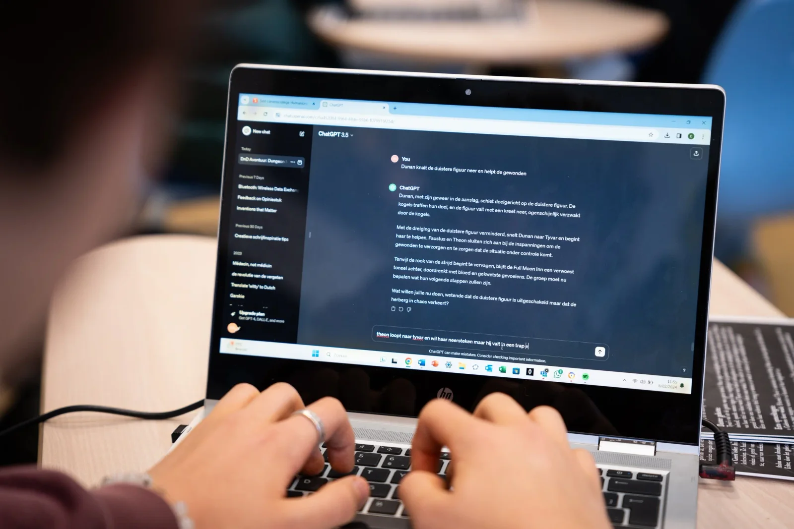
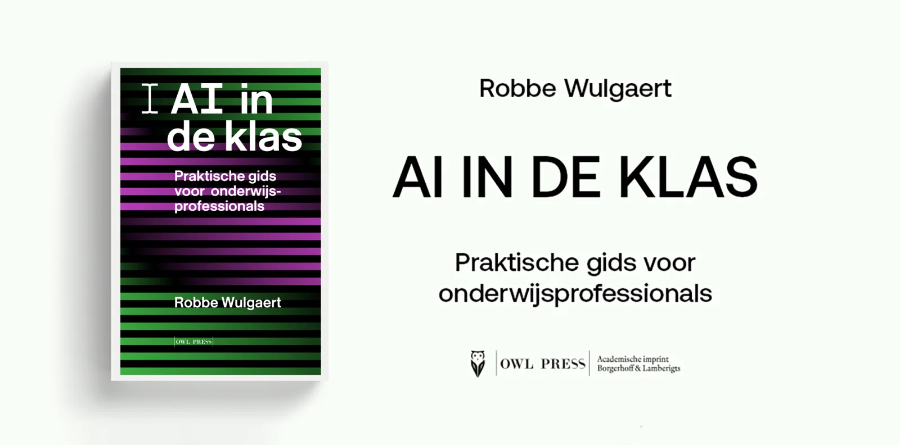

### Wanneer ik tijdens mijn lerarenopleiding terugkeerde naar mijn afstudeerschool, viel me op hoeveel er al veranderd was. Nieuwe gezichten, nieuwe lokalen, nieuw materiaal - allemaal in een ogenschijnlijk vertrouwde omgeving. Dat gevoel herkennen de oud-leerlingen van mijn huidige school ook tijdens hun jaarlijkse rondleiding door onze gebouwen. Maar is ons onderwijs werkelijk zoveel veranderd? Hoe hebben nieuwe technologieën zoals artificiële intelligentie invloed op onze lesinhoud en lesmethoden? Is een schriftelijke verhandeling eigenlijk nog relevant? Om deze vragen te beantwoorden, sprak ik met de Oud-leerlingenvereniging (OLV) van onze school over de impact van artificiële intelligentie in het onderwijs.

### [Dit interview verscheen in het ledenblad ‘De Cronijke’, jaargang 2024 nummer 1.](https://fliphtml5.com/zeyk/tzic/De_Cronijke_-_jaargang_2024_NR_1_DEF/27/)

### **Wat is ChatGPT eigenlijk?**

_ChatGPT maakt deel uit van de GPT-technologiefamilie (Generative Pre-trained Transformer), een geavanceerd type taalalgoritme dat is ontworpen om mensachtige tekst te genereren op basis van de input die het ontvangt. Wanneer je een gesprek voert hebt met ChatGPT of varianten zoals de Microsoft CoPilot of Google Gemini, via een tekstvak op een website, doet het je denken aan de chatbots die al jaren bestaan. Chatbots waar je misschien mee een gesprek diende te voeren wanneer er iets fout liep bij het boeken van een vliegreis of er zich een probleem voordeed met je Telenet-aansluiting. Klantendiensten gebruikten die al jaren, maar heel gelukkig werd je als klant niet van zo’n beperkt gesprek. ChatGPT en zijn concurrenten onderscheiden zich hier echter door een geavanceerder begrip van taalnuances en mogelijkheden._

_In de kern werkt een GPT-model met wiskundige modellen die waarschijnlijkheden berekenen om het volgende woord in een zin te voorspellen. Dit proces gebeurt woord voor woord, waardoor het AI-model antwoorden kan samenstellen die verrassend coherent en contextueel gepast kunnen lijken. Wanneer je de vraag stelt aan zo’n model “Wat is de hoofdstad van Finland …?”, gebruikt het de woorden in je vraag om het eerstvolgende woord te berekenen._

_De relevantie van deze technologie werd afgelopen jaar duidelijk zichtbaar door de toenemende populariteit onder jongere generaties. Scholieren én studenten! Volgens gegevens verzameld door de Scholierenkoepel gebruikt ongeveer 42% van de leerlingen regelmatig dit soort technologie. Ook de Digimeter-studie van imec stelde vast dat in de leeftijdscategorie 18-24 jaar bijna de helft (49%) van de studenten aan hogescholen en universiteiten, deze technologie regelmatig gebruikt. Willen of niet, deze technologie sijpelt ons onderwijs binnen. Maar ook op de werkvloer wordt dit soort technologie steeds vaker gebruikt._

### **Zal het gebruik van AI een impact hebben op het kennisniveau en de kritische ingesteldheid van leerlingen?**

_De vraag of het gebruik van AI invloed heeft op het kennisniveau en de kritische houding van leerlingen is terecht zorgwekkend. Steeds meer scholieren en studenten gebruiken deze technologie, maar het is cruciaal om te overwegen hoe ze deze tools gebruiken en welke vaardigheden ze daarbij ontwikkelen. Deze vraag is niet alleen relevant voor jongeren. Ook leraren maken gebruik van AI-technologie. Het is belangrijk om na te gaan of zij voldoende kennis hebben van deze technologieën, bewust zijn van de valkuilen, en of ze de mogelijkheden van AI kunnen benutten om hun vakgebied te versterken. Het baart mij zorgen als ik hoor dat docenten AI gebruiken om commentaren op rapporten te schrijven, omdat dit de persoonlijke touch in het onderwijs kan verminderen._

_Neem bijvoorbeeld een project op het Sint-Lievenscollege, ontwikkeld in samenwerking met de lerarenopleiding van de Universiteit Gent en Google DeepMind. We hebben AI niet ingezet om Nederlandse teksten te schrijven, maar bij een les Grieks! We ontwikkelden een algoritme dat niet het volgende woord voorspelt, maar dat ontbrekende karakters in Oudgriekse inscripties herstelt en helpt deze historische vondsten te dateren en plaatsen. Hoewel het lijkt alsof we al het denkwerk aan een computer overlaten, vereist de output van de AI nauwgezette controle door de leerlingen. Zij passen hun kennis van het Grieks en vaardigheden met woordenboeken toe om de AI 'factchecken'. Zonder deze kennis navigeren ze blind._

_Onderzoek van Yannis Assael en Thea Sommerschield toont aan dat deze aanpak, waarbij mens en machine samenwerken, nauwkeuriger en sneller resultaten oplevert dan de mens alleen. Is dit niet precies wat we moeten doen bij elke technologische doorbraak? Op avontuur gaan en ontdekken hoe het ons kan versterken in plaats van vervangen. Dat onze school laat zien dat er een mooi evenwicht kan bestaan tussen traditie en innovatie, en dat het AI-verhaal niet alleen voor STEM-vakken is, typeert het karakter van ons college._

### **Stuurt AI de leerling of kan de leerling AI zelf ook op creatieve wijze sturen?**

_Als we met een GPT-model zoals ChatGPT werken, zet de mens de eerste stap, maar wat daarna gebeurt, roept vragen op. Ik zal twee voorbeelden uit mijn lessen gebruiken om te illustreren hoe deze taaltechnologie ingezet kan worden bij het schrijven van zowel een opstel als een creatieve schrijfopdracht._

_Laten we beginnen met het opstellen van een argumentatieve tekst. De structuur is bekend: een inleiding met een stelling, gevolgd door een kern met drie argumenten, en een conclusie die de hoofdpunten samenvat. Het vermogen om een mening schriftelijk te articuleren is een essentiële vaardigheid die we onze leerlingen bijbrengen, net zoals het ondersteunen van argumenten met bronnen. Maar bronnen vinden is niet altijd eenvoudig. Of je vraagt het aan een GPT-model. "Hey ChatGPT, ik moet een opstel schrijven over generatie Rookvrij voor de les. Geef me drie argumenten om die stelling te ondersteunen," zou een leerling kunnen intypen. Voordat je het weet, verschijnen er drie argumenten op het scherm. In dit geval word ik, als docent, niet gelukkig. Hier komt geen echt onderzoek aan te pas. De leerling heeft zich niet verdiept in de materie, en de argumenten zijn niet het resultaat van zijn eigen denkwerk, maar van de technologie. Dit is een scenario waarin een leraar met kennis van AI moet ingrijpen om iets waardevols te beschermen._

_In een tweede voorbeeld uit de les gebruikten we een improvisatiespel waarin de leerlingen in groepen een fictieve wereld, eigen personages en een queeste creëerden. Het leek wel het begin van 'The Lord of the Rings'. Met hun zelfgeschreven teksten begonnen we een echt avontuur door onze stukken aan een GPT-model te geven met een specifieke opdracht: "Dit is onze spelwereld. Jij bent de verteller. We schrijven om de beurt een zet en jij reageert." Denk aan 'Dungeons and Dragons', maar dan met een AI. Hier ligt de creativiteit in de interactie tussen leerlingen en computer, een project dat opnieuw de synergie tussen mens en machine benadrukt._ 

### **Is er nog plaats voor de klassieke verhandeling?**

_Deze vraag klinkt vaak in lerarenkamers door heel Vlaanderen. De verleiding is groot om denkwerk uit te besteden aan GPT-technologie, gezien de snelheid, de schrijfkwaliteit, en de veelzijdigheid van de output. Onlangs besprak een studente op Radio 1 in het programma 'Het Uur van de Waarheid' hoe ze ChatGPT gebruikt om haar teksten samen te vatten, ideeën te genereren, onderzoeksresultaten te analyseren en zelfs hele alinea’s te schrijven._

_Hoewel ik geloof dat technologie een belangrijke ondersteuning kan bieden bij leren en werken, blijf ik benadrukken dat we moeten nadenken over welke competenties we actief inzetten. Vergelijk het met het gebruik van GPS: je vertrouwt op de technologie om je ergens heen te brengen, maar aan het einde van de rit moet je zelf kunnen controleren of je op de juiste bestemming bent aangekomen. Kun je bevestigen dat je in Lille bent en niet per ongeluk in het Antwerpse Lille?_

_In een vergelijkbare context, wanneer studenten voor elke alinea en analyse vertrouwen op een GPT-model, moeten we ons afvragen of zij daadwerkelijk de vaardigheden bezitten om aan het einde van hun academische 'reis' de juistheid van hun resultaten te beoordelen. Hebben ze de competenties en kennis om de output van een dergelijk model kritisch te evalueren en zo nodig te corrigeren? Zoals ik eerder beschreef in het project over het restaureren van Oudgriekse inscripties, als je niet de nodige kennis hebt om het model kritisch te beoordelen, speel je met vuur._

_Dus ja, volgens mij is er nog altijd plaats voor de klassieke verhandeling. Het vermogen om teksten te schrijven is een vaardigheid die we moeten blijven oefenen. Technologie, zoals een GPT-model, kan ons hierbij ondersteunen in de vorm van teamwork. Maar echt teamwork functioneert alleen als alle teamleden actief kunnen bijdragen. Anders noemen we het outsourcen._

### **Brengt AI Big Brother dichterbij?**

_Technologie op zich zal niet automatisch tot bepaalde resultaten leiden; het hangt af van hoe mensen ervoor kiezen om het te gebruiken. Dankzij de enorme rekenkracht van moderne computers zijn AI-modellen uiterst krachtig in het herkennen van patronen. Een voorbeeld hiervan vind je in de landbouw, waar slimme camera's onder sproeiinstallaties hangen om onkruid van gewassen te onderscheiden. Zo kunnen ze heel gericht bemesten of besproeien._

_Echter, deze vorm van patroonherkenning is slechts één toepassing van AI. Sommige fabrikanten en politici zijn snel geneigd om dergelijke technologieën te gebruiken voor het herkennen van personen, bijvoorbeeld tijdens een betoging of om te zien of een bestuurder tijdens het rijden met zijn smartphone bezig is._

_De lijn tussen het gebruik van deze technologie voor het verhogen van de veiligheid in onze maatschappij en het creëren van een 'Big Brother' samenleving is flinterdun. Dit onderwerp behandelen we tegenwoordig ook in de klas. Niet alleen leerlingen uit de richtingen ‘Wetenschappen’ en ‘Klassieke Talen’, maar ook die uit ‘Humane Wetenschappen’ komen in aanraking met AI. We verdiepen ons in hoe dergelijke AI-technologie en camera's werken en verkennen de mogelijkheden en valkuilen van emotieherkenning. Want als een camera je enige sensor is, reduceer je de beleving van emoties dan niet tot een puur visuele waarneming? Tot slechts één dimensie?_

### **Hoe vertaalt deze digitale omslag zich in de lesinfrastructuur van het college?**

_Voor wie bezorgd is dat de vertrouwde klaslokalen en lesmethoden onherkenbaar zijn geworden, is er geruststellend nieuws. Ondanks wat er soms in de media wordt beweerd, blijft ons onderwijs traditioneel hoogstaand. Je vindt hier nog altijd klassen met borden, stoelen en banken in rijen, en hier en daar een stoffig krijtbord vol wiskundige formules._

_Toch heeft de tijd zeker niet stilgestaan. Alle lokalen zijn voorzien van projectiemogelijkheden en geluidsinstallatie. Digitale borden worden steeds gebruikelijker, waarop docenten niet alleen kunnen projecteren, maar ook de lesstructuur kunnen omzetten in interactieve bordschema’s. Deze schema’s helpen om de leerstof te organiseren en effectief over te brengen, gecombineerd met het leereffect van het kunnen tonen van beelden tijdens het lesgeven (dual coding). Waar nodig nemen leerlingen hun laptops erbij om samen aan teksten te werken, te programmeren, inscripties te restaureren met een AI-model of hun eigen prototypes voor design thinking te ontwerpen, die we zelfs kunnen printen met onze 3D-printers._

_Nog niet elk lokaal is uitgerust met al deze technologieën. Het is een financiële en technologische uitdaging die over meerdere schooljaren is verdeeld, maar leraren die tijdelijk terug moeten naar een ouder lokaal, uiten hun ongenoegen soms in de lerarenkamer. Ik neem ze het niet kwalijk, ze willen gewoon zo optimaal mogelijk hun passie en kennis overbrengen naar onze leerlingen. Elk lesuur opnieuw._

* * *

### Lezing AI in ons onderwijs - 24/10

Benieuwd naar hoe wij dit thema in de les brengen of heb je na het lezen van dit interview nog meer vragen? Dan organiseert de Oud-leerlingenvereniging van het Sint-Lievenscollege een lezing over dit thema op 24 oktober 2024. Tijdens die avond bespreken we de impact van AI-technologie op onze samenleving, hoe wij het in de klas brengen en hoe onze leerlijnen werken. Al deze informatie vind je ook gebundeld in het boek ‘AI in de klas -Praktische gids voor onderwijsprofessionals’. Dat boek vind je natuurlijk ook tijdens die lezing! 

[Interesse / inschrijven? Neem gerust contact op via het contactformulier op deze website.](/contact)

