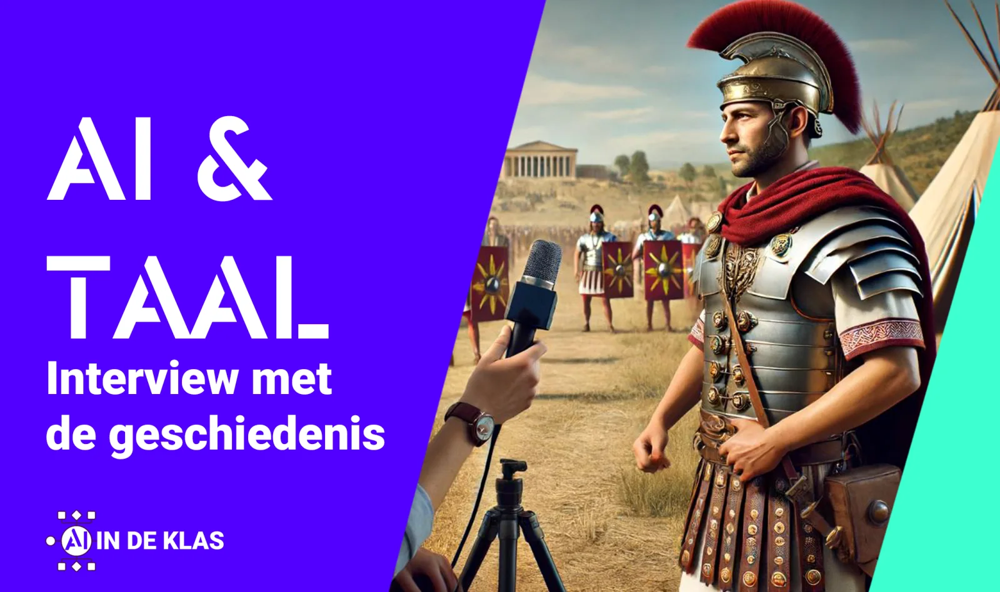

**Hoe zag een werkdag eruit voor Quintus Barbius Velinus, een Romeinse legioensoldaat? Kan Ada Lovelace uitleggen hoe de Analytical Engine werkt? Hoe kijkt Alexandre Dumas terug op zijn tijd op de militaire academie in Parijs? Hoewel we deze historische figuren niet zelf kunnen interviewen, op een teletijdmachine is het nog even wachten, kunnen we met behulp van artificiële intelligentie toch een glimp opvangen van hun ervaringen. Dit lesvoorbeeld bouwt voort op eerdere lessen over** [**taaltechnologie**](/onderwijs/taaltechnologie-op-de-redactie)**,** [**een nieuw onderdeel in het Archeocentrum Velzeke**](https://www.vrt.be/vrtnws/nl/2024/07/16/archeocentrum-velzeke-poppen-van-romeinse-soldaten-artificiele-i/#:~:text=In%20het%20Archeologisch%20Centrum%20in,%22%2C%20zegt%20conservator%20Kurt%20Braeckman.) **en laat zien hoe je AI kunt gebruiken om informatie te verzamelen, interviews voor te bereiden en fictieve gesprekken te voeren. Daarna leer je hoe je deze gesprekken kunt transcriberen, omzetten in nieuwsberichten en delen op sociale media. Niet door AI al het werk te laten uitvoeren, maar door het doelgericht in te zetten.**

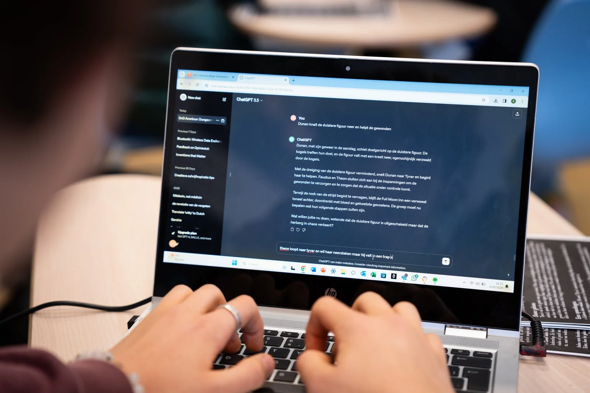

Dit experiment in "tijdreizen" vereist natuurlijk enige uitleg. Met dit lesmateriaal willen we niet alleen de taalvaardigheid van leerlingen verbeteren, maar ook hun AI-geletterdheid versterken.

We richten ons op specifieke vaardigheden en competenties, die we hieronder per fase van het project uiteenzetten. Telkens wordt voorafgegaan door _'de leerling kan'_:

### Achtergrondinformatie verzamelen:

-   bronnen vinden met een zoekmachine;

-   AI correct inzetten voor onderzoek;

### Het interview voorbereiden:

-   interviewvragen formuleren op basis van onderzoek.

-   specifieke-, open- en vervolgvragen bij een interview kunnen opstellen, duiden en onderscheiden;

-   een effectieve prompt opstellen voor een ‘large language model’;

-   belang van context begrijpen bij het maken van een prompt voor generatieve AI.

### Het interview afnemen:

-   informatie en vragen in een AI-model laden;

-   een interview opnemen (audio-of video-opname);

-   letten op juiste uitspraak tijdens het interview.

### Het interview verwerken tot een nieuwsartikel:

-   AI gebruiken om een transcriptie te maken;

-   de opbouw van een krantenartikel begrijpen, inclusief structuur, doelgroep, verzender, ontvanger …

-   de transcriptie verwerken tot een artikel;

-   het eigen artikel vergelijken en aanpassen met behulp van AI-output.

### Het artikel verwerken tot een socialmediapost:

-   elementen van een socialmediapost duiden, zoals platform, duidelijke boodschap, doelgroep, call to action en taalgebruik;

-   deze elementen toepassen om een artikel om te zetten in een social media post;

-   eigen bericht vergelijken en aanpassen aan de hand van de output van een AI-model.

Een behoorlijke boterham aan competenties. Deze stappen lichten we hieronder stap voor stap toe.

### Achtergrondinformatie verzamelen

### Persoon kiezen

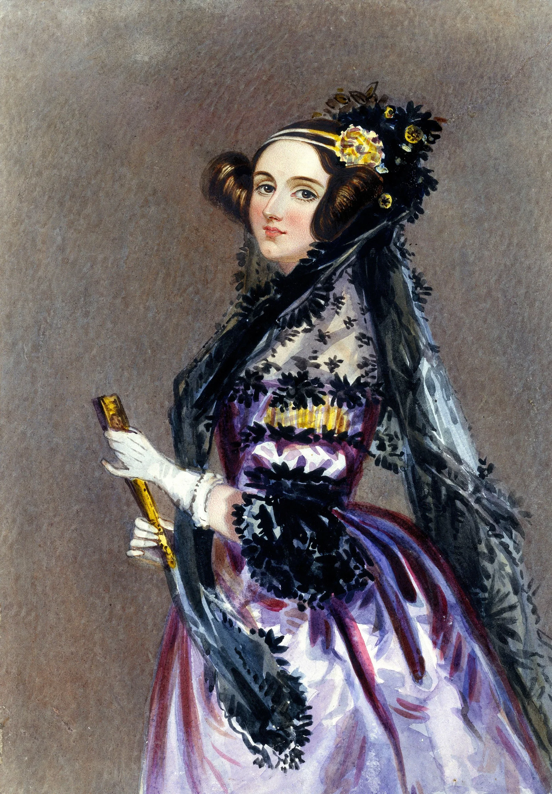

_Portret van Ada Lovalace Byron - Wikimedia_

We beginnen met de wie-vraag: welke persoon willen we interviewen? Hier ligt een kans om aan te knopen bij eerder behandelde stof, een vorig hoofdstuk, of het vak van een collega. Hebben de leerlingen in biologie net geleerd over Darwin? Of hebben ze in geschiedenis het hoofdstuk over Karel V afgerond? Gebruik deze momenten als aanknopingspunten. Laat leerlingen niet zomaar een willekeurige persoon kiezen, maar zorg ervoor dat de keuze aansluit bij het curriculum. Dit kan verticaal, door eerdere leerstof binnen hetzelfde vak te benutten, of horizontaal, door te kijken naar de leerlijnen van collega’s. Zo voorkom je dat leerlingen met een persoon moeten werken waar ze nog nooit van hebben gehoord, en geef je hen de kans om hun voorkennis te activeren.

Voor dit lesvoorbeeld kies ik een figuur die mijn leerlingen goed kennen: Ada Lovelace Byron, de (vermeende) eerste programmeur en een belangrijke pionier in de computerwetenschappen. Nu leerlingen een figuur hebben gekozen en voorbereid zijn om meer over hen te leren, rijst de vraag: hoe vinden ze de informatie die ze nodig hebben? In het huidige digitale tijdperk neigen velen snel naar GPT-toepassingen zoals ChatGPT, maar is dit altijd de beste keuze?

### Zoekmachine versus GPT-machine

Wanneer leerlingen hun persoon hebben gekozen, verzamelen ze belangrijke informatie in een tekstdocument. Tegenwoordig grijpen ze snel naar een GPT-toepassing zoals ChatGPT en voeren prompts in zoals: "Schrijf een korte biografie van tien zinnen over Ada Lovelace. Hou het taalgebruik op het niveau van een vijftienjarige student." Binnen enkele seconden verschijnt de gevraagde informatie op het scherm van de leerling. Klaar is Kees, toch?

_Wanneer VRT-journalist Tim Verheyden in een klas vijfdejaars polst naar het gebruik van ChatGPT (VRT-programma ‘Het Digitale Dilemma, seizoen 1 aflevering 2)_

Als je merkt dat dit gebeurt in de klas, kun je het zien als een waardevol leermoment. Wanneer leerlingen de opdracht krijgen om feitelijke informatie te verzamelen over een persoon, is blindelings vertrouwen op een generatief tekstmodel geen goed idee. Dit heeft te maken met de juistheid van de informatie, het risico op **hallucinaties** door het model, het **gebrek** **aan** **transparantie** over de bronnen, en het **ecologische** **vraagstuk** rond het gebruik van deze technologie.

**Hallucinaties**

Hallucinaties is een term die wordt gebruikt om onjuiste output van een AI-model te beschrijven. Dit gaat niet zomaar over verkeerde informatie, maar over output die heel overtuigend lijkt, maar bij nader onderzoek fout blijkt te zijn. Zo kan het gebeuren dat een AI-model een biografie van Ada Lovelace schrijft die voor 90% correct is, maar foutief vermeldt dat ze in Parijs is geboren, terwijl ze in werkelijkheid in Londen werd geboren. Wat het nog gevaarlijker maakt, is dat het AI-model deze fout of onzekerheid niet met de gebruiker deelt.

Deze hallucinaties kunnen ontstaan door verschillende factoren, zoals een gebrek aan data in de dataset waarmee het model is getraind, overfitting of de complexiteit van het model zelf. Er zijn dus veel mogelijke oorzaken van dit soort verzinsels. Om deze fouten te filteren uit de output van het AI-model, moeten gebruikers de informatie altijd factchecken, door verder onderzoek te doen en hun bestaande voorkennis toe te passen. Gebruikers die niet kritisch genoeg zijn of niet over voldoende voorkennis/vakkennis beschikken, lopen hier een groter risico.

Sta in de klas stil bij het gevaar van dit soort verzinsels voor de correctheid van het werk van leerlingen. Leer hen hoe ze de output grondig kunnen controleren en toon aan dat in tijden van AI een goede basis aan voorkennis uiterst belangrijk is en blijft. Ook goed bronnenonderzoek kan hierbij helpen. Maar naast de risico's van hallucinaties in AI-modellen, is een ander aspect waar we aandacht aan moeten besteden net de **transparantie** **van** **de** **bronnen** die deze modellen gebruiken.

**Transparantie**

Wanneer leerlingen een onderzoeksopdracht uitvoeren, biedt dit ons ook de kans om het belang van betrouwbare bronnen te benadrukken. Het is belangrijk dat leerlingen informatie halen uit bronnen die we als betrouwbaar beschouwen en dat ze een lijst van referenties opstellen. Dit is niet bedoeld om hen met extra werk te belasten, maar juist omdat het in wetenschappelijk onderzoek essentieel is dat resultaten kunnen worden geverifieerd en eventueel gerepliceerd. Hoewel dit laatste minder frequent voorkomt in het secundair onderwijs, vormt het wel een noodzakelijke reflex voor hogere studies.

Een belangrijke zwakte van AI-modellen zoals GPT is net hun onvermogen om transparant en betrouwbaar bronnen te vermelden. We kunnen dit illustreren met het eerder genoemde voorbeeld waarin een leerling via een prompt een biografie van Ada Lovelace verkrijgt. De tekst leest vloeiend, maar aan het einde ontbreekt een bronnenlijst. Als je het model vraagt om de bronnen te geven waarop het zich baseerde, blijken deze vaak onjuist of verzonnen te zijn, wat aansluit bij het eerder besproken probleem van hallucinaties. AI-modellen zoals Google Gemini of ChatGPT hebben geen live toegang tot de gigantische bibliotheken aan informatie waarop ze zijn getraind; ze genereren tekst door telkens het volgende woord in een zin te voorspellen.

Een klassieke zoekmachine biedt daarentegen wel zicht op de bronnen. Hoewel er ook algoritmes achter de schermen werken om de rangschikking van websites (en advertenties) te bepalen, biedt een zoekmachine gebruikers een scala aan bruikbare en vooral verifieerbare bronnen die zelf in hun onderzoek kunnen worden verwerkt.

Die klassieke zoekmachines bestaan al een gehele poos en zijn vrij efficiënt in hun taak. Die efficiëntie durft een laatste zwakke plek vormen van AI-systemen die we hier zullen bespreken. 

**Ecologisch vraagstuk**

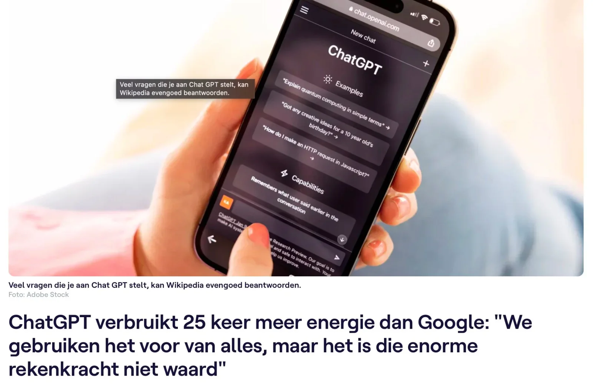

[_Uit een artikel van de VRT._](https://www.vrt.be/vrtnws/nl/2024/05/03/klimaatimpact-chat-gpt-ai/)

AI-modellen zoals tools voor tekstgeneratie zijn heel handig. In een handomdraai heb je een volledige tekst die misschien voor 94% gelijkaardig is aan de inhoud die je kon vinden op Wikipedia. Echter, zo een tekst genereren kost heel veel energie.

AI-modellen, zoals tekstgeneratietools, zijn handig en kunnen snel volledige teksten produceren die vaak grotendeels overeenkomen met wat je op Wikipedia zou vinden. Echter, het genereren van zo'n tekst kost heel veel energie. AI-modellen gebruiken complexe berekeningen om woorden te voorspellen en teksten te genereren. Die berekeningen vinden meestal plaats in datacenters over de hele wereld. Deze datacenters, met hun krachtige processors en grafische rekeneenheden, verbruiken enorme hoeveelheden energie.

Hoewel een zoekopdracht via een zoekmachine ook wordt uitgevoerd op een externe server, is de werking van zoekmachines veel geoptimaliseerder. Ze zoeken in bestaande databanken naar relevante informatie, een proces dat we door de jaren heen verfijnd hebben om energieverbruik te minimaliseren. Dit maakt zoekmachines aanzienlijk efficiënter in hun energiegebruik dan AI-tekstgeneratie.

Hoewel deze uitleg zich enkel richt op de energieverbruikende aspecten van het gebruik van AI-modellen door de eindgebruiker, is het belangrijk om te beseffen dat er ook energie nodig is voor het verzamelen van data en het trainen van AI-modellen. Toch kunnen we al concluderen dat in hun huidige vorm zoekopdrachten veel efficiënter zijn dan het genereren van teksten door AI. Daarom is het, vanuit ecologisch oogpunt, verstandig om bij eenvoudige informatieopdrachten te kiezen voor de geoptimaliseerde zoekmachineprocessen in plaats van energie-intensieve AI-tekstgeneratie.

### Interview voorbereiden

Nadat we de informatie over onze historische figuur hebben verzameld, dienen we ons interview voor te bereiden. Dit betekent dat we nadenken over relevante vragen die we kunnen stellen aan onze gesprekspartner. Die vragen kunnen we onderverdelen in drie types aan vragen, namelijk: specifieke vragen, open vragen en vervolgvragen. 

**Specifieke vragen**

Specifieke vragen focussen op één punt, zijn eenvoudig te beantwoorden en geven context aan het gesprek en de persoon die we interviewen. Ze zijn kort en bondig, waardoor ze ideaal zijn om het gesprek te beginnen. Voorbeelden van dit soort vragen zijn:

-   _In welk jaar ontmoette u … ?_

-   _Wie was uw voornaamste partner binnen het onderzoek?_

-   _Wanneer zag u voor het laatst …?_

**Open vragen**

Open vragen geven de gesprekspartner de ruimte om een gedetailleerd antwoord te geven. Deze antwoorden bieden de mogelijkheid om persoonlijke inzichten en ervaringen te delen en kunnen leiden tot nieuwe informatie. Bijvoorbeeld:

-   _Kunt u uitleggen hoe u de Analytical Engine verder hebt ontwikkeld?_

Een open vraag is ook ideaal als afsluiter van het gesprek, zoals: “Zijn er zaken die we niet hebben besproken, maar die je zeker nog wilde meegeven?” Dit geeft de gesprekspartner de kans om het gesprek af te ronden met een laatste inzicht of toevoeging.

**Vervolgvragen**

Vervolgvragen zijn vaak het moeilijkst om van tevoren vast te leggen. Ze ontstaan vanuit informatie die je tijdens het interview krijgt en bieden de kans om dieper in te gaan op nieuwe inzichten. Vervolgvragen tonen aan dat je actief luistert en echt geïnteresseerd bent in het verhaal van je gesprekspartner. Als je alleen je voorbereide vragen afwerkt, kan dat de indruk wekken dat je minder betrokken bent.

Deze vragen verzamelen we opnieuw in het tekstdocument waar we eerder de achtergrondinformatie in bundelden. Dit document zullen we, zowel als interviewer als onze AI-gesprekspartner, gebruiken tijdens het interview.

### Interview afnemen

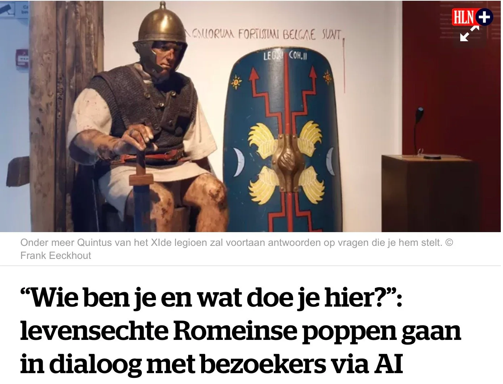

_Een voorbeeld van hoe AI-modellen "gesprekken met historische figuren" tot leven kunnen brengen. Een project van Lean Learning Machines en Archeocentrum Velzeke._ [_Bron (HLN)_](https://www.hln.be/zottegem/wie-ben-je-en-wat-doe-je-hier-levensechte-romeinse-poppen-gaan-in-dialoog-met-bezoekers-via-ai~a5eece9a/)

Nu is het tijd om ons interview te voeren. Hiervoor gebruiken we een GPT-model. Hoewel de teletijdmachine helaas nog niet bestaat, kunnen we dankzij AI toch een gesprek simuleren met Ada Lovelace. Door onze achtergrondinformatie en vragen om te zetten in een duidelijke prompt, kunnen we het echte interview beginnen. We starten met het ontleden van de belangrijke elementen van een prompt, geven vervolgens vorm aan onze eigen prompt, en gaan uiteindelijk over naar het echte gesprek.

### Interviewprompt opstellen

Als we willen communiceren met een GPT-model, moeten we het voorzien van een instructie, ook wel een prompt genoemd. Deze prompt fungeert als de spelregels voor onze conversatie, die het AI-model gebruikt om context te geven aan de antwoorden die het genereert. Elke keer dat het GPT-model een antwoord formuleert, berekent het het volgende woord of token op basis van de woorden in onze prompt. Hoe beter we de prompt structureren en verrijken met relevante informatie, hoe nauwkeuriger en nuttiger de output van het model zal zijn. In feite spelen we door het opstellen van een prompt een rollenspel met het AI-model, waarbij wij bepalen hoe het model zich moet gedragen.

### Interviewprompt ontleden

Nu we begrijpen hoe een prompt werkt, gaan we deze ontleden. We hebben spelregels nodig om het rollenspel succesvol te laten verlopen. Een voorbeeld van zo’n prompt zou kunnen zijn:

* * *

_“We spelen een interview - rollenspel. Jij bent de persoon die geïnterviewd wordt. Ik zal jou interviewen. Ik geef je hieronder enkele zaken mee._

_\-                basisinformatie over jouw persona._

_\-                mogelijke vragen die we tijdens het interview aan jou kunnen stellen._

_Je krijgt eerst deze informatie. Lees die grondig door. Geef weer of je de opdracht begrijpt voordat we aan het interview beginnen. Begrepen?”_

* * *

Vervolgens geven we de GPT-tool twee zaken mee, namelijk de achtergrondinformatie die we hebben verzameld in de eerste fase van dit lesproject en de vragen die we hebben opgesteld in de tweede fase van het lesproject. Deze informatie kan je aan de GPT-tool geven door een eenvoudige copy-paste uit te voeren. Hieronder vind je beide stukken die ik heb ingevoerd in mijn conversatie met ChatGPT.

-   ### Achtergrondinformatie Ada Lovelace

    **Inleiding**

    Augusta Ada King, Countess of Lovelace, beter bekend als Ada Lovelace, was een baanbrekende Engelse wiskundige en schrijfster die belangrijke bijdragen leverde aan de vroege ontwikkeling van de computer. Ze werd geboren op 10 december 1815 en is vooral bekend vanwege haar werk aan Charles Babbage's voorgestelde mechanische computer voor algemeen gebruik, de Analytical Engine. Lovelace was de eerste die inzag dat deze machine potentiële toepassingen had die verder gingen dan alleen berekeningen. Ze zag een toekomst voor zich waarin computers symbolen konden manipuleren en complexe algoritmen konden creëren. Ondanks de uitdagingen waar ze tijdens haar leven mee te maken kreeg, legden Lovelace's visionaire inzichten de basis voor de toekomst van computergebruik en verdiende ze een plaats in de geschiedenis als 's werelds eerste computerprogrammeur.

    **Haar leven en familieachtergrond**

    Ada Lovelace was het enige wettige kind van de beroemde dichter Lord Byron en de hervormster Anne Isabella Milbanke. Haar geboorte op 10 december 1815 markeerde een korte periode van eenheid in het gezin, want haar ouders scheidden een maand later. Haar vader, Lord Byron, verliet Engeland en keerde nooit meer terug. Uiteindelijk stierf hij in Griekenland toen Ada net acht jaar oud was. Lovelace's moeder, vastbesloten om te voorkomen dat haar dochter zou erven wat zij zag als Byron's krankzinnigheid, richtte Ada's opvoeding op wiskunde en logica. Ondanks deze inspanningen bleef Ada gefascineerd door de erfenis van haar vader en noemde ze haar twee zonen zelfs Byron en Gordon. Bij haar dood vroeg ze om naast hem begraven te worden.

    **Opvoeding en invloeden**

    Ada's vroege jaren werden gekenmerkt door frequente ziekte, maar dit weerhield haar er niet van om haar studie met kracht voort te zetten. Haar moeder huurde de beste docenten in om Ada's interesse in wetenschap en wiskunde te cultiveren. Een van haar leermeesters was Mary Somerville, een bekende wiskundige en wetenschapper die Ada in contact bracht met belangrijke wetenschappelijke figuren uit die tijd, waaronder Andrew Crosse, Sir David Brewster, Charles Wheatstone en Michael Faraday. Ada ontwikkelde ook een vriendschap met de beroemde schrijver Charles Dickens. Deze connecties waren belangrijk voor haar intellectuele ontwikkeling en wetenschappelijke perspectief.

    In 1833, toen Ada achttien was, leidden haar wiskundige talenten haar naar Charles Babbage, een mede-Britse wiskundige die vaak "de vader van de computer" wordt genoemd. Ada en haar moeder bezochten een van Babbage's zaterdagavond soirees, een bijeenkomst van intellectuelen en wetenschappers. Dit evenement markeerde het begin van een lange en productieve samenwerking tussen Ada en Babbage, waarbij de nadruk vooral lag op zijn werk aan de Analytical Engine.

    **Bijdragen aan de informatica**

    De belangrijkste bijdragen van Ada Lovelace aan computers kwamen tussen 1842 en 1843 toen ze een artikel van de Italiaanse militair ingenieur Luigi Menabrea over de Analytical Engine vertaalde. Ada vertaalde het artikel niet alleen; ze vulde het aan met een uitgebreide set van zeven aantekeningen, bekend als "Notes". Deze aantekeningen worden beschouwd als fundamenteel in de geschiedenis van computers. Vooral de zevende notitie wordt vaak genoemd als het eerste computerprogramma - een algoritme bedoeld om door een machine te worden uitgevoerd. Deze bewering wordt echter betwist door sommige historici die beweren dat Babbage's eerdere aantekeningen de eerste programma's voor de machine bevatten.

    Ongeacht dit debat, toonde Ada's werk aan de Analytical Engine haar unieke visie op wat computers konden bereiken. Terwijl Babbage en anderen de machine zagen als een hulpmiddel voor het uitvoeren van complexe berekeningen, voorzag Ada de mogelijkheid om symbolen te manipuleren en complexe algoritmen te creëren, waarmee ze de weg vrijmaakte voor toekomstige ontwikkelingen in de computerwetenschap. Haar perspectief, dat ze "poëtische wetenschap" noemde, stelde haar in staat om te onderzoeken hoe technologie kon dienen als een hulpmiddel voor samenwerking, dat zowel individuele capaciteiten als maatschappelijke functies kon verbeteren.

    **Nalatenschap**

    De bijdragen van Ada Lovelace aan de informatica werden tijdens haar leven niet volledig erkend, maar haar visionaire inzichten hebben haar sindsdien een prominente plaats in de geschiedenis opgeleverd. De programmeertaal Ada, ontwikkeld door het Amerikaanse Ministerie van Defensie, is naar haar vernoemd om haar blijvende invloed op het vakgebied weer te geven. Lovelace's leven en werk blijven wetenschappers, wiskundigen en computerprogrammeurs inspireren en benadrukken het belang van creativiteit en interdisciplinair denken bij technologische innovatie.

    **Conclusie**

    Het leven van Ada Lovelace was een mix van intellectuele nauwgezetheid en creatieve visie, kwaliteiten die haar in staat stelden om de expansieve mogelijkheden van computers te voorzien lang voordat deze werkelijkheid werden. Als enig wettig kind van Lord Byron erfde ze een erfenis van literaire genialiteit die ze combineerde met haar moeders gedisciplineerde focus op wiskunde en logica. Haar samenwerking met Charles Babbage en haar inzichtelijke aantekeningen over de Analytical Engine getuigen van haar pioniersgeest. Ondanks de uitdagingen waarmee ze werd geconfronteerd, waaronder frequente ziekte en maatschappelijke beperkingen, legden de bijdragen van Ada Lovelace de basis voor de moderne informatica. Haar nalatenschap als 's werelds eerste computerprogrammeur blijft het zich ontwikkelende gebied van de computerwetenschap inspireren en beïnvloeden.

-   ### Interviewvragen Ada Lovelace

    **Introductie**

    -   "Goedemorgen, Ada. Dank u voor uw tijd vandaag. Mijn naam is \[Jouw Naam\] en ik ben journalist bij \[Naam van het Nieuwsbedrijf\]."

    -   "Ik ben hier om meer te weten te komen over uw leven en uw werk op het gebied van wiskunde en computerwetenschappen."

    1.  **IJsbreker**

        -   "Hoe voelt het om te weten dat uw werk nog steeds bestudeerd en gewaardeerd wordt in de moderne tijd?"

    **Achtergrond**

    3.  **Specifieke vraag**

        :

        -   "Welke rol speelde uw moeder, Anne Isabella Milbanke, in uw opvoeding?"

    **Ontmoeting met Charles Babbage**

    4.  **Specifieke vraag**

        :

        -   "In welk jaar ontmoette u Charles Babbage voor het eerst?"

    5.  **Specifieke vraag**

        :

        -   "Kunt u uitleggen hoe u de concepten van Charles Babbage's Analytical Engine verder ontwikkelde?"

    6.  **Vervolgvraag**

        :

        -   "U sprak over de samenwerking met Charles Babbage; kunt u meer vertellen over een specifiek project waar u bijzonder trots op bent?"

    **Wat heeft ze bereikt?**

    7.  **Open vraag:**

        -   "Wat inspireerde u om de mogelijkheden van de Analytical Engine verder te verkennen dan alleen rekenkundige berekeningen?"

    8.  **Vervolgvraag**

        :

        -   "U noemde dat u muziek gebruikte als inspiratie voor uw werk; kunt u een voorbeeld geven van hoe dat uw ideeën beïnvloedde?"

    9.  Open vraag:

        -   Men omschrijft u tegenwoordig als de eerste programmeur, gezien in uw notities over de analytische machine het eerste algoritme te vinden was. Klopt dit? Wat vindt u daar zelf van?

    **Persoonlijke inzichten**

    9.  **Open vraag:**

        -   "Wat zijn enkele van de moeilijkste momenten die u hebt ervaren tijdens uw werk aan de Analytical Engine?"

    **Toekomst**

    10.  **Open vraag:**

         -   "Wat hoopt u dat uw nalatenschap zal zijn voor toekomstige generaties wetenschappers en ingenieurs?"

We geven de GPT-tool nog een laatste instructie mee voordat we het interview echt kunnen beginnen.

_“Begrijp je het doel en de opzet van dit interview? Ik speel de interviewer, jij de interviewee. We werken vraag per vraag. Beantwoord de vraag duidelijk. Gebruik taal op niveau van een X-jarige leerling. Leg moeilijke begrippen telkens kort en bondig uit. Begrepen? (ja/neen)”_

### Interview afnemen en opnemen

Nu we de prompt hebben opgesteld en de spelregels duidelijk zijn, is het tijd om deze in de praktijk te brengen. We starten ons gesprek met het AI-model en nemen dit op voor verdere analyse en feedback. Hoewel de spraakmogelijkheden van dergelijke tools beter presteren in het Engels, zijn ze ook in het Nederlands voldoende geschikt om een realistisch interview te simuleren.

[Video on YouTube](https://www.youtube.com/embed/5SGViMRtxLc?feature=oembed)

Vraag de leerlingen om met een tweede toestel (smartphone, tablet of laptop) het gesprek op te nemen. Deze opname gebruiken we om feedback te geven op hun uitspraak, het gebruik van vervolgvragen, en de algehele interactie in het gesprek. Zo krijgen de leerlingen een volledig beeld van hun spreekvaardigheid en kunnen ze hun vaardigheden verder aanscherpen.

### Nieuwsartikel schrijven

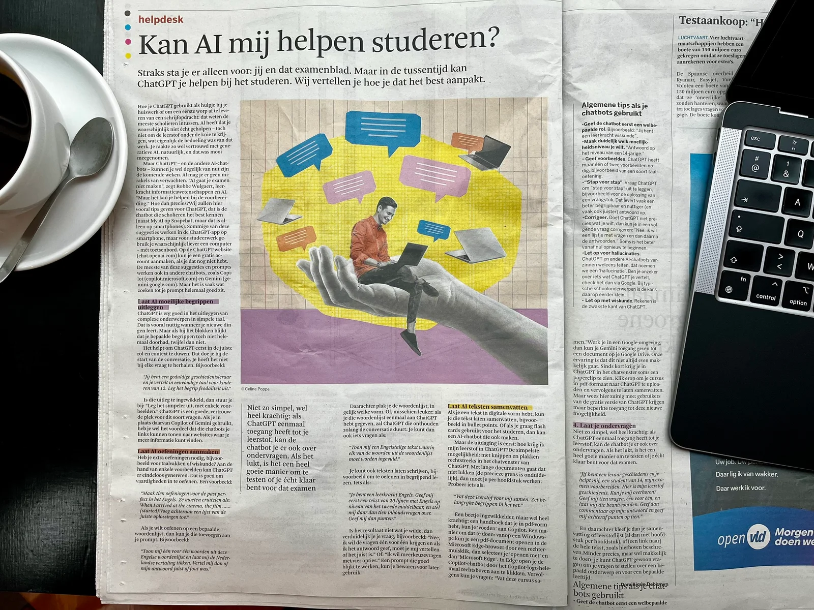

Nu het interview is afgerond, willen we onze bevindingen delen met een breder publiek. Dit doen we door een krantenartikel te schrijven waarin we de belangrijkste inzichten uit ons gesprek verwerken. Om dit te doen, hebben de leerlingen twee zaken nodig: kennis van de structuur van een krantenartikel en een transcriptie van het gevoerde gesprek.

### Structuur krantenartikel

We gaan aan de slag met enkele kranten in de klas om te analyseren hoe een goed artikel is opgebouwd. Dit hebben leerlingen waarschijnlijk al eerder gedaan, maar een herhaling kan geen kwaad. Ze zoeken naar de volgende kenmerken: krantenkoppen, tussentitels, inleiding, en conclusie. Daarnaast analyseren ze de inhoud: wie het betreft, wat er is gebeurd, waar en wanneer het plaatsvond, wie de doelgroep / ontvanger is, wie is de zender en wat de toon van de tekst is.

### Transcriptie

Een transcriptie van het gesprek kan op twee manieren worden gemaakt. Traditioneel kan een leerling de audio handmatig uittypen, wat tijdrovend is. Tegenwoordig wordt dit proces vaak versneld door gebruik te maken van AI-tools zoals Whisper, die in enkele minuten een volledige transcriptie kunnen genereren. Het is echter belangrijk dat leerlingen de transcriptie zorgvuldig controleren, omdat AI nog steeds fouten kan maken, vooral in het Nederlands of bij onduidelijke uitspraak. Ongecorrigeerde fouten kunnen zich verder verspreiden in het project, wat kan leiden tot foutieve informatie in het uiteindelijke nieuwsartikel.

-   ### AI-transcriptie van het gesprek met Ada

    Morgen Ada. Bedankt voor je tijd vandaag. Mijn naam is Robbe en ik ben een journalist bij AI in de klas. We zijn hier om meer te weten komen voor je werk en het opgebied van wiskunde, vooral in vermaatkawetenschappen. Wil je zelf eventjes kort voorstellen aan ons? Goedemorgen Robben, bedankt voor de uitnodiging. Mijn naam is Aral Lutleys en ik ben een wiskundige en schijfster, vooral bekend op mijn werk aan Charles Babbage's voorgestelde mechanische computer, de Analytical Engine. Ik ben geboren op 10 december 1815 en wordt vaak beschaald als de eerste computerprogrammeur vanwege mijn uitgebreide notities en algoritmes die ik heb ontwikkeld voor de Analytical Engine. Ja, goeiemorgen heb ik gezien in een syllabus de week gebruikken op school dat je er nog altijd vermeld wordt. Voelt het om te weten dat uw werk nog steeds besudeerd en waardeerd wordt ook in deze moderne tijd? Het is werkelijk een eer en een bron van grote voldoening. Het idee dat mijn inzichten en werk nog steeds invloed hebben en relevant zijn in de moderne tijd geeft me een diep gevoel van trots. Het is prachtig om te zien hoe de basisprincipes die ik heb gelegd hebben bijgedragen aan de geavanceerde technologieën die we vandaag de dag gebruiken. Misschien moeten we even beginnen bij het begin. We zijn een stuk van die opvoeding misschien. Welke rol speelde uw moeder en Isabel Milbank in die opvoeding eigenlijk? Mijn moeder Anne Isabel aan Milbanken speelde een cruciale rol in mijn opvoeding. Ze was vastbesloten om mij een grondige opleiding in wiskunde en logica te geven. In de hoop dat dit mij zou beschermen tegen wat zij zag als de krankzinnigheid van mijn vader, Lord Byron. Ze huurde de beste leraren in en moedigde me voortdurend aan om mijn intellectuele capaciteiten te ontwikkelen. Haartoewijding aan mijn educatie heeft zeker bijgedragen aan mijn latere werk en succes in de wetenschap. Heeft u ooit uw vader Lord Byron ontmoet? Nee, ik heb mijn vader Lord Byron nooit ontmoet. Mijn ouders scheiden toen ik nog maar een maand oud was en mijn vader verliet Engeland kort daarna. Hij overleed toen ik acht jaar oud was, zonder dat ik ooit de kans had gehad hem te ontmoeten. Ondanks dat voelde ik altijd een sterke band met zijn literaire erfenis en zijn creativiteit. Misschien gaan we nu over naar uw belangrijkste werk, het werk met een lillical engine. En heb je samen gedaan met Charles Babbage in welk jaar ontmoeten u Charles Babbage voor het eerst? Ik ontmoet de Charles Babbage voor het eerst in het jaar 1833. Ik was toen 18 jaar oud en werd geïntroduceerd aan hem tijdens een van zijn zaterdagavonds race bij einkomsten van intellectuele en wetenschappers. Dit moment markeerde het begin van een lange en vruchtbare samenwerking tussen ons. Kan je uitleggen dat die concepten van de engine van Charles Babbage precies ontwikkeld zijn, of hoe dat u die verder heeft ontwikkeld? Jazeker. Charles Babbage ontwikkelde het concept van de analytical engine, een mechanische computer die in staat zou zijn om complexe berekeningen uit te voeren. Mijn belangrijkste bijdrage kwam toen ik een artikel van Lelgi Menabrea over de analytical engine vertaalde en aanvulde met mijn pijgen notities bekend als notes. In deze notities beschreef ik niet alleen hoe de machine berekeningen kon uitvoeren, maar ook hoe het symbolen kon manipuleren en complexe algoritmen kon creëren. Ik voorzacht toepassingen die verder gingen dan alleen wiskunnige berekeningen, zoals het creëren van muziek. Mijn werk tonde aan dat de analytical engine veel bredere mogelijkheden had dan wat Babbage oorspronkelijk had bedacht, wat een belangrijke stap vooruit was in de ontwikkeling van de computer wetenschap. U noemde dan net muziek, dat is een eigenaar de gebrug tussen computer wetenschappen en muziek. Kun je een voorbeeld geven dat dat creatief of dat muzikaal uw ideeën beïnvloed? Natuurlijk, muziek is in beze een reeks van symbolen en patronen, net als wiskunde. Dit inzicht bracht me er toe te verkennen hoe de analytical engine symbolen zou kunnen manipuleren om niet alleen berekeningen uit te voeren, maar ook creatieve processen te ondersteunen. Een specifiek voorbeeld is mijn idee dat de analytical engine in staat zou kunnen zijn om muziek te componieren. Ik stelde me voor dat de machine door patronen in muziek te analyseren en te repliceren nieuwe muziekstukken zou kunnen creëren. Dit concept was revolutionair omdat het liet zien dat de mechanische computer meer kon doen dan alleen reken kunnen getaken. Het kon ook een middel zijn voor artistieke en creatieve expressie. Deze visie op de veelzijdigheid van computers heeft de manier waarop we technologie zien en gebruiken aanzienlijk beïnvloed. Is het net die veelzijdigheid dat ze net aanhaalden dat ervoor zorgt dat men jou ziet als eerste programmer en niet Charles Babbage? Ja, dat speelt zeker een rol. Terwijl Charles Babbage de concepten en meganismen voor de analytical engine ontweer, ging mijn werk verder door de bredere implicaties en mogelijkheden van de machine te verkennen. Mijn notities bevatten niet alleen algoritmen, maar ook een visie op hoe de machine symbolen kon manipuleren en verschillende soorten taken kon uitvoeren, inclusief creatieve en niet rekenkullige processen. Dit bredere perspectief op wat computers zouden kunnen doen, gecombineerd met mijn gedetailleerde algoritmische notities, heeft er toe bijgedragen dat ik vaak als de eerste programmer wordt beschouwd. Mijn benadering van poetische wetenschap benadrukt de integratie van creativiteit en logica, wat een nieuw en diepgaand inzicht bood in de potentie van computationele machines. U had wel gedacht dat computers muziek zouden kunnen maken, maar had u ooit kunnen dromen dat mensen zouden kunnen babbelen, chatten, spreken met computersystemen, dat die computersystemen gewoon zouden kunnen terug spreken met ons en mensentouw? In mijn tijd was het idee van machines die met mensen kunnen praten, zoals we dat vandaag kennen, nog pure science fiction. Hoewel ik visionair was in het zien van de veelzijdigheid van computers, kon ik me niet voorstellen hoe ver de technologie zich zou ontwikkelen. Het vermogen van moderne computers om te communiceren in natuurlijke mensentaal en zelfs gesprekken te voeren zoals wij nu doen, is werkelijk verbluffend. Dit dan aan hoe ver de wetenschap en technologie zijn gevoorderd en het is een prachtige illustratie van het potentieel dat ik ooit in de analytical engine zag. Een machine die veel meer kon dan alleen rekenen, maar kon bijdragen aan de menselijke ervaring op manier die toen nog onvoorstelbaar waren. Misschien nog een laatste vraag voor jou. Wat hoop je dat u na een latenschap zal zijn voor de toekomstige generaties van informatiekant-wetenschappers programmeurte negen uur? Ik hoop dat mijn naalatenschap toekomstige generaties zal inspireren om buiten de gebaande paden te denken en de grenzen van wat mogelijk is te verleggen. Ik wil dat mijn werk hem er aan herinnert hoe belangrijk het is om zowel creatief als analytisch te zijn en om de kracht van interdisciplineerdenken te omarmen. Mijn visie op technologie als een hulpmiddel voor zowel logische berekeningen als creatieve expressie zou hem moeten aanmoedigen om innovatief en veelzijdig te zijn in hun benadering van wetenschap en techniek. Het idee dat computers niet alleen rekenmachine zijn, maar ook tools voor kunst, muziek en complexe probleemoplossing, is iets dat ik hoop dat ze blijven verkennen en uitbreiden. Oké, bedankt voor dit gesprek, Eda. Heeft u toevallig nog een laatste zin voor onze luisteraars? Misschien een slogan, iets dat in één zin te vatten is? Oké, bedankt. Hopelijk horen we je dan een volgende keer opnieuw. Dag, Eda. Bedankt Robin. Het was genoegen om met je te spreken. Tot de volgende keer. Dag.

    \------------------------------------------------------------------------

    ...

    Transcriptie afgerond in 268 seconden.

Vanaf dit punt in het lesproject zie je technieken terugkomen die we eerder hebben ontwikkeld in het lesmateriaal [_‘Taaltechnologie op de Redactie’_](/onderwijs/taaltechnologie-op-de-redactie). Eerst maken de leerlingen zelf een (deel van de) transcriptie, schrijven ze hun eigen nieuwsartikel en stellen ze een socialmediapost op. Daarna laten we elke stap volledig uitvoeren door een AI-model. In de laatste stap vergelijken we ons werk met dat van de computer en combineren we de beste elementen van beide om tot een optimaal eindresultaat te komen.

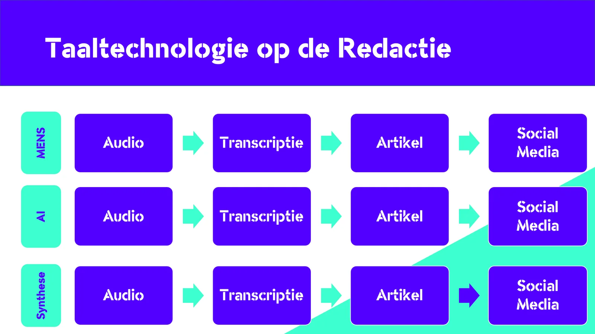

### Zelf een artikel schrijven

Zoals je in het schema hierboven kunt zien, schrijven de leerlingen niet alleen zelf een transcriptie van het interview (je kunt deze opdracht beperken door hen bijvoorbeeld alleen de eerste drie minuten te laten uitschrijven), maar ze schrijven daarna ook een kort nieuwsartikel op basis van dit gesprek. Dit soort artikelen vind je vaak in de weekendbijlagen van kranten. Omdat het schrijven van zo’n artikel voor leerlingen een uitdagende taak is, analyseren we samen eerst bestaande artikelen om de belangrijkste elementen en kenmerken te identificeren. We kijken bijvoorbeeld naar de inhoud: Over wie gaat het artikel? Wat is de nieuwswaarde? Is het gespreksonderwerp actueel of krijgt het zijn nieuwswaarde door een specifieke locatie of gebeurtenis, zoals een interview met een professor politieke wetenschappen vlak voor de Amerikaanse presidentsverkiezingen?

De kenmerken op het gebied van inhoud en tekststructuur vormen de basis voor een evaluatiematrix die we samen opstellen. Deze matrix maakt duidelijk welke criteria belangrijk zijn voor een goed krantenartikel en hoe de leerlingen hun eigen werk hieraan kunnen toetsen. Bovendien zullen de leerlingen dezelfde matrix gebruiken om het artikel te evalueren dat door een AI-systeem wordt geschreven.

### Artikel door AI laten schrijven

Nadat de leerlingen hun eigen nieuwsartikel hebben geschreven, kunnen we nu de kracht van AI inzetten om hetzelfde artikel door een GPT-tool te laten schrijven. Om dit te doen, heeft de tool twee dingen nodig: de transcriptie van ons gesprek en enkele richtlijnen voor het artikel. Deze richtlijnen omvatten zaken zoals de structuur (inleiding, midden, slot), de beoogde doelgroep en de gewenste toon van het artikel. Samen met de transcriptie vormen deze richtlijnen de context voor de GPT-tool, die vervolgens woord voor woord het artikel genereert.

Hieronder vind je een voorbeeldartikel dat is geschreven door GPT4-o-mini, aangesproken via de API-toegang van OpenAI. De leerlingen analyseren dit soort resultaten en zoeken naar wat goed is en wat beter kan. Hiervoor kunnen ze dezelfde evaluatiematrix gebruiken die ze eerder hebben gebruikt voor de controle van hun zelfgeschreven artikel. Deze oefening helpt hen niet alleen de sterke en zwakke punten van AI-gegenereerde teksten te identificeren, maar ook hun eigen schrijfvaardigheden verder te ontwikkelen.

-   ### Artikel door AI

    Description text goes here

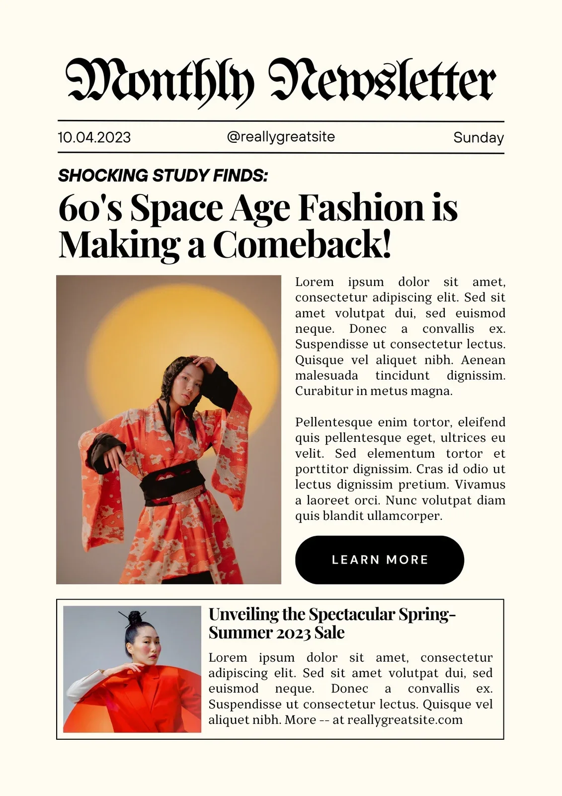

### Opmaak van een krantenartikel

Nu de leerlingen hun artikel hebben geanalyseerd en een synthese hebben gemaakt van hun eigen werk en de output van het AI-model, is het tijd om het artikel op te maken tot een krantenartikel. Hiervoor kunnen ze teruggrijpen naar kranten om te bekijken hoe de lay-out van een artikel eruitziet, met aandacht voor elementen zoals kolommen, koppen, afbeeldingen en bijschriften. Ze kunnen dit namaken met behulp van een tekstverwerker of Canva, waar ze templates kunnen vinden om hen te helpen.

Wil je de lat wat hoger leggen? Verwerk dan samen met de leerlingen alle interviews in eenzelfde sjabloon en breng zo een gezamenlijke krant uit. Dit bevordert niet alleen de samenwerking, maar leert de leerlingen ook hoe een gezamenlijke inspanning kan leiden tot een professioneel en samenhangend eindresultaat.

### Socialmediapost opstellen

Nu we het krantenartikel hebben afgerond, is het tijd om te onderzoeken hoe we deze inhoud effectief kunnen promoten op sociale media. In deze stap willen we ons artikel online onder de aandacht brengen met een socialmediapost. Net zoals kranten en dagbladen regelmatig hun artikelen promoten via socialemediakanalen, zullen wij analyseren welke de elementen zijn van een goede socialmediapost. Samen met de leerlingen bepalen we de belangrijkste eigenschappen van zo’n post en verwerken deze in een evaluatiematrix. Vervolgens laten we zowel de leerlingen als een GPT-tool een socialmediapost opstellen. Uiteindelijk vergelijken we de resultaten en bespreken we welke post het beste uit de verf komt en waarom.

### Kenmerken van een goede socialmediapost

Socialmediaposts zijn vaak een vertrouwde tekstvorm voor leerlingen, meer dan krantenartikels. Er wordt veel onderzoek gedaan naar welke posts slagen in hun opzet en welke ingrediënten ze bevatten. Let op: deze ingrediënten verschillen soms per platform, evenals de taal die ze hanteren om gebruikers te boeien. Bijvoorbeeld, de toon van een TikTok-post verschilt duidelijk van die op LinkedIn vanwege de verschillende doelgroepen.

Wanneer we bovenstaande kenmerken samenvatten, bekomen we volgend elementen:

-   **Platform**: post je dit op Instagram, LinkedIn, TikTok, Facebook …

-   **Gebruikers en doelgroep:** gaat het hier over jongeren, of mik je op een volwassen publiek?

-   **Toon en taal:** informeel of eerder formeel taalgebruik? Jongerentaal of standaardtaal?

-   **Relevantie:** is jouw artikel relevant voor de gebruikers die je voor ogen hebt? Spreekt het hen aan? Is er soortgelijke content succesvol op dat platform?

-   **Duidelijkheid:** je post is vaak kort en bondig. Soms worden deze beperkingen opgelegd door het gekozen platform. Zo kan men op X (voormalig Twitter) beschikken over 280 karakters. Kan je daarbinnen de kern van jouw interview duidelijk brengen?

-   **Visueel aantrekkelijk:** mensen zijn visueel ingestelde wezens. Met een goed gekozen beeld kan je sneller de aandacht trekken van jouw doelgroep dan met een muur droge tekst.

-   **Roept op tot actie:** een post moet de gebruiker motiveren om ‘iets’ te doen. Een actie te stellen. Vaak gebruikt men een prikkelende stelling of afbeelding om de doelgroep aan te zetten om het artikel te lezen en/of te delen. Opgelet: wanneer je hier te ver in gaat, wordt dit ook wel ‘clickbait’ genoemd. Daarbij is de oproep zodanig ronkend of mysterieus, maar bevat het eigenlijke artikel weinig interessant.

Gewapend met bovenstaande informatie en het uitgeschreven artikel kunnen de leerling en het AI-model aan de slag. Hieronder vind je een voorbeeld van de output van zo’n AI-model.

-   ### Socialmediapost door AI (TikTok)

    🚀 Wist je dat Ada Lovelace de ALLEREERSTE programmeur was? 🤯 Deze legendairy chick combineerde wiskunde met creativiteit en liet zien dat tech ook kunst kan zijn! 🎨💻 Laat je inspireren door haar verhaal en denk buiten de lijntjes! Wat ga jij creëren? 👇 #AdaLovelace #TechMeetsArt #GirlPower

-   ### Socialmediapost door AI (LinkedIn)

    🌟 **Vier de Erfenis van Ada Lovelace Byron** 🌟

    Als de eerste computerprogrammeur heeft Ada Lovelace Byron ons geleerd dat technologie niet alleen een middel is voor berekeningen, maar ook een krachtig instrument voor creativiteit en innovatie Laten we haar boodschap omarmen: denk buiten de gebaande paden en combineer logica met verbeeldingskracht

    👉 **Hoe inspireert de erfenis van Lovelace u in uw professionele leven? Deel uw gedachten hieronder!**

-   ### Beschrijving bij een YouTube-video

    🌟 Ontdek de wereld van Ada Lovelace Byron, de eerste programmeur die technologie en creativiteit samenbracht! 🎨💻 Laat je inspireren door haar visie dat computers niet alleen voor rekenen zijn, maar ook voor kunst en innovatie Bekijk onze nieuwste video en laat je creativiteit de vrije loop! 👉 \[link\] #AdaLovelace #Creativiteit #Technologie

### Situering binnen de leerlijn

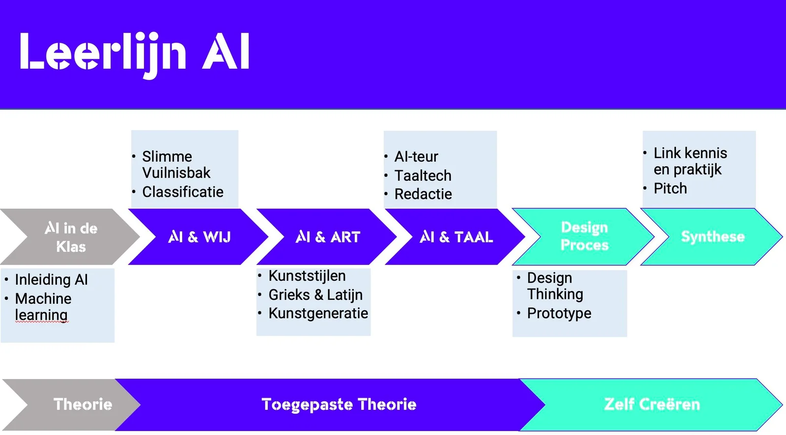

_Overzicht van de leerlijn AI (Robbe Wulgaert)_

Nu we hebben gezien hoe de leerlingen praktische vaardigheden toepassen binnen het kader van een socialmediapost, is het belangrijk om deze activiteiten te plaatsen binnen de bredere leerlijn die we hebben ontwikkeld. In deze leerlijn ontwikkelen leerlingen hun AI-geletterdheid door middel van verschillende modules en lesmateriaal. Het doel is om hen voor te bereiden op een digitale samenleving waarin AI-technologie steeds meer invloed heeft. 

[

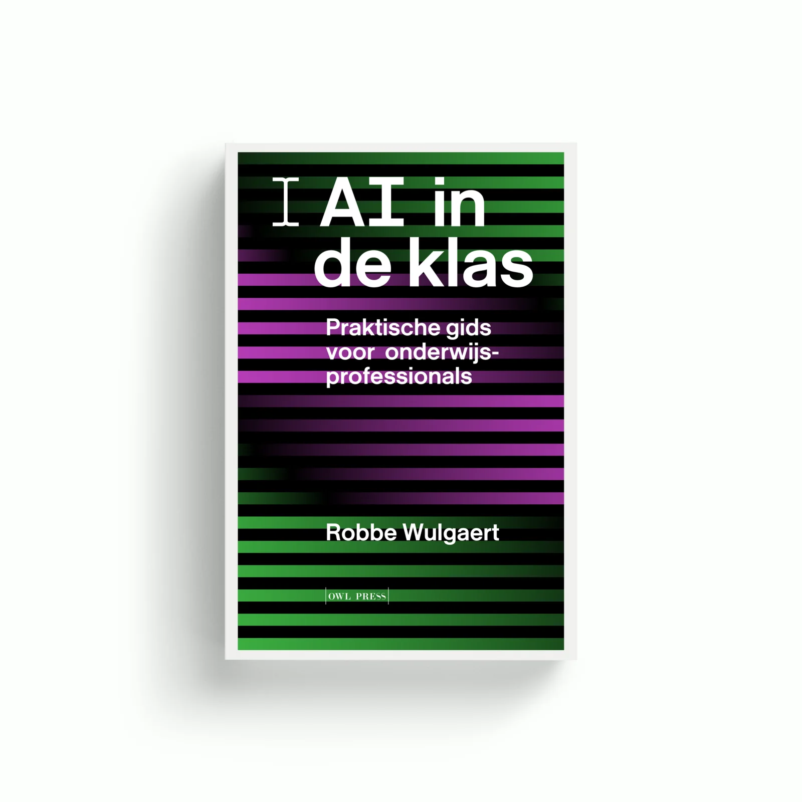

](/boek)

Dit lesmateriaal kan op zichzelf worden gebruikt, maar het is ook een onderdeel van een grotere, verticale leerlijn. Deze leerlijn bevat leermodules en kant-en-klaar lesmateriaal om leerlingen te leren over artificiële intelligentie, het toepassen van deze technologie binnen vakdomeinen zoals kunst en taal en zelfs het ontwikkelen van eigen AI-toepassingen.

Het lesproject over het interviewen van een historisch figuur is onderdeel van het taal- en AI-gedeelte van de leerlijn. Hier verkennen leerlingen AI-technologieën zoals tekstgeneratie, automatische transcriptietools en spraaktechnologie. Door deze technologieën toe te passen binnen een taalvak, leren leerlingen niet alleen over AI, maar ook over tekstsoorten, taalgebruik, uitspraak en doelgroepgericht schrijven.

Meer informatie over deze volledige leerlijn en de andere onderdelen daarin vind je in het [boek _‘AI in de Klas - Praktische gids voor onderwijsprofessionals’_.](/boek)

### Doelgroep voor dit lesmateriaal

Dit lesmateriaal kan in verschillende richtingen en onderwijscontexten worden ingezet. Het is echter vooral ontwikkeld voor de doorstroomfinaliteit, specifiek voor docenten en scholieren in richtingen met een sterke focus op Moderne Talen.

Hieronder vind je de leerdoelen uit de leerplannen Communicatiewetenschappen en ‘Taaltechnologie en Taalredactie’. Omdat het materiaal ook geschikt kan zijn voor andere onderwijscontexten, zijn de bijbehorende competenties uit het EU DigComp en Unesco-framework rond AI-geletterdheid voor leerkrachten opgenomen. Afhankelijk van de specifieke context kan het lesmateriaal eenvoudig worden aangepast om te voldoen aan de behoeften van andere richtingen of finaliteiten.

### Leerplanspecifieke Doelen

Dit lesmateriaal werd ontwikkeld met oog op de leerplannen [‘communicatiewetenschappen en taaltechnolgie’](https://pro.katholiekonderwijs.vlaanderen/ii-com-d) en [‘taalredactie en taaltechnologie’](https://pro.katholiekonderwijs.vlaanderen/iii-tata-d) zoals opgesteld door het Katholiek Onderwijs Vlaanderen. Volgende leerplandoelen kan je terugvinden in de aanpak en doelen van dit lesproject:

**Communicatiewetenschappen en taaltechnologie (2de graad SO, Moderne Talen):**

-   LPD 3+ De leerlingen tonen onderbouwd verschillen aan in media- en nieuwsgebruik vanuit de mediagebruiker. Bijvoorbeeld: _“De leerlingen brengen het actuele medialandschap in kaart.”_

-   LPD 4+ De leerlingen bepalen de nieuwswaarden in (inter)nationale nieuwsmedia aan de hand van criteria. Bijvoorbeeld: _“De volgorde in de opbouw van een krant, een journaal …”_

-   LPD 6+  De leerlingen maken een online story met nieuwswaarde. 

-   LPD 7+ De leerlingen illustreren mogelijkheden en beperkingen van taaltechnologische toepassingen. Bijvoorbeeld: _“Je kan met leerlingen bestaande taaltechnologische hulpmiddelen verkennen zoals de spellingscorrector, vertaaltechnologie, zoeksystemen, chatbots … Je kan vanuit voorbeelden uit actuele media met leerlingen reflecteren over mogelijkheden en beperkingen van taaltechnologische toepassingen. Als leerlingen taaltechnologie inzetten bij het maken van een online story (LPD 6+) kan dit een aanleiding zijn om erover met leerlingen in dialoog te gaan.”_

**Taaltechnologie en taalredactie (3de graad SO, Moderne Talen):**

-   LPD 1 De leerlingen herformuleren doelgericht (delen van) schriftelijke en mondelinge teksten in functie van de doelgroep, het kanaal of het medium.

-   LPD 2 De leerlingen analyseren hoe de context de betekenis van een taaluiting beïnvloedt.

-   LPD 4 De leerlingen gaan kritisch en doelgericht om met taaltechnologische hulpmiddelen.

-   LPD 5 De leerlingen lichten het maatschappelijk en wetenschappelijk belang van taaltechnologie toe.

-   LPD 6 + De leerlingen illustreren hoe taaltechnologie hen in hun werk als taalprofessional kan ondersteunen.

### Competenties - EU DigComp en Uneso

Behalve leerplandoelstellingen voor leerlingen kunnen we ook competenties uit het [EU DigComp 2.2](https://publications.jrc.ec.europa.eu/repository/handle/JRC128415) en Unesco framework koppelen aan dit lesproject. Beiden zijn opgesteld om leerkrachten voor te bereiden op een digitale toekomst en bevatten onderdelen zoals ethiek, AI-geletterdheid, het begrijpen van de mogelijkheden en beperkingen van AI-tools, ondersteunen van het leren van leerlingen m.b.t. AI-technologie … 

### EU DigComp Framework

-   ### Professionele betrokkenheid

    -   De leerkracht kan positieve en negatieve effecten van het gebruik van AI in het onderwijs benoemen, zoals binnen het eigen vakdomein.

    -   De leerkracht kan voorbeelden geven van­ AI-­ toe­passingen en hun relevantie binnen het eigen vakdomein, zoals het gebruik van automatische transcriptie bij journalistiek werk of bij tolken, genereren van socialmediaposts binnen marketing ...

-   ### Lesgeven en leren

    -   De leerkracht kan duiden hoe het gekozen AI-systeem zich verhoudt tot de kerndoelen van het onderwijs (kwalificatie, socialisatie, persoonlijke ontwikkeling).

    -   Bovenstaande kan je linken aan de leerplandoelstellingen en de voorbereiding van leerlingen = kwalificatie.

-   ### Ondersteunen van ­ lerenden

    -   De leerkracht is zich bewust van het verschil in leereffect dat kan ontstaan bij de toepassing van AI-systemen naargelang aanvangsprestaties, SES, cognitieve capaciteiten…

    -   Bovenstaande is belangrijk bij de stappen waarbij leerlingen hun eigen output naast die van de AI-modellen leggen. Bij sommige leerlingen met een beperkter taalregister en capaciteiten zal het verschil met het AI-model vrij significant zijn. Let ervoor op dat ze hier nog steeds uit leren en de AI-output niet gewoonweg kopiëren en dus de tool gebruiken als kruk.

-   ### Ondersteunen van ­ digitale competenties van leerlingen

    -   De leerkracht ondersteunt leerlingen in het gebruik van AI-systemen en bij ethische vraagstukken, het beheer van data en de onderliggende werking van AI-systemen.

    -   Ethische vraagstukken die kunnen optreden bij dit lesproject gaan over het vervangen van menselijke arbeid ("de tool kan het beter dan ik!") en wanneer AI-modellen feitelijke fouten (=hallucinaties) genereren en hoe we deze kunnen tegengaan.

### Unesco Framework

-   ### AI-geletterdheid

    Het lesmateriaal omvat zowel de technische aspecten van AI zoals het gebruik van taalmodellen voor transcriptie en tekstgeneratie en het formuleren van sterke prompts, als de ethische en menselijke aspecten zoals de impact van AI op contentcreatie.

-   ### AI-tools begrijpen

    Leerlingen leren specifieke AI-tools gebruiken, zoals ­ Whisper voor audiotranscriptie en GPT-modellen om tekst te ­ genereren. Die tools worden praktisch toegepast in een redactionele context, waarbij leerlingen leren hoe ze de tools kunnen integreren en gebruiken.

-   ### Evaluatie van AI-invloed

    Leerlingen onderzoeken hoe AI de kwaliteit van journalistiek werk positief en negatief kan beïnvloeden door automatisering van repetitieve taken. Ze evalueren de effectiviteit en de foutmarges van AI-transcripties en de invloed van AI op de communicatie en informatieverspreiding.

-   ### Ethiek en bewustzijn

    Door reflectie op de mogelijke ethische implicaties van AI in de media (zoals de snelheidswinst, maar ook de feitelijke fouten die de tools maken), worden leerlingen aangemoedigd om kritisch na te denken over de maatschappelijke verant- woordelijkheden gerelateerd aan AI-gebruik.

-   ### Praktische ervaringen

    Het project biedt hands-on ervaringen met AI-tools door leerlingen actief te betrekken bij het maken van transcripties, samenvattingen en socialmediaposts. Die directe toepassing bevordert een diepgaand begrip van ­ AI-mogelijkheden en -beperkingen.

### Benodigdheden

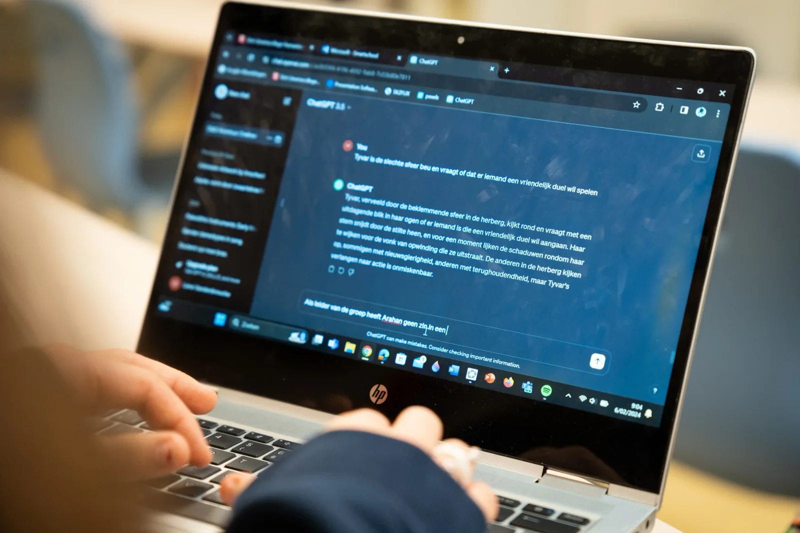

Om aan de slag te gaan met deze lesmaterialen en -aanpak heb je volgende zaken nodig:

-   laptop;

-   tekstverwerker (Microsoft Word, Google Docs …);

-   microfoon om het interview op te nemen;

-   toegang tot een large language model met audiofunctie, zoals bv. ChatGPT

    -   Opgelet: aan het gebruik van dergelijke applicaties hangen GDPR-verplichtingen. Zo is het vaak niet toegestaan deze te gebruiken bij leerlingen jonger dan dertien jaar. Onder achttien jaar is vaak expliciete toestemming vereist. Vraag hiervoor raad bij jouw Data Protection Officer en/of ICT-coördinator.

-   notebook voor de transcriptie en voor de verwerking tot nieuwsartikel en socialmediapost door een GPT-model.

* * *

### Ik wil hiermee aan de slag in de klas!

<a class="content-button content-button--primary content-button--medium" href="/contact" target="_blank" rel="noreferrer">Sluit je aan bij onze Discord Community!</a>

### Meer informatie over AI in ons onderwijs en veel meer vind je in:

