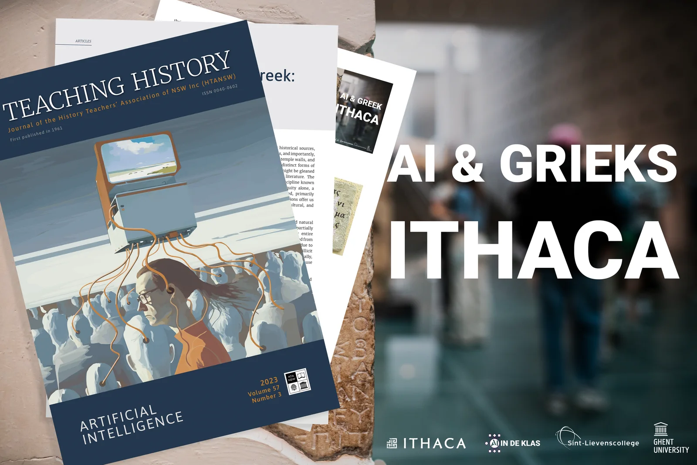
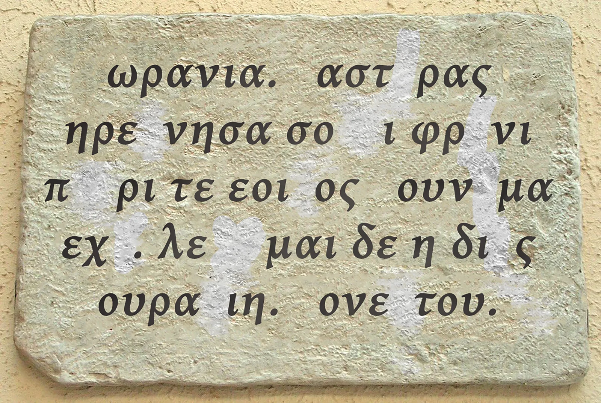
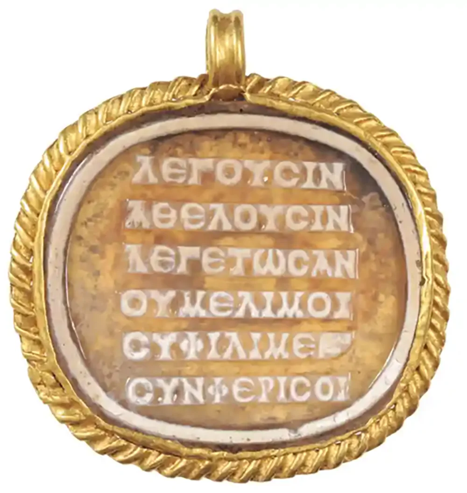
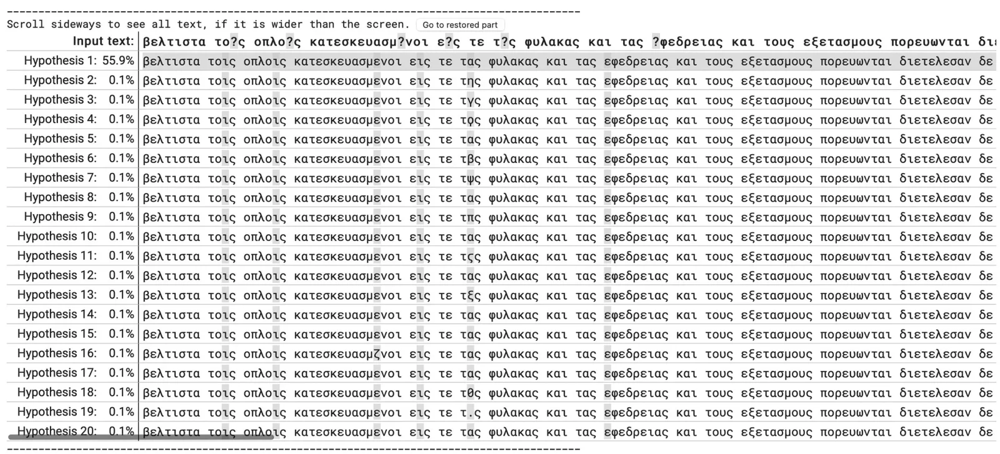
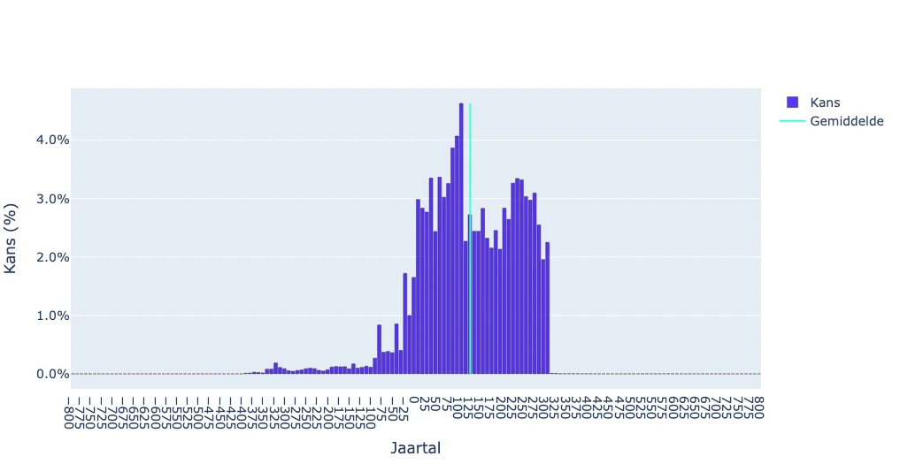
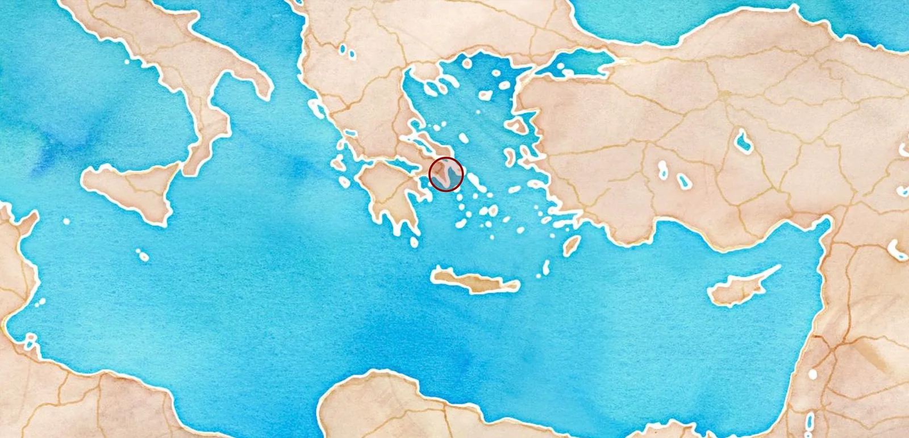

**_Het onderstaande artikel is (in het Engels) gepubliceerd in de_** [**_september 2023 editie van het 'Teaching History Journal_**](https://search.informit.org/doi/epdf/10.3316/informit.322879405179531)**_'_** **_, uitgegeven door de_** [**_History Teachers’ Association of North-South-Wales, Australia._**](https://htansw.asn.au/#:~:text=The%20History%20Teachers%27%20Association%20of%20NSW%20was%20formed%20in%201954,of%20activities%20it%20engaged%20in.)

### AI ontmoet Oudgrieks - Muzen en robots in de klas

_Robbe Wulgaert, docent computerwetenschappen en AI, Sint-Lievenscollege Gent, België._

**Kunstmatige intelligentie (AI) dringt steeds verder door in verschillende aspecten van ons leven. Van het vormgeven van onze digitale ervaringen tot het verbeteren van smartphone-fotografie en zelfs het genereren van volledige essays, de invloed van AI is alomtegenwoordig. Nu staat de kracht en het potentieel van AI op het punt om een revolutie teweeg te brengen in de ervaringen in klaslokalen, met name op het gebied van geschiedenis, archeologie en klassieke talen. Dit artikel verkent de AI-modellen ontwikkeld door Google's DeepMind en onderwijsmateriaal geproduceerd door de Universiteit van Gent en Sint-Lievenscollege in België voor secundair onderwijs. Maak je klaar om je Indiana Jones hoed op te zetten en je computer aan te zetten!**

<!-- p08-deferred:media-500dda1cb747cb1a -->

### **Brug tussen twee tegenpolen**

Het doel van deze leermiddelen is om een brug te slaan tussen wat twee verschillende domeinen lijken te zijn: Klassieke talen en moderne computertechnieken, inclusief programmeertalen. Dit materiaal is in de eerste plaats ontworpen voor studenten van 16 jaar en ouder die Oudgrieks studeren, zoals voorgeschreven door het onderwijssysteem in Vlaanderen, België. De bedoeling is om studenten een inleiding te geven in de wereld van AI, waarbij zowel de mogelijkheden als de beperkingen van AI voor het bestuderen van Klassieke Talen worden belicht. Dit lesmateriaal brengt drie onderling verbonden facetten samen: epigrafie, kunstmatige intelligentie en literatuur, in één enkel lesproject. Ze helpen studenten beseffen dat deze elementen, hoewel verschillend, elkaar kunnen aanvullen en versterken. Ze laten ook zien dat de studie en toepassing van AI verder gaat dan bèta/techniek en dat AI een waardevol hulpmiddel kan zijn voor epigrafen, in plaats van een bedreiging voor hun carrière, zoals soms in de media wordt gesuggereerd. Hieronder geef ik een overzicht van de verschillende onderdelen van dit project en laat ik zien hoe ze in de klas kunnen worden gebruikt.

### **Epigrafie 101**

In de inleidende segmenten van onze cursus maken we studenten vertrouwd met de veelheid aan historische bronnen. De academische syllabus houdt hen vaak voornamelijk bezig met artefacten zoals aardewerk, archeologische vindplaatsen zoals Mycene en literatuur, zoals de werken van Homerus. Deze soorten bronnen vormen de ruggengraat van de historische studie.

Er bestaat echter nog een grote verscheidenheid aan andere historische bronnen, waaronder munten, papyri-rollen, manuscripten en, nog belangrijker, stenen inscripties - te vinden op grafstenen, tempelmuren en zelfs juwelen. Deze inscripties bevatten verschillende vormen van historische kennis, die afwijkt van wat je zou kunnen afleiden uit één enkel belangrijk stuk literatuur uit de oudheid. De studie van dergelijke inscripties valt onder de discipline die bekend staat als epigrafie. Alleen al uit de klassieke oudheid is een enorme hoeveelheid inscripties ontdekt, voornamelijk in oude stadslandschappen. Deze inscripties bieden ons belangrijke inzichten in de politieke, sociale, culturele en economische geschiedenis van de betreffende samenlevingen.

Door het verstrijken van de tijd, menselijke activiteiten en natuurkrachten zijn veel van deze inscripties echter gedeeltelijk of geheel onleesbaar geworden, met ontbrekende karakters of hele zinnen. Sommige artefacten met inscripties zijn gescheiden van hun oorspronkelijke context en de bijbehorende informatie door vroege opgravingstechnieken, gebrek aan documentatie of illegale handel. Bovendien sluit de anorganische aard van deze inscripties het gebruik van koolstofdatering uit.

Epigrafen hebben de taak om deze teksten te restaureren en proberen ze historisch en geografisch te dateren. Het corpus van ontdekte inscripties is hierbij van onschatbare waarde. Het is echter geen sinecure om door deze enorme schat aan kennis en gegevens te navigeren. De workflows die nodig zijn voor restauratie en toeschrijving zijn ingewikkeld en tijdrovend.

Ten eerste putten epigrafen uit enorme archieven om tekstuele en contextuele parallellen te identificeren in hun zoektocht om beschadigde inscripties te herstellen. Deze opslagplaats bestaat voornamelijk uit de geheugensteuntjesverzameling van parallellen van een onderzoeker, aangevuld met digitale corpora die 'string matching'-zoekopdrachten mogelijk maken. Variaties in zoekopdrachten kunnen echter onbedoeld relevante resultaten vertroebelen, waardoor het een uitdaging wordt om de waarschijnlijkheidsverdeling van potentiële restauraties nauwkeurig in te schatten.

Ten tweede levert de toeschrijving unieke problemen op, vooral voor inscripties die uit hun oorspronkelijke context zijn verwijderd of die interne dateringselementen missen. Epigrafen moeten vaak hun toevlucht nemen tot bijkomende criteria zoals lettervormen en dialecten om de oorsprong en context van een inscriptie te bepalen. Dit proces gaat vaak gepaard met een aanzienlijke mate van generalisatie, gezien de grote tijdsspanne die chronologische toeschrijvingsintervallen kunnen omvatten. De epigraaf heeft dus te maken met een grote hoeveelheid gegevens, onzekerheden en een reeks tijdrovende taken - waarbij algoritmen voor machine learning van pas kunnen komen!

Volledige grootte weergeven

_Afbeelding van gewijzigde incriptie gebruikt in lesmateriaal_

### **AI als assistent - Maak kennis met Ithaca**

Geïnspireerd door biologische neurale netwerken is een diep neuraal netwerk (DNN) een algoritme voor machinaal leren dat patronen kan ontdekken in grote hoeveelheden gegevens. Dankzij de gestage toename in rekenkracht kunnen we met DNN's steeds grotere datasets te lijf gaan. Hieronder vallen zelfs datasets van archeologische inscripties die duizenden jaren oud zijn.

Ithaca,\[i\] een diep lerende neurale architectuur, is het eerste diepe neurale netwerk dat is ontworpen om Oudgriekse teksten te herstellen en te helpen met hun geografische en chronologische toewijzing. Ithaca AI is vernoemd naar het eiland dat voorkomt in de Odyssee van Homerus en is bedacht door onderzoekers van de Universiteit van Oxford en gemaakt door DeepMind van Google. De AI is getraind met behulp van een dataset van inscripties die in het Oudgrieks zijn geschreven in de hele Mediterrane wereld tussen de zevende eeuw voor Christus en de vijfde eeuw na Christus. De dataset is afkomstig van het Packard Humanities Institute (PHI), Los Altos, Californië. Elke inscriptie gaat vergezeld van een ID en metadata over geografische regio's en datering. Het resultaat is een uitgebreide set machineleesbare epigrafische teksten, met in totaal 78.608 inscripties.

Als Ithaca alleen wordt gebruikt, kan het 62 procent nauwkeurigheid bereiken bij het herstellen van beschadigde inscripties, terwijl historici die zonder hulp van AI werken slechts 25 procent nauwkeurigheid bereiken. Wanneer historici in combinatie met Ithaca werken, wordt het volledige potentieel gerealiseerd en kunnen historici een nauwkeurigheid van 72 procent bereiken bij het herstellen van teksten. Ithaca kan inscripties dateren op een periode van dertig jaar en hun archeologische vindplaatsen toewijzen met een nauwkeurigheid van 71 procent. Modellen als Ithaca kunnen het samenwerkingspotentieel tussen historici en AI vergroten en de manier waarop we geschiedenis bestuderen en erover schrijven veranderen.

Voor een meer diepgaande verkenning van het mechanisme van het Ithaca AI-model, inclusief de behandeling van inputs en de specifieke kenmerken van transformatortechnologie (de 'T' in 'ChatGPT' betekent ook transformatortechnologie), raadpleeg het onderzoeksartikel dat is geschreven door de onderzoekers die Pythia (de oorspronkelijke versie van Ithaca) hebben bedacht, Yannis Assael en Thea Sommerschield en anderen.\[ii\]

\[i\] Ithaca, https://ithaca.deepmind.com/ (geraadpleegd op 28 juli 2023).

\[ii\] Y. Assael, T. Sommerschield, B. Shillingford, et al. 'Restoring and attributing ancient texts using deep neural networks', Nature 603 (2022), 280-283. https://doi.org/10.1038/s41586-022-04448-z

### Ithaca toepassen op ons onderwijsproject

Vanuit het perspectief van een opvoeder is het meest verbijsterende aspect van Ithaca AI het gebruiksgemak. Tijdens mijn studententijd waren computerlokalen een zeldzaam goed. Voor gespecialiseerde taken zoals grafisch ontwerp of CNC-toepassingen moesten mijn klas en ik verhuizen naar een andere campus om tijd te winnen op een beperkt aantal dure computers met hardware. Het volstaat om te zeggen dat een leeromgeving waarin drie leerlingen één apparaat delen, de leerresultaten niet versterkt of vermenigvuldigt.

Spoel door naar 2023 en deze neurale architectuur voor diep leren kan in de cloud worden uitgevoerd met behulp van een Notebook (een online bestand waarin afbeeldingen, video en code door elkaar kunnen worden gebruikt), waardoor de rekenvereisten van het apparaat van de eindgebruiker worden gehaald. Hierdoor kan elke leerling in een klas deelnemen aan ons onderzoeksproject door gebruik te maken van hun schoollaptops of hun eigen apparaten.

Voor dit academische project hebben we twee inscripties gekozen: een van Honestos met betrekking tot de muze Urania (Figuur 2) en een gedicht op een Romeinse camee (Figuur 3).\[i\] Oplettende lezers zullen misschien opmerken dat deze voorbeelden, zoals de camee, niet willekeurig zijn en ook geen ontbrekende tekens in hun oorspronkelijke vorm bevatten. We hebben deze twee voorbeelden bewust gekozen vanwege hun unieke kenmerken en eigenschappen, die we in het derde deel van dit project nader zullen onderzoeken. Bovendien hebben we zelf opzettelijk bepaalde delen van de inscriptie onleesbaar gemaakt door de studenten deze gewijzigde materialen te geven. Dit gewijzigde materiaal bevat geen metadata-attributen zoals geografische of historische informatie.

De leerlingen bestuderen de inscripties en leveren hun tekst in met behulp van hun cloud-gebaseerde Notebook. Om deze taak uit te voeren, beginnen we met de studenten vertrouwd te maken met de Griekse toetsenbordindeling. Veel van onze studenten zijn niet bekend met Python en Markdown-code (de bouwstenen van een Notebook, die worden gebruikt om het diepe neurale netwerk te interpreteren), vooral de studenten die niet voor een bèta/technische richting hebben gekozen. Daarom hebben we de benodigde Python-code verborgen, waardoor de taak toegankelijker wordt voor veel leerlingen en docenten. Als docent informatica moedig ik iedereen aan om zich te verdiepen in de wereld van coderen en computational thinking, maar technische details mogen de interesse in of de toegang tot deze materialen niet beperken.

Nadat leerlingen hun 'beschadigde' inscriptie in het AI-model hebben ingevoerd, wordt inferentie uitgevoerd om de tekst te herstellen en geografische en historische toeschrijving uit te voeren. De tijd die nodig is om deze taak uit te voeren wordt bepaald door de lengte van de ingediende taak en het aantal ontbrekende tekens. Onze ervaring is dat dit tussen de vier en tien minuten duurt. Samen met de beperkte hardwarevereisten (door de offloading naar een online tool), maakt dit het behalen van een resultaat haalbaar binnen de beperkingen van een klas van een uur. Nogmaals, de relatief lage hardwarevereisten in combinatie met het verbergen van onbewerkte code (voor niet-ingewijden) en de snelheid van de gevolgtrekkingen, verlicht enkele van de hindernissen die een onderwijsprofessional zou kunnen ervaren.

\[i\] Voor meer details over de cameo, zie T. Whitmarsh, 'Less Care, More Stress: A Rhythmic Poem from the Roman Empire', The Cambridge Classical Journal 67 (2021): 135-163, doi:10.1017/S1750270521000051

Volledige grootte weergeven

Camee uit de paper van T. Whitmarsh (2021)

### **Een kritische kijk naar de output**

Zoals we de afgelopen jaren steeds meer hebben ontdekt bij het werken met AI-modellen en hun output, is het cruciaal om alert te blijven op hallucinaties en feitelijke onjuistheden, door andere bronnen of geheugenkennis te gebruiken om de feiten te controleren. Wanneer het Ithaca-model klaar is met het herstelproces, presenteert het twintig hypotheses (Afbeelding 4), gerangschikt van de meest plausibele naar de minst waarschijnlijke. Leerlingen gebruiken dan hun kennis, ervaring en een digitale thesaurus om de output te evalueren en te vertalen naar het Nederlands.

Volledige grootte weergeven

Inferentie resultaten - Top 20 hypotheses

Uit een vergelijking van de prestaties van het Ithaca-model met zijn voorganger Pythia en een menselijke historicus blijkt dat Ithaca de andere benaderingen consequent overtreft. Het model laat een karakterfoutenpercentage zien dat ongeveer de helft is van dat van de menselijke expert. Wanneer menselijke historici samenwerken met Ithaca, zien we bovendien aanzienlijke verbeteringen in het tekenfoutenpercentage en de top hypothese scores. Als het aankomt op toeschrijvingsvaardigheden, overtreft het neurale netwerk de voorspellingen van de menselijke expert die gespecialiseerd is in onomastiek (de studie van de geschiedenis van eigennamen). Deze bevindingen versterken het argument voor Ithaca als een ondersteunend hulpmiddel voor historisch onderzoek, dat menselijke vaardigheden vergroot en, wanneer het samen wordt gebruikt, superieure resultaten oplevert dan beide afzonderlijk zouden kunnen bereiken.

Volledige grootte weergeven

Resultaat - Historische Situering

Volledige grootte weergeven

Resultaat - Geografische Situering

### **Duik in de teksten!**

Op dit punt van het onderzoek geef ik het stokje over aan mijn collega's die experts zijn in Oudgrieks. Als ons inferentie en vertaling klaar zijn, hebben we een tekst van Honestos over het ontstaansverhaal van de muze Urania en haar meer symbolische en semantische relatie tot Zeus, in plaats van een fonetische verbinding. In het vers op de visueel opvallende Romeinse camee ligt de klemtoon op de eerste en derde lettergreep, waarmee een krachtige proclamatie van filosofische autonomie wordt overgebracht. Vertaald luidt _λέγουσιν, ἃ θέλουσιν, λεγέτωσαν, οὐ μέλει μοι_: 'ze zeggen wat ze willen; laat ze het maar zeggen; het kan me niet schelen'. Het laatste deel van de tekst introduceert een onverwachte erotische wending en de afwijzing door de maatschappij van de niet-conventionele relatie. Het is een krachtige uitdrukking van onafhankelijkheid en tegencultureel individueel denken, gecontrasteerd met de geografische reikwijdte van dit oude gedicht van Spanje tot Mesopotamië. Dit kan gezien worden als analoog aan het kopen van een punkachtig shirt bij een multinationale winkelgigant als H&M - een hedendaags voorbeeld van rebelse geest in een algemeen verspreide en toegankelijke vorm.

### Conclusie

Hier zijn we dan, aan het einde van onze reis, onze symbolische Ithaka. Doorheen dit artikel heb ik het proces beschreven van de integratie van het diepe neurale netwerk met de naam Ithaca in lesmateriaal ontwikkeld door de Universiteit Gent en het Sint-Lievenscollege in België, bestemd voor leerlingen vanaf 16 jaar.

In eerste instantie maken we de leerlingen vertrouwd met epigrafie als een gebied voor historisch onderzoek, waarbij we mogelijke obstakels beschrijven die historici op dit gebied kunnen tegenkomen. Vervolgens verkennen we het potentieel van diepe neurale netwerken en hun vermogen om patronen te detecteren, waarbij we laten zien hoe ze deze geïdentificeerde belemmeringen kunnen aanpakken.

Vervolgens gaan we dieper in op de implementatie van deze AI-modellen in de klasomgeving, waarbij we factoren beoordelen zoals de minimale hardwarevereisten, de bruikbaarheid van Python-code en de inferentiesnelheid van het model. We bekijken ook hoe deze factoren aansluiten bij de zorgen van leerkrachten. Vervolgens integreren we de gerestaureerde en vertaalde tekst in latere lessen, waarbij we leerlingen de kans geven om zich bezig te houden met de semantische relaties en ritmische nuances die zijn ingebed in twee zorgvuldig geselecteerde casestudies.

Deze aanpak dient meerdere doelen. Niet alleen laat het de veelzijdigheid van AI-modellen zien, waardoor hun toepassing verder reikt dan traditionele bèta- en techniekcursussen om leerlingen met een taalkundige interesse te boeien, maar het presenteert ook een evenwichtig verhaal. Door de nadruk te leggen op het samenwerkingspotentieel tussen menselijke intelligentie en AI, gaan we in tegen het discours dat technologische vooruitgang uitsluitend ziet als een bedreiging voor menselijke werkgelegenheid.

Bekijk de syllabus

<a class="content-button content-button--primary content-button--medium" href="/contact">Contacteer Robbe</a>

### Wie ontwierp deze leermaterialen?

Deze materialen werden ontwikkeld door Robbe Wulgaert (Sint-Lievenscollege) en Noor Vanhoe (Student Verkorte Educatieve Master Grieks-Latijn Universiteit Gent), samen met docenten Katrien Vanacker en Katja De Herdt (Universiteit Gent). Dit project is een verdere ontwikkeling van het onderwijsproject 'AI & Greek - Pythia' en bouwt voort op onderzoek van Tim Whitmarsh (Cambridge University) en de AI-modellen (Pythia en Ithaca) ontworpen door Yannis Assael (Oxford University, Google DeepMind), Thea Sommerschield (Oxford University) en anderen.

### Referenties

Dit artikel werd geschreven in juli 2023 door Robbe Wulgaert, docent computerwetenschappen en AI in Gent, België.

_\[1\] Ithaca, https://ithaca.deepmind.com/ (geraadpleegd op 28 juli 2023)._

_\[2\] Y. Assael, T. Sommerschield, B. Shillingford, et al. 'Restoring and attributing ancient texts using deep neural networks', Nature 603 (2022), 280-283. https://doi.org/10.1038/s41586-022-04448-z_

_\[3\] Voor meer details over de camee, zie T. Whitmarsh, 'Less Care, More Stress: A Rhythmic Poem from the Roman Empire', The Cambridge Classical Journal 67 (2021): 135-163, doi:10.1017/S1750270521000051_
