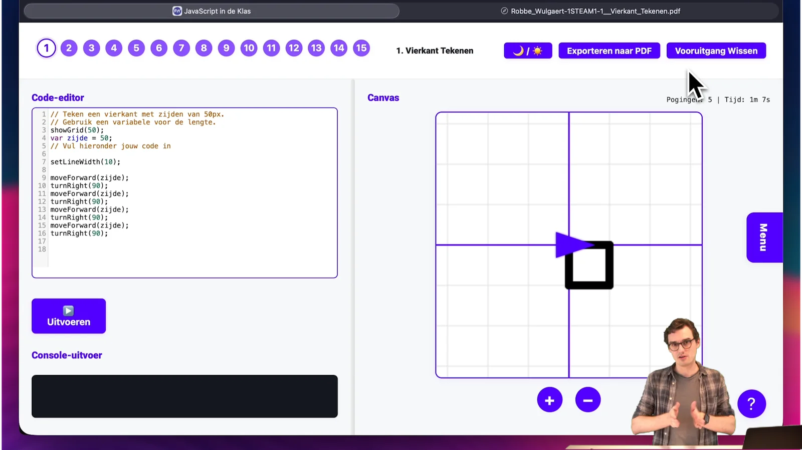

### Tijdens de festivalzomer had ik tussen de optredens eindelijk tijd om even terug te blikken op het voorbije schooljaar. Niet elke leraar kan een volledig jaar programmeren als vak geven en sommige leerlingen willen net na de lesdag extra oefenen zonder dat dit in hun curriculum zit. Dus vroeg ik me af: hoe bouw je iets kleins, eenvoudig en op basis van ons bestaand lesmateriaal? Iets licht in gebruik, zonder installatie, zonder accounts en bewust zonder grote functionaliteit. Gewoon een website, een leerlijn en grosso modo 70 eenvoudig aan te passen oefeningen computationeel denken en JavaScript? Een geluk dat deze zot zijn laptop meesleurt naar een muziekfestival! Down the Rabbit Hole we go! 

### Wat is het en voor wie?

Uitslapen tijdens een festival is niet aan mij besteed. Daarom werkte ik een een **webpagina met oefenreeksen** uit die leerlingen stap voor stap door een leerpad loodst: selectie, herhaling (begrensd/voorwaardelijk), werken met een turtle/tekenraster en eenvoudige grafieken. De focus ligt hier op **snelle inzetbaarheid**:

-   **Beperkte lestijd?** Snel aan de slag in de browser, ook voor richtingen waar programmeren niet de hoofdmoot is.

-   **Verdieping naast het curriculum of in de studie?** Laat leerlingen zelfstandig extra oefeningen maken, inclusief exporteerbare rapporten.

Wanneer je volledige lessenreeksen, dashboards en gedetailleerde opvolging nodig hebt, is en blijft het platform **Dodona en onze leerlijn Python in de Klas** de aangewezen keuze volgens mij. Dit project is bewust **heel light** ontworpen.

[Video on YouTube](https://www.youtube.com/embed/83_MiAKjgi4?feature=oembed)

### Hoe werkt het in de klas of studie?

**Opgave + editor + uitvoer** in één scherm. Leerlingen voeren code uit en zien console-output of een tekening op het canvas.

-   **Formularium (syntax-hulp):** Een ingebouwde spiekkaart met veelgebruikte commando’s voorkomt dat syntax de bottleneck wordt; zo kan de focus op **algoritmisch denken** blijven.

-   **Automatische feedback & fouten:** Oefeningen kunnen automatisch gecontroleerd worden; foutmeldingen wijzen naar regel en icoontjes geven status (groen/oké).

-   **Export naar PDF:** Met naam, klas, opdracht, code, console-uitvoer, canvas-screenshot, aantal pogingen en bestede tijd. Handig voor **inzage en feedback**.

-   **Opslag in de browser:** Voortgang via localStorage/cookies; **geen accounts, maar dus ook geen dashboard**.

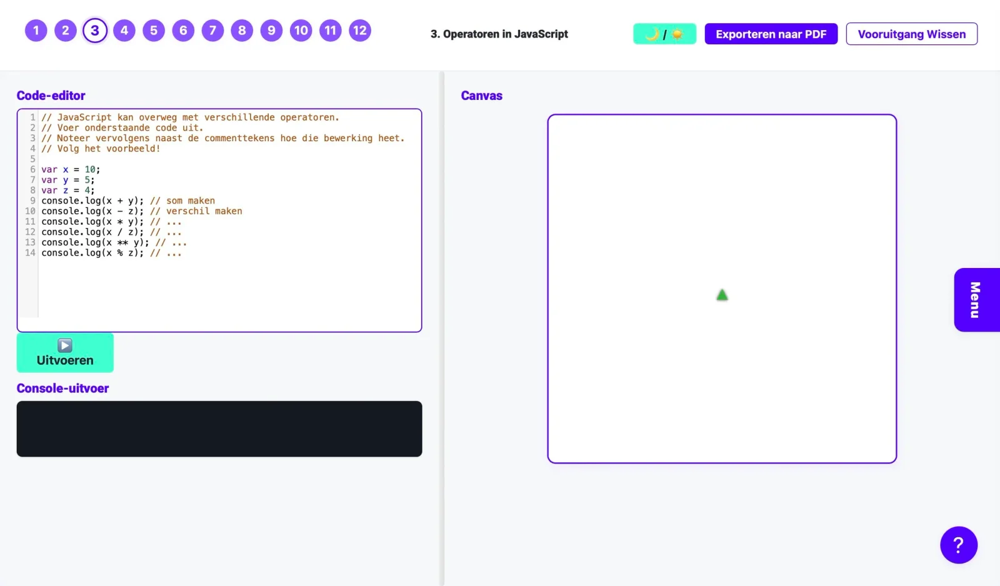 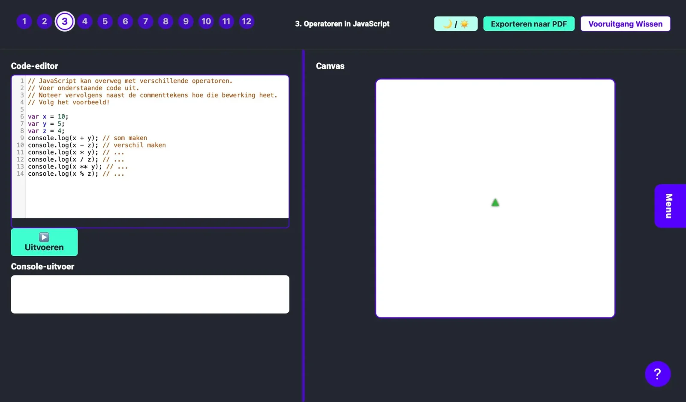 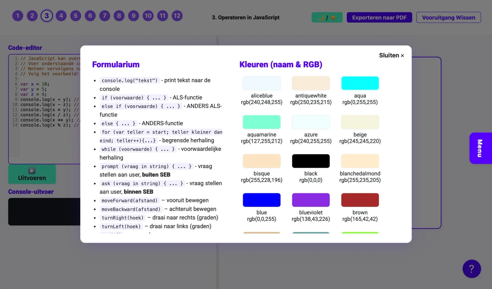 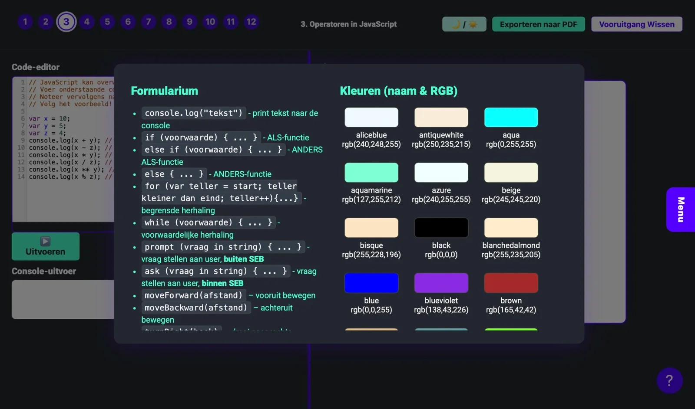 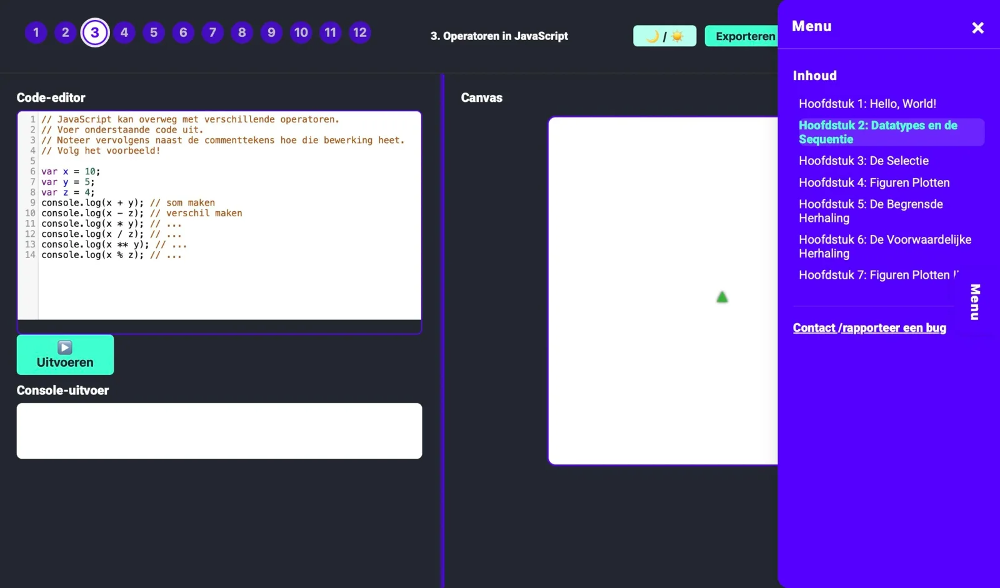 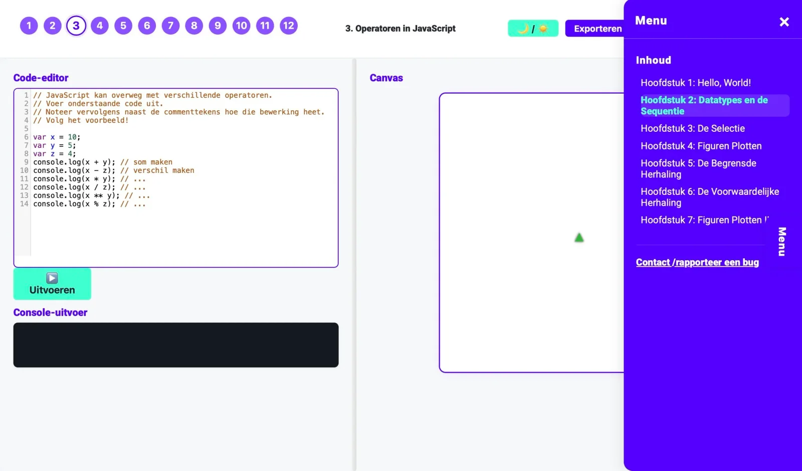 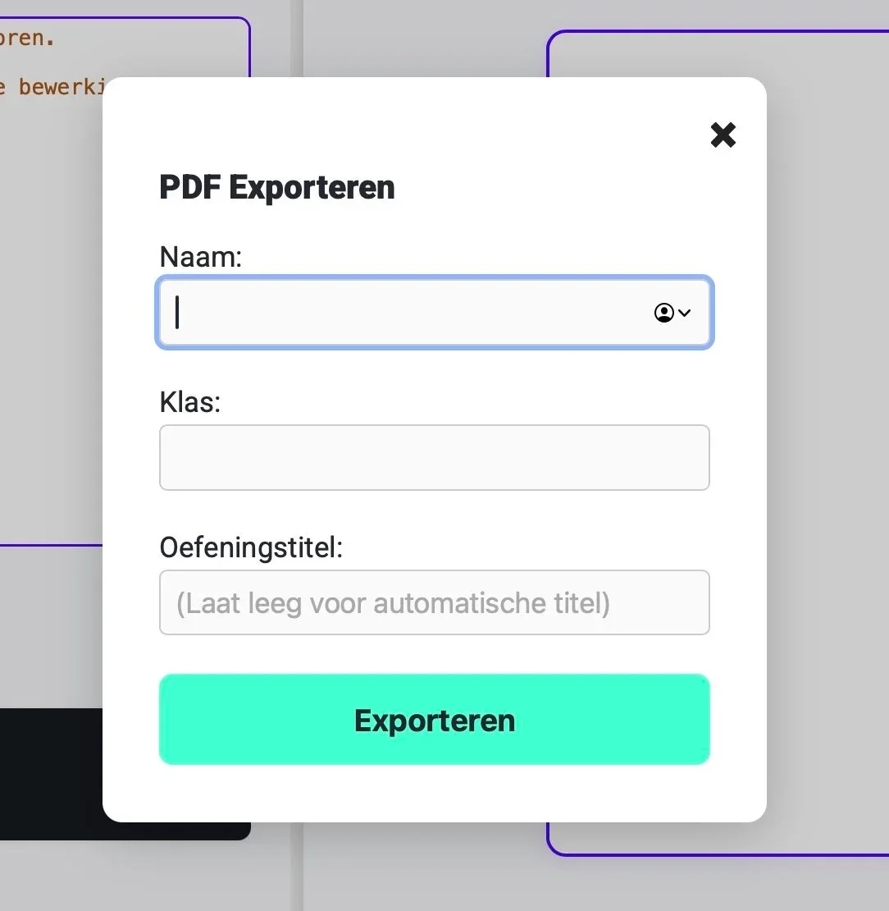 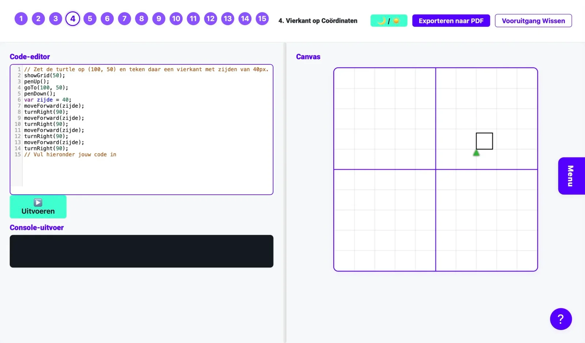 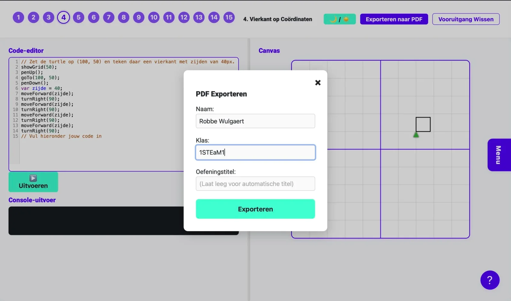 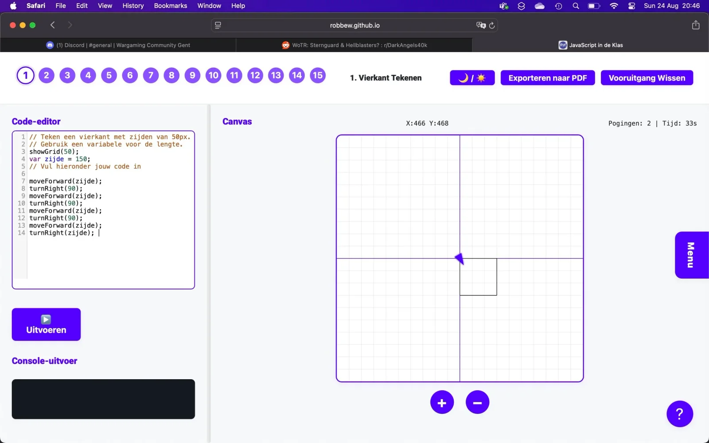 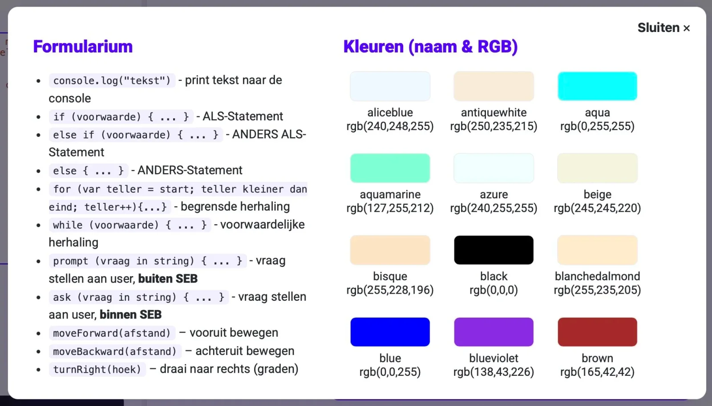 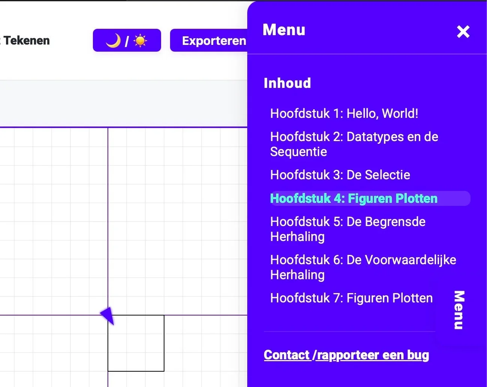 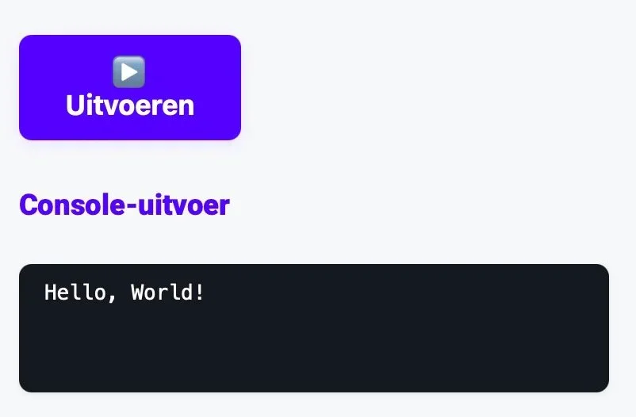 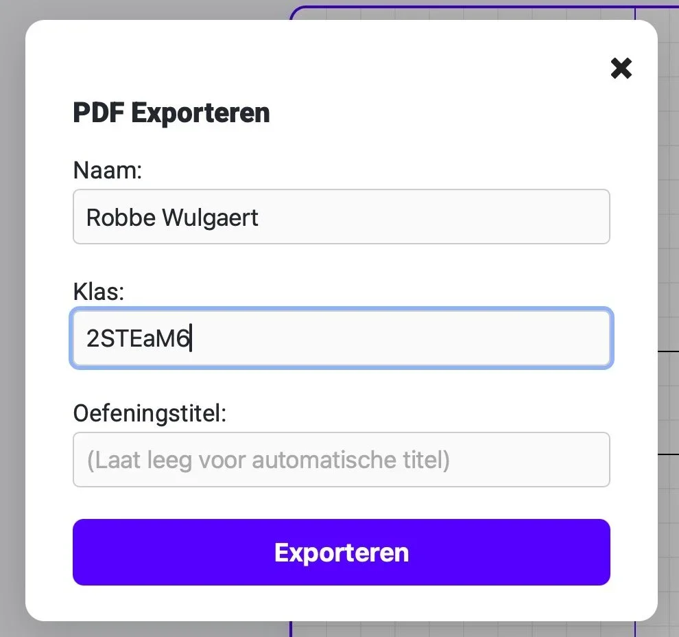

### Evaluatie

Op elke PDF export hanteren een compacte rubriek die onderscheid maakt tussen:

-   **Functionaliteit:** werkt de code?

-   **Leesbaarheid:** variabelen en comments duidelijk?

-   **Programmeerkernconcept:** paste de leerling de **beoogde constructie** toe (bv. begrensde herhaling)?

-   **Vakkennis/wiskunde:** klopt de berekening als die deel uitmaakt van de opdracht?

-   **Creativiteit (optioneel):** alternatieve, geldige aanpakken worden gewaardeerd.

Deze indeling ondersteunt **transparante feedback** en helpt leerlingen gericht bij te sturen. Het maakt het voor lerarenteams ook eenvoudiger om consistent te evalueren.

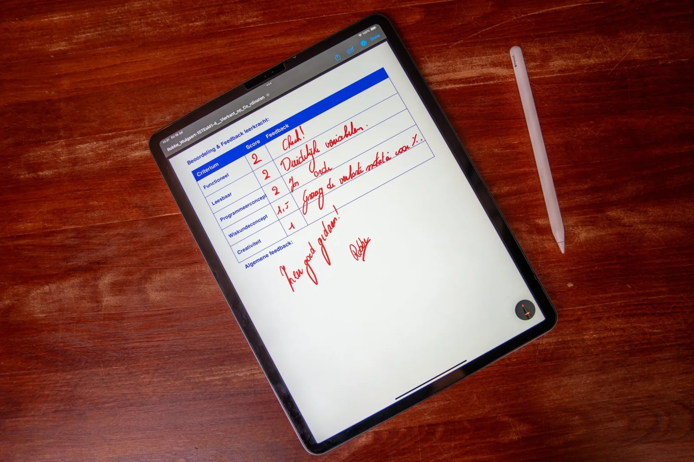

Ingevulde feedback op iPad (pdf)

## Praktisch voor leerkrachten

-   **Alles in HTML/CSS/JS:** Je kunt eigen oefeningen en leerpaden toevoegen of aanpassen (mits je wat behendig bent met GitHub repositories)

-   **Geen installatie:** Werkt eenvoudigweg in de browser van allerlei schooltoestellen.

-   **Werkt in een Safe Exam Browser:** functionaliteiten en prompts werden zodanig geschreven zodat leerlingen opdrachten kunnen maken met SEB. Zo doe ik het ook en beperk je de afleiding (terwijl de time on task verhoogt).

-   **Lightweight:** Geen login, geen dashboard; precies daarom **snel inzetbaar** voor curricula met beperkte ruimte of voor **opdrachten in de (zelf)studie.**

### Ik wil dit in mijn klas! Wat moet ik doen?

Wil je hier zelf mee aan de slag in jouw klaslokaal? Super! Samen met jongeren werken rond computationeel denken en programmeren is fantastisch, maar ik ben wellicht een bevooroordeelde bron. Met de knoppen hieronder kan je de tool zelf uittesten. Vind je een bug in mijn code? Laat het gerust weten via het contactformulier of via de Discord-server! 

<a class="content-button content-button--primary content-button--medium" href="https://robbew.github.io/jsindeklas/" target="_blank" rel="noreferrer">Test de webtool</a>

<a class="content-button content-button--primary content-button--medium" href="/contact">Contacteer Robbe!</a>

