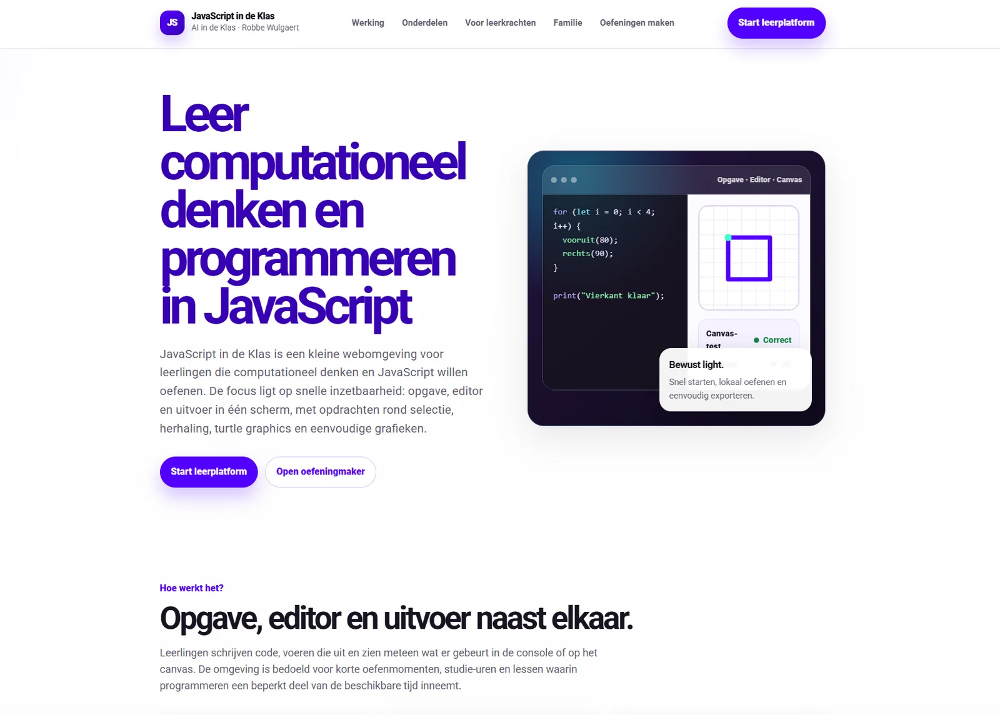
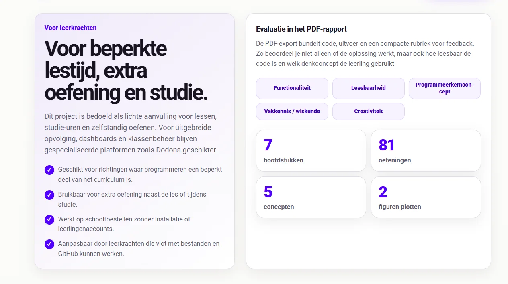
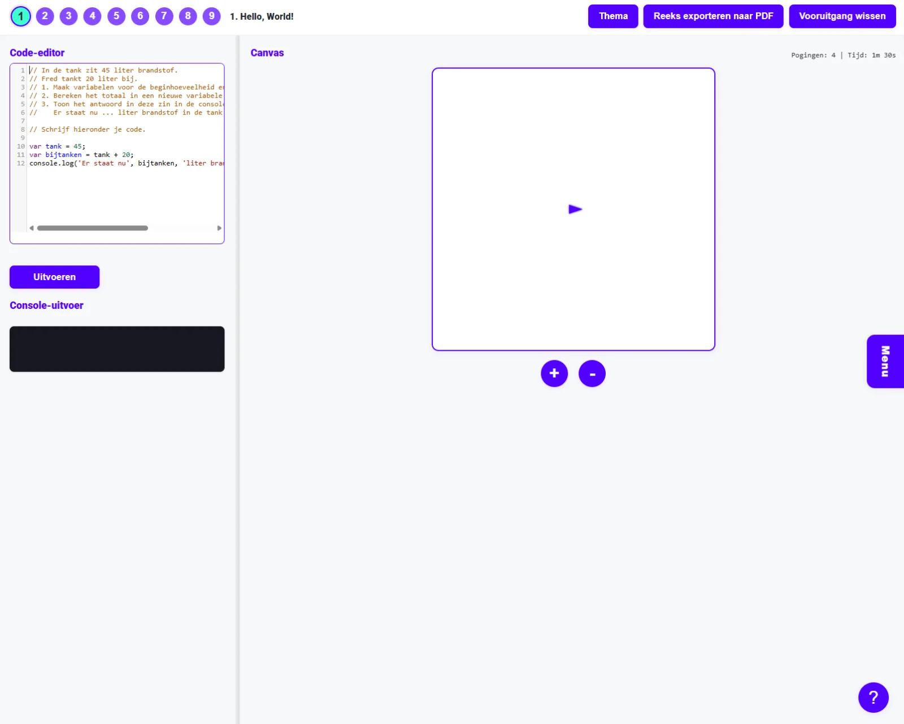
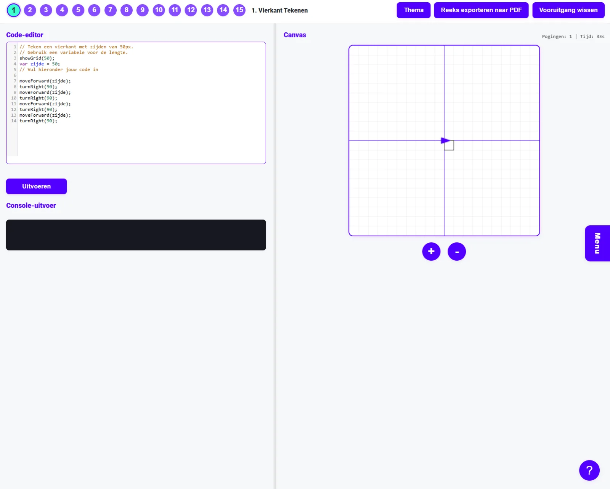
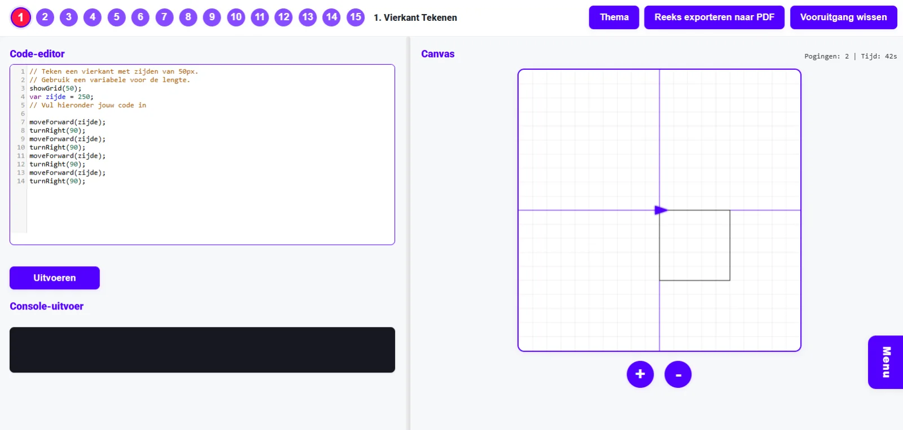
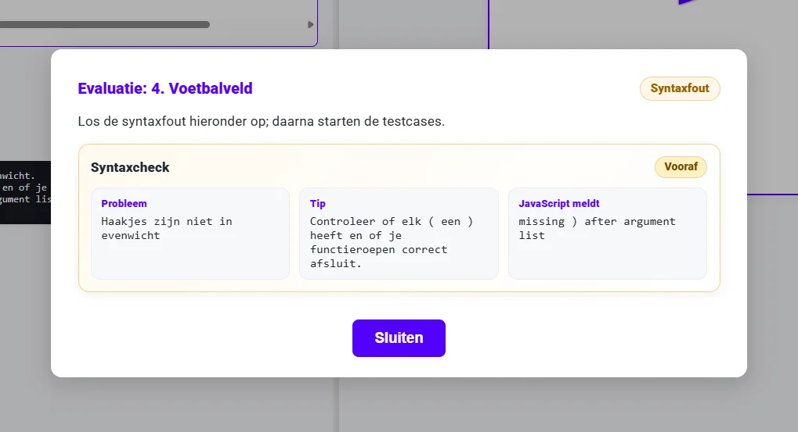
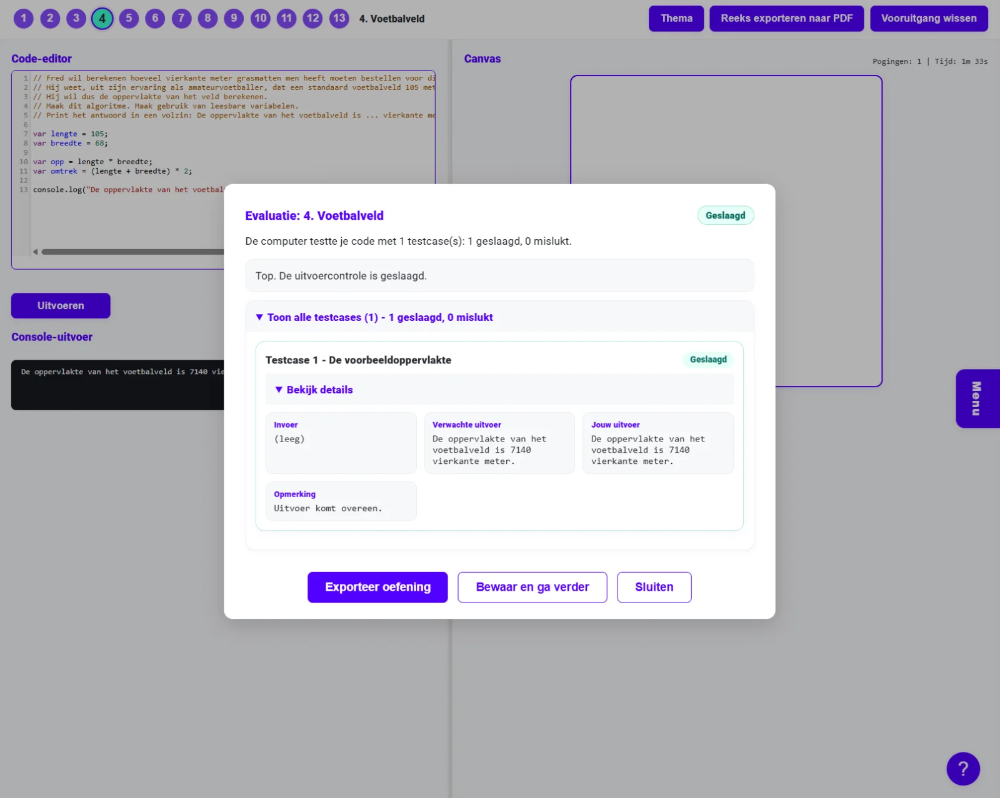
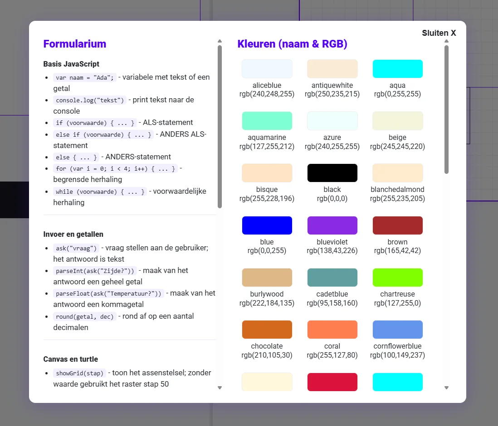
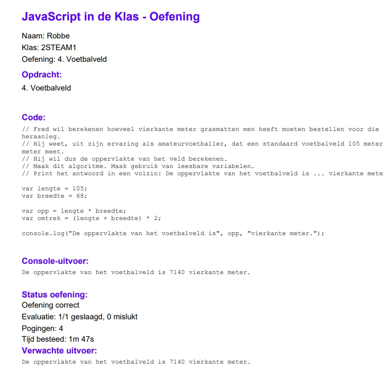
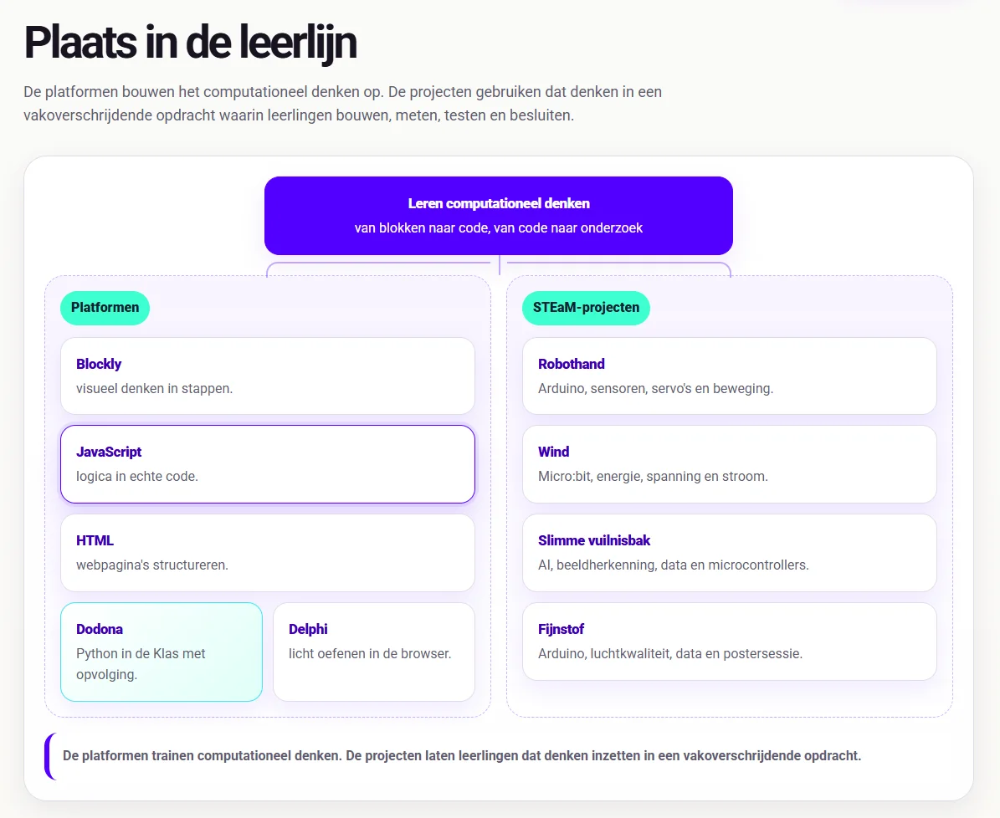

### **JavaScript verdient een duidelijke plek in informaticaonderwijs omdat de taal zo dicht bij de browser zit. En die browser is voor leerlingen al lang meer dan een venster op het internet. Het is de plek waar ze opdrachten lezen, websites bouwen, simulaties openen, interactieve tools gebruiken en steeds vaker ook code uitvoeren. Die positie maakt JavaScript breed inzetbaar. Wie met Blockly redeneert over stappen, keuzes en herhaling, kan diezelfde patronen later in JavaScript uitschrijven. Wie met HTML de structuur van een webpagina leert begrijpen, kan met JavaScript gedrag toevoegen. Wie met canvas werkt, ziet lussen, hoeken en patronen meteen verschijnen. En wie met micro:bit of MakeCode werkt, herkent opnieuw de brug tussen blokken, tekstuele code en fysieke interactie.**

### **Vakdidactisch is het leeproces vrij eenvoudig: opdracht lezen, ontleden, patronen herkennen, algoritmes uitwerken, code aanpassen, uitvoeren, feedback bekijken en debuggen. De eerste versie werkte, maar begon wat te veel op één grote doos te lijken. De inhoud zat te vast in de toepassing. Nieuwe oefeningen toevoegen vroeg te veel zoekwerk. Feedback mocht duidelijker. De export kon rijker. Herstarten moest eenvoudiger. Daarom kreeg JavaScript in de Klas een nieuwe iteratie. Versie 2.0!**

### Wat is het?

**JavaScript in de Klas** is een browseromgeving waarin leerlingen computationeel denken en JavaScript oefenen. Ik zie de tool vooral werken bij korte oefenmomenten, lessen met beperkte programmeertijd, studie-uren of extra oefening naast het gewone curriculum.

De huidige cursus bevat 7 hoofdstukken en 81 oefeningen. Daarvan hebben 78 oefeningen automatische tests. De cursus start bij een eerste **Hello, World!** en bouwt daarna verder naar datatypes, sequentie, selectie, figuren plotten, begrensde herhaling, voorwaardelijke herhaling en een tweede reeks figuuropdrachten. Een bewuste volgorde. Eerst leren leerlingen dat code precies uitvoert wat er staat. Daarna komen variabelen, uitvoer, invoer, keuzes, lussen en tekenopdrachten erbij. Zo bouwen we stapsgewijs op en introduceren we nieuwe programmeerconcepten en wiskundeconcepten.

### Hoe werkt de leeromgeving?

De omgeving toont opgave, editor, console en canvas in één scherm. Leerlingen lezen de opdracht, passen de startcode aan en klikken op **Uitvoeren**. Daarna verschijnt de uitvoer meteen in de console of op het canvas. Die korte lus is belangrijk: lezen, voorspellen, uitvoeren, vergelijken en aanpassen. Bij tekstuele oefeningen controleren leerlingen wat de console toont. Bij invoeroefeningen werkt de omgeving met antwoorden via ask(). Bij tekenopdrachten controleert de tool canvasresultaten, bijvoorbeeld het aantal lijnen, lijnlengtes, kleuren of een gesloten figuur. De tool gebruikt daarom niet alleen console-uitvoer, maar ook turtle graphics en canvasopdrachten. Die maken sequentie, selectie en herhaling zichtbaar. Bij een verkeerde lus zie je meteen waar het misloopt: een lijn loopt verkeerd, een patroon klopt niet, of een herhaling staat op de verkeerde plaats.

  

### Wat is er verbeterd?

De grootste verbetering zit in de structuur. De app laadt de cursus niet langer uit één grote ingebouwde oefenlijst, maar rechtstreeks uit de map content/. Elke oefening heeft nu een eigen map. De opdracht, startcode en testcases staan bij elkaar. Voor leerkrachten maakt die mappenstructuur een verschil. Je hoeft niet door één enorm bestand te scrollen om iets aan te passen. Wie een fork gebruikt op GitHub Pages kan de inhoud gerichter onderhouden en uitbreiden.

Ook voor leerlingen geeft de nieuwe versie meer houvast. Er is een voortgangsbalk bovenaan. De browser bewaart de gekozen oefening, de code, het aantal pogingen, de werktijd en de evaluatiestatus lokaal. Leerlingen zien sneller welke opdrachten al correct of fout zijn. Die informatie wordt lokaal bewaard op het toestel van de leerling. Zo is er geen account nodig, geen cloud en geen dashboard dat eerst ingericht moet worden.

### **Feedback en syntaxhulp**

Feedback was een belangrijk werkpunt. Leerlingen moeten niet alleen weten dat iets fout is. Ze moeten ook weten waar ze opnieuw kunnen beginnen zoeken. Daarom controleert de nieuwe versie eerst een aantal typische JavaScriptproblemen voordat de code echt uitgevoerd wordt. Denk aan ontbrekende haakjes, vergeten puntkomma’s bij acties, onbekende functienamen of beginnerssyntax die vaak fout loopt. De melding zegt wat er misloopt, waar ongeveer, en wat de leerling kan proberen.

Daarna komen de testcases. De tool markeert een oefening als geslaagd, fout of manueel te beoordelen. Bij een fout toont de omgeving een samenvatting. Wie dieper wil kijken, kan de testcases openen en vergelijken wat de opdracht verwachtte met wat de code werkelijk teruggeeft.

Ik heb ook het formularium opgefrist. De knop met het vraagteken blijft de plek waar leerlingen snel syntax en commando’s terugvinden. Ze vinden er basis-JavaScript, if, else if, else, for, while, ask(), getalomzettingen, turtlecommando’s, canvasfuncties, kleuren en korte voorbeelden.

Dat formularium fungeert als een gericht ondersteuningsmiddel binnen het leerproces. Als een leerling de redenering begrijpt, maar even niet meer weet hoe parseInt() of setPenColour() geschreven wordt, hoeft de oefening niet stil te vallen. Voor evaluaties kan dit formularium uitgeschakeld worden.

### **Canvas, turtle en zichtbare algoritmes**

JavaScript in de Klas gebruikt het canvas als didactisch hulpmiddel. Leerlingen tekenen figuren, maken patronen, testen hoeken en controleren lussen zichtbaar. Vooral herhalingen worden daardoor een pak duidelijker. Een for-lus is op papier snel een constructie met haakjes en tellers. Op het canvas wordt ze een vierkant, een trap, een reeks lijnen of een patroon. Een while-lus blijft doorgaan zolang een voorwaarde klopt. Wanneer die voorwaarde verkeerd staat, zie je het resultaat meteen.

De nieuwe interface ondersteunt dat beter. Editor en canvas staan naast elkaar. Met een splitter verdelen leerlingen de ruimte tussen code en tekening. Zoomknoppen maken het canvas beter leesbaar. Leerlingen moeten hun tekening kunnen bekijken zonder voortdurend te schuiven, zoeken of in- en uitzoomen via de browser zelf.

### **Voortgang, reset en bewijs van werk**

De nieuwe PDF-export bevat ook meer bruikbare informatie. Leerlingen kunnen hun werk exporteren met naam, klas, oefening, opdracht, code, console-uitvoer, canvasbeeld, evaluatiestatus, pogingen en werktijd. Er is ook ruimte voor feedback en een compacte rubriek. Die rubriek maakt feedback breder dan juist of fout. Een oplossing kan werken, maar onleesbaar zijn. Een tekening kan visueel kloppen, maar het gevraagde programmeerconcept missen. Zulke nuances wil je als leerkracht kunnen benoemen.

Er is ook een gebundelde export voor meerdere oefeningen. Dat past goed bij studie-uren of zelfstandige oefenreeksen. Leerlingen werken door, bewaren hun resultaten lokaal en leveren achteraf één PDF in.

## **Evaluatieversies en veilige contexten**

De nieuwe versie houdt ook rekening met evaluaties. Je kan aparte evaluatieversies klaarzetten met afgebakende inhoud, een eigen titel of een andere contentmap. De map evaluaties/ bevat aparte evaluatiepagina’s.

Voor volledige eindexamens in grote aula’s is dit niet geschikt, maar het maakt de tool wel bruikbaar voor korte toetsen, afgebakende opdrachten of Safe Exam Browser-contexten waar je de omgeving beperkt en voorspelbaar wil houden.

## **Hoe ziet de leerlijn er uit?**

Eerst verdiepen leerlingen via de **platformen** in de wereld van het computationeel denken. Ze leren de decompositie toepassen, leren programmeerconcepten herkennen, ontwerpen algoritmes en slaan aan het debuggen. Hiervoor hanteren we volgende **platformen**:

-   **Blockly in de Klas** helpt leerlingen eerst visueel redeneren. Ze oefenen daar met sequentie, selectie, begrensde herhaling en voorwaardelijke herhaling zonder dat syntax meteen met alle aandacht gaat lopen. Dit onderdeel zit in het begin van de leerlijn.

-   **JavaScript in de Klas** zit op een interessante plek in de reeks. Het komt na visueel redeneren met blokken, maar blijft dichter bij de browser dan Python. Daardoor kan het tegelijk programmeerconcepten oefenen en webgedrag zichtbaar maken.

-   **HTML in de Klas** zit in de webtak. Daar leren leerlingen hoe webpagina’s opgebouwd zijn met structuur, tags, attributen en inhoud. HTML beslist niets en herhaalt niets. **JavaScript** verbindt die werelden. De taal voegt gedrag toe aan webpagina’s en laat leerlingen dezelfde denkpatronen uit Blockly verder oefenen: variabelen, voorwaarden, lussen, functies, invoer, uitvoer en debugging.

-   **Project Delphi** neemt daarna Python op als tekstuele programmeertaal met een grotere oefencatalogus en testcases.

-   **Dodona blijft de allersterkste keuze voor volledige trajecten, dashboards, deadlines, evaluaties, klasopvolging, toetsen en zelfs examens!**

Daarna komen de **STEaM-projecten**. Die projecten gebruiken de opgebouwde concepten in grotere opdrachten waarin leerlingen bouwen, meten, testen en besluiten. De platformen trainen de bouwstenen van het computationeel denken. De projecten zetten tonen hoe we met die bouwstenen en digitale systemen een impact kunnen hebben op onze eigen leefwereld en samenleving.

-   Bij **Project Robothand** brengen leerlingen Arduino, sensoren, servo’s, seriële data en mechaniek samen in één werkend systeem. Dit past later in de leerlijn, na een eerste traject rond Arduino en fysieke computing. Leerlingen sturen niet alleen code naar een bordje, maar zien hoe sensorwaarden beweging veroorzaken.

-   Bij **Project Wind** verschuift de focus naar meten en onderzoeken. Leerlingen bouwen een windmolenopstelling, gebruiken de micro:bit om spanning en stroom te meten, berekenen vermogen en energie, vergelijken proeven en schrijven een besluit op basis van data. Hier wordt code een onderzoeksinstrument.

-   Bij **Slimme Vuilnisbak** komt daar artificiële intelligentie bij. Leerlingen verzamelen voorbeelden, kennen labels toe, trainen een model, testen voorspellingen, bekijken confidence-scores en koppelen de voorspelling aan een microcontroller. Zo wordt AI geen magische doos, maar een systeem dat werkt met data, labels, fouten en bijsturing.

-   **Fijnstof** hoort in dezelfde projectlaag. Tijdens dit STEaM-project gaan we aan de slag met Arduino, luchtkwaliteit, data en een postersessie. Leerlingen meten een verschijnsel uit de echte wereld, verwerken data en communiceren hun bevindingen.

Zo ontstaat er een overzichtelijk en duidelijk **curriculum**: eerst leren leerlingen redeneren, structureren en programmeren in kleine oefenomgevingen. Daarna gebruiken ze die kennis in projecten waarin code gekoppeld wordt aan fysieke systemen, meetgegevens, onderzoeksvragen en ontwerpkeuzes.

### **Ik wil dit in mijn klas! Wat moet ik doen?**

Wil je hier zelf mee aan de slag in jouw klaslokaal? Super! Samen met jongeren werken rond computationeel denken en programmeren is fantastisch, maar ik ben wellicht een bevooroordeelde bron. Met de knoppen hieronder kan je de tool zelf uittesten. Vind je een bug in mijn code? Laat het gerust weten via het contactformulier of via de Discord-server! 

<a class="content-button content-button--primary content-button--medium" href="https://robbew.github.io/jsindeklas/" target="_blank" rel="noreferrer">Ga naar JS in de Klas!</a>

<a class="content-button content-button--primary content-button--medium" href="/contact">Contacteer Robbe!</a>

