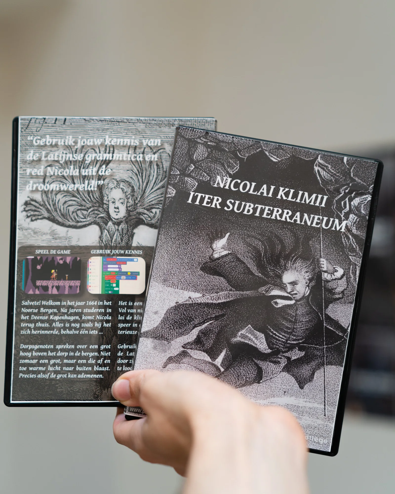
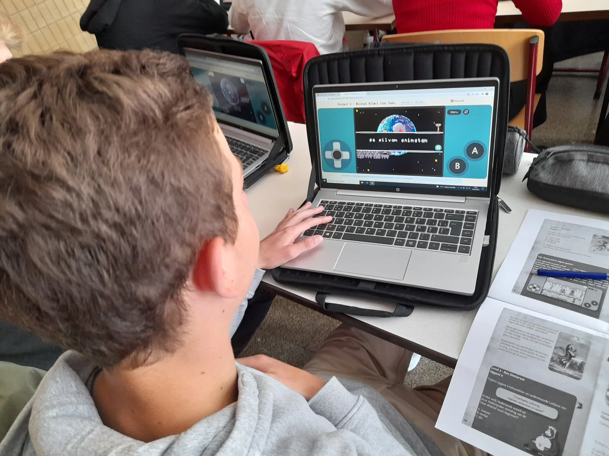
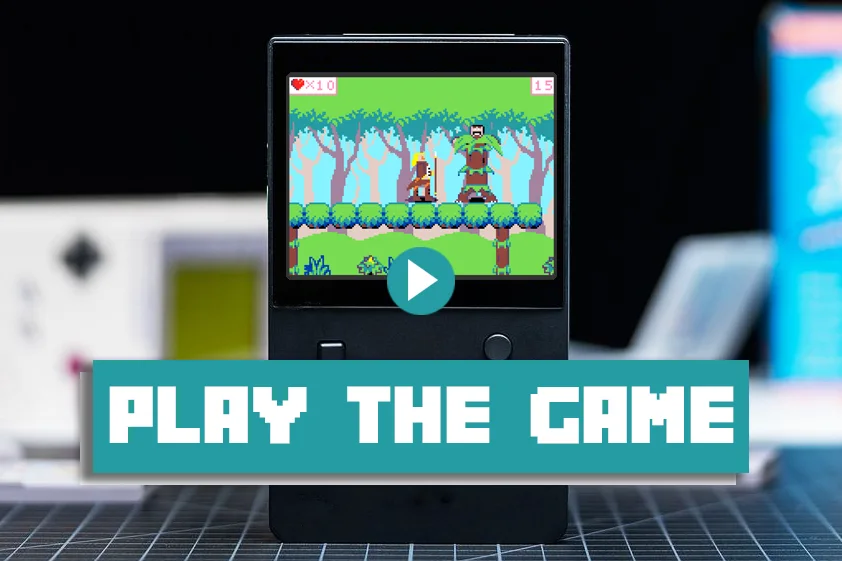
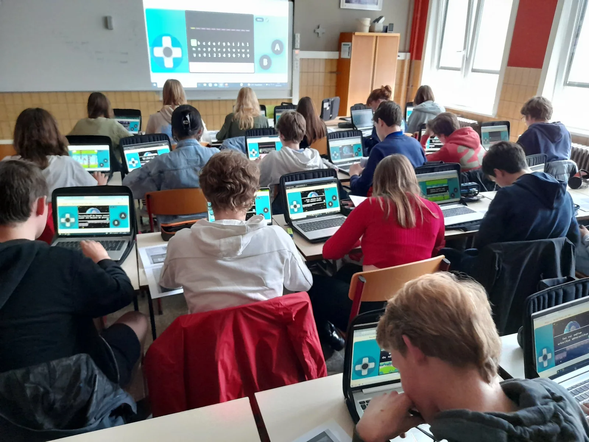
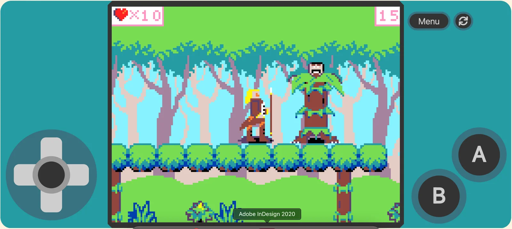
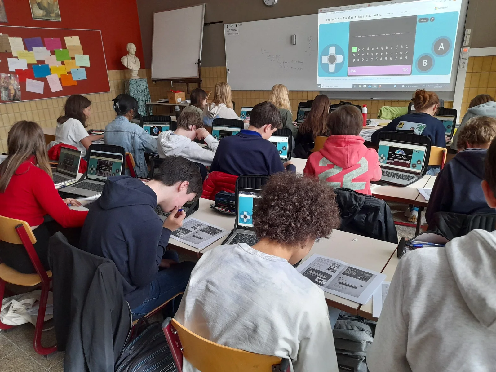

### Latijn en programmeren, het lijken tegenpolen die je niet meteen in dezelfde context zou gebruiken. Dit gameproject, dat een samenwerking vormt tussen de Educatieve Master UGent en het Sint-Lievenscollege bewijst het tegendeel. Door een game te ontwerpen waarin leerlingen met hun kennis van het Latijn enkele levels proberen uit te spelen, hopen we deze twee werelden dichter bij elkaar te brengen!

[Video on YouTube](https://www.youtube.com/watch?v=QMbS3vqfVkk)

### Postklassiek Latijn in een modern jasje

Als achtergrond van de game wordt het 18de-eeuwse verhaal van Ludvig Holberg gebruikt, _Nicolai Klimii iter subterraneum_. Door deze tekst te gebruiken willen we leerlingen vooral laten kennismaken met postklassieke Latijnse teksten. Bovendien hopen we hiermee op de kar te springen van de **huidige modernisering** binnen het vak. Het verhaal bevat fantasierijke ontmoetingen van Nicola met gekke wezens, wat meteen ook het visuele aspect van de game verhoogt.

### Aan de slag

Voor dit project werd het lesmateriaal verpakt in een speciale DVD-doos. Zo lijkt het alsof de leerling een echte game in de handen krijgt. Binnenin het doosje steekt het boekje, opnieuw zoals bij een échte game, met allerlei opgaves over de herhaling van de **losse ablatief**. Aan het einde van de game moeten ze in staat zijn om: een losse ablatief te herkennen in een zin, de juiste tijdsverhouding te benoemen, deze losse ablatief correct te vertalen en inhoudelijke begripsvragen over de tekst op te lossen.

Naast de game werd er ook een inleidende les gemaakt om de tekst en auteur in hun context te kaderen. Hierbij wordt ook ingegaan op de literaire traditie waarbinnen Ludvig Holbergs sciencefiction-roman zich situeert.

Er zijn natuurlijk nog veel meer mogelijkheden om met deze tekst aan de slag te gaan. Leerkrachten kunnen er bijvoorbeeld een lectuurles aan koppelen door een stuk Latijnse tekst te lezen waarmee de leerlingen al inhoudelijk even kennismaakten in de game. Hierna kan dan als uitdieping van het verhaal een stuk cultuurreflectie volgen, eventueel door de leerlingen zelf creatief aan de slag te laten gaan met het werk van Holberg.

### Benodigdheden

Toegankelijkheid is een belangrijk element in dit project. Daarom werd de game ontwikkeld in een omgeving die alle leerlingen kunnen gebruiken en verkennen! Zo kunnen ze zich verdiepen in het avontuur van Nicola in de onderwereld, maar ook zelf aan de slag gaan om een eigen verhaal te ontwikkelen ([dat lesproject ontwikkelde ik eerder](/onderwijs/super-marcus)).

Om aan de slag te gaan met dit project heb je nodig:

-   een computer of smartphone

-   internetverbinding

-   [Inleidende PowerPoint](https://sintlievenscollege-my.sharepoint.com/:b:/g/personal/robbe_wulgaert_sintlievenscollege_be/Ede-mOGpPoxJuHyUfj8KW1MBK0wNGQkqjVtX6jJZ7fU7yw?e=b6NCS6)

-   [het boekje met bijhorende oefeningen voor de leerlingen](https://sintlievenscollege-my.sharepoint.com/:b:/g/personal/robbe_wulgaert_sintlievenscollege_be/EcYwhd4ahCtDoF_jBwnJCTIBMr_Zhul88zQRlqa3-bpYiQ?e=G0Cc9y)

-   [het boekje met de uitgebreide uitleg voor de leerkracht](https://sintlievenscollege-my.sharepoint.com/:b:/g/personal/robbe_wulgaert_sintlievenscollege_be/EQuqWk2V2HVFsvUXgYCe4msBenQ3oFSYqO2pQ-ahFqT-FQ?e=qQzTWJ)

Voor dit project heb je geen speciaal programma of specifieke installatie nodig. De game is te spelen door te surfen naar [nicolaiklimii.be](http://nicolaiklimii.be/) of via de QR-code op de DVD-hoes! Je kan de game ook hieronder testen. Opgelet: je hebt het boekje met de opgaves nodig.

Klik op de afbeelding om de game te starten!

### Hoe kwam dit project tot stand?

Dit project is het resultaat van een samenwerking tussen de UGent en het Sint-Lievenscollege Gent. Dit in het kader van het opleidingsonderdeel ‘Vakdidactiek B’ binnen de Educatieve Master. In dit opleidingsonderdeel dienden de studenten, Sofie Baeckelandt en Laura Naeye, digitaal lesmateriaal te ontwikkelen voor Latijn binnen een game-omgeving. Hiervoor werden ze begeleid door vakdocenten Katrien Vanacker en Katja De Herdt (UGent - vakinhoudelijk) en Robbe Wulgaert (begeleider - ontwikkeling digitaal materiaal).

Sofie en Laura verkenden de mogelijkheden van een digitale tool, kozen relevante leerplan- en lesdoelen, ontwikkelden lesmateriaal en evaluatiemethoden … Zo leren studenten zelf (digitaal) lesmateriaal ontwikkelen, van begin tot eind.

### Wat leer ik hiermee bij?

### Lesdoelen

-   Kunnen Ludvig Holberg en zijn werk _Nicolai klimi iter subterraneum_ in de socio-culturele context situeren;

-   Korte inhoud in eigen woorden uitleggen;

-   Deze roman in de literaire traditie plaatsen;

-   De losse ablatief aanduiden in een zin;

-   De juiste tijdsverhouding die door de losse ablatief wordt uitgedrukt, benoemen;

-   De losse ablatief correct vertalen in de zin;

-   Begripsvragen over een postklassieke tekst beantwoorden na zelfstandige lectuur.

### Leerplandoelen

De leerplandoelstellingen werden geselecteerd uit het leerplan Latijn, 2de graad, Katholiek Onderwijs Vlaanderen.

-   LPD 8: De leerlingen tonen aan hoe naamwoorden, voornaamwoorden, participia en persoonsvormen congrueren

-   LPD 10: De leerlingen onderscheiden zinsdelen, bepalen de vorm, stellen de functie en rol vast bij het gezegde en geven de betekenis weer. (specifiek: losse ablatief)

-   LPD 19: De leerlingen bewaken hun leesproces en sturen bij waar nodig.

-   LPD 21: De leerlingen laten zien dat ze de tekst begrepen hebben.

-   LPD 22: De leerlingen situeren teksten in het oeuvre van een auteur en als teksttype.

-   LPD 30: De leerlingen situeren auteur(s) en werk(en) binnen de socio-culturele context waarin de tekst ontstond en betrekken die bij de interpretatie ervan.

### Ik wil dit in mijn klas! Wat moet ik doen?

Wil je hier zelf mee aan de slag in jouw klaslokaal? Super! Ik wil jou daar gerust bij helpen. Hieronder vind je informatie over workshops, nascholingen en de tool om me een bericht te sturen. Ik antwoord doorgaans binnen de 48 uur op jouw vraag.

<a class="content-button content-button--primary content-button--medium" href="/onderwijs/workshops-en-nascholingen">Workshop info</a>

<a class="content-button content-button--primary content-button--medium" href="/contact">Vraag het lesmateriaal aan</a>

