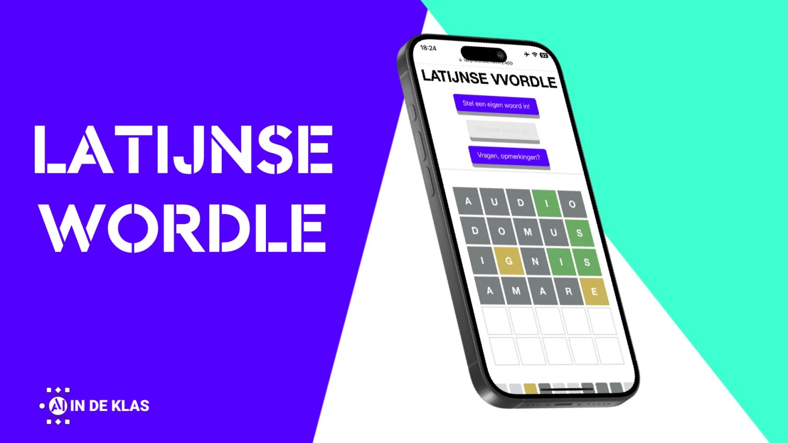
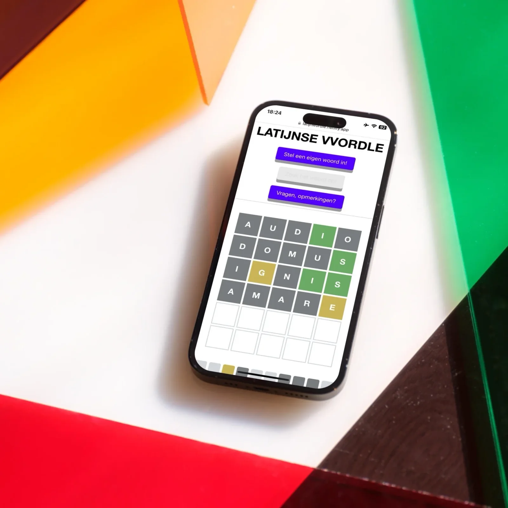
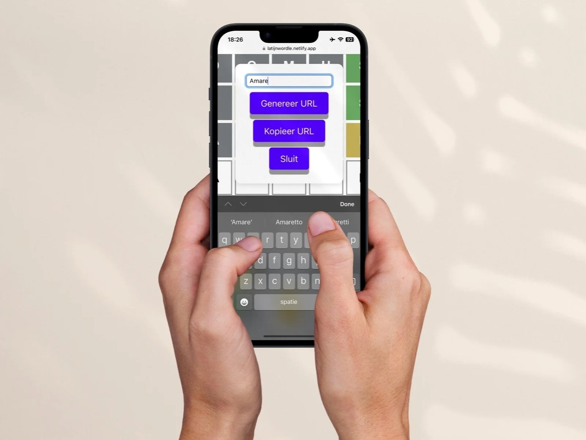

**Als leerkracht bent u altijd op zoek naar boeiende en educatieve tools om uw lessen te verrijken, groot of klein. Het populaire spel Wordle, bekend om zijn eenvoud en verslavende aard, heeft ons geïnspireerd tot het creëren van een eigen variant met een unieke twist: een Latijns woordenboek als basis. Waar de originele Wordle draait om hedendaagse talen, neemt onze versie u en uw leerlingen mee op een dagelijkse mini-ontdekkingstocht doorheen het Latijn. In dit artikel verkennen we hoe deze Latijnse variant werkt en hoe u deze kunt integreren in uw lesplannen. Het is meer dan een spelletje; want naast het ontdekken van nieuwe woorden kan je als speler direct de betekenis ervan achterhalen. Als docent kunt u zelfs het spel personaliseren door uw eigen 'woord van de dag' te kiezen, waarmee u een les een leuke afsluiter geeft. Ontdek hoe deze alternatieve versie van Wordle een kleine maar waardevolle toevoeging kan zijn aan uw lesmateriaal.**

## Hoe werkt het?

## Standaardspel

Wanneer je de app opent, zie je een speelveld van vijf bij zes vakjes, klaar om het '**woord van de dag**' te ontdekken. Dit woord wordt dagelijks automatisch geselecteerd, waardoor jij en je leerlingen elke dag een nieuw Latijns woord te raden hebben. Het draait hierbij om het gezamenlijk en efficiënt ontcijferen van hetzelfde woord.

**Spelregels:**

-   Geef een woord in;

-   Wanneer een letter grijs oplicht, dan steekt deze zeker niet in het gezochte woord van de dag;

-   Wanneer een letter oranje oplicht, dan steekt het wel in het gezochte woord, maar staat het op een andere plaats;

-   Wanneer een letter groen oplicht, dan heb je dat karakter op die plaats goed geraden;

-   Probeer dus binnen de zes pogingen, maar liefst met zo min als mogelijk gokken, dagelijks het woord te vinden!

De woordenlijst van onze app combineert een uitgebreid Latijns lexicon met de woordenlijst van de website Perseus, met daarin duizenden woorden in hun basisvorm en verschillende verbuigingen. Mocht je toch een woord tegenkomen dat niet in onze woordenlijst staat, een zogenaamde 'non in glossario', aarzel dan niet om ons dit te laten weten via de feedbackknoppen onder dit artikel. Zo help je ons om de app voortdurend te verbeteren.

<!-- p08-deferred:media-e55deffd22c8e408 -->

## Stel een eigen woord in!

Natuurlijk bevat onze uitgebreide woordenlijst veel onbekende of complexe woorden voor leerlingen. Woorden als '_volem_', '_optem_', en '_oculi_' zijn niet altijd even makkelijk te raden. Daarom biedt de app u de mogelijkheid om **zelf een 'woord van de dag' te kiezen.** Zo kunt u woorden selecteren die beter aansluiten bij het niveau en de voortgang van uw leerlingen of bij een specifiek lesonderwerp. 

Als u een eigen woord wil instellen gaat u als volgt te werk:

-   Druk op de knop bovenin de app;

-   Voer een woord van vijf karakters in;

-   Genereer de URL via de knop in beeld;

-   Kopieer die naar het klembord via de knop in beeld;

-   Plak die in de adresbalk of deel deze met de leerlingen via uw digitale leeromgeving naar keuze.

## Leer bij!

Uiteraard is het leren van nieuwe woorden slechts het halve werk; het begrijpen en toepassen ervan is minstens zo belangrijk. Daarom hebben we in onze app een handige functie geïntegreerd die aansluit bij dit leerproces. Met een eenvoudige druk op de knop kunnen jij en je leerlingen elk gevonden woord – of het nu het automatisch gekozen 'woord van de dag' is of een door jou geselecteerd woord – direct opzoeken in de **Latin Word Study Tool van de Perseus Digital Library**. Deze tool biedt uitgebreide informatie over de betekenis, de context en het gebruik van het woord in de Latijnse taal. Zo wordt niet alleen het raden van woorden een leerzame ervaring, maar biedt het ook een iets meer diepgaande verkenning van de Latijnse taal. 

<!-- p08-deferred:media-bff3485d66cd5df7 -->

* * *

### **Ik wil dit in mijn klas! Wat moet ik doen?**

**Klaar om te starten? Gebruik de knop hieronder om direct met de game te beginnen. Omdat het in uw webbrowser draait, is het spel zowel op uw laptop als smartphone moeiteloos te spelen. Geniet ervan!**

**Benieuwd naar meer van onze lesmaterialen over klassieke talen, Minecraft, en artificiële intelligentie? Bekijk dan de onderstaande links voor meer informatie en inspiratie!**

<a class="content-button content-button--primary content-button--medium" href="https://latijnwordle.netlify.app/" target="_blank" rel="noreferrer">Speel de game!</a>

<a class="content-button content-button--primary content-button--medium" href="/onderwijs/grieks-minecraft-akropolis-avontuur" target="_blank" rel="noreferrer">Minecraft en Klassieke Talen</a>

<a class="content-button content-button--primary content-button--medium" href="/onderwijs/ithaca-teaching-history-journal" target="_blank" rel="noreferrer">Grieks en AI - Epigrafie</a>

<a class="content-button content-button--primary content-button--medium" href="/onderwijs/ai-en-latijn-breng-tacitus-tot-leven" target="_blank" rel="noreferrer">Latijn en AI - Tacitus</a>

<a class="content-button content-button--primary content-button--medium" href="/contact">Ik heb een vraag!</a>

