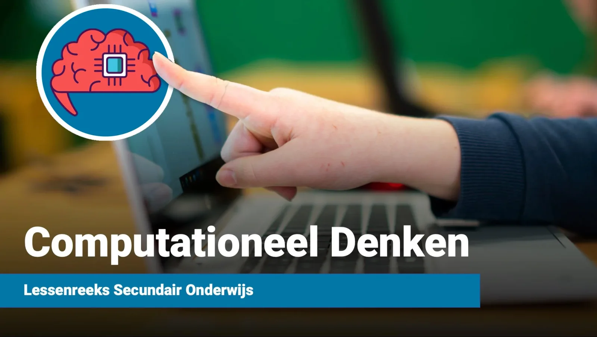
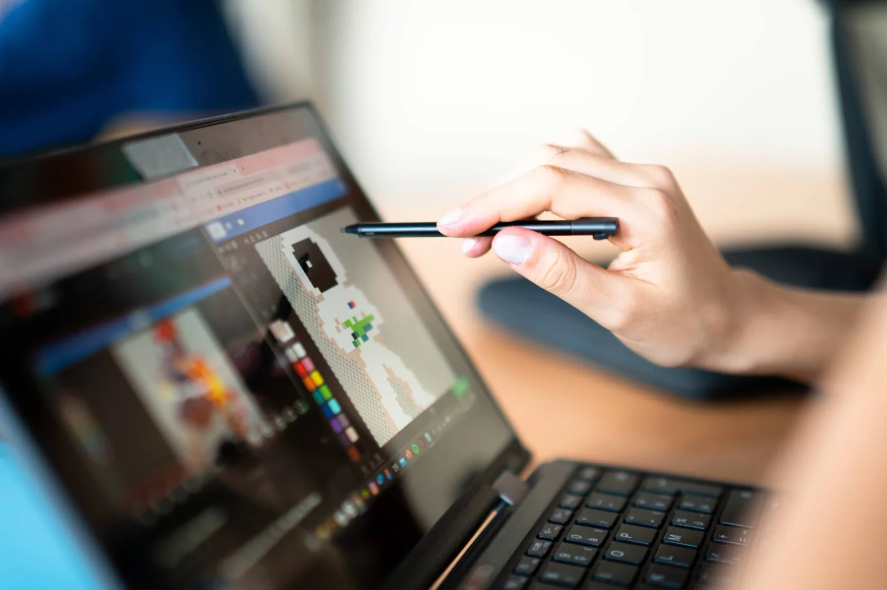
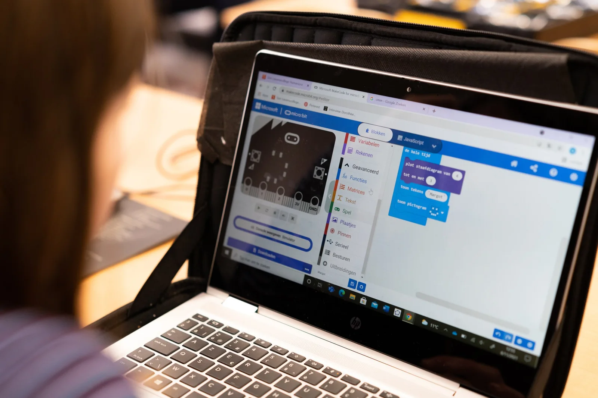
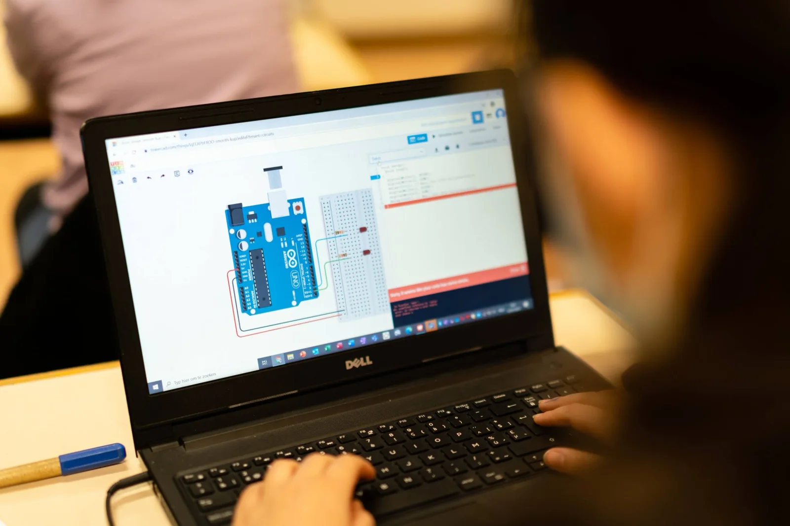
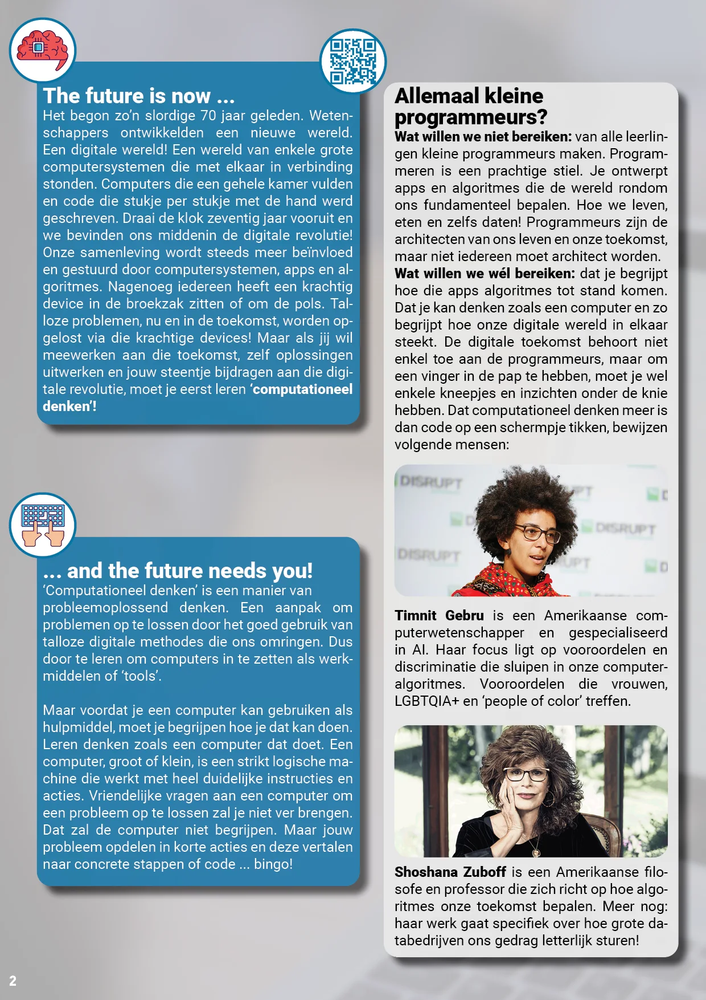
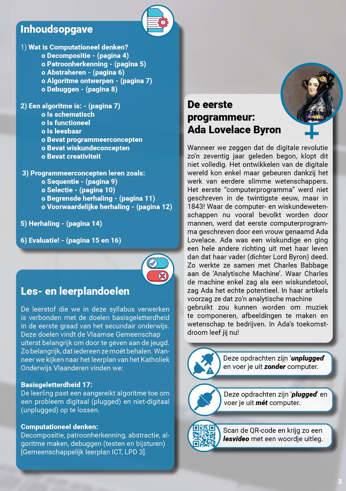
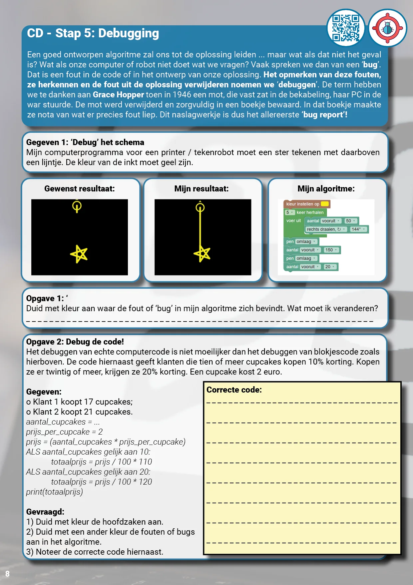
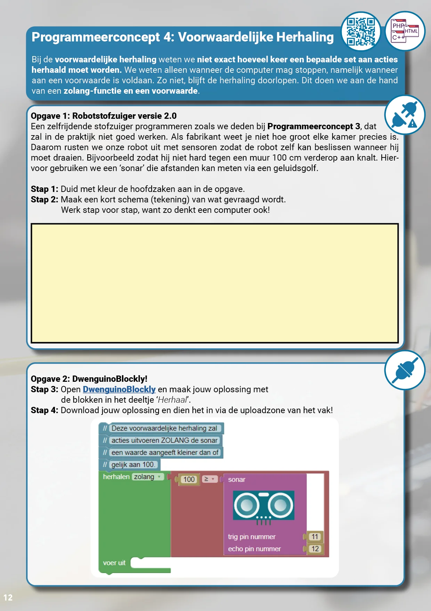

### Waarom leren ‘Computationeel Denken’?

Het begon zo’n slordige 70 jaar geleden. Wetenschappers ontwikkelden een nieuwe wereld. Een digitale wereld! Een wereld van enkele grote computersystemen die met elkaar in verbinding stonden. Computers die een gehele kamer vulden en code die stukje per stukje met de hand werd geschreven. Draai de klok zeventig jaar vooruit en we bevinden ons middenin de digitale revolutie! Onze samenleving wordt steeds meer beïnvloed en gestuurd door computersystemen, apps en algoritmes. Nagenoeg iedereen heeft een krachtig device in de broekzak zitten of om de pols. Talloze problemen, nu en in de toekomst, worden opgelost via die krachtige devices! Maar als jij wil meewerken aan die toekomst, zelf oplossingen uitwerken en jouw steentje bijdragen aan die digitale revolutie, moet je eerst leren **‘computationeel denken’!**

**‘Computationeel denken’** is een manier van **probleemoplossend denken**. Een aanpak om problemen op te lossen door het goed gebruik van talloze digitale methodes die ons omringen. **Dus door te leren om computers in te zetten als werk- middelen of ‘tools’.** Maar voordat je een computer kan gebruiken als hulpmiddel, moet je begrijpen hoe je dat kan doen. Leren denken zoals een computer dat doet. Een computer, groot of klein, is een strikt logische machine die werkt met heel duidelijke instructies en acties. Vriendelijk vragen aan een computer om een probleem op te lossen zal je niet ver brengen. Dat zal de computer niet begrijpen. Maar jouw probleem opdelen in korte acties en deze vertalen naar concrete stappen of code ... bingo!

### Allemaal kleine programmeurs?

**Wat willen we niet bereiken:** van alle leerlingen kleine programmeurs maken. Programmeren is een prachtige stiel. Je ontwerpt apps en algoritmes die de wereld rondom ons fundamenteel bepalen. Hoe we leven, eten en zelfs daten! Programmeurs zijn de architecten van ons leven en onze toekomst, maar niet iedereen moet architect worden.

**Wat willen we wél bereiken:** dat je begrijpt hoe die apps algoritmes tot stand komen. Dat je kan denken zoals een computer en zo begrijpt hoe onze digitale wereld in elkaar steekt. De digitale toekomst behoort niet enkel toe aan de programmeurs, maar om een vinger in de pap te hebben, moet je wel enkele kneepjes en inzichten onder de knie hebben.

### Lesdoelen

De leerstof die we met deze lesmaterialen verwerken is verbonden met de doelen basisgeletterdheid in de eerste graad van het secundair onderwijs. Deze doelen vindt de Vlaamse Gemeenschap uiterst belangrijk om door te geven aan de jeugd. Zo belangrijk, dat iedereen ze moét behalen. Wan- neer we kijken naar het leerplan van het Katholiek Onderwijs Vlaanderen vinden we:

**Basisgeletterdheid 17:**

De leerling past een aangereikt algoritme toe om een probleem digitaal (plugged) en niet-digitaal (unplugged) op te lossen.

**Computationeel denken:**

Decompositie, patroonherkenning, abstractie, al- goritme maken, debuggen (testen en bijsturen) \[Gemeenschappelijk leerplan ICT, LPD 3\].

### Het lesmateriaal

[Volledige grootte weergeven ](https://images.squarespace-cdn.com/content/v1/6026af223ff1970db5c08fb8/1659730457412-4NTT1TGL0ZEVBOUU2ARK/Syllabus+Computationeel+Denken+-+PNG2.png)

[Volledige grootte weergeven ](https://images.squarespace-cdn.com/content/v1/6026af223ff1970db5c08fb8/1659730458809-GSNFEQTFG6YSSJOYVP8Z/Syllabus+Computationeel+Denken+-+PNG3.png)

[Volledige grootte weergeven ](https://images.squarespace-cdn.com/content/v1/6026af223ff1970db5c08fb8/1659730460051-KNPGEJHP8XO5N9ITGUQ2/Syllabus+Computationeel+Denken+-+PNG8.png)

[Volledige grootte weergeven ](https://images.squarespace-cdn.com/content/v1/6026af223ff1970db5c08fb8/1659730461309-SK1QQSXBGAN3QL03CQFW/Syllabus+Computationeel+Denken+-+PNG12.png)

Het lesmateriaal werd ontwikkeld in de zomer van 2022 op basis van mijn zes jaar ervaring als docent programmeren in het secundair onderwijs en extern begeleider bij de UGent (vakdidactiek B/ ontwikkelen lesmateriaal). Het maakt gebruik van zowel _unplugged_ (=geen computer vereist) als _plugged_ (=we maken wel gebruik van de computer) lesactiviteiten en behandelt vier onderdelen:

-   Waarom leren computationeel denken;

-   Vijf stappen bij het computationeel denken;

-   Vier programmeerconcepten;

-   Evaluatie.

Het lesmateriaal bestaat uit:

-   een syllabus van 16 bladzijden in PDF-formaat die beschikbaar is in print en interactieve versie (met hyperlinks);

-   een reeks van tien lesvideo’s die bereikbaar zijn via QR-codes doorheen de syllabus;

-   begeleidende PowerPoint;

-   een vijftal affiches met de stappen van het computationeel denken (om op te hangen in de klas).

Tijdens de ontwikkeling van het lesmateriaal werd nadrukkelijk gelet op de **representatie van vrouwen en people of color**. De **rolmodellen** die aangehaald worden doorheen dit lesmateriaal zijn bv. Ada Lovelace (eerste programmeur), Grace Hopper (eerste bug report), Timnit Gebru (pioneer AI-ethiek) en Shoshana Zuboff (IT-filosoof).

De volledige reeks lesvideo’s zijn te vinden via [deze link (YouTube)](https://youtube.com/playlist?list=PL7qul8TV_7p516Au9GHLOh6QswaizHfUv). Hieronder vind je alvast de eerste van maar liefst tien video’s!

[Video on YouTube](https://www.youtube.com/watch?v=cyc00CGvozY)

### Ik wil dit in mijn klas! Wat moet ik doen?

Wil je hier zelf mee aan de slag in jouw klaslokaal? Super! De toekomst zal steeds meer en meer digitaal zijn. Een toekomst waar computationeel denken een heel belangrijke rol in zal spelen. Dat we jongeren hierop moeten voorbereiden en motiveren, spreekt voor zich. Ik wil jou daar gerust bij helpen! Via de knoppen hieronder kan je het lesmateriaal en de affiches downloaden. Je kan ook informatie krijgen over een nascholing of workshop.

<a class="content-button content-button--primary content-button--medium" href="/onderwijs/workshops-en-nascholingen">Info workshops</a>

<a class="content-button content-button--primary content-button--medium" href="https://raw.githubusercontent.com/RobbeW/aiindeklas/main/computationeel_denken/Syllabus_Computationeel_Denken_PRINT.pdf" target="_blank" rel="noreferrer">Download het lesmateriaal</a>

<a class="content-button content-button--primary content-button--medium" href="https://raw.githubusercontent.com/RobbeW/aiindeklas/main/computationeel_denken/Affiches_Computationeel_Denken.pdf" target="_blank" rel="noreferrer">Download de affiches</a>

