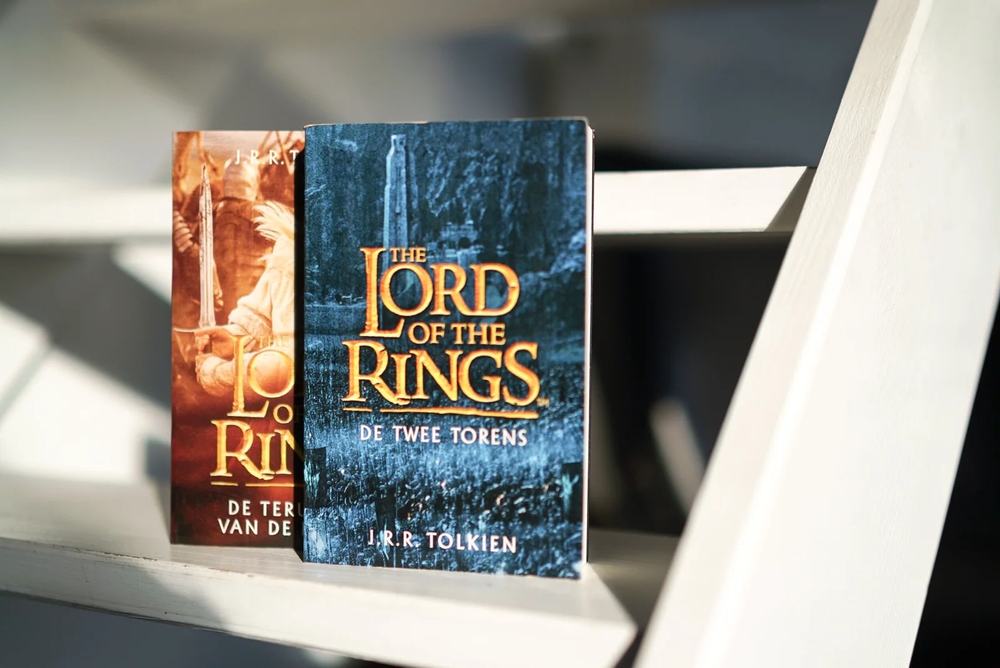

**Op 23 april is het ‘Internationale Dag van Boek en het Auteursrecht’. Een ideaal moment om het educatief A.I.-project “A.I. & Taal: Auteur of AI-teur?” in de verf te zetten!**

Dat J.K. Rowling, de schrijfster van de Harry Potter-verhalen, ook achter de pseudoniem ‘Robert Galbraith’ zat, konden [taalalgoritmes reeds achterhalen](https://www.smithsonianmag.com/science-nature/how-did-computers-uncover-jk-rowlings-pseudonym-180949824/). Ze slaagden er in om haar schrijfstijl, een linguïstieke vingerafdruk zeg maar, te herkennen.

Maar wat als zo een A.I. niet enkel die ‘vingerafdruk’ kan herkennen, maar zelf het nieuwste Harry Potter-verhaal schrijft? Of het nieuwste boek in de reeks van Tolkiens ‘Lord of the Rings’? Wie kan dan de auteursrechten claimen? Rowling of de familie van Tolkien? De programmeur van de A.I.? Wij als gebruikers van het taalalgoritme?

Met die vraag trokken we naar **Thomas Gils (KUL)**. Thomas Gils als onderzoeker aan de KUL gespecialiseerd in intellectueel eigendom, auteursrecht en artificiële intelligentie.

Meer info? Bekijk gerust eens de contactpagina!

[Video on YouTube](https://www.youtube.com/watch?v=Ksheo4RrQUM)
