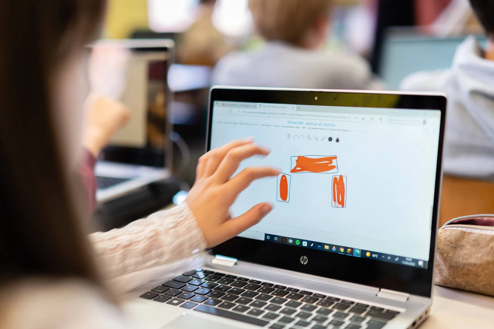

### De sprong maken naar het secundair onderwijs, daar komt heel wat bij kijken. Nieuwe leerkrachten en nieuwe vakken om uit te kiezen. Zo maken leerlingen reeds kennis met wetenschappen of programmeren via diverse activiteiten en kampjes. Maar wat is Latijn? Hoe kan je kennismaken met de taal en cultuur van de oude Romeinen en toch voluit de digitale kaart trekken? De brug slaan tussen twee schijnbare tegenpolen, de klassieke talen en een digitale game-omgeving?

[Video on YouTube](https://www.youtube.com/watch?v=KNXrgWcAiBs)

### Samenwerking tussen school en universiteit

In dit project, een samenwerking tussen de **UGent** en het **Sint-Lievenscollege Gent**, ontwikkelden we lesmateriaal voor leerlingen uit het vijfde leerjaar, zesde leerjaar en het eerste middelbaar. De onderzoeksvraag: Kunnen we leerlingen warm maken voor het vak Latijn door hen te laten proeven van het leven van een familia in het oude Rome? Hoe nemen we hen digitaal mee doorheen insulae en domus in een gigantische Minecraft-spelwereld? Hoe kunnen we evaluatie integreren in het digitale lesmateriaal?

### De uitdaging: proef van Latijn!

Leerlingen uit het vijfde en zesde leerjaar staan voor een grote keuze: welke studierichting of uitbreidingspakket willen ze kiezen? Zo kunnen ze via initiatieven zoals Coderdojo proeven van het programmeren of kan de leerkracht wetenschap in de klas brengen … maar het vak Latijn blijft altijd wat onbekend. Zo is het maken van een goede, geïnformeerde keuze moeilijk. Of doorspekt met stereotypes over het nut van de taal (“later wanneer je Geneeskunde wil doen”), en niet de schoonheid van de taal en cultuur zelf. Daar proberen we met dit project een oplossing voor te bieden!

### Voor wie?

Leerling aan de slag met het tekenen van het triclinium met de aanligtafels.

Dit project richt zich op leerlingen uit het **vijfde en zesde leerjaar** van het lager onderwijs en het **eerste jaar van het secundair onderwijs**. De leerlingen ontdekken de taal, cultuur en het leven van de Romeinen door middel van een aangepaste Minecraft-wereld. In deze wereld is een **bijna volledige herschepping gemaakt van de oude Romeinse binnenstad**, inclusief het Circus Maximus, de Palatijn, het Colosseum … We ontwikkelden enkele lesprojecten in deze game-omgeving rond de **‘Familia Latina’, over de ‘Domus et Insula’ en een uitbreidingsles over de Italiaanse taal en haar verwantschap met het Latijn**.

### Aan de slag!

De leerling krijgt drie levels voor de kiezen die een voor een doorlopen worden. In die levels wordt de leerling ondergedompeld in de, voor velen bekende, **Minecraft**\-**wereld**. Niet om te bouwen of overleven, maar om het oude Rome volledig te ontdekken! Tijdens deze levels wordt de spelwereld afgebakend. Zo verkennen we in de drie levels de Subura van Rome, zonder dat de leerling verdwaald loopt in de indrukwekkende spelwereld.

Binnen een level maakt de leerling kennis met enkele spelpersonages. Claudius, Arminius, Livia … Romeinen uit alle lagen van de samenleving. Van een dominus tot de servi die “helpen” in het huishouden. De leerling leert zo over familiebanden en maatschappelijke relaties tussen arm en rijk.

Als extra uitdaging, of evaluatie en feedbacktool voor de leerkracht, wordt elk level afgesloten met een digitale quiz! Slaagt de leerling, dan krijgt die een stempel op zijn / haar / hun persoonlijke kaart en kan die doorgaan naar het volgend level!

### Hoe kwam dit project tot stand?

Dit project is het resultaat van een samenwerking tussen de **UGent** en het **Sint-Lievenscollege** **Gent**. Dit in het kader van het opleidingsonderdeel ‘**Vakdidactiek B’ binnen de Educatieve Master**. In dit opleidingsonderdeel dienden studenten, Emma De Bruyne en Maria Kamei, digitaal lesmateriaal te ontwikkelen voor Latijn binnen het spel Minecraft. Hiervoor werden ze begeleid door vakdocenten Katrien Vanacker en Katja De Herdt (UGent - vakinhoudelijk) en Robbe Wulgaert (begeleider - ontwikkeling digitaal materiaal).

Emma en Maria verkenden de mogelijkheden van een digitale tool, kozen relevante leerplan- en lesdoelen, ontwikkelden lesmateriaal en evaluatiemethoden … Zo leren studenten zelf (digitaal) lesmateriaal ontwikkelen, van begin tot eind.

### Benodigdheden

Toegankelijkheid is een belangrijk element binnen dit project. De benodigdheden om aan de slag te gaan met dit lesmateriaal, voor leerkracht en leerling, zijn:

-   het programma Minecraft Education Edition;

-   een Microsoft- of Office365-account;

-   een computer;

-   eventueel een computermuis (voor extra comfort);

-   stabiele internetverbinding;

-   [natuurlijk: de drie Minecraft-levels!](https://sintlievenscollege-my.sharepoint.com/:u:/g/personal/robbe_wulgaert_sintlievenscollege_be/EREG0bQBLFFHnXqFrSb9zygBHZuYsg8MxgpYXkL_oMDSAg?download=1)

### Doelen: wat leer je hiermee bij?

### Lesdoelen:

-   De leerlingen kunnen de Nederlandse vertaling van verschillende leden van de familia geven.

-   De leerlingen kunnen de functie van de verschillende ruimtes van de domus verbinden met de juiste naam.

-   De leerlingen kunnen uitleggen dat niet alle slaven even goed of slecht behandeld werden of altijd dezelfde taken kregen.

-   De leerlingen kunnen de talen aanduiden die tot dezelfde taalfamilie behoren als het Latijn. (differentiatie)

-   De leerlingen kunnen de woon- en leefsituatie van de Romeinen vergelijken met hedendaagse woon- en leefsituatie.

-   De leerlingen kunnen de woon- en leefsituatie van een arme Romein vergelijken met die van een rijke.

-   De leerlingen kunnen de nadelen en gevaren van leven in een insula in eigen woorden uitleggen.

-   De leerlingen kunnen een eenvoudige Latijnse zin met onderwerp, een praesensvorm van esse en een NWDG begrijpen en vertalen.

-   De leerlingen kunnen in eigen woorden de relatie tussen patronus en cliens beschrijven.

-   De leerlingen kunnen een hedendaags voorbeeld van patronage geven.

### Leerplandoelen:

Deze leerplandoelen werden geselecteerd uit het [leerplan Latijn eerste graad (Katholiek Onderwijs Vlaanderen)](https://llinkid.katholiekonderwijs.vlaanderen/#!/leerplan/99ba041a-d80d-44c7-9482-7f9accda476a/doelenlijst).

-   KLTAa3: De leerlingen leiden de betekenis van woorden af vanuit woordopbouw en -verwantschap;

    -   in het Latijn: via verwantschap met andere Latijnse woorden;

    -   in het Latijn: via verwantschap met de moderne talen;

    -   in moderne talen: via verwantschap met het Latijn.

-   KLTAa 26: De leerlingen beschrijven aspecten van de Romeinse cultuur en vergelijken ze met de  eigen cultuur. 

-   KLTAa 27: De leerlingen verwerken aspecten van de klassieke oudheid op een creatieve manier.

### Evalueren en motiveren

Leerling aan de slag in de BookWidget van level 1.

Om de leerlingen te motiveren en de lesdoelen te evalueren maken we gebruik van een stempelkaart, BookWidgets en Minecraft skins. Wanneer een leerling klaar is met een level, verschijnt er in het spel een knop die de leerling naar een BookWidget-oefening brengt. Zo kunnen we de lesdoelen evalueren en de leerlingen aansporen om in interactie te gaan met alle elementen uit het level, en niet snel-snel doorheen het project te haasten.

Wanneer een leerling een oefening correct invult, krijgt die een stempel op het kaartje. Dit betekent dat de leerling mag doorgaan naar het volgende level en dat er een nieuwe skin werd vrijgespeeld. Een skin is een ‘look’ voor de speler in de Minecraft-game. We voorzien een skin voor een Romeinse senator, een Romeinse soldaat en een Romeinse vrouw.

**Wil je de BookWidgets uittesten? Je vindt ze hieronder:**

-   [Level 1: Domus et Familia Latina](https://www.bookwidgets.com/play/X12DfBvU-iQAExSIBggAAA/LDDMGLW/minecraft-domu?teacher_id=4559212599312384)

-   [Level 2: Domus et Insula](https://www.bookwidgets.com/play/6Eh-oXE1-iQAFdqUmggAAA/ZDC7PZC/minecraft-insu?teacher_id=4559212599312384)

-   [Level 3: Domus et Familia Latina - Italiaans (uitbreiding)](https://www.bookwidgets.com/play/MIh-D8bc-iQAFUTSBggAAA/8DC648J/minecraft-fami?teacher_id=4559212599312384)

**De lerarenlinks naar de BookWidgets vind je hieronder:**

-   [Level 1: Domus et Familia Latina](https://www.bookwidgets.com/play/X12DfBvU-iQAExSIBggAAA/LDDMGLW/minecraft-domu?teacher_id=4559212599312384)

-   [Level 2: Domus et Insula](https://www.bookwidgets.com/play/6Eh-oXE1-iQAFdqUmggAAA/ZDC7PZC/minecraft-insu?teacher_id=4559212599312384)

-   [Level 3: Domus et Familia Latina - Italiaans (uitbreiding)](https://www.bookwidgets.com/play/t:MiGw9bonKCDDXQ1tY06cuN7Hc8NXGusAsBSYMXhiS5E4RDIzUzg5)

### Hoe een eigen BookWidget importeren?

[Video on YouTube](https://www.youtube.com/embed/dj-LwgdVYFY?feature=oembed)

### Ik wil dit in mijn klas! Wat moet ik doen?

Wil je hier zelf mee aan de slag in jouw klaslokaal? Super! Jongeren helpen kiezen en goed oriënteren is belangrijk. Daar hoort het proeven van het vak Latijn zeker bij. Ik wil jou daar gerust bij helpen!

<a class="content-button content-button--primary content-button--medium" href="https://education.minecraft.net/en-us/get-started/download">Download Minecraft Education Edition</a>

<a class="content-button content-button--primary content-button--medium" href="https://sintlievenscollege-my.sharepoint.com/:u:/g/personal/robbe_wulgaert_sintlievenscollege_be/ER6fdtcoLGBHl_TkvOGdiaIBhuXHjjvp8CHxrDxvLoWFLg?download=1" target="_blank" rel="noreferrer">Download de werelden!</a>

