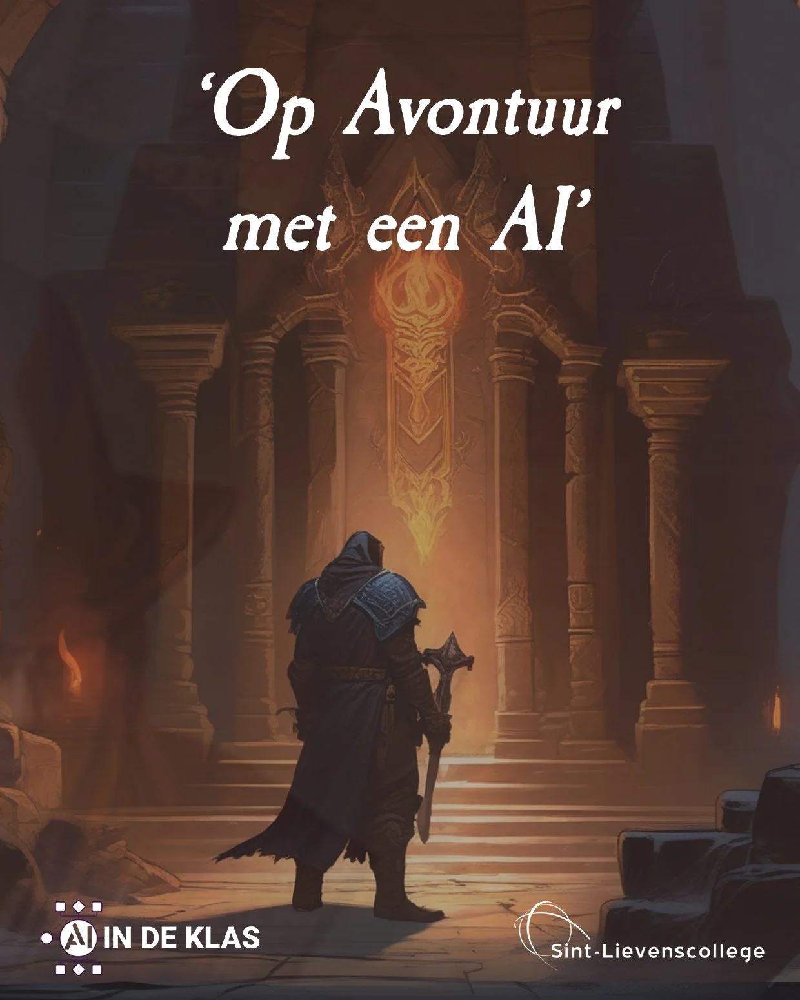

**Beste avonturier, welkom! In dit lesproject maak je kennis met de werking van GPT-taalmodellen, prompting en leer je deze inzetten om, in samenspel met anderen en een AI, een verhaal te beleven. Dit is versie 2.0 van dit lesmateriaal dat ik sinds 2020 gebruik en ontwerp samen met mijn leerlingen. Bij deze een shout-out naar Jerom, Sander en Ward! Lesmateriaal waarin we taalalgoritmen en taaltechnologie combineren met creatief schrijven. Lesmateriaal waarbij Dungeons & Dragons en taalwetenschappen elkaar vinden. Lesmateriaal dat een mooie toevoeging kan zijn binnen het curriculum van menig richting met ‘Moderne Talen’ en ‘Taalredactie en Taaltechnologie’. We’re off on an adventure!**

Met dit project combineren we de vakken informaticawetenschappen met moderne talen (Engels, Frans, Nederlands ...) en verkennen de leerlingen een deelgebied van de ontwikkeling van artificiële intelligentie, namelijk neural language processing. Een mondvol, maar door de ontwikkeling van taalmodellen zoals GPT-2, GPT-3 en sinds 2022 ChatGPT kan A.I. steeds meer natuurlijk ogende gesprekken voeren en teksten genereren. Deze taalmodellen zijn reeds gebruikt om poëzie te schrijven, columns te pennen voor kranten (over het gevaar van A.I.), interacties met digitale personages in VR games mogelijk te maken, gesprekken met chatbots ... Voorbeelden legio dus. Voor dit project tappen we uit een ander vaatje. Want wij combineren deze taalalgoritmen met een opdracht rond verhaalstructuur en creatief schrijven! In samenspel met een A.I. schrijven we aan een fictieve wereld en gaan op avontuur. Niet met flitsende beelden en felle kleuren, maar enkel met onze taal. In dit lesmateriaal krijg je een aanzet gebaseerd op role playing games zoals het bekende Dungeons & Dragons.

Tovenaar met zijn fireball spell - beeld gemaakt via Stable Diffusion en Python-code. [**Klik hier voor meer info over dit soort lesmateriaal.**](/onderwijs/ai-design-aikea)

Na ons heus avontuur verkennen we de achterliggende technieken die deze taalalgoritmen mogelijk maken en reflecteren we op ons avontuur. We kijken kritisch naar de prestaties van onze ‘AI Game Master’ en hoe die het verhaal stuurde. Bekomen we een spannende verhaal- boog? Weet het taalmodel alle details te onthouden? Wie is er echt creatief aan de slag gegaan? Wij als mensen, of stiekem het AI-model ook?

### Verloop van dit AI-project

Binnen dit project werken leerlingen samen aan hun verhaal. Voor we aan de slag gaan met een taalalgoritme moeten we zelf het een en ander op papier zetten. Zoals:

-   Waar speelt het verhaal zich af? Is dat in de toekomst, in een parallelle versie van het heden, het verleden, een fantasy-setting met oude koninkrijken en ridders, of tussen de sterren en planeten van een grauwzwarte science fiction toekomst?

-   Wie zijn onze hoofdpersonages? Een groep ruimtevaarders? Strijders? Wezens die lijken op mensen of toch net iets anders? Wat zijn hun sterktes en zwaktes?

-   Wat is het doel van ons avontuur? Gaan we op queeste om een belangrijk artefact op te zoeken? Moet- en we een dorp redden van een tirannieke leider? Dreigt een disfunctioneel onderdeel ons ruimtestation te beschadigen of is er sabotage in het spel?

Bovenstaande zijn allemaal elementen die de leerlingen moeten voorbereiden. Dit kan thuis, via groepswerk in de klas ...

> **Tip:** laat leerlingen nooit onvoorbereid aan een brain- storm beginnen. Laat hen boeken verzamelen, opzoeken, ideeën met zich meebrengen naar de klas. Echt creatieve oplossingen komen pas uit een brainstorm wanneer elke deelnemer een stuk voorbereiding heeft kunnen uitvoeren. Zo niet dreigt het resultaat tegen te vallen of verkrijg je niet de diversiteit aan voorstellen die je op het oog had.

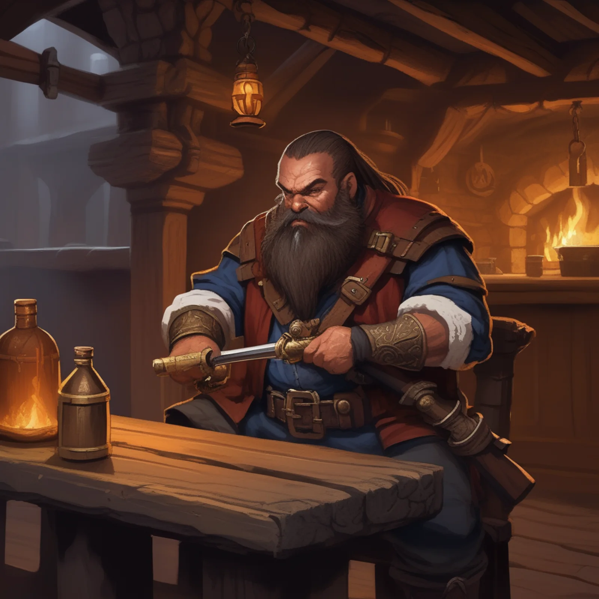

Een van de helden uit het verhaal in de taverne - beeld gemaakt via Stable Diffusion en Python-code. [**Klik hier voor meer info over dit soort lesmateriaal.**](/onderwijs/ai-design-aikea)

### Proof-of-Concept

Verder in dit lesmateriaal vind je een voorbeeldopstelling voor zo’n verhaal. In dit voorbeeld krijg je enkele personages, een setting, een verhaal ... Waarmee je onmiddellijk aan de slag kan gaan. Dit kan je gebruiken als inspiratie, of als demonstratie. Zo kunnen de leerlingen via dit voorbeeld een idee vormen over hun held, hun verhaal, wat de mogelijkheden en beperkingen zijn van het taalalgoritme en voeren we hiermee reeds een korte analyse en reflectie uit. Daarna kunnen ze de opdracht herhalen met hun zelfgeschreven helden, avonturen en prompts. 

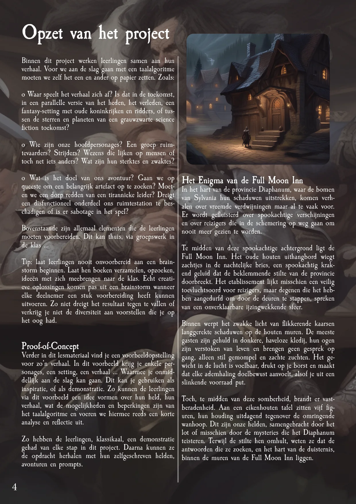 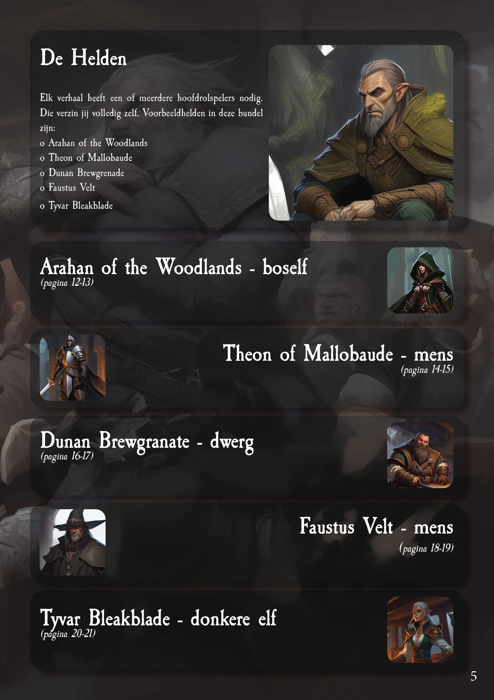 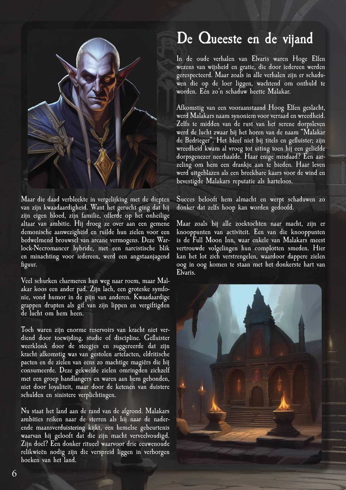 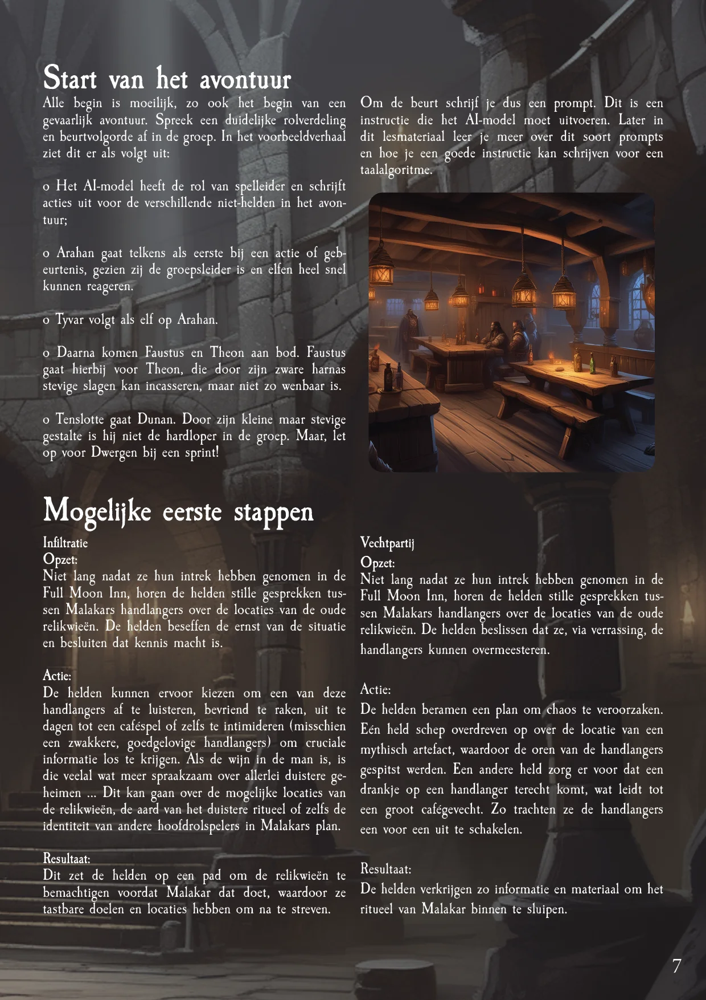

### GPT-Taaltechnologie en Prompting

Volledige grootte weergeven

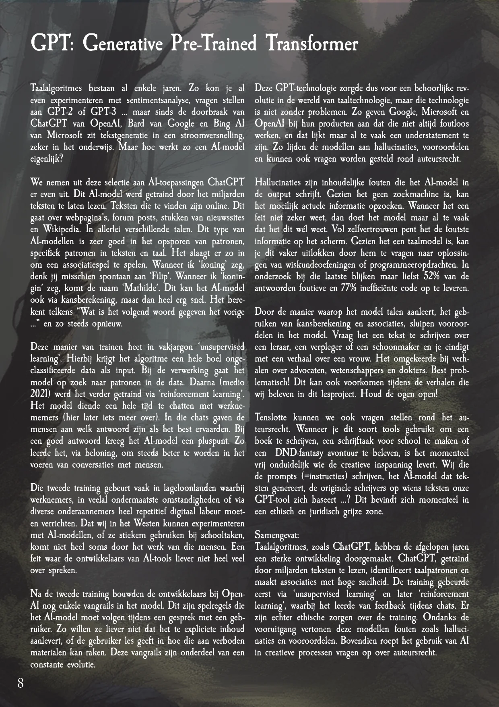

Taalalgoritmes bestaan al enkele jaren. Zo kon je al even experimenteren met sentimentsanalyse, vragen stellen aan GPT-2 of GPT-3 ... maar sinds de doorbraak van ChatGPT van OpenAI, Bard van Google en Bing AI van Microsoft zit tekstgeneratie in een stroomversnelling, zeker in het onderwijs. Maar hoe werkt zo een AI-model eigenlijk? Hoe schrijf je goede instructies of ‘**prompts**’ voor zo’n taalmodel? Daar staan we ook bij stil in dit lesmateriaal!

**Prompting** is een cruciaal aspect in de interactie met AI-modellen. Een prompt kan worden gezien als een aanwijzing of instructie die aan het model wordt gegeven om een specifieke reactie of output te genereren. In essentie fungeert het als een startpunt voor het model om zijn kennis toe te passen en een relevante reactie te produceren. Een goed geformuleerde prompt kan het verschil betekenen tussen een nauwkeurige en relevante reactie en een die minder relevant of zelfs incorrect is.

Volledige grootte weergeven

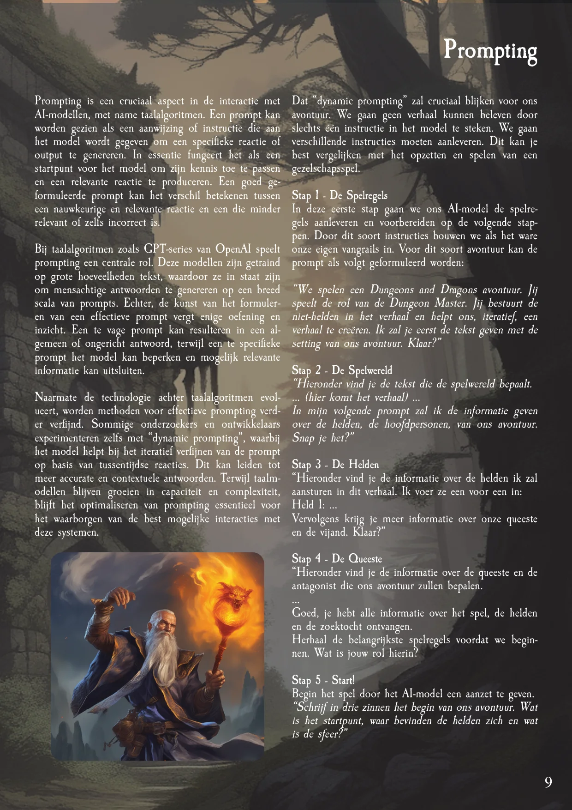

Bij taalalgoritmen zoals GPT-series van OpenAI speelt prompting een centrale rol. Deze modellen zijn getraind op grote hoeveelheden tekst, waardoor ze in staat zijn om mensachtige antwoorden te genereren op een breed scala van prompts. Echter, de kunst van het formuleren van een effectieve prompt vergt enige oefening en inzicht. Een te vage prompt kan resulteren in een algemeen of ongericht antwoord, terwijl een te specifieke prompt het model kan beperken en mogelijk relevante informatie kan uitsluiten.

Naarmate de technologie achter taalalgoritmen evolueert, worden methoden voor effectieve prompting verder verfijnd. Sommige onderzoekers en ontwikkelaars experimenteren zelfs met “dynamic prompting”, waarbij het model helpt bij het iteratief verfijnen van de prompt op basis van tussentijdse reacties. Dit kan leiden tot meer accurate en contextuele antwoorden. Terwijl taalmodellen blijven groeien in capaciteit en complexiteit, blijft het optimaliseren van prompting essentieel voor het waarborgen van de best mogelijke interacties met deze systemen.

Dat “dynamic prompting” zal cruciaal blijken voor ons avontuur. We gaan geen verhaal kunnen beleven door slechts één instructie in het model te steken. We gaan verschillende instructies moeten aanleveren. Dit kan je best vergelijken met het opzetten en spelen van een gezelschapsspel. Ook daarvoor vind je een **uitgebreid** **stappenplan** en **een** **praktijkvoorbeeld** in het lesmateriaal

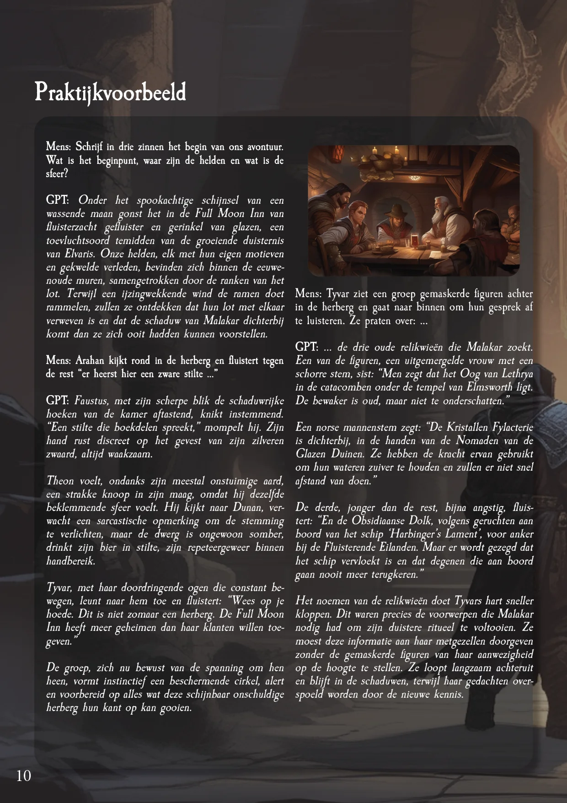 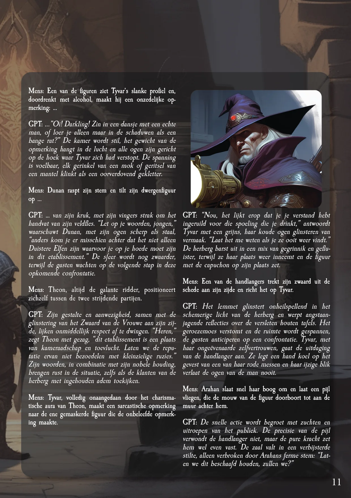

### Kijk kritisch naar het eindresultaat!

Eigenlijk een altijd-geldend advies wanneer je werkt met AI-modellen: vertrouw niet blindelings op de output. Wees je bewust van de beperkingen, de fouten, mogelijke vooroordelen en leg het naast jouw vakkennis. Zo ook de kennis die je hebt over een vlot verloop van een verhaal, hoe een “hero’s journey” verloopt, hoe je een goed personage schrijft, een logisch verloop van een scene … Het vergt ook een stevig taalregister om alle woorden die een GPT-tool schrijft onmiddellijk te begrijpen. De complexiteit of ‘perplexity score’ van het taalregister durft wel eens af te wijken van dat van onze leerlingen.

Ook daar vind je materiaal voor in deze syllabus. Na het “spelen” van ons verhaal, dienen leerlingen te reflecteren. Wat verliep goed, wat kon beter? Ze dienen stukken uit de tekst te halen, redigeren, samen te vatten … en zo hun analyse te presenteren aan de docent of aan de klas.

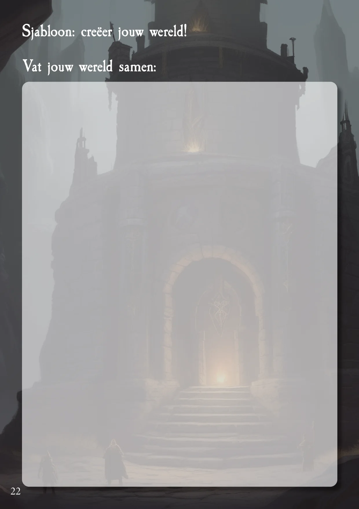 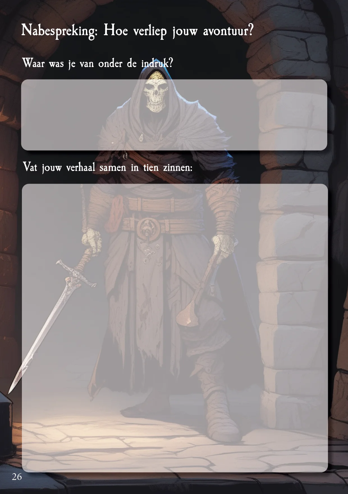 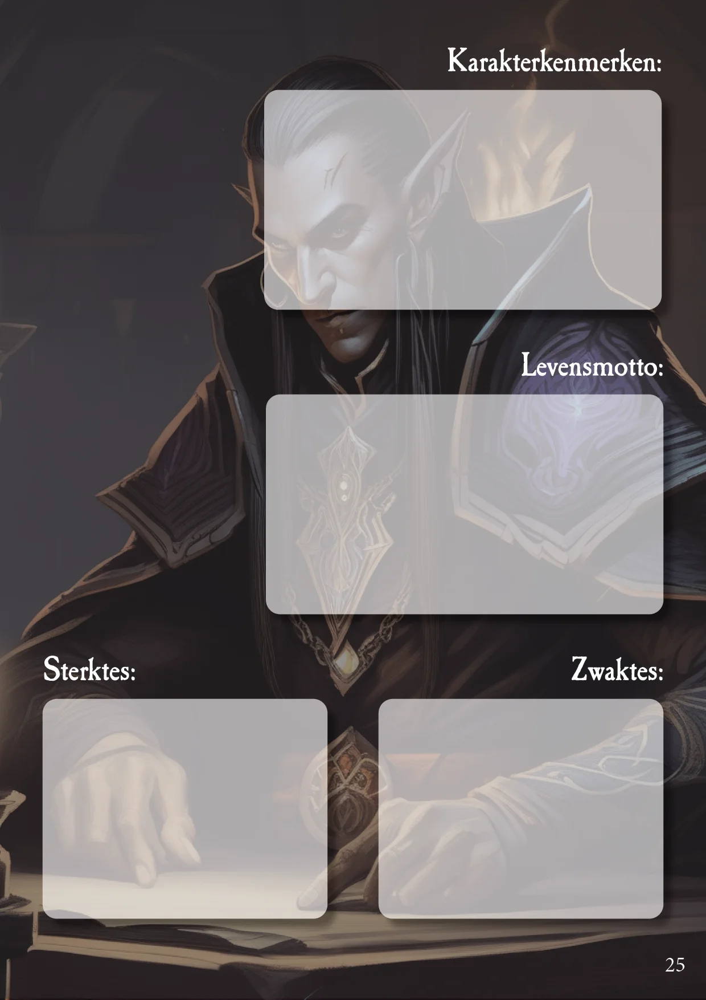 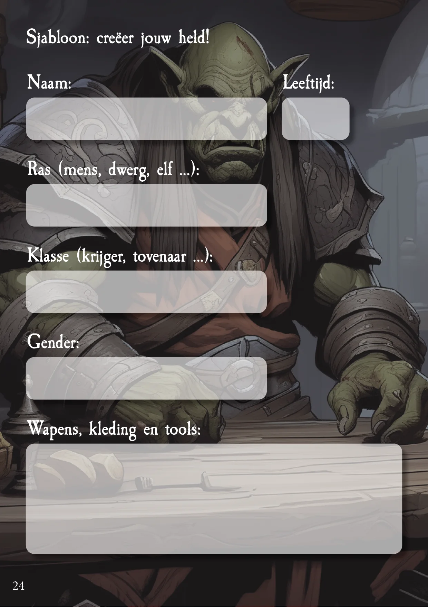 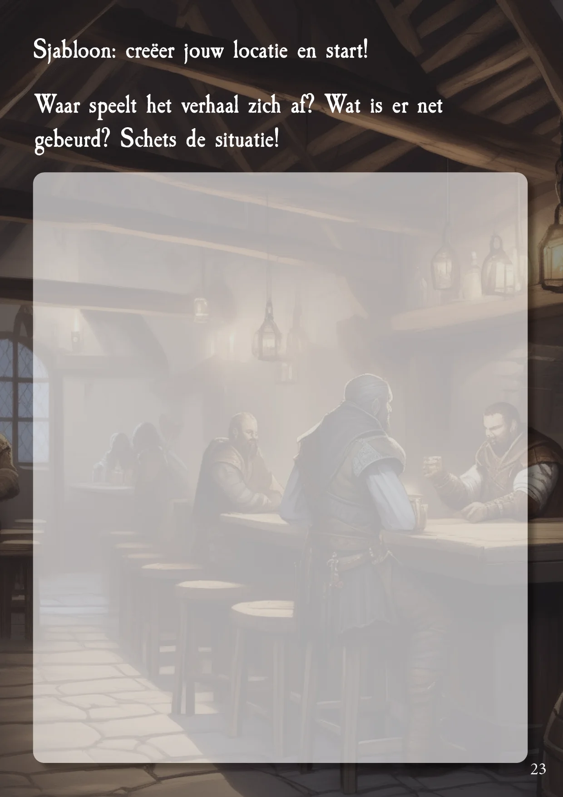 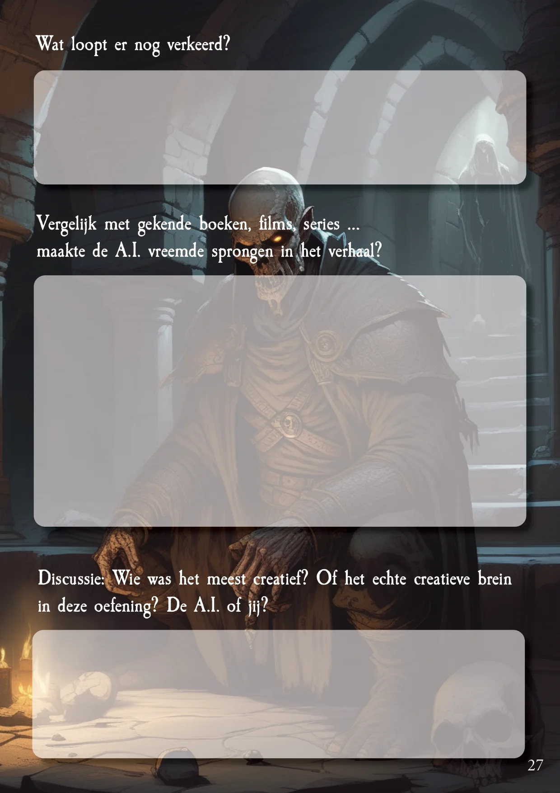

### Benodigdheden

Om met dit lesmateriaal aan de slag te gaan heb je volgende materialen nodig:

-   Deze werkbundel voor docent en/of leerlingen;

-   Schrijfgerei (echt, laat de leerlingen gerust eerst hun helden en verhalen schrijven);

-   Stabiele internetverbinding;

-   (School)laptop;

-   Toegang tot GPT-tool zoals ChatGPT of alternatieven.

### Situering in het curriculum en leerplandoelstellingen

Voor onderstaande selectie aan leerplandoelstellingen werd gekeken naar het ontwerpleerplan ‘Taaltechnologie en Taalredactie’ binnen de richting Moderne Talen in de doorstroomfinaliteit. Dit leerplan werd gemaakt binnen de koepelvereniging ‘Katholiek Onderwijs Vlaanderen’.

-   **LPD 1: De leerlingen herformuleren doelgericht schriftelijke en mondelinge teksten in functie van de doelgroep, kanaal of medium.**
    **Wenk**: binnen deze lesopdracht dienen leerlingen een eigen tekst te schrijven over hun personage, de wereld, hun queeste ... en deze informatie om te zetten in een prompt voor het AI-model. Nadien verwerken de leer- lingen hun avontuur (de chat) naar een tekstreflectie (kritische analyse van het verhaal) of herschrijven ze deze naar een verhaal (fantasy-tekst).

-   **LPD 3: De leerlingen redigeren schriftelijke teksten op taalgebruik, consistentie en doelgerichtheid.**
    **Wenk**: Bij het herwerken van het avontuur (de resul- terende chat) naar een reflectie of consistent verhaal dienen leerlingen gehele stukken te herschrijven volgens afspraken en richtlijnen. Hierbij kunnen leerlingen ook vertaalprogramma’s gebruiken.

-   **LP4: De leerlingen gaan kritisch om met taaltechnologische hulpmiddelen.**
    **Wenk**: Spreekt voor zich binnen dit lesmateriaal. Hier komen leerlingen in contact met taalalgoritmen, leren ze hoe ze een prompt kunnen opstellen en evalueren nadien de teksten op vlak van consistentie, geheugen, verhaalstructuur ... Hier kan je ook stil staan bij het gegeven creativiteit, auteursrecht en plagiaat.

Aan dit lesmateriaal kunnen mogelijk nog meer leerplandoelstellingen gekoppeld worden, maar bovenstaande geeft alvast een duidelijke indicatie.

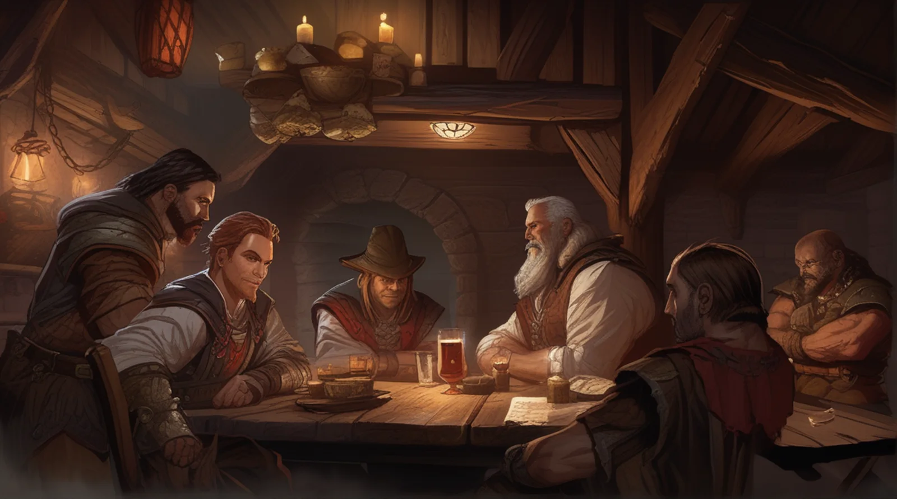

Sfeerbeeld uit de taverne in het verhaal - beeld gemaakt via Stable Diffusion en Python-code. [**Klik hier voor meer info over dit soort lesmateriaal.**](/onderwijs/ai-design-aikea)

### **Ik wil dit in mijn klas! Wat moet ik doen?**

**Wil je hier zelf mee aan de slag in jouw klaslokaal? Super! Jongeren laten kennismaken met taalalgoritmen en taaltechnologie, zeker binnen een richting met focus op de moderne talen, is een belangrijk onderdeel. Hieronder vind je de knoppen om het verhaal uit te testen, maar ook om aan te sluiten bij de Discord Community!**

<a class="content-button content-button--primary content-button--medium" href="/contact">Contact en Discord</a>

<a class="content-button content-button--primary content-button--medium" href="https://hf.co/chat/assistant/65d4e40b8742586be76d6a53">Speel het verhaal!</a>

