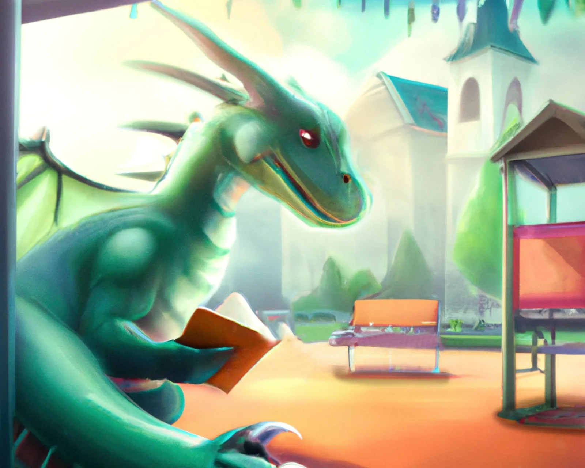
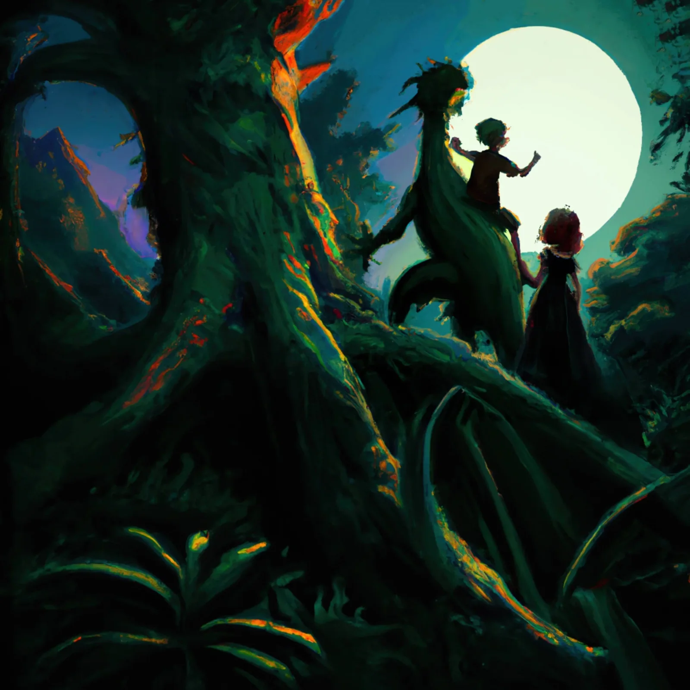
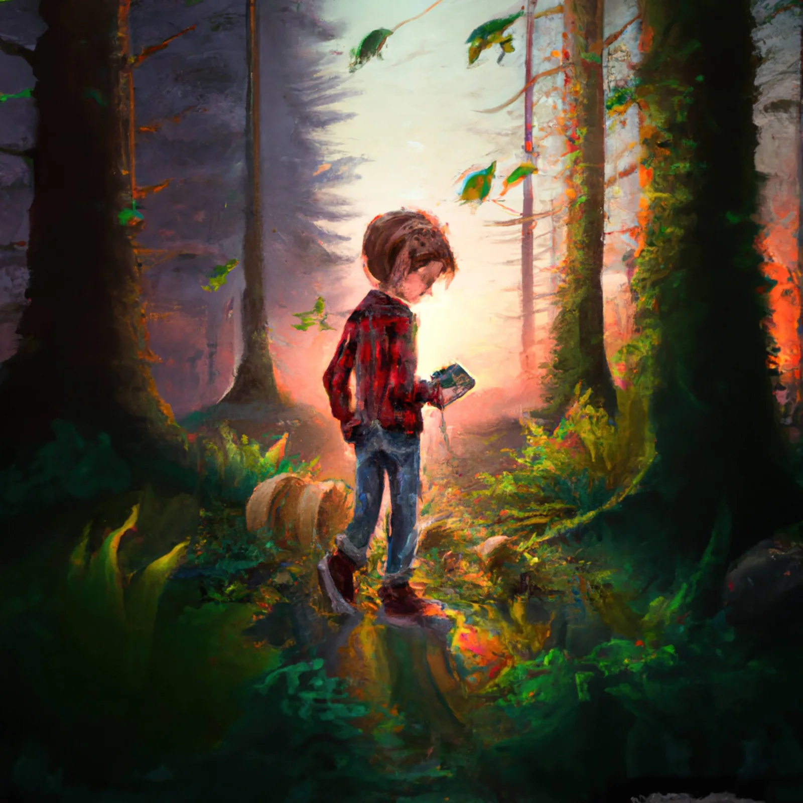
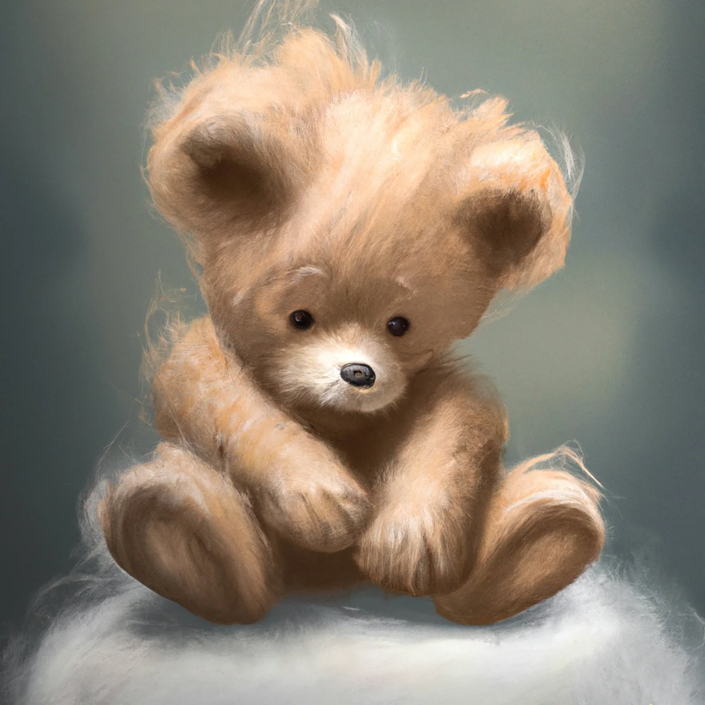
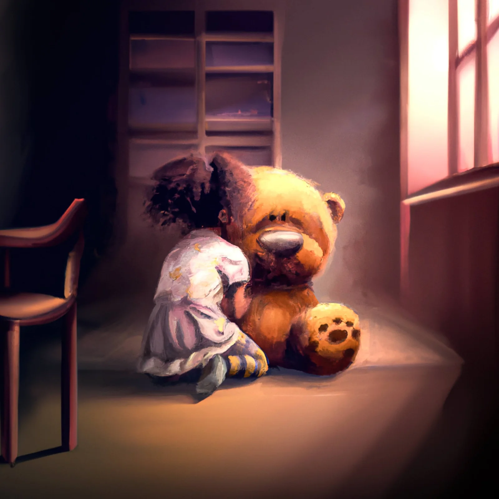
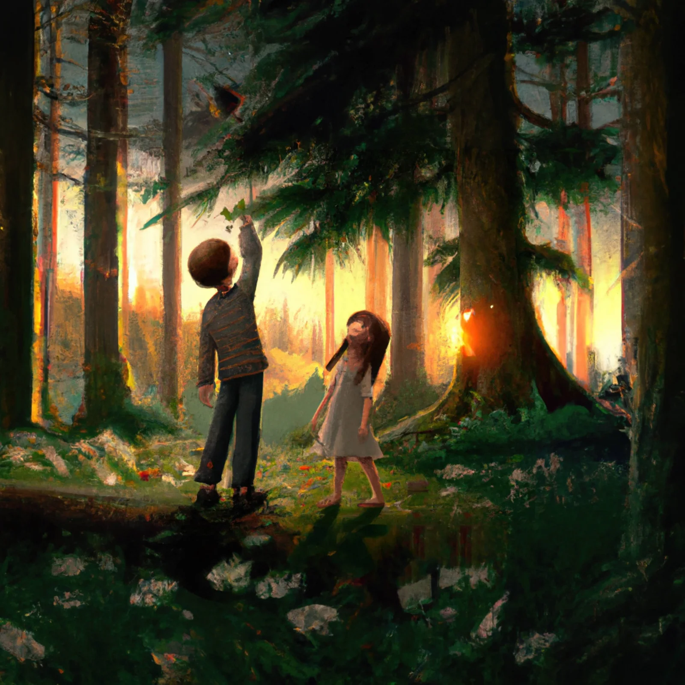
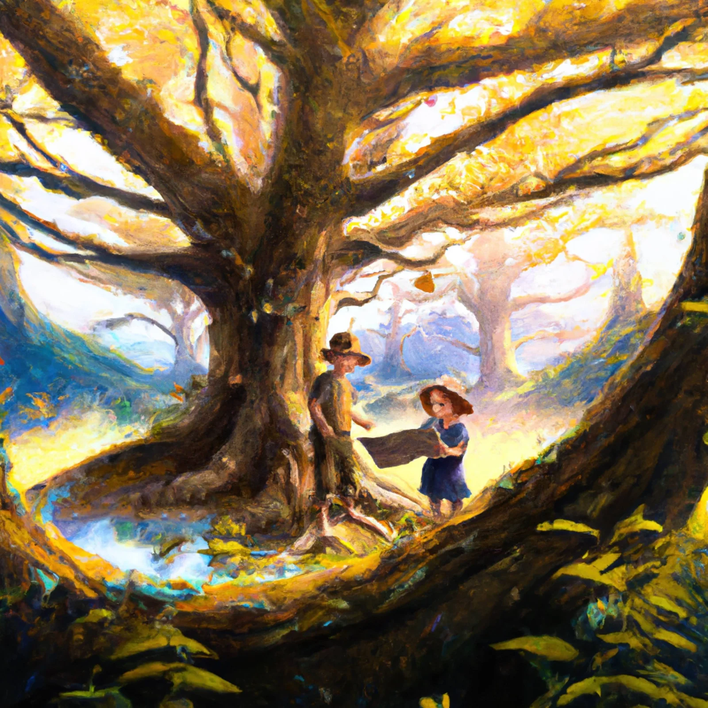
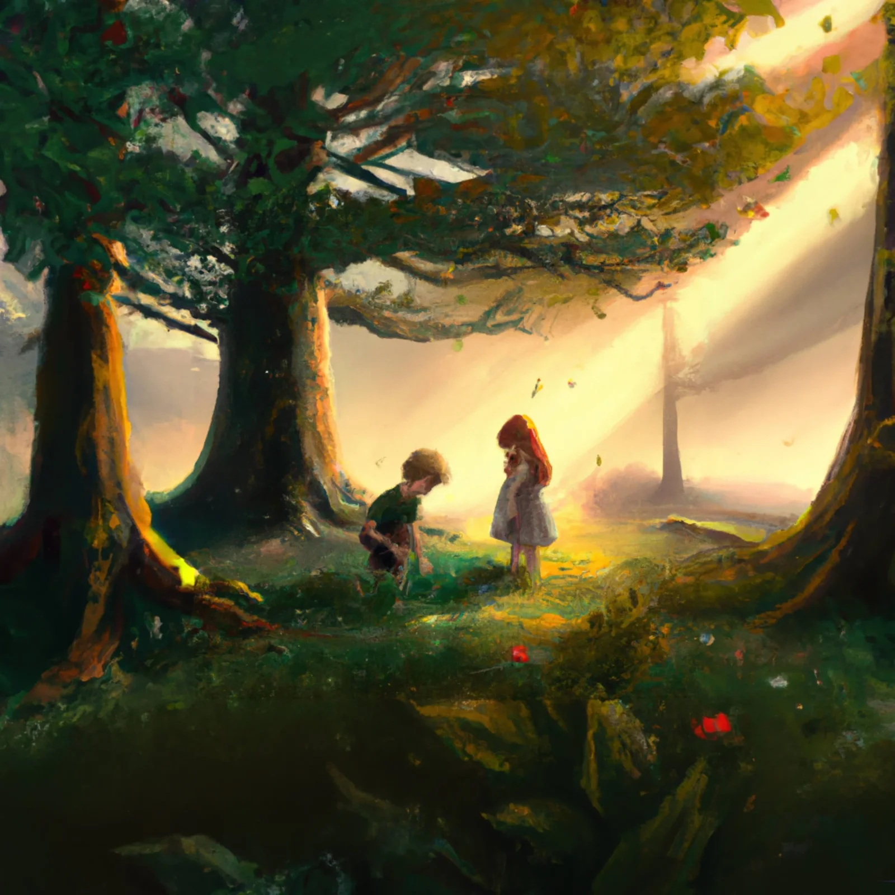

### **Op zondag 23 april 2023 - niet toevallig Wereldboekendag - vindt de allereerste editie plaats van Vlaanderenleestdag.** Een [UNESCO-dag](https://www.unesco.org/en/days/world-book-and-copyright) waarop we de kracht van boeken vieren om mensen, over generaties en culturen heen, te boeien. Een ideale kans om het te hebben over een nieuw kinderboek dat net dat doet: generaties verbinden. ‘Over Zonnedraken en Zeerovers’ vertelt het verhaal van Robbe, Martha en draakje Rana, over kinderlijke fantasie en afscheid leren nemen. Maar ook een beetje het verhaal, over generaties heen, van haar auteurs: Patricia David en ikzelf.

### Over de juf en de meester

Patricia was jarenlang kleuterjuf en stond met veel plezier voor de klas. Daar ontdekte ze haar liefde voor het vertellen en schrijven. Ondertussen schreef ze reeds twintig kinderboeken! Maar ze was niet zomaar kleuterjuf in een basisschool in Ursel, ze was **‘_mijn_ _kleuterjuf’ , mijn ‘Juf Patsy’,_** en ik haar leerling in dat tweede kleuterklasje. Net zoals zij sta ik nu zelf voor de klas. Niet als meester in de basisschool, maar als leerkracht programmeren en artificiële intelligentie.

Het avontuur over Rana, Martha en Robbe schreef Patricia voor het eerst in 1997, toen ik als fantasierijke kleuter in haar klasje zat. Of dat vertellen die papieren op mijn zolder, want het verhaal werd toen niet gepubliceerd. Nagenoeg een kwarteeuw lag het verhaal hier stof te vangen. Totdat ik het van de zolder plukte, herschreef, voorzag van illustraties en verstuurde naar mijn ‘juf Patsy’. Na enkele maanden van herwerken, legden we de laatste hand aan ons verhaaltje. In 168 bladzijden ontmoeten Martha en Robbe draakje Rana, sleuren haar naar school, ontmoeten de Sint, herstellen van een drakenschild … maar hier verder geen spoilers!

### Over fantasie en artificiële intelligentie

Al snel maakte ik de beslissing om zelf dit licht autobiografisch verhaal te voorzien van illustraties. En dat op mijn eigen manier. In mijn lessen gaat het iets minder over draken en zeerovers, maar des te meer over computers, software en artificiële intelligentie. Dus besliste ik om de illustraties te maken met die tools waar [ik mijn eigen leerlingen ook over onderwijs.](/onderwijs/ai-design-aikea)Gewapend met Photoshop, Lightroom, Python-code en AI-modellen ging ik aan de slag!

Dat brengt ons ook een beetje bij het tweede deel van die UNESCO-dag, namelijk over dat ‘**auteursrecht**’. Want de AI-modellen die ik gebruik en aanstuur met Python-code zijn niet onbesproken. AI-modellen zoals Stable Diffusion en DALL-E putten hun inspiratie via enorme datasets aan teksten en afbeeldingen. Afbeeldingen van kunstwerken, mensen, landschappen … vormen de basis van de trainingsdata van die AI-modellen. Afbeeldingen waar ze niet alle auteurs toestemming voor hebben gevraagd. [Meer over die auteursrechten en plichten kan je terugvinden in het artikel over artificiële intelligentie binnen de artistieke vakken dat ik schreef voor Schoolmakers.](https://www.schoolmakers.be/blog/artificiele-intelligentie-in-creatieve-vakken/)

### Een proevertje …

Genoeg over het verhaal achter het verhaal. Ben je benieuwd naar het avontuur van Martha, Robbe en Rana? Dan vind je hieronder het een stuk uit het begin van het boek. Veel (voor)leesplezier!

_Martha en Robbe kijken het bos rond. Ze zijn voorzichtig want ze willen geen zeerover tegen het lijf lopen. Martha haalt een getek- ende schatkaart uit haar zak en wijst: ‘Dat moet de oude eik zijn.’ ‘Weet je zeker dat het deze boom is?’ Vraagt Robbe. Samen gaan ze aan de voet van de dikke boom zitten en bekijken de kaart._

_‘Opa kan goed tekenen,’ lacht Robbe, ‘maar hoe weet hij zeker dat hier een schat begraven ligt?’ Martha haalt de schouders op en Robbe kijkt met spleetogen naar de zon. Als hij zijn ogen dichtknijpt wordt de zon een vuurspetterzon. Martha haalt hem uit zijn dagdromen: ‘Op de schatkaart is een heuvel getekend waar is die?’_

_Robbe kijkt rond, hij roept verwonderd: ‘Kijk ginder glijdt iets op een zonnestraal naar beneden, kom mee.’ Hij weet precies waar het is. Hij trekt Martha achter zich aan._

_De kinderen ruiken een brandlucht. ‘Er moet een vuurspetter naar beneden gekomen zijn, straks staat het hele bos in lichterlaaie,‘ zegt Martha. Even later merken ze een zwart geblakerde put, er komt rook uit._

_De kinderen hebben zoiets nog nooit gezien, maar toch durven ze dichterbij gaan kijken. Er zit een afdruk van een reuzenpoot en die heeft klauwen. ‘Martha bibbert en wijst: ‘Kijk daar nog een afdruk en nog een afdruk. Iets verbergt zich achter een dikke boom._

_Er steekt een groen ding uit en het beweegt een beetje. Robbe loopt een eind weg: ‘Kom mee zus, het kan gevaarlijk zijn , misschien is het een reuzenslang.’_

_Martha lacht: ‘Heb jij ooit een slang gezien met poten en klauwen?
‘Nee , maar...’_

_‘We zijn op zoek naar een schat van een zeerover, we zijn nergens bang voor, ook niet voor een bewegend groen ding. Laten we dichterbij gaan kijken,’ stelt Martha voor. Robbe aarzelt: ‘Oké, geef me een hand, we tellen tot drie en op drie springen we samen tot bij de boom.’_

_Eén, twee, drie, hand in hand springen ze vooruit. ‘BRORR,’ horen de kinderen. Het is een indringend verschrikkelijk geluid. Robbe en Martha deinen achteruit …_

* * *

### Vragen en links

<a class="content-button content-button--primary content-button--medium" href="/contact">Neem hier contact op!</a>

<a class="content-button content-button--primary content-button--medium" href="https://sintlievenscollege-my.sharepoint.com/:b:/g/personal/robbe_wulgaert_sintlievenscollege_be/EVS8-h3RgYlIpfkTjdd7IpcBXJt2VwgAq1XW921R6WQv6A?e=BW11Tl" target="_blank" rel="noreferrer">Lees het volledige boek!</a>

* * *
