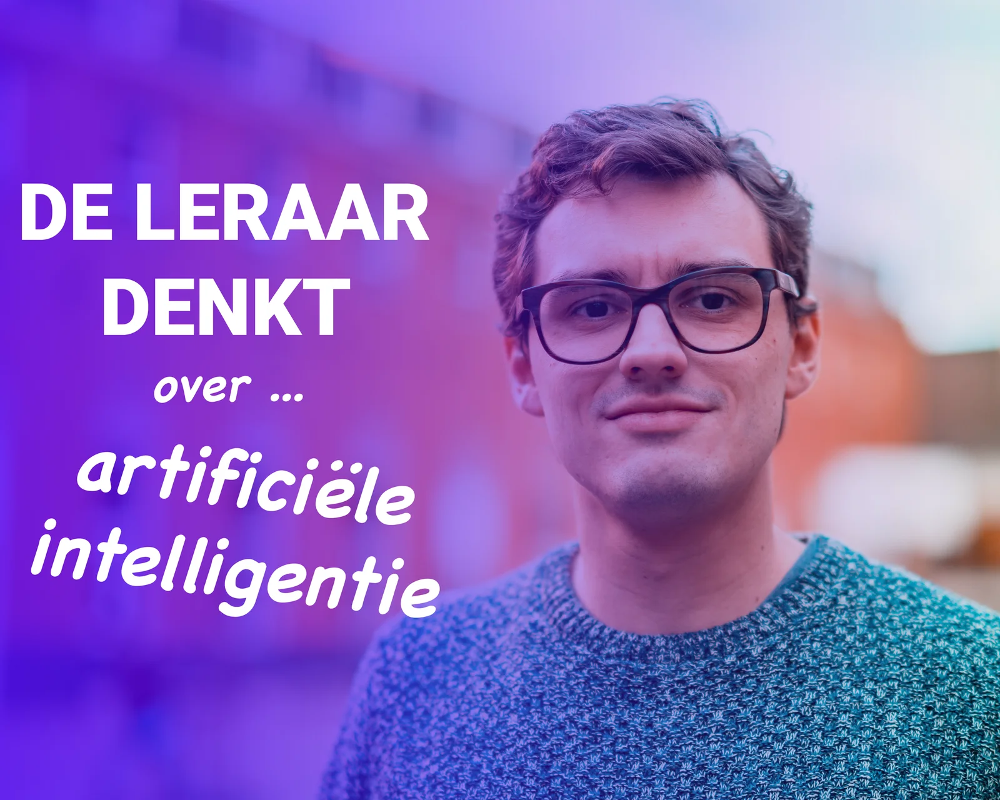

### Artificiële intelligentie is aan een opmars bezig. Ook in de lerarenkamers en klaslokalen duikt het steeds vaker op. Maar wat is ‘AI’ eigenlijk? Hoe kan je het inzetten in het onderwijs? Maak je nu reeds afspraken met collega’s en leerlingen over het goed gebruik van tools zoals ChatGPT? In de podcastaflevering _‘De Leraar Denkt … Over AI’_ spreek ik erover met host Rinke Vanhoeck ([Buiten De Krijtlijnen](https://www.dekrijtlijnen.be/)). We analyseren de recente resultaten van Teacher Tapp Vlaanderen en geven zo een antwoord op de meest prangende vragen uit de lerarenkamer over artificiële intelligentie.

<a class="content-button content-button--primary content-button--medium" href="https://deleraardenkt.transistor.fm/episodes/over-ai" target="_blank" rel="noreferrer">Luister via de website</a>

<a class="content-button content-button--primary content-button--medium" href="https://open.spotify.com/episode/5SUEeay6hGMYwMT9U99BpC?si=mugqmWTdSe2W_iZ1K7dPUQ" target="_blank" rel="noreferrer">Luister via Spotify</a>

<a class="content-button content-button--primary content-button--medium" href="https://deleraardenkt.transistor.fm/subscribe" target="_blank" rel="noreferrer">Abonneer op Buiten De Krijtlijnen</a>

