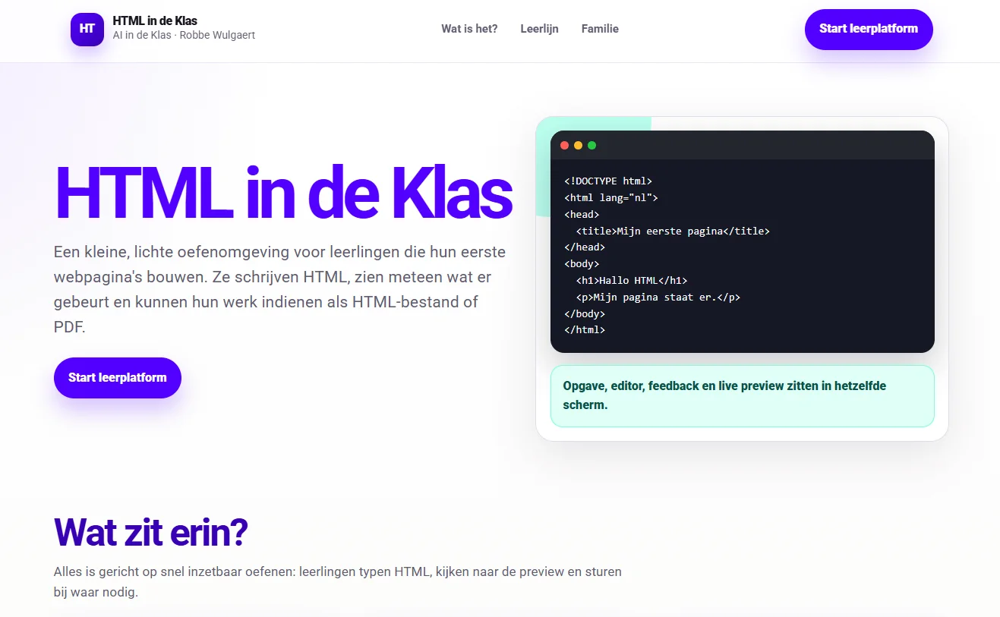
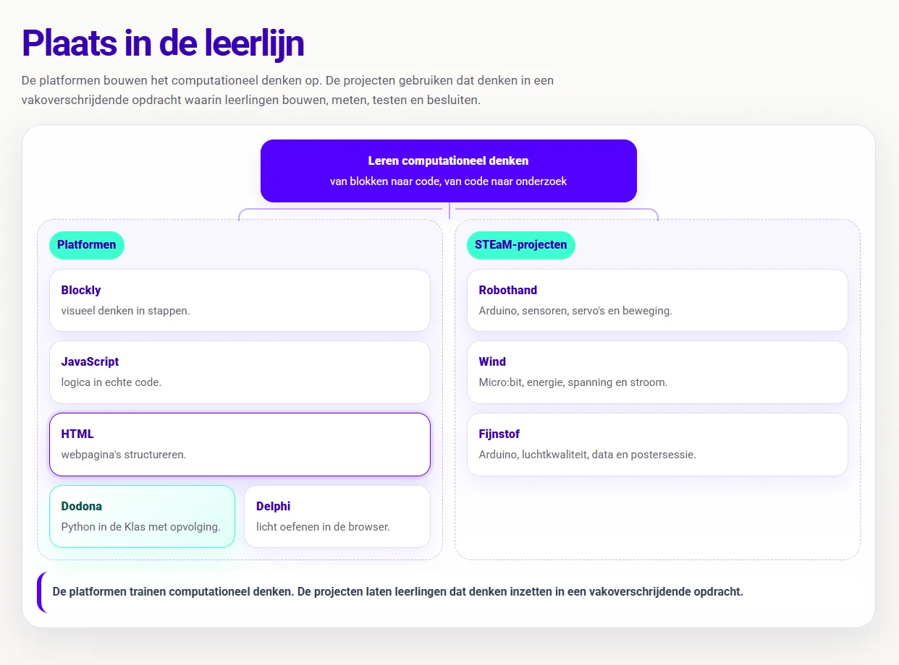
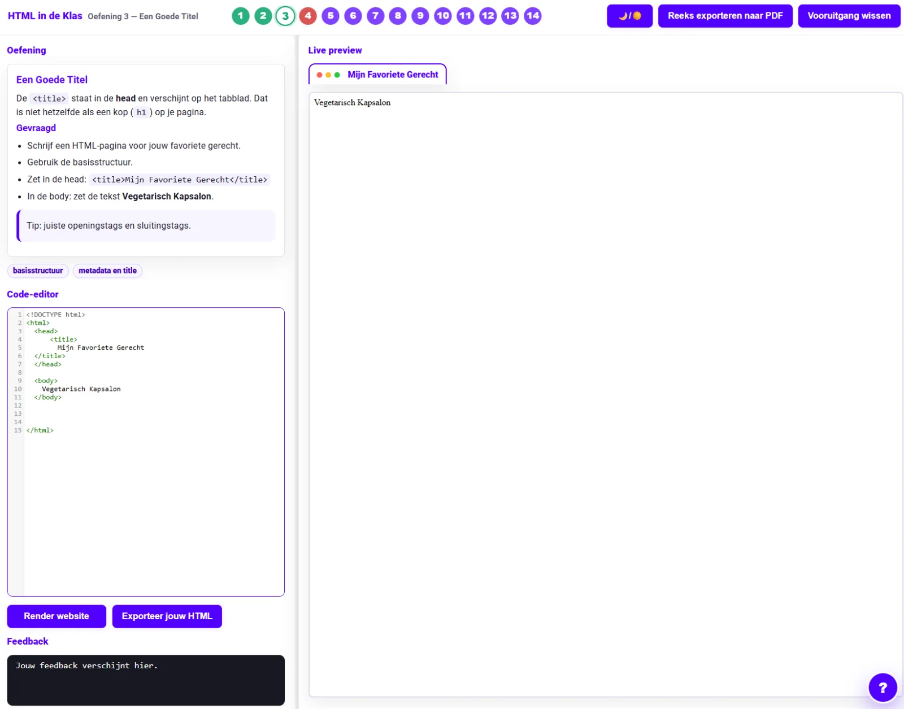
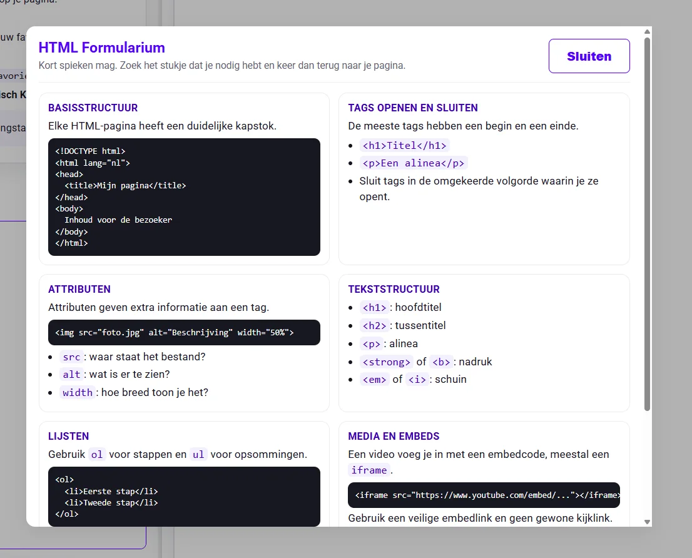
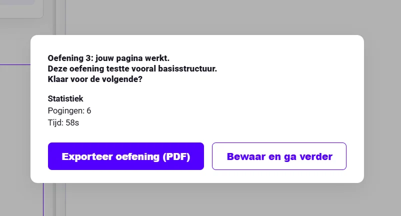
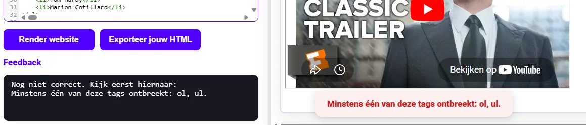
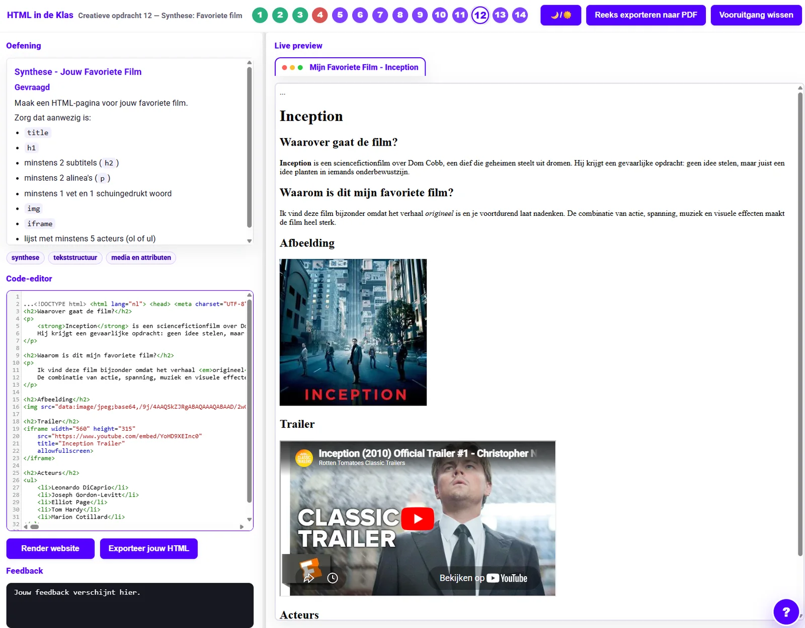
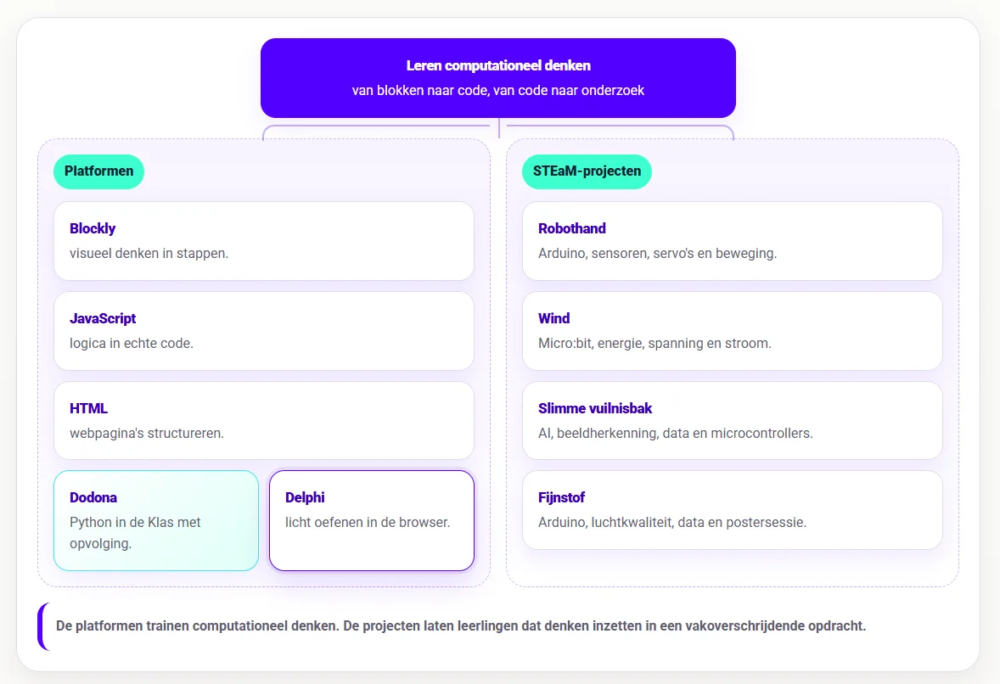

### Python is een fijne taal om programmeerconcepten mee te oefenen, tot je ze op twintig verschillende schooltoestellen wil laten draaien. Dan wordt de eerste les soms een kleine uitdaging in troubleshooting. Is Python geïnstalleerd? Werkt de juiste versie? Mag de leerling iets uitvoeren? Waar staat het bestand? Waarom opent het in de verkeerde app? Bij een lange leerlijn kan die infrastructuur de moeite waard zijn. Bij een korte oefenreeks zit ze vaak net in de weg.

### Ik wilde daarom een kleine Python-omgeving die gewoon in de browser draait. Leerlingen openen de pagina, kiezen een opdracht, schrijven code, voeren die uit, lezen de feedback en sturen bij. Met testcases, invoer via input(), lokale voortgang en een PDF-export achteraf.

### Zo ontstond **Project Delphi**. Die naam koos ik natuurlijk niet geheel toevallig. In de Griekse mythologie leefde Python bij Delphi. Dat was een te mooie knipoog om te laten liggen. Tegelijk is Delphi een lichte spiegel van onze véél grotere Python-leerlijn op het oefenplatform Dodona.

### Wat is het?

**Project Delphi** is een browseromgeving waarin leerlingen Python oefenen. De oefeningen richten zich op computationeel denken en tekstuele code, met een duidelijke leerlijn: sequentie, selectie, begrensde herhaling en voorwaardelijke herhaling.

De huidige catalogus bevat 4 hoofdstukken, 22 subhoofdstukken, 209 opdrachten en theoriebouwstenen. Delphi kan 183 oefeningen automatisch evalueren. De workflow is eenvoudig: open de pagina, kies een opdracht, schrijf code, voer uit, lees de feedback en stuur bij.

Daarom past Delphi vooral bij lessen waarin leerlingen Python moeten oefenen zonder dat je meteen een volledig dashboard nodig hebt. Denk aan een uur in de studie, een korte herhalingsles, zelfstandig oefenen, differentiatie of een reeks waarin je leerlingen stap voor stap door de basisconcepten wil loodsen.

### Hoe werkt het?

Ging je al aan de slag met andere programmeeromgevingen, dan is vrij herkenbaar. Opdracht, code-editor en uitvoer staan in dezelfde omgeving. Leerlingen schrijven Python, klikken op _Uitvoeren_ en krijgen meteen feedback.

De Pythonruntime draait in de browser via Papyros. Daardoor kunnen leerlingen gewone Pythoncode uitvoeren, ook bij oefeningen met input(). Voor die invoer krijgt de leerling een invoerveld, zodat opdrachten met gebruikersinvoer ook in de browser werkbaar blijven.

Veel oefeningen gebruiken testcases. Die controleren of de uitvoer klopt en tonen daarna een samenvatting. Wanneer iets fout loopt, krijgt de leerling concrete informatie om verder te zoeken en zelf hun algoritme te debuggen.

  

### **Inhoudelijke leerlijn**

De oefeningen volgen dezelfde programmeerconcepten die ook in de andere projecten terugkomen.

Eerst komt **sequentie**. Leerlingen plaatsen instructies in een juiste volgorde, gebruiken variabelen, rekenen, combineren tekst, importeren nieuwe bibliotheken en controleren uitvoer. Dat lijkt eenvoudig, maar hier leren ze al dat een programma exact doet wat je schrijft, niet wat je bedoelt.

Daarna volgt **selectie**. Leerlingen beslissen met voorwaarden. Ze oefenen met if, elif en else, en leren hoe een programma verschillend kan reageren op verschillende invoer. Dat is vaak het moment waarop code iets minder lineair wordt. Niet elke regel hoort altijd uitgevoerd te worden.

Vervolgens komt **begrensde herhaling**. Leerlingen doen een vast aantal keer iets opnieuw. Leerlingen leren bij het lezen van de opgave te speuren naar startgetal, eindgetal en interval.

Tot slot is er **voorwaardelijke herhaling**. Leerlingen blijven herhalen zolang een voorwaarde waar is, ook al wil je dat zelf niet … Want ja, wie ooit een oneindige lus geschreven heeft, weet dat de computer geen enkele moeite heeft om koppig te blijven doen wat jij vroeg.

## **Formularium**

Delphi bevat ook een Python-formularium. Dat vervangt de uitleg in de les niet, maar het geeft leerlingen wel een handig vangnet tijdens het oefenen. Leerlingen vinden er snel terug hoe ze tekst tonen met print(), invoer vragen met input(), tekst omzetten naar int of float, voorwaarden schrijven, lussen gebruiken en veelgemaakte fouten herkennen.

Dat helpt vooral leerlingen die het denkpatroon begrijpen, maar struikelen over de exacte schrijfwijze. Ze weten wat het programma moet doen, maar zoeken nog naar hoe ze dat correct in Python noteren. Dan wil je niet dat de oefening stilvalt op één vergeten dubbelepunt of verkeerd geplaatste insprong.

## **Exporteren**

De browser bewaart code, pogingen, werktijd en evaluatiestatus lokaal. Leerlingen hebben dus geen account nodig en Delphi stuurt niets naar een server. Dat maakt de tool snel inzetbaar, zeker op schooltoestellen waar je niet eerst allerlei instellingen wil aanpassen. Dat betekent dus ook dat ik als ontwikkelaar geen gegevens van gebruikers ontvang of verwerk.

Leerlingen kunnen een reeks ook exporteren naar PDF. Die export bevat leerlinggegevens, code, feedback en een compacte rubriek voor evaluatie. Dat is handig wanneer je een bewijs van werk wil laten indienen, of wanneer je achteraf kort feedback wil geven zonder dat je alles live hebt moeten opvolgen.

Er is ook een knop om voortgang te wissen. Dat lijkt een beetje banaal, maar soms wil een leerling een oefening volledig opnieuw maken om te oefenen en automatiseren.

### **Pythia voor nieuwe oefeningen**

Naast de leeromgeving werk ik ook aan **Pythia**. Die tool moet lesgevers helpen om zelf oefeningen te bouwen voor Delphi. Dat onderdeel is nog in ontwikkeling. Een oefenplatform wordt pas echt bruikbaar wanneer je de inhoud kan aanpassen aan je eigen klas. Soms wil je een extra oefening bij selectie. Soms wil je een context vervangen. Soms heeft een klas net een tussenstap nodig die in de standaardreeks ontbreekt.

Pythia moet het mogelijk maken om metadata, opdrachttekst, startcode, oplossing en testcases gestructureerd in te vullen. Daarna moet de tool helpen om de oefening in de juiste mapstructuur te plaatsen. Ook met Pythia zal je nog wat vertrouwd moeten zijn met repositories, mappen en contentstructuur. Behoorlijk technisch allemaal. Het doel is vooral om de drempel te verlagen wanneer je eigen oefeningen netjes wil klaarzetten. Elke klas heeft vroeg of laat een oefening nodig die nét iets dichter bij hun leefwereld ligt.

## **Hoe ziet de leerlijn er uit?**

Eerst verdiepen leerlingen via de **platformen** in de wereld van het computationeel denken. Ze leren de decompositie toepassen, leren programmeerconcepten herkennen, ontwerpen algoritmes en slaan aan het debuggen. Hiervoor hanteren we volgende **platformen**:

-   **Blockly in de Klas** helpt leerlingen eerst visueel redeneren. Ze oefenen daar met sequentie, selectie, begrensde herhaling en voorwaardelijke herhaling zonder dat syntax meteen met alle aandacht gaat lopen. Dit onderdeel zit in het begin van de leerlijn.

-   **JavaScript in de Klas** zit op een interessante plek in de reeks. Het komt na visueel redeneren met blokken, maar blijft dichter bij de browser dan Python. Daardoor kan het tegelijk programmeerconcepten oefenen en webgedrag zichtbaar maken.

-   **HTML in de Klas** zit in de webtak. Daar leren leerlingen hoe webpagina’s opgebouwd zijn met structuur, tags, attributen en inhoud. HTML beslist niets en herhaalt niets. **JavaScript** verbindt die werelden. De taal voegt gedrag toe aan webpagina’s en laat leerlingen dezelfde denkpatronen uit Blockly verder oefenen: variabelen, voorwaarden, lussen, functies, invoer, uitvoer en debugging.

-   **Project Delphi** neemt daarna Python op als tekstuele programmeertaal met een grotere oefencatalogus en testcases.

-   **Dodona blijft de allersterkste keuze voor volledige trajecten, dashboards, deadlines, evaluaties, klasopvolging, toetsen en zelfs examens!**

Daarna komen de **STEaM-projecten**. Die projecten gebruiken de opgebouwde concepten in grotere opdrachten waarin leerlingen bouwen, meten, testen en besluiten. De platformen trainen de bouwstenen van het computationeel denken. De projecten zetten tonen hoe we met die bouwstenen en digitale systemen een impact kunnen hebben op onze eigen leefwereld en samenleving.

-   Bij **Project Robothand** brengen leerlingen Arduino, sensoren, servo’s, seriële data en mechaniek samen in één werkend systeem. Dit past later in de leerlijn, na een eerste traject rond Arduino en fysieke computing. Leerlingen sturen niet alleen code naar een bordje, maar zien hoe sensorwaarden beweging veroorzaken.

-   Bij **Project Wind** verschuift de focus naar meten en onderzoeken. Leerlingen bouwen een windmolenopstelling, gebruiken de micro:bit om spanning en stroom te meten, berekenen vermogen en energie, vergelijken proeven en schrijven een besluit op basis van data. Hier wordt code een onderzoeksinstrument.

-   Bij **Slimme Vuilnisbak** komt daar artificiële intelligentie bij. Leerlingen verzamelen voorbeelden, kennen labels toe, trainen een model, testen voorspellingen, bekijken confidence-scores en koppelen de voorspelling aan een microcontroller. Zo wordt AI geen magische doos, maar een systeem dat werkt met data, labels, fouten en bijsturing.

-   **Fijnstof** hoort in dezelfde projectlaag. Tijdens dit STEaM-project gaan we aan de slag met Arduino, luchtkwaliteit, data en een postersessie. Leerlingen meten een verschijnsel uit de echte wereld, verwerken data en communiceren hun bevindingen.

Zo ontstaat er een overzichtelijk en duidelijk **curriculum**: eerst leren leerlingen redeneren, structureren en programmeren in kleine oefenomgevingen. Daarna gebruiken ze die kennis in projecten waarin code gekoppeld wordt aan fysieke systemen, meetgegevens, onderzoeksvragen en ontwerpkeuzes.

### **Ik wil dit in mijn klas! Wat moet ik doen?**

Wil je hier zelf mee aan de slag in jouw klaslokaal? Super! Samen met jongeren werken rond computationeel denken en programmeren is fantastisch, maar ik ben wellicht een bevooroordeelde bron. Met de knoppen hieronder kan je de tool zelf uittesten. Vind je een bug in mijn code? Laat het gerust weten via het contactformulier of via de Discord-server! 

<a class="content-button content-button--primary content-button--medium" href="https://robbew.github.io/delphi/" target="_blank" rel="noreferrer">Ga naar Delphi!</a>

<a class="content-button content-button--primary content-button--medium" href="/contact">Contacteer Robbe!</a>

