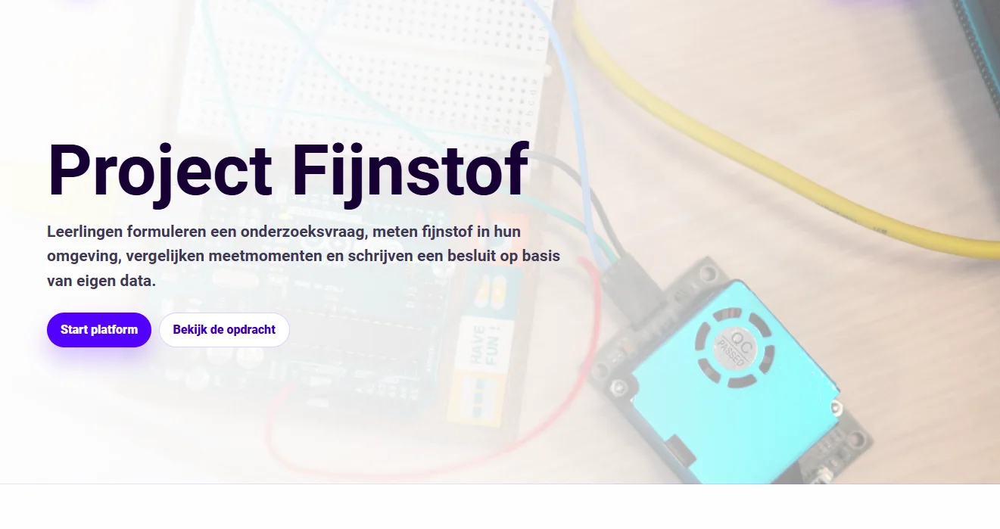
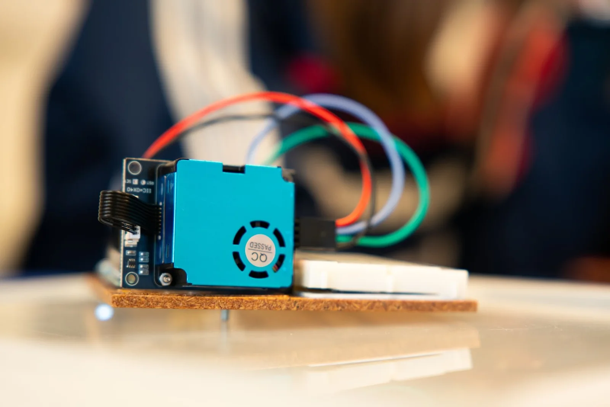
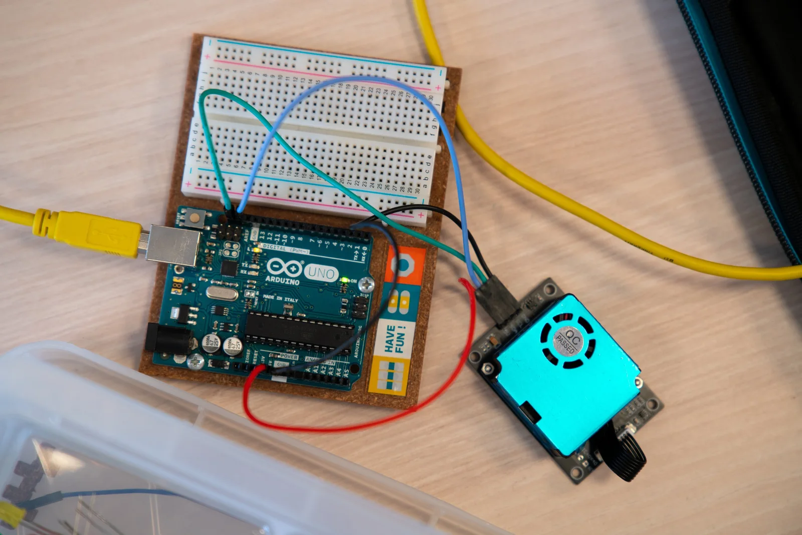
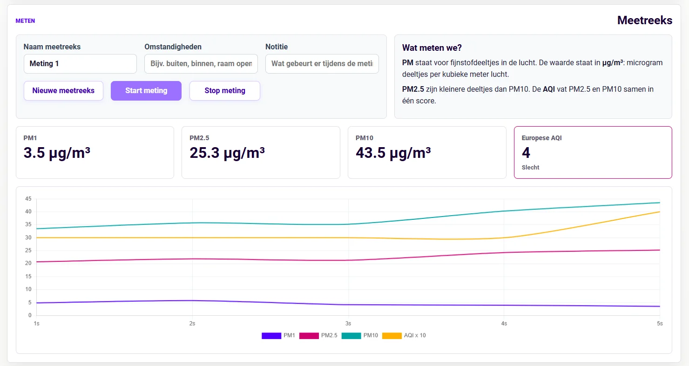
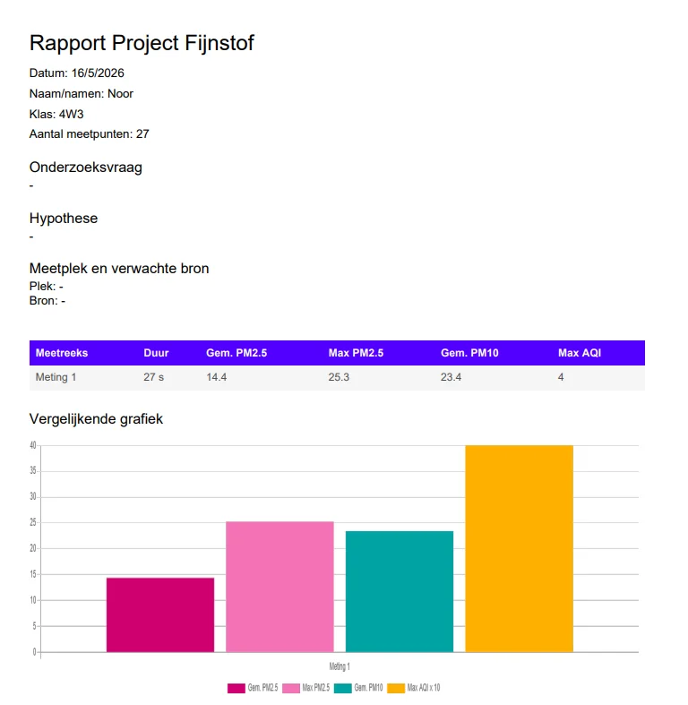
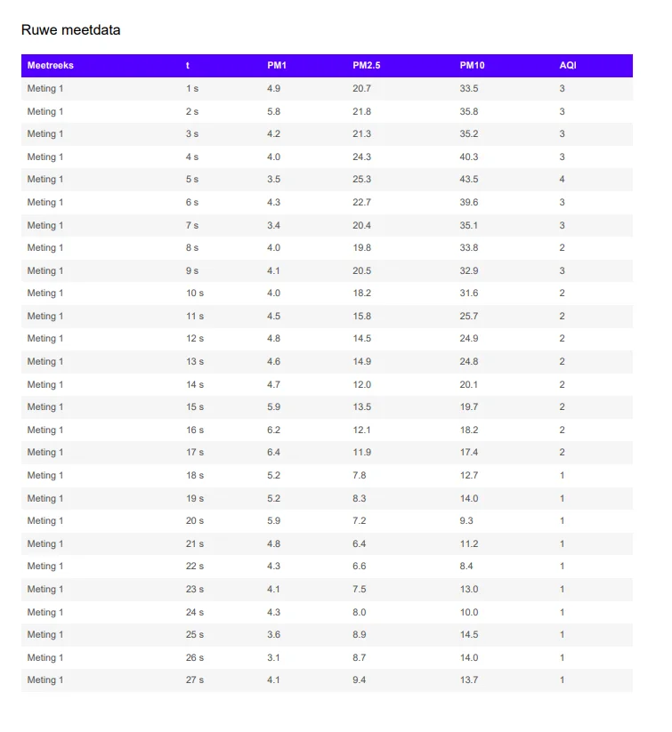
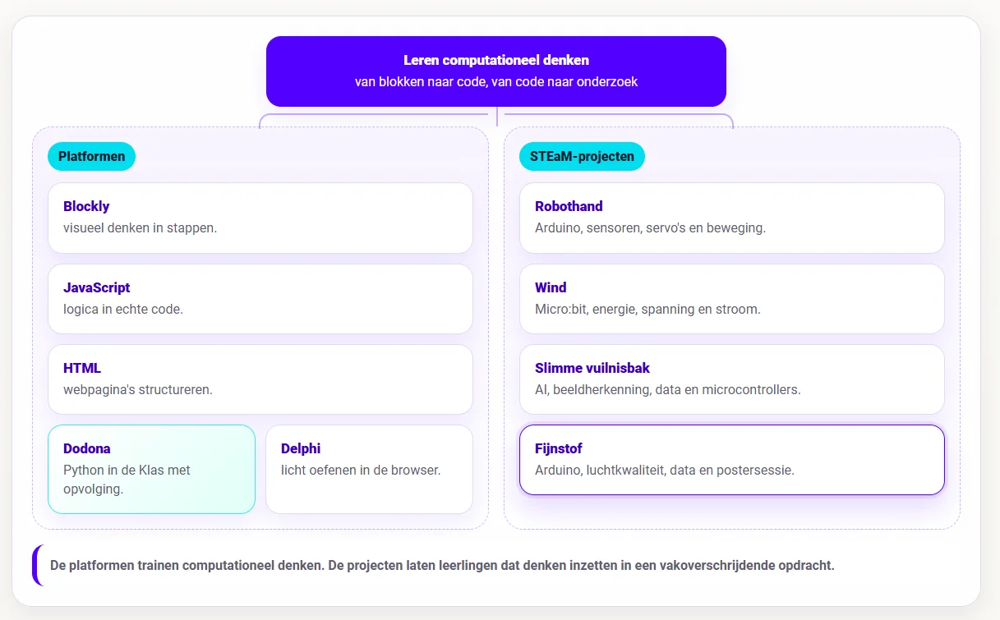

### Luchtkwaliteit duikt regelmatig op in het nieuws. Denk aan de lage-emissiezone in Gent, discussies over verkeer in de binnenstad, houtstook, ventilatie op school of bredere vragen rond klimaat en gezondheid. Zo is de Gentse binnenstad is vandaag een lage-emissiezone om de luchtkwaliteit te verbeteren. Toch blijft luchtkwaliteit snel abstract. Je kan praten over fijnstof, PM2.5, PM10 en AQI, maar leerlingen zien die deeltjes niet. Ze zien hoogstens de mogelijke bronnen: verkeer, stof, rook, drukte, ventilatie of een open raam. Precies daarom wilden we een project waarin leerlingen niet alleen over luchtkwaliteit spreken, maar er zelf ook gegevens over verzamelen in hun leefomgeving.

### Project Fijnstof maakt PM1, PM2.5, PM10 en de Europese AQI zichtbaar met een Arduino, een HM330X-fijnstofsensor en een browseromgeving. Leerlingen formuleren een onderzoeksvraag, kiezen een meetplek, verzamelen meetreeksen, vergelijken data, schrijven een conclusie en ontwerpen samen een poster.

### Wat is het?

**Project Fijnstof** is een meetopdracht rond luchtkwaliteit. Leerlingen gebruiken een Arduino met een HM330X-fijnstofsensor om waarden door te sturen naar een webomgeving. De webapp toont live metingen van PM1, PM2.5, PM10 en AQI. Leerlingen kunnen meerdere meetreeksen maken, bijvoorbeeld binnen en buiten, aan de straatkant en op de speelplaats, bij een open raam of in een lokaal met minder ventilatie.

De opdracht is onderzoekend opgebouwd. Eerst formuleren leerlingen een vraag en hypothese. Daarna controleren ze de opstelling, verbinden ze de Arduino of starten ze de demomodus, meten ze data en trekken ze een besluit. Hun meetresultaten en besluit combineren ze in een poster voor een heuse klassikale postersessie.

### Hoe werkt het?

De webomgeving volgt zes stappen: voorspellen, bouwen, verbinden, meten, vergelijken en besluiten. Bij voorspellen vullen leerlingen hun onderzoeksvraag en hypothese in. Ze noteren ook de meetplek en een mogelijke bron van fijnstof, zoals verkeer, ventilatie, een open raam, een kaars …

Daarna controleren ze de opstelling. Is de Arduino verbonden? Is de sensor aangesloten? Kan lucht vrij in de sensor? Staat de juiste Arduino-code op het bord? Via WebSerial stuurt de Arduino meetresultaten naar de browser.

Tijdens de meting toont de app live waarden en een grafiek. Leerlingen geven elke meetreeks een naam, noteren de omstandigheden en kunnen een korte notitie toevoegen. Daarna vergelijken ze de reeksen op gemiddelde PM2.5, maximale PM2.5, gemiddelde PM10 en maximale AQI.

### **PM, microgram en AQI**

De opdracht brengt meteen enkele nieuwe begrippen binnen. PM staat voor _particulate matter_: fijnstofdeeltjes in de lucht. PM10 zijn grotere deeltjes dan PM2.5. PM1 is nog kleiner. De waarden staan in microgram per kubieke meter, µg/m³.

Dat is voor leerlingen niet vanzelfsprekend. Een getal zoals 18 µg/m³ zegt weinig als je nog nooit met luchtkwaliteit bezig was. Daarom hanteert de app de Europese AQI. Die vat PM2.5 en PM10 samen in een score van zeer goed tot extreem slecht.

## **Meten is weten**

Een belangrijk onderdeel in dit leerproces is het opstellen van een hypothese en die vervolgens onderzoeken met data. Een leerling kan verwachten dat de straatkant slechter scoort dan de speelplaats. Dat is een prima hypothese. Daarna komt het echte werk: gegevens verzamelen en interpreteren.

Leerlingen moeten nadenken over meetduur, omstandigheden en vergelijkbaarheid. Was er toevallig net veel verkeer? Stond er een raam open? Waren er leerlingen aan het bewegen vlak bij de sensor? Hebben we lang genoeg gemeten? Eén momentopname is maar beperkt. Meerdere reeksen naast elkaar maken het een pak interessanter. Je kan pieken zien, gemiddelden vergelijken en nadenken over storende variabelen.

## **Wat leren leerlingen?**

Leerlingen leren wat PM1, PM2.5 en PM10 betekenen. Ze leren werken met concentraties in µg/m³ en met de Europese AQI. Ze oefenen met grafieken, tabellen, gemiddelden en maxima. Ook onderzoeksmatig gebeurt er veel. Leerlingen formuleren een vraag, maken een hypothese, kiezen een meetplek, verzamelen data, vergelijken reeksen en schrijven een besluit. Ze leren dat de context van een meting ertoe doet. Een getal zonder beschrijving van waar die gemeten is en omstandigheden is veel minder bruikbaar.

### **Benodigdheden**

Je hebt een Arduino-compatibel bord nodig, een HM330X-fijnstofsensor, een datakabel en de juiste Arduino-code. De app werkt met WebSerial in Chrome of Edge. De tool bevat een demomodus. Die is handig wanneer je het meetverloop eerst klassikaal wil tonen, wanneer nog niet elke groep hardware heeft of wanneer een sensor even niet meewerkt. De app draait zonder accounts en zonder server. Data blijft in de browser, tenzij leerlingen zelf CSV of PDF exporteren om later te verwerken, analyseren of te plaatsen in de Uploadzone van de elektronische leeromgeving.

## **Hoe ziet de leerlijn er uit?**

Eerst verdiepen leerlingen via de **platformen** in de wereld van het computationeel denken. Ze leren de decompositie toepassen, leren programmeerconcepten herkennen, ontwerpen algoritmes en slaan aan het debuggen. Hiervoor hanteren we volgende **platformen**:

-   **Blockly in de Klas** helpt leerlingen eerst visueel redeneren. Ze oefenen daar met sequentie, selectie, begrensde herhaling en voorwaardelijke herhaling zonder dat syntax meteen met alle aandacht gaat lopen. Dit onderdeel zit in het begin van de leerlijn.

-   **JavaScript in de Klas** zit op een interessante plek in de reeks. Het komt na visueel redeneren met blokken, maar blijft dichter bij de browser dan Python. Daardoor kan het tegelijk programmeerconcepten oefenen en webgedrag zichtbaar maken.

-   **HTML in de Klas** zit in de webtak. Daar leren leerlingen hoe webpagina’s opgebouwd zijn met structuur, tags, attributen en inhoud. HTML beslist niets en herhaalt niets. **JavaScript** verbindt die werelden. De taal voegt gedrag toe aan webpagina’s en laat leerlingen dezelfde denkpatronen uit Blockly verder oefenen: variabelen, voorwaarden, lussen, functies, invoer, uitvoer en debugging.

-   **Project Delphi** neemt daarna Python op als tekstuele programmeertaal met een grotere oefencatalogus en testcases.

-   **Dodona blijft de allersterkste keuze voor volledige trajecten, dashboards, deadlines, evaluaties, klasopvolging, toetsen en zelfs examens!**

Daarna komen de **STEaM-projecten**. Die projecten gebruiken de opgebouwde concepten in grotere opdrachten waarin leerlingen bouwen, meten, testen en besluiten. De platformen trainen de bouwstenen van het computationeel denken. De projecten zetten tonen hoe we met die bouwstenen en digitale systemen een impact kunnen hebben op onze eigen leefwereld en samenleving.

-   Bij **Project Robothand** brengen leerlingen Arduino, sensoren, servo’s, seriële data en mechaniek samen in één werkend systeem. Dit past later in de leerlijn, na een eerste traject rond Arduino en fysieke computing. Leerlingen sturen niet alleen code naar een bordje, maar zien hoe sensorwaarden beweging veroorzaken.

-   Bij **Project Wind** verschuift de focus naar meten en onderzoeken. Leerlingen bouwen een windmolenopstelling, gebruiken de micro:bit om spanning en stroom te meten, berekenen vermogen en energie, vergelijken proeven en schrijven een besluit op basis van data. Hier wordt code een onderzoeksinstrument.

-   Bij **Slimme Vuilnisbak** komt daar artificiële intelligentie bij. Leerlingen verzamelen voorbeelden, kennen labels toe, trainen een model, testen voorspellingen, bekijken confidence-scores en koppelen de voorspelling aan een microcontroller. Zo wordt AI geen magische doos, maar een systeem dat werkt met data, labels, fouten en bijsturing.

-   **Fijnstof** hoort in dezelfde projectlaag. Tijdens dit STEaM-project gaan we aan de slag met Arduino, luchtkwaliteit, data en een postersessie. Leerlingen meten een verschijnsel uit de echte wereld, verwerken data en communiceren hun bevindingen.

Zo ontstaat er een overzichtelijk en duidelijk **curriculum**: eerst leren leerlingen redeneren, structureren en programmeren in kleine oefenomgevingen. Daarna gebruiken ze die kennis in projecten waarin code gekoppeld wordt aan fysieke systemen, meetgegevens, onderzoeksvragen en ontwerpkeuzes.

### **Ik wil dit in mijn klas! Wat moet ik doen?**

Wil je hier zelf mee aan de slag in jouw klaslokaal? Super! Samen met jongeren werken rond computationeel denken en programmeren is fantastisch, maar ik ben wellicht een bevooroordeelde bron. Met de knoppen hieronder kan je de tool zelf uittesten. Vind je een bug in mijn code? Laat het gerust weten via het contactformulier of via de Discord-server! 

<a class="content-button content-button--primary content-button--medium" href="https://robbew.github.io/projectfijnstof/" target="_blank" rel="noreferrer">Ga naar de projectpagina!</a>

<a class="content-button content-button--primary content-button--medium" href="/contact">Contacteer Robbe!</a>

