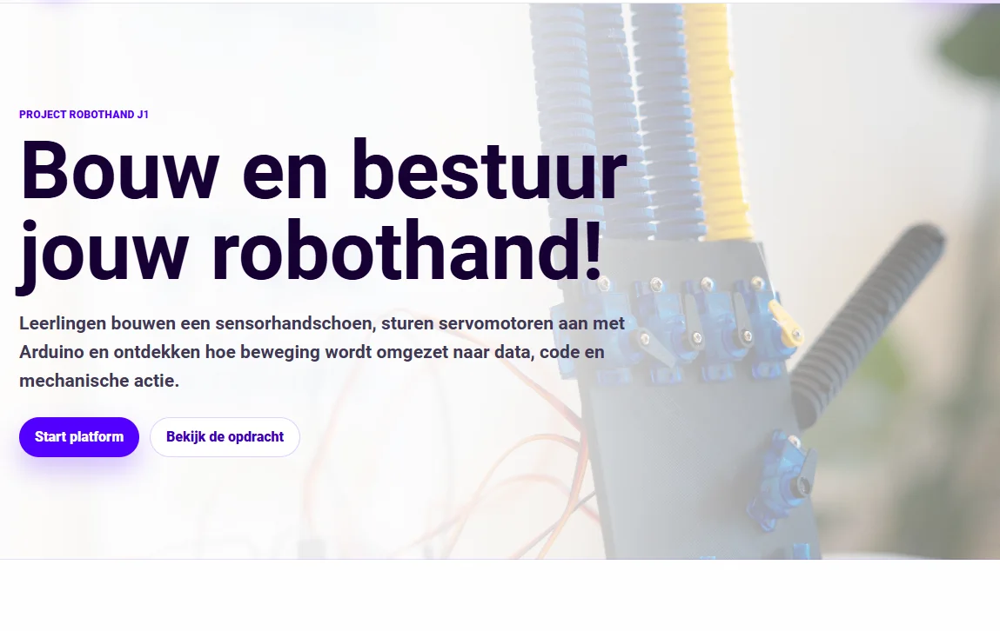
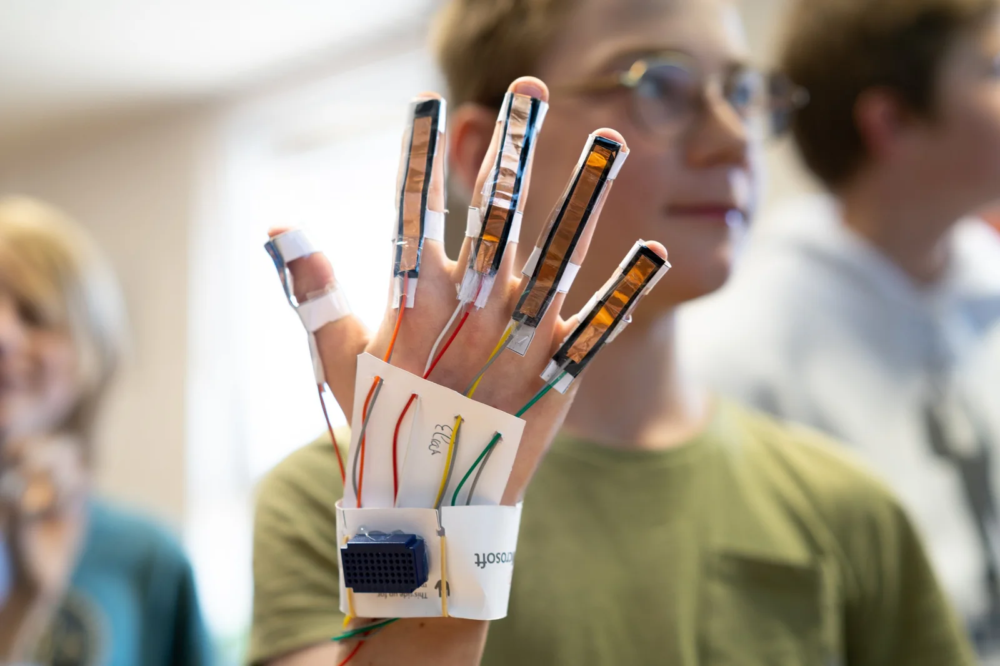
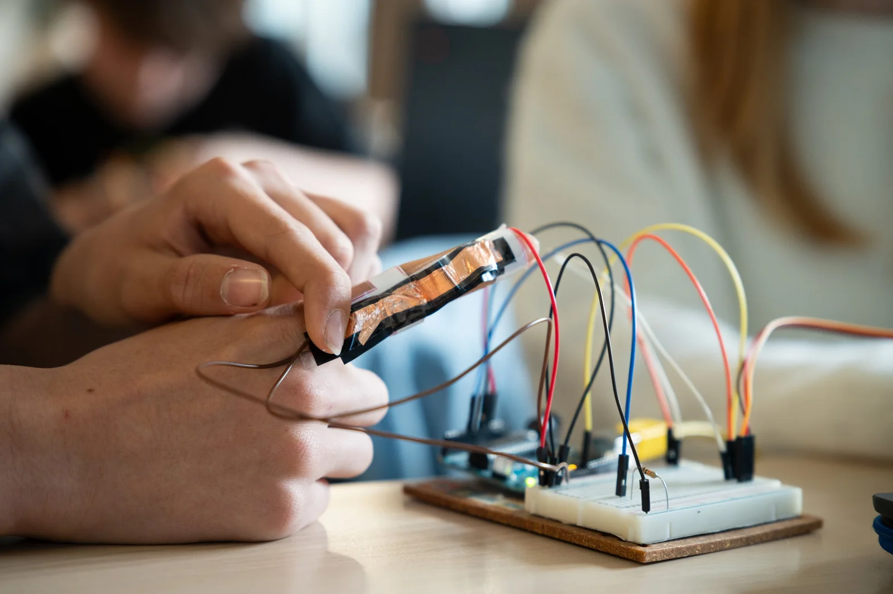
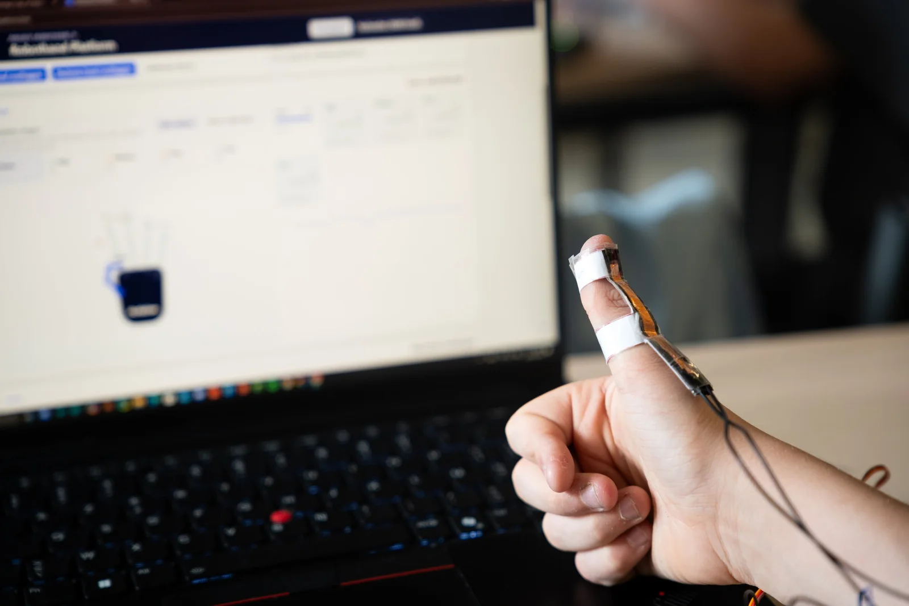
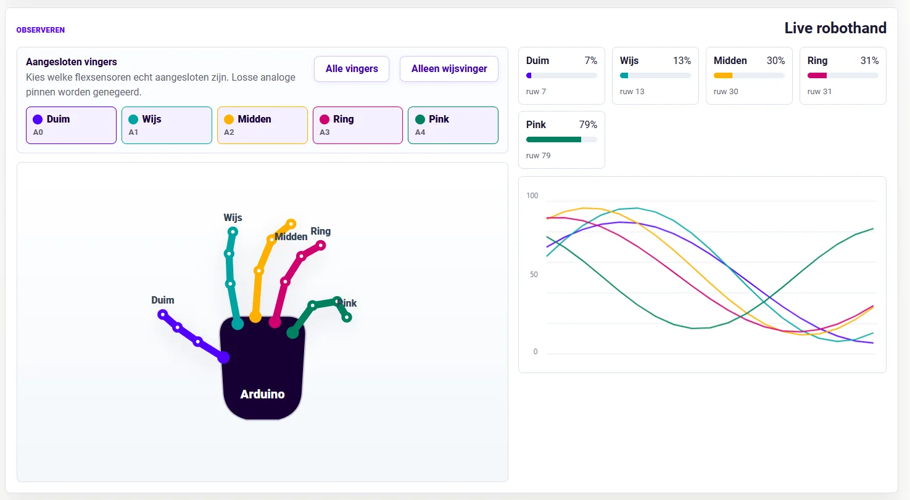
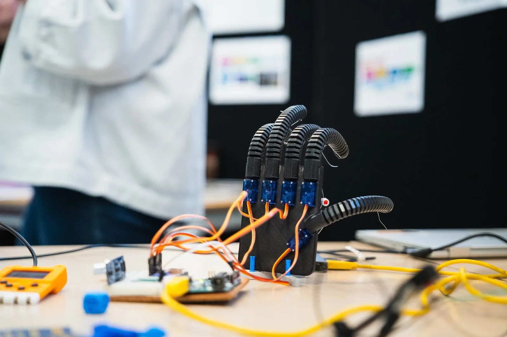
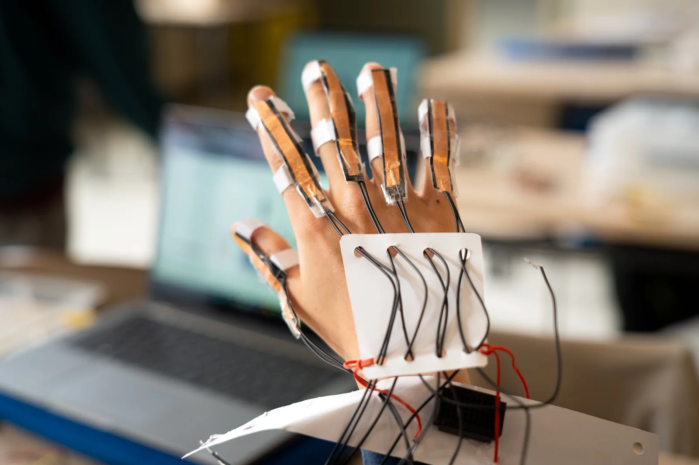
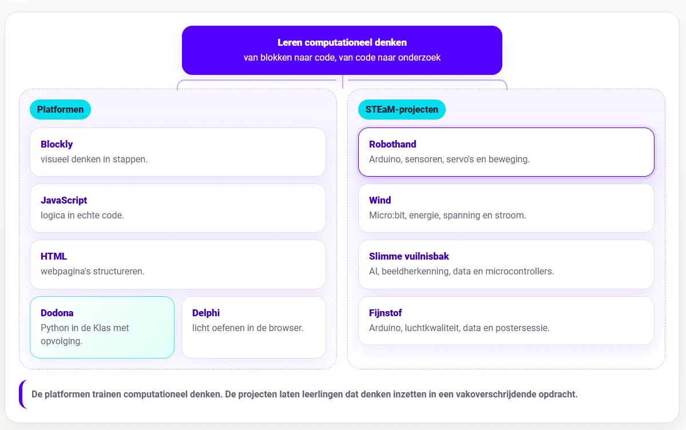

### Na een reeks Arduino-lessen komt er meestal een moment waarop leerlingen méér willen dan een ledje laten knipperen of een servo even laten draaien. Dat zijn nuttige stappen, maar de puzzel begint pas echt te leven wanneer code, elektronica en een fysiek systeem tegelijk moeten kloppen. Project Robothand zit precies op dat punt. Leerlingen bouwen en testen een sensorhandschoen met flexsensoren en een robothand met servomotoren. Ik wilde hiervoor een lichte webomgeving maken die leerlingen door dat proces loodst. Binnen het leerplatform leren de leerlingen verbinden, kalibreren, meten, testen, observeren en uitleggen wat hun systeem doet.

<!-- p08-deferred:media-b6fecc6bd90ff4db -->

### Wat is het?

**Project Robothand** is een syntheseopdracht aan het einde van een Arduino-traject. Leerlingen combineren analoge input, servosturing, seriële communicatie en eenvoudige herkenning van handgebaren. De opstelling bestaat uit een handschoen met flexsensoren en een robothand met servomotoren. Wanneer een leerling zijn of haar vingers buigt, veranderen de sensorwaarden. De Arduino leest die waarden uit en stuurt data naar de browser en naar de servomotoren.

De webomgeving vertaalt die ruwe waarden naar overzichtelijke percentages, toont wat er gebeurt en helpt leerlingen om de hand correct te kalibreren. Daarna testen leerlingen of de robothand reageert zoals verwacht. Ze bekijken per vinger wat open en gesloten betekent, schakelen vingers uit die niet aangesloten zijn, vergelijken sensorwaarden met bewegingen van de servo’s en gebruiken de hand uiteindelijk in een eenvoudige blad-steen-schaar-opdracht.

### Hoe werkt het?

Het leerplatform werkt in de browser. Leerlingen verbinden de Arduino via WebSerial, controleren welke vingers aangesloten zijn en starten daarna met kalibreren. Eerst meten ze de open hand. Daarna meten ze de gesloten hand. Die twee uitersten zijn nodig om ruwe sensorwaarden om te zetten naar bruikbare percentages.

Een flexsensor geeft immers geen mooi getal terug dat vanzelf betekent: deze vinger is 73 procent gebogen. Die betekenis moet je uit de opstelling afleiden. Daar zit meteen een belangrijke les in. In programmeeroefeningen lijkt input vaak netjes. Een gebruiker typt een getal, een functie geeft een waarde terug en klaar. Bij fysieke computing is input veel minder netjes. Sensoren verschillen van elkaar. Een vinger buigt niet altijd even ver, een draadje kan slecht contact maken, er is ruis binnen de schakeling …

Leerlingen zien via het leerplatform per vinger de ruwe waarde, de gekalibreerde waarde en de beweging van de hand. Als een vinger niet betrouwbaar meet, kunnen ze die tijdelijk uitschakelen zodat losse analoge pinnen de oefening niet verstoren.

### **Wat leren leerlingen?**

Leerlingen oefenen hier verschillende onderdelen uit informaticawetenschappen en techniek tegelijk. Ze bouwen een sensorhand, lezen analoge waarden van flexsensoren, sturen servomotoren aan, gebruiken seriële communicatie tussen Arduino en browser, kalibreren ruwe meetwaarden en testen eenvoudige logica voor gebaarherkenning.

In een gewone programmeeroefening zoek je vaak stap voor stap naar een fout in de code. Bij Robothand moet je breder kijken. Is GND verbonden? Zit de sensor op de juiste pin? Komt er data binnen? Kloppen de waarden? Beweegt de servo in de juiste richting? Heeft de flexsensor de week in het lockertje overleefd?

## **Rapporteren en reflecteren**

De webomgeving bevat ook een PDF-rapport. Leerlingen vullen naam, klas, observaties en reflectie in. De export bundelt hun werk zodat ze kunnen indienen wat ze onderzocht hebben. Dat past goed bij het soort opdracht dat Robothand is. Het eindproduct bestaat uit meer dan een bewegende hand. Leerlingen moeten ook kunnen uitleggen wat ze gemeten, getest en bijgestuurd hebben.

Het is verleidelijk om alleen naar het eindmoment te kijken: beweegt de hand of niet? Maar de echte leerwinst zit vaak ook in de weg ernaartoe. Welke fout vonden leerlingen? Hoe losten ze die op? Welke vinger was moeilijk aan te sluiten? Wat zouden ze anders doen bij een volgende versie?

## **Benodigdheden**

Je hebt een Arduino UNO of compatibel bord nodig, een handschoen met flexsensoren, een robothand met servomotoren, een datakabel en indien nodig een aparte voeding voor de servo’s. De browseromgeving werkt met WebSerial in Chrome of Edge.

Geen hardware beschikbaar of wil je eerst demonstreren? Dan kan je met een demomodus het verloop tonen zonder meteen alles snel-snel te moeten aansluiten.

## **Hoe ziet de leerlijn er uit?**

Eerst verdiepen leerlingen via de **platformen** in de wereld van het computationeel denken. Ze leren de decompositie toepassen, leren programmeerconcepten herkennen, ontwerpen algoritmes en slaan aan het debuggen. Hiervoor hanteren we volgende **platformen**:

-   **Blockly in de Klas** helpt leerlingen eerst visueel redeneren. Ze oefenen daar met sequentie, selectie, begrensde herhaling en voorwaardelijke herhaling zonder dat syntax meteen met alle aandacht gaat lopen. Dit onderdeel zit in het begin van de leerlijn.

-   **JavaScript in de Klas** zit op een interessante plek in de reeks. Het komt na visueel redeneren met blokken, maar blijft dichter bij de browser dan Python. Daardoor kan het tegelijk programmeerconcepten oefenen en webgedrag zichtbaar maken.

-   **HTML in de Klas** zit in de webtak. Daar leren leerlingen hoe webpagina’s opgebouwd zijn met structuur, tags, attributen en inhoud. HTML beslist niets en herhaalt niets. **JavaScript** verbindt die werelden. De taal voegt gedrag toe aan webpagina’s en laat leerlingen dezelfde denkpatronen uit Blockly verder oefenen: variabelen, voorwaarden, lussen, functies, invoer, uitvoer en debugging.

-   **Project Delphi** neemt daarna Python op als tekstuele programmeertaal met een grotere oefencatalogus en testcases.

-   **Dodona blijft de allersterkste keuze voor volledige trajecten, dashboards, deadlines, evaluaties, klasopvolging, toetsen en zelfs examens!**

Daarna komen de **STEaM-projecten**. Die projecten gebruiken de opgebouwde concepten in grotere opdrachten waarin leerlingen bouwen, meten, testen en besluiten. De platformen trainen de bouwstenen van het computationeel denken. De projecten zetten tonen hoe we met die bouwstenen en digitale systemen een impact kunnen hebben op onze eigen leefwereld en samenleving.

-   Bij **Project Robothand** brengen leerlingen Arduino, sensoren, servo’s, seriële data en mechaniek samen in één werkend systeem. Dit past later in de leerlijn, na een eerste traject rond Arduino en fysieke computing. Leerlingen sturen niet alleen code naar een bordje, maar zien hoe sensorwaarden beweging veroorzaken.

-   Bij **Project Wind** verschuift de focus naar meten en onderzoeken. Leerlingen bouwen een windmolenopstelling, gebruiken de micro:bit om spanning en stroom te meten, berekenen vermogen en energie, vergelijken proeven en schrijven een besluit op basis van data. Hier wordt code een onderzoeksinstrument.

-   Bij **Slimme Vuilnisbak** komt daar artificiële intelligentie bij. Leerlingen verzamelen voorbeelden, kennen labels toe, trainen een model, testen voorspellingen, bekijken confidence-scores en koppelen de voorspelling aan een microcontroller. Zo wordt AI geen magische doos, maar een systeem dat werkt met data, labels, fouten en bijsturing.

-   **Fijnstof** hoort in dezelfde projectlaag. Tijdens dit STEaM-project gaan we aan de slag met Arduino, luchtkwaliteit, data en een postersessie. Leerlingen meten een verschijnsel uit de echte wereld, verwerken data en communiceren hun bevindingen.

Zo ontstaat er een overzichtelijk en duidelijk **curriculum**: eerst leren leerlingen redeneren, structureren en programmeren in kleine oefenomgevingen. Daarna gebruiken ze die kennis in projecten waarin code gekoppeld wordt aan fysieke systemen, meetgegevens, onderzoeksvragen en ontwerpkeuzes.

### **Ik wil dit in mijn klas! Wat moet ik doen?**

Wil je hier zelf mee aan de slag in jouw klaslokaal? Super! Samen met jongeren werken rond computationeel denken en programmeren is fantastisch, maar ik ben wellicht een bevooroordeelde bron. Met de knoppen hieronder kan je de tool zelf uittesten. Vind je een bug in mijn code? Laat het gerust weten via het contactformulier of via de Discord-server! 

<a class="content-button content-button--primary content-button--medium" href="https://robbew.github.io/robothand/" target="_blank" rel="noreferrer">Ga naar de projectpagina!</a>

<a class="content-button content-button--primary content-button--medium" href="/contact">Contacteer Robbe!</a>

