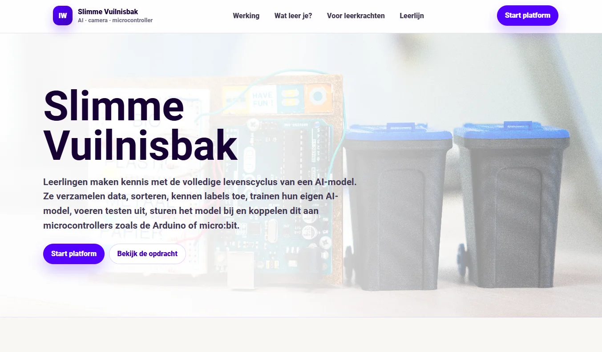
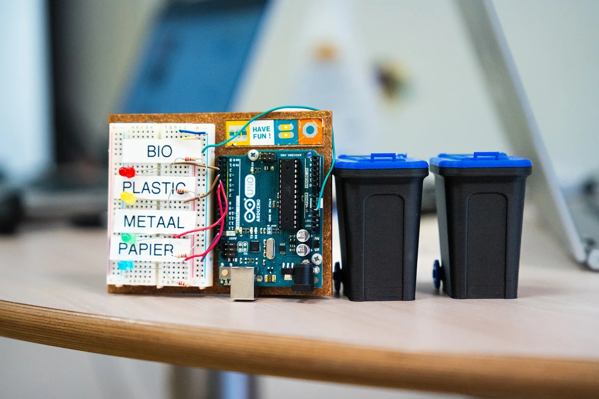
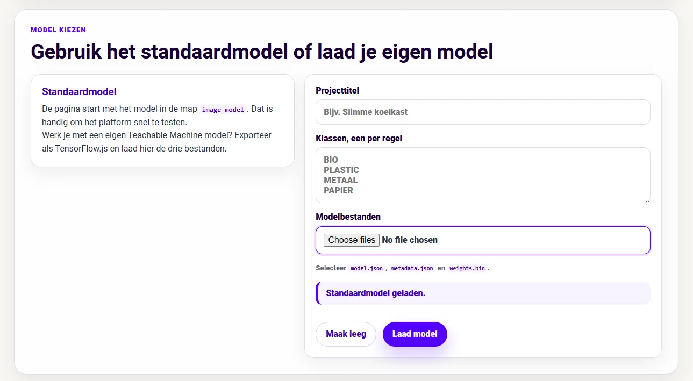
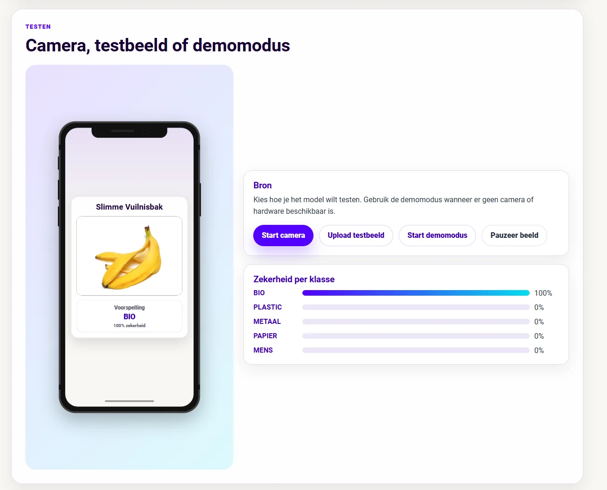
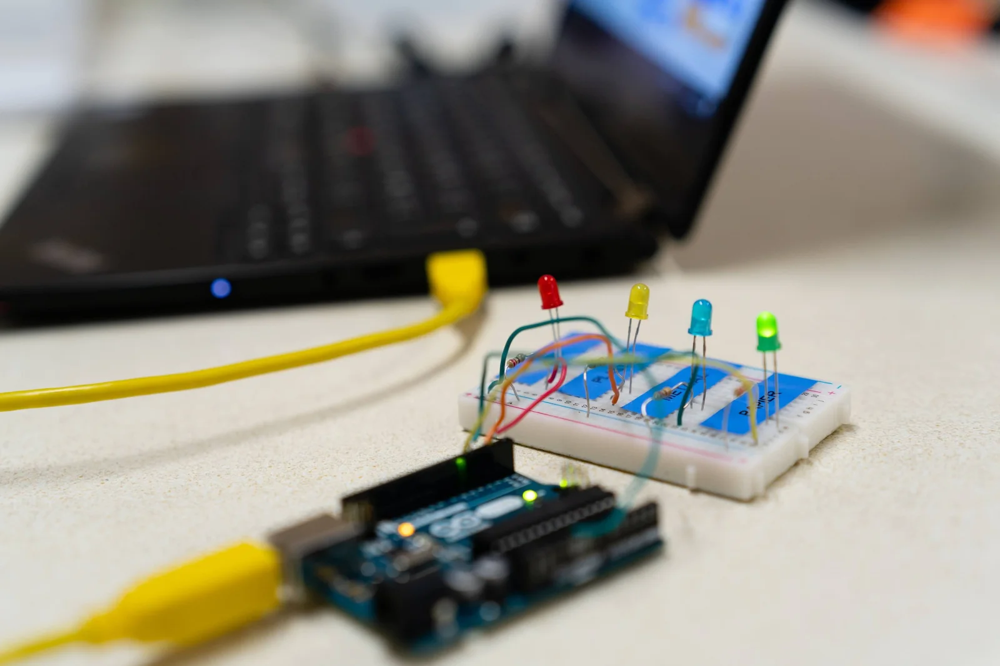
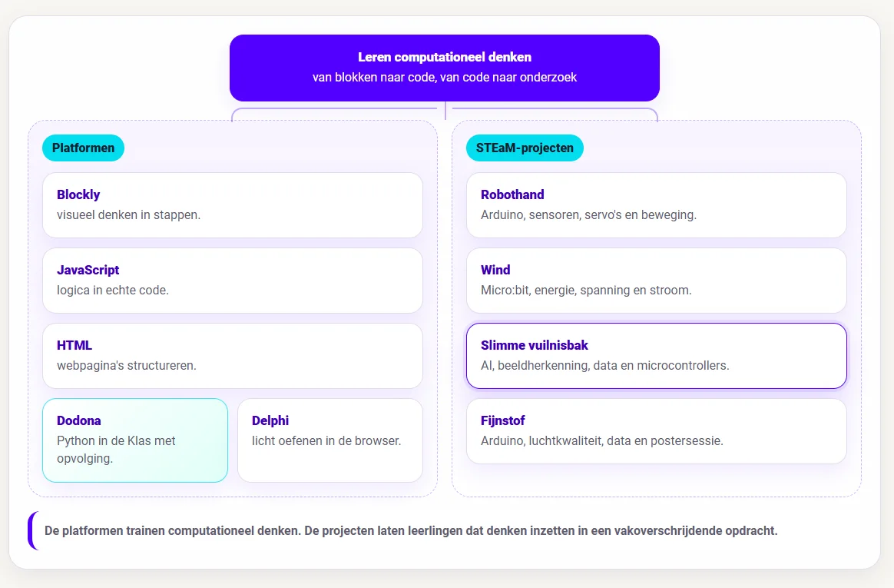

### Iedereen heeft al eens voor een vuilnisbak gestaan met een stuk afval in de hand en een kort moment van twijfel gevoeld. Hoort dit bij PMD? Is dit restafval? Mag dit bij papier? Sorteerregels lijken eenvoudig tot je met een vettige verpakking, een metalen dopje of een twijfelachtig stukje plastic waar karton aan kleeft in je hand staat. Afval sorteren is een alledaagse opdracht voor ons als mens, maar tegelijk is het een goede manier om artificiële intelligentie heel concreet te maken. Een slimme vuilnisbak moet iets kunnen dat leerlingen meteen begrijpen: kijken naar een object, een klasse kiezen en daarop reageren.

### De nieuwste versie van Project **Slimme Vuilnisbak** brengt dat proces samen in een webplatform. Leerlingen testen een standaardmodel of trainen een eigen AI-model. Ze werken met een camera of testbeeld, vergelijken de voorspelling met hun eigen verwachting, sturen een code naar een microcontroller zoals de micro:bit of zelfs een heuse Arduino. Zo kunnen zelf de impact zien van AI-systemen op onze eigen leefwereld door dit samen te ontwerpen.

### Wat is het?

**Slimme Vuilnisbak** is een STEaM-project rond AI-technologie, beeldherkenning en microcontrollers. Leerlingen maken kennis met de levenscyclus van een eenvoudig AI-model: data verzamelen, labels toekennen, trainen, testen, bijsturen en koppelen aan een fysieke reactie.

De standaardversie werkt met klassen zoals BIO, PLASTIC, METAAL, PAPIER en MENS. Het model bekijkt een camerabeeld of testbeeld en berekent per klasse een zekerheid. De hoogste score wordt de voorspelling. Daarna kan de browser een code sturen naar een Arduino of micro:bit. Die microcontroller laat bijvoorbeeld een ledje branden, toont een symbool of stuurt een motor aan om een echte vuilnisbak te doen bewegen.

Leerlingen kunnen starten met het meegeleverde model. Wie verder wil, kan een eigen model trainen in Google Teachable Machine en dat in het platform laden. Daardoor werkt de tool zowel als demonstratie als voor de ontwikkeling van jouw eigen klein AI-model.

### Hoe werkt het?

De webomgeving volgt zeven stappen: voorspellen, model controleren, model kiezen, testen, verbinden, sorteren en besluiten. Bij voorspellen noteren leerlingen welk testobject ze gebruiken, welke klasse ze verwachten en waarom. Daarna bekijken ze het model: welke klassen kent het en welke code hoort bij welke klasse? De browser stuurt namelijk een eenvoudige seriële code naar de microcontroller. Het bordje moet dezelfde codes kennen om juist te reageren.

Vervolgens kiezen leerlingen hun model. Ze gebruiken het standaardmodel of laden een eigen Teachable Machine-model. Daarna testen ze met de webcam, een geüpload testbeeld of de demomodus. De app toont de voorspelde klasse en de zekerheid per klasse. Bij een stabiele voorspelling boven de ingestelde drempel stuurt de browser de code door via WebSerial.

In de sorteerstap vergelijken leerlingen hun verwachting, de voorspelling, de zekerheid en de fysieke reactie (brandt de led of beweegt de motor?). Klopt wat ze dachten? Klopt wat het model voorspelde? Heeft de microcontroller gereageerd? Of maakte het AI-model een verklaarbare fout?

### **Data, labels en supervised learning**

De opdracht maakt supervised learning concreet. Een AI-model leert hier niet uit zichzelf wat afval is. Mensen tonen voorbeelden en geven labels. Een foto van een banaanschil krijgt bijvoorbeeld BIO. Een foto van een blikje krijgt METAAL. Een afbeelding van papier krijgt PAPIER.

De keuze van jouw data is best interessant om te bespreken in de klas. Welke voorbeelden kies je? Zijn ze duidelijk genoeg? Lijken sommige klassen te veel op elkaar? Heeft het model alleen propere voorbeeldfoto’s gezien, terwijl afval in het echt vaak gekreukt, vuil, half verborgen of slecht belicht is? Zo wordt het woord dataset minder abstract. Een dataset is het materiaal waaruit het model leert. Als die voorbeelden beperkt, slordig of eenzijdig zijn, zie je dat terug in de voorspellingen.

## **Zekerheid en fouten**

Een handig onderdeel van het platform is de confidence-score. Naast de gekozen klasse toont de app ook de zekerheid per klasse. Een model kan 82% zeker zijn en toch fout zitten. Het kan twijfelen tussen PLASTIC en METAAL omdat een verpakking glanst. Het kan MENS herkennen wanneer er per ongeluk een hand of gezicht in beeld komt.

Foute voorspellingen zijn nuttig om het model te debuggen. Wanneer het model papier als plastic ziet, moeten leerlingen verder kijken. Was de foto onduidelijk? Zat er te weinig papier in de dataset? Leek het object door de belichting op plastic? Werd het te dicht bij de camera gehouden?

Daarmee oefenen leerlingen een vorm van debuggen. Ze debuggen niet alleen code, maar ook data, labels, verwachtingen, testomstandigheden en de koppeling tussen software en hardware.

## **Van voorspellen naar sorteren**

De slimme vuilnisbak wordt echt boeiend wanneer de voorspelling een fysieke reactie veroorzaakt. Met een Arduino kan je ledjes aansluiten op digitale pinnen. Elke code zet één ledje aan. Met een micro:bit kan je pins aansturen en tegelijk feedback tonen op het ledmatrixscherm.

De huidige microcontrollercode bevat eenvoudige reacties. Codes zoals 1, 2, 3, 4 of X kunnen elk een andere klasse voorstellen. X kan bijvoorbeeld gebruikt worden voor MENS. Want wat moet een systeem doen wanneer het een persoon ziet? Alles blokkeren? Een waarschuwing tonen? Niets sorteren?

Je kan de opstelling later uitbreiden met servomotoren, kleppen of een echte sorteerbak. Een paar ledjes zijn voldoende, maar het is natuurlijk een pak cooler als je kleine of grote bakken k

### **Wat leren leerlingen?**

Binnen dit STEaM-project leren leerlingen wat een klasse, label en dataset zijn. Ze maken kennis met supervised learning en zien hoe beeldclassificatie werkt. Ze vergelijken hun eigen verwachting met de voorspelling van het model en leren dat AI-modellen werken met een confidence-score.

Ook technisch gebeurt er best veel. Leerlingen gebruiken een webcam of testbeeld, trainen een eigen AI-model, bekijken modelbestanden, koppelen klassen aan seriële codes en laten een Arduino of micro:bit reageren. Ze zien hoe een browser via WebSerial met een microcontroller praat.

Daarnaast opent kan je via dit lesproject ook de maatschappelijke impact van AI-technologie kaderen en bespreken. Wie labelt de data achter AI-systemen? Waarom is die arbeid vaak onzichtbaar? Hoeveel energie kost het om modellen te trainen en te gebruiken? Wat betekent het wanneer een camera mensen kan herkennen? Zo staan we niet alleen stil op de technische impact op onze samenleving, maar bekijken we net het bredere plaatje.

## **Hoe ziet de leerlijn er uit?**

Eerst verdiepen leerlingen via de **platformen** in de wereld van het computationeel denken. Ze leren de decompositie toepassen, leren programmeerconcepten herkennen, ontwerpen algoritmes en slaan aan het debuggen. Hiervoor hanteren we volgende **platformen**:

-   **Blockly in de Klas** helpt leerlingen eerst visueel redeneren. Ze oefenen daar met sequentie, selectie, begrensde herhaling en voorwaardelijke herhaling zonder dat syntax meteen met alle aandacht gaat lopen. Dit onderdeel zit in het begin van de leerlijn.

-   **JavaScript in de Klas** zit op een interessante plek in de reeks. Het komt na visueel redeneren met blokken, maar blijft dichter bij de browser dan Python. Daardoor kan het tegelijk programmeerconcepten oefenen en webgedrag zichtbaar maken.

-   **HTML in de Klas** zit in de webtak. Daar leren leerlingen hoe webpagina’s opgebouwd zijn met structuur, tags, attributen en inhoud. HTML beslist niets en herhaalt niets. **JavaScript** verbindt die werelden. De taal voegt gedrag toe aan webpagina’s en laat leerlingen dezelfde denkpatronen uit Blockly verder oefenen: variabelen, voorwaarden, lussen, functies, invoer, uitvoer en debugging.

-   **Project Delphi** neemt daarna Python op als tekstuele programmeertaal met een grotere oefencatalogus en testcases.

-   **Dodona blijft de allersterkste keuze voor volledige trajecten, dashboards, deadlines, evaluaties, klasopvolging, toetsen en zelfs examens!**

Daarna komen de **STEaM-projecten**. Die projecten gebruiken de opgebouwde concepten in grotere opdrachten waarin leerlingen bouwen, meten, testen en besluiten. De platformen trainen de bouwstenen van het computationeel denken. De projecten zetten tonen hoe we met die bouwstenen en digitale systemen een impact kunnen hebben op onze eigen leefwereld en samenleving.

-   Bij **Project Robothand** brengen leerlingen Arduino, sensoren, servo’s, seriële data en mechaniek samen in één werkend systeem. Dit past later in de leerlijn, na een eerste traject rond Arduino en fysieke computing. Leerlingen sturen niet alleen code naar een bordje, maar zien hoe sensorwaarden beweging veroorzaken.

-   Bij **Project Wind** verschuift de focus naar meten en onderzoeken. Leerlingen bouwen een windmolenopstelling, gebruiken de micro:bit om spanning en stroom te meten, berekenen vermogen en energie, vergelijken proeven en schrijven een besluit op basis van data. Hier wordt code een onderzoeksinstrument.

-   Bij **Slimme Vuilnisbak** komt daar artificiële intelligentie bij. Leerlingen verzamelen voorbeelden, kennen labels toe, trainen een model, testen voorspellingen, bekijken confidence-scores en koppelen de voorspelling aan een microcontroller. Zo wordt AI geen magische doos, maar een systeem dat werkt met data, labels, fouten en bijsturing.

-   **Fijnstof** hoort in dezelfde projectlaag. Tijdens dit STEaM-project gaan we aan de slag met Arduino, luchtkwaliteit, data en een postersessie. Leerlingen meten een verschijnsel uit de echte wereld, verwerken data en communiceren hun bevindingen.

Zo ontstaat er een overzichtelijk en duidelijk **curriculum**: eerst leren leerlingen redeneren, structureren en programmeren in kleine oefenomgevingen. Daarna gebruiken ze die kennis in projecten waarin code gekoppeld wordt aan fysieke systemen, meetgegevens, onderzoeksvragen en ontwerpkeuzes.

### **Ik wil dit in mijn klas! Wat moet ik doen?**

Wil je hier zelf mee aan de slag in jouw klaslokaal? Super! Samen met jongeren werken rond computationeel denken en programmeren is fantastisch, maar ik ben wellicht een bevooroordeelde bron. Met de knoppen hieronder kan je de tool zelf uittesten. Vind je een bug in mijn code? Laat het gerust weten via het contactformulier of via de Discord-server! 

<a class="content-button content-button--primary content-button--medium" href="https://robbew.github.io/slimme_vuilnisbak/" target="_blank" rel="noreferrer">Ga naar de slimme vuilnisbak!</a>

<a class="content-button content-button--primary content-button--medium" href="/contact">Contacteer Robbe!</a>

