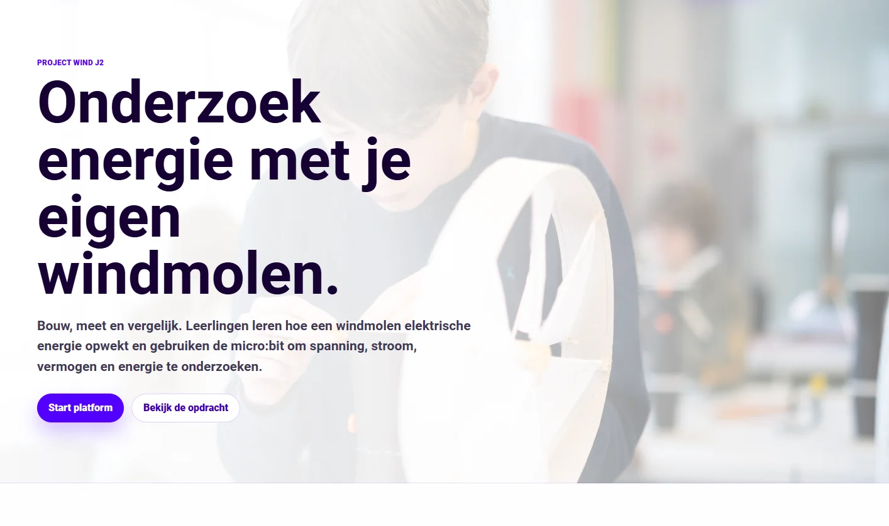
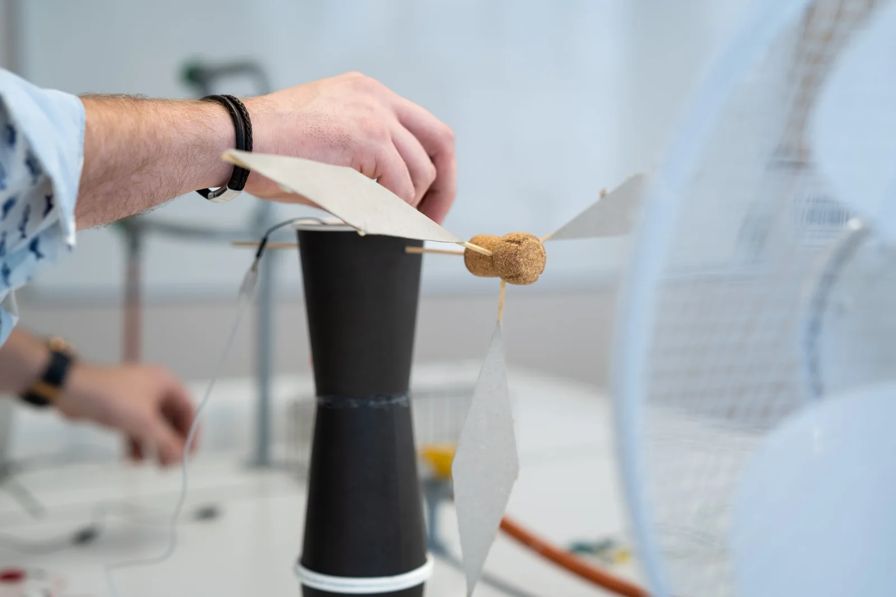
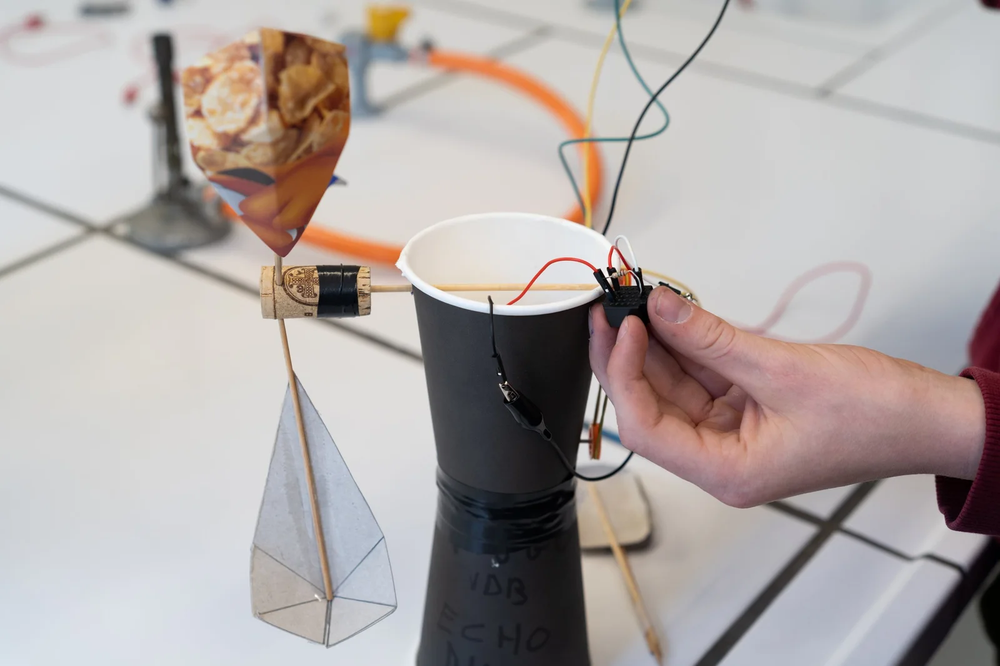
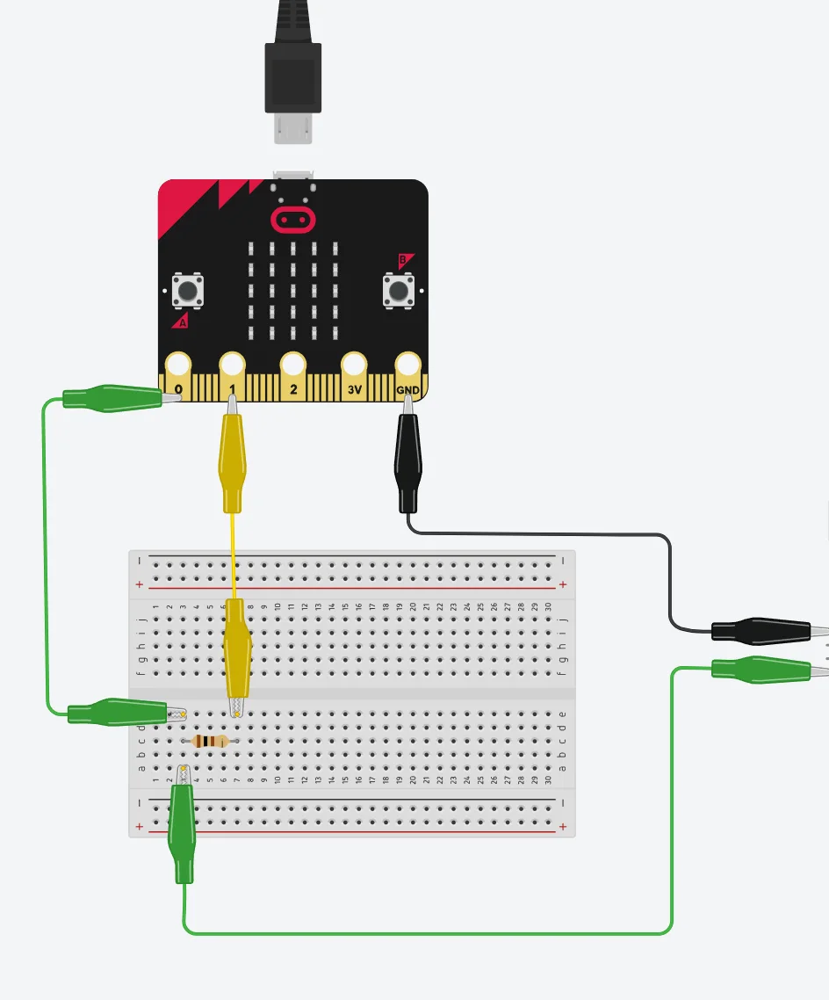
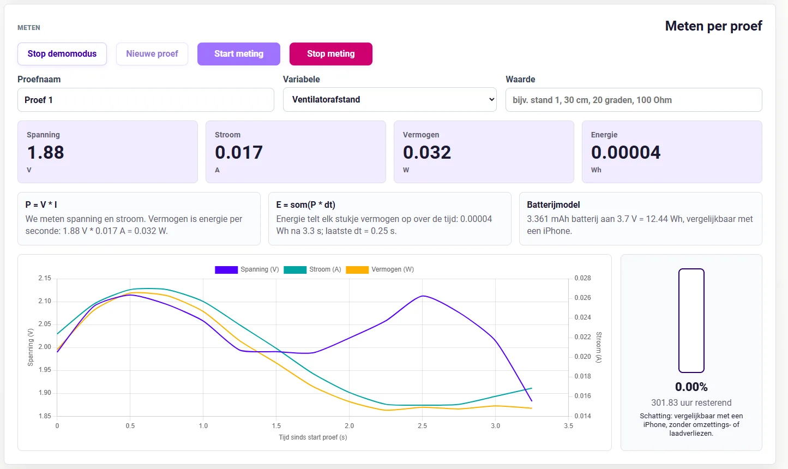
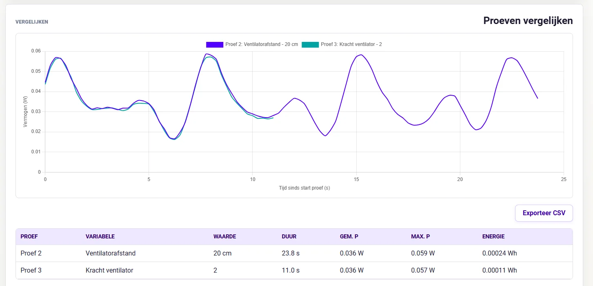
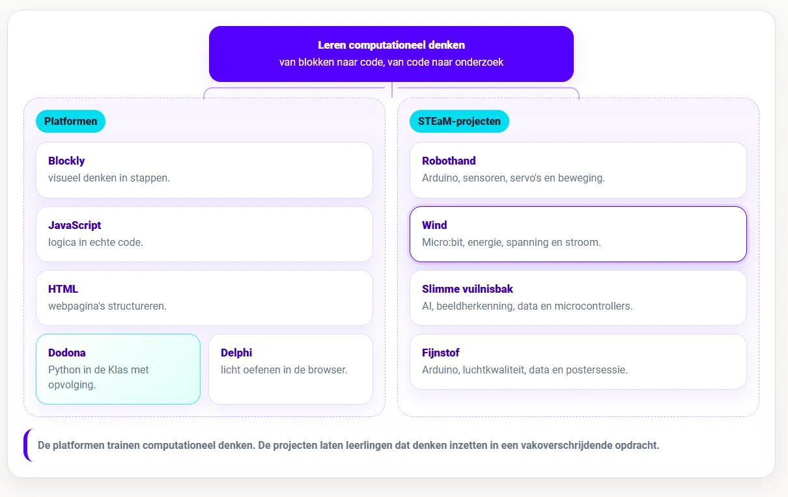

### Een windmolen bouwen is een fijne opdracht. Leerlingen zien iets draaien, er komt spanning uit een generator en het voelt meteen alsof er iets technisch en groots gebeurt. Alleen blijft zo’n project soms hangen bij: kijk, hij draait. Daar kunnen we stap verder gaan. Wanneer levert die molen het meest op? Wat gebeurt er als de ventilator dichterbij staat? Maakt de hoek van de wieken verschil? Hoe vergelijk je twee metingen eerlijk? En wanneer kan je met data zeggen dat een opstelling beter werkt?

### Project Wind is gebouwd rond die vragen. Leerlingen gebruiken een zelfgemaakte windmolengenerator, een micro:bit en een webomgeving om spanning, stroom, vermogen en energie te meten. Binnen het leerplatform leren ze voorspellen, bouwen, kalibreren, meten, vergelijken en besluiten. Wie bouwt de meest efficiënte windmolen van de klas?

### Wat is het?

**Project Wind** is een onderzoeksopdracht waarin leerlingen aan de slag gaan met energie, meten en eenvoudige data-analyse. De opstelling bestaat uit een zelfgebouwde windmolen met generator, een meetweerstand, een micro:bit en een ventilator. De micro:bit stuurt meetgegevens naar de browser. De webomgeving toont live waarden, tekent grafieken, vergelijkt meetreeksen en helpt leerlingen om hun conclusie te onderbouwen.

De opdracht begint met een voorspelling. Leerlingen kiezen één variabele die ze willen onderzoeken, bijvoorbeeld de afstand tot de ventilator, de stand van de wieken of de kracht (modus) van de ventilator. Daarna bouwen ze de opstelling, kiezen ze een nulpunt, doen ze meerdere metingen en vergelijken ze de resultaten. Zo maken ze niet alleen een technisch object, maar leren ze ook eerlijk meten met een afhankelijke en onafhankelijke variabele.

### Hoe werkt het?

Het leerplatform werkt in de browser. Leerlingen formuleren eerst een onderzoeksvraag en hypothese. Ze bepalen wat ze verwachten, welke variabele ze veranderen en welke waarde ze willen meten. Daarna controleren ze de opstelling. Zit de micro:bit goed aangesloten? Is de meetweerstand correct verbonden? Is GND aangesloten aan de micro:bit? Staat de juiste code op de micro:bit?

Voor de meting kiezen leerlingen een nulpunt. Dat is belangrijk, want een sensor of meetopstelling geeft niet altijd exact nul wanneer er niets zou moeten gebeuren. Er is nagenoeg altijd wat ruis. Door te kalibreren leren leerlingen dat meten begint bij een referentiepunt. Daarna starten ze een meetreeks. De app toont spanning, stroom, vermogen en energie. De grafiek loopt mee terwijl de meting loopt. Bij een volgende poging veranderen leerlingen één instelling en meten ze opnieuw. Daarna leggen ze de reeksen naast elkaar en bekijken ze welk resultaat het meest betrouwbaar lijkt.

### **Vermogen en energie meten**

Project Wind gebruikt eenvoudige formules waarbij we even geen rekening houden met verlies door randvariabelen in de schakeling. Vermogen berekenen leerlingen met P = V \* _I._ Energie volgt uit de som van vermogen over tijd: _E = som(P_ dt). Die formules worden begrijpelijker wanneer de waarden live veranderen.

De app bevat ook een eenvoudige batterijvergelijking. Die vertaalt de gemeten energie naar een herkenbare grootteorde, bijvoorbeeld ten opzichte van een telefoonbatterij. Dat is geen echte voorspelling voor het opladen van een smartphone. Daarvoor is de opstelling te eenvoudig en spelen er te veel verliezen mee. Het helpt leerlingen wel om hun meting concreter te maken.

## **Wat leren leerlingen?**

Leerlingen leren werken met spanning, stroom, vermogen en energie. Ze zien dat spanning en stroom samen bepalen hoeveel vermogen een generator levert. Ze ontdekken waarom tijd belangrijk is bij energie en oefenen met grafieken, tabellen en meetreeksen. Daarnaast leren ze onderzoekstaal gebruiken. Onderzoeksvraag, hypothese, onafhankelijke variabele, afhankelijke variabele, nulpunt, meetreeks, vergelijking en conclusie moeten leerlingen gebruiken binnen dit project.

## **Exporteren**

De app heeft een demomodus. Die is handig wanneer er te weinig materiaal is, wanneer een groep nog bezig is of wanneer je de onderzoekscyclus eerst klassikaal wil tonen. Soms wil je namelijk eerst het onderzoeksverloop klassikaal duidelijk maken voordat kabels, krokodillenklemmen en micro:bits alle aandacht opeisen.

Leerlingen kunnen data exporteren als CSV. Dat is nuttig wanneer je later verder wil rekenen of grafieken wil maken in een spreadsheet. Daarnaast kunnen ze een PDF-rapport maken met hun onderzoeksvraag, hypothese, meetreeksen, grafiek, conclusie en reflectie. In een rapport kunnen leerlingen tonen wat ze geprobeerd hebben, welke data ze verzamelden en hoe ze tot hun besluit kwamen.

### **Benodigdheden**

Je hebt een zelfgebouwde windmolen met generator nodig, een micro:bit met de juiste code, een meetweerstand, een ventilator, een USB-datakabel en een browser die WebSerial ondersteunt. Chrome en Edge zijn daarvoor de meest logische keuzes. De omgeving draait als statische website en kan via GitHub Pages gebruikt worden.

Via het leerplatform gaan de leerlingen stap voor stap door voorspellen, bouwen, kalibreren, meten, vergelijken en besluiten. Dat helpt zeker bij klassen waar onderzoek nog nieuwe leerstof is.

## **Hoe ziet de leerlijn er uit?**

Eerst verdiepen leerlingen via de **platformen** in de wereld van het computationeel denken. Ze leren de decompositie toepassen, leren programmeerconcepten herkennen, ontwerpen algoritmes en slaan aan het debuggen. Hiervoor hanteren we volgende **platformen**:

-   **Blockly in de Klas** helpt leerlingen eerst visueel redeneren. Ze oefenen daar met sequentie, selectie, begrensde herhaling en voorwaardelijke herhaling zonder dat syntax meteen met alle aandacht gaat lopen. Dit onderdeel zit in het begin van de leerlijn.

-   **JavaScript in de Klas** zit op een interessante plek in de reeks. Het komt na visueel redeneren met blokken, maar blijft dichter bij de browser dan Python. Daardoor kan het tegelijk programmeerconcepten oefenen en webgedrag zichtbaar maken.

-   **HTML in de Klas** zit in de webtak. Daar leren leerlingen hoe webpagina’s opgebouwd zijn met structuur, tags, attributen en inhoud. HTML beslist niets en herhaalt niets. **JavaScript** verbindt die werelden. De taal voegt gedrag toe aan webpagina’s en laat leerlingen dezelfde denkpatronen uit Blockly verder oefenen: variabelen, voorwaarden, lussen, functies, invoer, uitvoer en debugging.

-   **Project Delphi** neemt daarna Python op als tekstuele programmeertaal met een grotere oefencatalogus en testcases.

-   **Dodona blijft de allersterkste keuze voor volledige trajecten, dashboards, deadlines, evaluaties, klasopvolging, toetsen en zelfs examens!**

Daarna komen de **STEaM-projecten**. Die projecten gebruiken de opgebouwde concepten in grotere opdrachten waarin leerlingen bouwen, meten, testen en besluiten. De platformen trainen de bouwstenen van het computationeel denken. De projecten zetten tonen hoe we met die bouwstenen en digitale systemen een impact kunnen hebben op onze eigen leefwereld en samenleving.

-   Bij **Project Robothand** brengen leerlingen Arduino, sensoren, servo’s, seriële data en mechaniek samen in één werkend systeem. Dit past later in de leerlijn, na een eerste traject rond Arduino en fysieke computing. Leerlingen sturen niet alleen code naar een bordje, maar zien hoe sensorwaarden beweging veroorzaken.

-   Bij **Project Wind** verschuift de focus naar meten en onderzoeken. Leerlingen bouwen een windmolenopstelling, gebruiken de micro:bit om spanning en stroom te meten, berekenen vermogen en energie, vergelijken proeven en schrijven een besluit op basis van data. Hier wordt code een onderzoeksinstrument.

-   Bij **Slimme Vuilnisbak** komt daar artificiële intelligentie bij. Leerlingen verzamelen voorbeelden, kennen labels toe, trainen een model, testen voorspellingen, bekijken confidence-scores en koppelen de voorspelling aan een microcontroller. Zo wordt AI geen magische doos, maar een systeem dat werkt met data, labels, fouten en bijsturing.

-   **Fijnstof** hoort in dezelfde projectlaag. Tijdens dit STEaM-project gaan we aan de slag met Arduino, luchtkwaliteit, data en een postersessie. Leerlingen meten een verschijnsel uit de echte wereld, verwerken data en communiceren hun bevindingen.

Zo ontstaat er een overzichtelijk en duidelijk **curriculum**: eerst leren leerlingen redeneren, structureren en programmeren in kleine oefenomgevingen. Daarna gebruiken ze die kennis in projecten waarin code gekoppeld wordt aan fysieke systemen, meetgegevens, onderzoeksvragen en ontwerpkeuzes.

### **Ik wil dit in mijn klas! Wat moet ik doen?**

Wil je hier zelf mee aan de slag in jouw klaslokaal? Super! Samen met jongeren werken rond computationeel denken en programmeren is fantastisch, maar ik ben wellicht een bevooroordeelde bron. Met de knoppen hieronder kan je de tool zelf uittesten. Vind je een bug in mijn code? Laat het gerust weten via het contactformulier of via de Discord-server! 

<a class="content-button content-button--primary content-button--medium" href="https://robbew.github.io/projectwind/" target="_blank" rel="noreferrer">Ga naar de projectpagina!</a>

<a class="content-button content-button--primary content-button--medium" href="/contact">Contacteer Robbe!</a>

