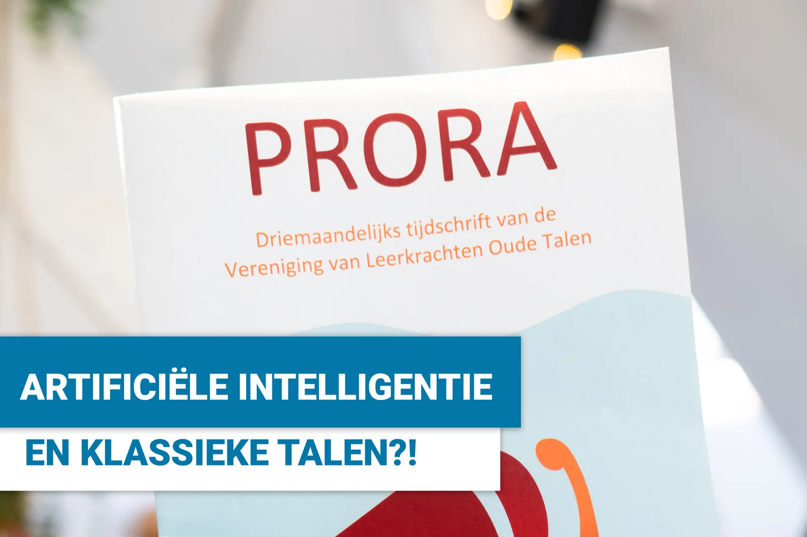
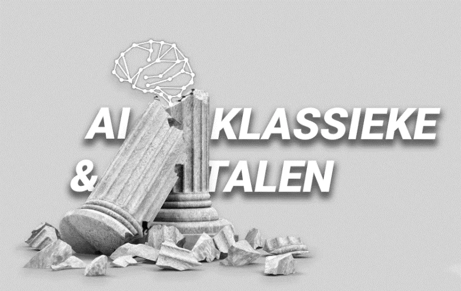
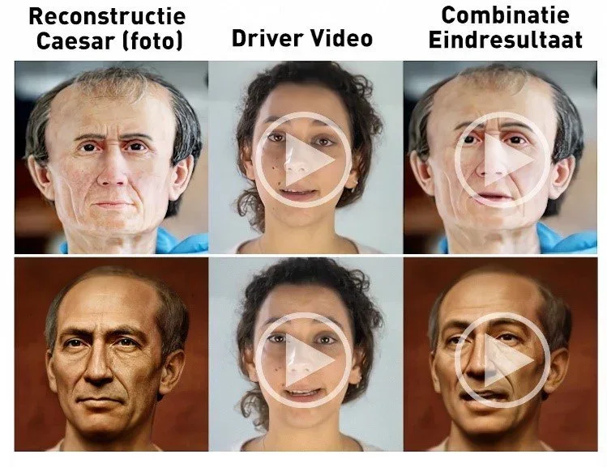
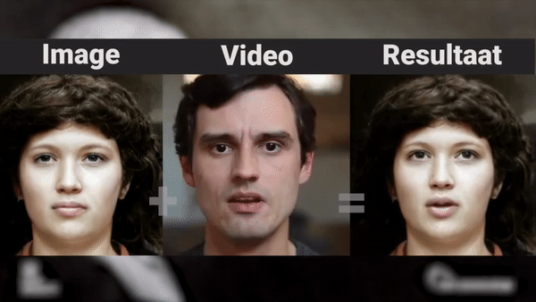
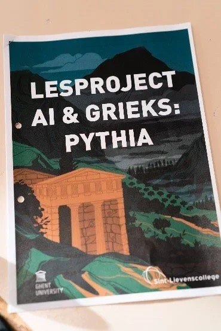
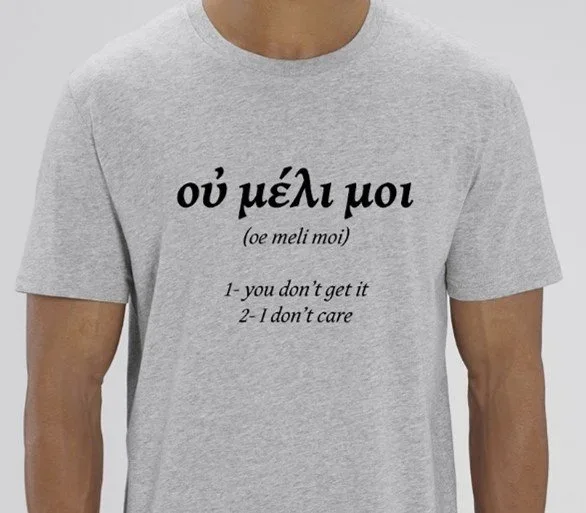
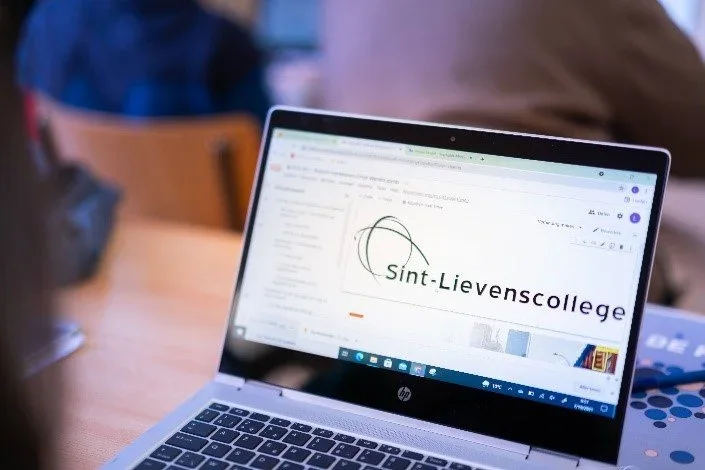

### “Hey Google, wat betekent ‘uit de comfortzone stappen’?” Misschien is dat als leerkracht informaticawetenschappen en artificiële intelligentie, als docent uit de STEM-vakken, een uitgebreide bijdrage schrijven voor _Prora_, het vakblad voor leerkrachten … Oude Talen?! Onderstaande bijdrage werd geschreven begin 2022 en verscheen in de editie van april-mei-juni van 2022. Sommige details zijn reeds herwerkt in mijn eigen lespraktijk, maar de integrale bijdrage kan je hier lezen!

Beste lezer, ik vrees deze voorstelling te moeten beginnen met een valse noot, een ware mea culpa eigenlijk. Ik ben Robbe Wulgaert, sta fulltime in het onderwijs en heb geen achtergrond in de klassieke talen. Geen jota. Maar ook ik had het voorrecht om van mijn passie mijn vak te maken en onderwijs leerlingen in de eerste en tweede graad in programmeren en artificiële intelligentie. Een collega uit de STEM-cluster in úw vakblad! Maar wees gerust, dit stuk dient niet om u te overladen met hippe buzzwords of om ‘innovatie in uw les te brengen’. In dit artikel breng ik twee lesprojecten waarbij mijn collegae en ik de brug slaan tussen onze respectievelijke passies. Als demonstratie dat, in tijden van Digisprong et al., wij een meerwaarde kunnen vormen voor elkaar en voor onze leerlingen. Dat we de Romeinse keizers tot leven kunnen brengen en ondertussen onze uitspraak Latijn oefenen. Of via algoritmes en epigrafie Oudgriekse poëzie kunnen herstellen. Leerlingen inspireren kunnen we allemaal, maar met deze twee projecten hoop ik dat we dat ook samen kunnen.

### AI in het curriculum

Een niet-classicus die aan twee projecten sleutelt voor de vakken Latijn en Grieks? Dat vraagt wat context natuurlijk. Want waar mijn kennis van de oude talen nihil is, onderwijs ik mijn leerlingen in computertalen zoals JavaScript, HTML en Python. Dit geven we in de richtingen met verdieping STEaM, zoals Natuurwetenschappen en Latijn-STEaM. Een lesuur per week leren mijn derdes over ‘slimme computers’ die we kunnen gebruiken voor objectherkenning, taalalgoritmes, sentimentsanalyse, stylometrie, creatief aan de slag met tekst en beeld … Ik maak er bewust een leerlijn van waarin we theorie combineren met AI-projecten. Die projecten zijn vakoverschrijdende thema’s met mijn collegae. Projecten waar de leerlingen zelf aan de slag gaan met AI-modellen. Projecten waar ook de **vakken Latijn en Grieks aan te pas komen**! Maar voordat ik je meer over die projecten vertel, sta ik even stil bij de belangrijkste vraag: “Waarom moeten wij ons daarmee bezighouden?”

### Mijn favoriete vraag: “Waarom moeten we dit kennen?”

De vraag naar het nut van een stuk leerstof of een volledig vak klinkt vaak ietwat gemeen of klagend uit de tienermond. Het is een vraag die ook menig classicus voor de voeten geworpen krijgt, geloof ik. En toch is het mijn favoriete vraag. Het houdt me scherp en zet de doelstellingen van mijn lespraktijk helder. Want artificiële intelligentie klinkt vaak als een ver-van-mijn-bedshow. Het oogt ingewikkeld, uitermate wiskundig, heel abstract … terwijl het eigenlijk vele aspecten van ons leven beïnvloedt, ten goede, maar soms ook ten kwade. Denk aan courante apps op de smartphone van uzelf of de leerlingen. Apps zoals Spotify, Netflix, YouTube, Shazam, Instagram, TikTok, Facebook, Deliveroo, Tinder … Ze beïnvloeden of bepalen hoe we media consumeren, nieuwsberichten lezen, onszelf en elkaar zien, eten en zelfs daten. Dat zal in de toekomst wellicht enkel toenemen. Onze leerlingen komen al van jongs af in contact met de technologie, maar toch blijft op veel schoolbanken hun werking onderbelicht. Bovendien is **AI geen ‘STEM-only’ verhaal**. Een goede vorming heeft oog voor de fundamenten van onze samenleving, maar ook voor de technologieën die onze toekomst vormen, niet?

> “AI is geen STEM-only verhaal. Een goede vorming heeft oog voor de fundamenten van onze samenleving, maar ook oog voor de technologieën die onze toekomst vormen, niet?”

### Latijn – We brengen de Romeinse keizers terug tot leven!

Die invloed van AI op onze toekomst is **niet altijd of per se positief** … Naast sociale media, inhoudsaanbeveling en zelfrijdende auto’s heeft het ook minder aangename toepassingen, zoals desinformatie, beeldmanipulatie en deepfakes. Terwijl desinformatie en manipulatie ook in de klassieke oudheid al welig tierden, zijn deepfakes werkelijk een product van onze tijd. Dit zijn video’s waarop het gezicht van iemand anders is gefotoshopt, zodat bijvoorbeeld Obama iets zegt wat hij nooit echt zei, Thomas Vanderveken zijn carrièreswitch naar de politiek aankondigt of veel erger. Grosso modo 95% van alle toepassingen van deze technologie heeft slechte bedoelingen. Die vervalsingen zijn soms heel geslaagd en moeilijk op te sporen. Door de manier waarop deze AI-modellen bijleren, loopt de ontwikkeling van een deepfake detector vaak de feiten achterna. De mediawijsheid en het kritisch denkvermogen van onze leerlingen aanscherpen is een heilzamere weg. Laat ons dus deze technologie verkennen en de positieve 5% zijn. Laat ons deze technologie gebruiken om de uitspraak van het Latijn te oefenen of, wie weet, wat actief Latijn als het ware tot leven te brengen.

> “De inleiding van ‘De Bello Gallico’ laten rollen van Caesars ‘eigen’ lippen, dat kan in jouw klas.”

AI-modellen om deepfakes te maken, werken op een zeer kenmerkende manier. Zo’n deepfake-model bestaat uit twee rivaliserende actoren. Een vervalser, die de oorspronkelijke beelden vervalst, en een detective, die vervalsingen opspoort. Beiden gebruiken grote rekenkracht om duizenden keren een wedstrijd tegen elkaar te spelen. Vergelijk het met een boksmatch: hoe meer je bokst met dezelfde tegenstander, hoe beter je diens tactiek kan achterhalen en hoe beter jij wordt. Door deze aanpak worden de vervalsingen steeds beter en beter. Het resultaat is een AI-model dat op basis van één video en één afbeelding een nieuwe video kan genereren. Een combinatie van de twee dus. Het laat de afbeelding bewegen en spreken zoals de persoon in de video. Deze beeldmanipulatie is ideaal om toe te passen op afbeeldingen van de Romeinse keizers.

### Het verhaal achter ‘pecunia non olet’

In de klas gaan leerlingen op zoek naar een citaat en wat achtergrond over hun favoriete keizer. Zo koos een van mijn derdejaars voor Vespasianus. ‘Pecunia non olet’ zou hij tegen zijn zoon Titus gezegd hebben tijdens een discussie over de belasting op … urine.  De leerling kroop voor de camera en bracht de uitspraak en de korte geschiedenis erachter. Deze video noemen we de ‘driver video’, de video die zal dienen om de gekozen afbeelding aan te sturen.

De afbeelding van Vespasianus is op zich ook een creatie van een ander AI-model. Dit model keek naar de diverse beeltenissen van de keizers op bustes, standbeelden en munten om zo een nagenoeg levensechte reconstructie te maken. Deze afbeelding is de tweede input voor ons project.

### Videowall of fame

De leerlingen gaan met beide elementen, hun video en de afbeelding van hun keizer (of Caesar, die mag er ook zijn), aan de slag. Ze laden het AI-model in, voorzien het van die twee media en laten de AI zijn werk doen. Het eindresultaat uit mijn klas was verzameling aan video’s van Vespasianus, Caligula, Nero, Marcus Aurelius … die me meer vertelden over een bekend of berucht citaat, over hun leven en dood. Zo vertelde Caligula over de oorsprong van zijn bijnaam, soldatenschoentje. Elk fragment duurt zo een 45 seconden tot 1 minuut. Ze zijn niet allemaal technisch geslaagd, maar zelfs de mindere fragmenten geven een inkijk in de werking van zulke AI-modellen. Hoe reageert het op loshangend haar, welke gelaatsuitdrukkingen neemt het correct over? Niet altijd een foutloos experiment dus, maar een interessant alternatief op de klassieke presentatie of spreekoefening voor de klas.

### Grieks – Epigrafie, poëzie en AI!

Bij het bestuderen van de klassieke oudheid vertrouwen we op allerlei bronnen. Verhalen van grote dichters, prachtige tempels, tekeningen op allerlei objecten …  In dit AI-project maken leerlingen kennis met de epigrafie, de tak van archeologie die zich verdiept in inscripties op harde objecten. Helaas zijn inscripties niet altijd meer even leesbaar, maar laat dit nu net iets zijn waarbij een AI-tool het werk een pak kan verlichten! Wat als je met deze aanpak de betekenis van een eeuwenoud gedicht kan achterhalen? Een gedicht, nota bene, dat de brug slaat tussen de poëzie uit de 2de eeuw n.C. en die van vandaag. In dit AI-project, ontwikkeld in samenwerking met Bram Fauconnier van de UGent, combineren we onderzoek van de universiteit van Oxford en de universiteit van Cambridge in één lespakket.

### Kennismaking met de epigrafie

Epigrafie is de tak van de archeologie die focust op het onderzoeken van de geschiedenis door middel van inscripties. Deze vind je terug op bijvoorbeeld stenen, muren en graven, maar ook op brons of lood. Zo werden er honderdduizenden Griekse inscripties teruggevonden uit een periode van 800 v.C. tot 700 n.C. verspreid over een gigantisch gebied. Van Newcastle tot Kandahar, van Denemarken tot Jemen. Louis Robert zou de Griekse en Romeinse samenleving omschrijven als “Une civilisation d’épigraphie”. Epigrafie kan ons meer leren over de politieke, sociale, economische en culturele geschiedenis van die boeiende tijd. Bekende vondsten zijn o.a. de Res Gestae Divi Augusti en de Rosettasteen.

### Uitdagingen bij de epigrafie

Vondsten uit het verleden zijn niet altijd in goede staat. Door de tand des tijds of menselijke interventie zijn stukken van de tekst verloren gegaan. Dit kan gaan over bepaalde karakters die vervagen of ontbreken, maar vaak ontbreken volledige woorden, zinnen of zelfs gehele stukken van de tekst. Dit maakt het ontcijferen van de betekenis van de tekst niet eenvoudig!

De epigraficus kan terugvallen op zijn kennis en het bestaande corpus aan teksten om de vondst te herstellen. Dat is echter geen eenvoudige klus! Zo moet men eerst proberen achterhalen hoeveel karakters en woorden er ontbreken, vooraleer het herstellen zelf kan starten. Gezien de gigantische hoeveelheid teksten en mogelijke opschriften, kan dit een werk van lange adem worden. Een werk waarbij artificiële intelligentie veel in de melk te brokken heeft!

### Ontmoet Pythia, de robot

**Pythia** is een AI-model dat ontworpen is door [Yannis Assael en Thea Sommerschield bij de universiteit van Oxford.](https://arxiv.org/abs/1910.06262)  Het is een model dat ze trainden op een gigantische collectie inscripties uit een periode van 700 v.C. tot 500 n.C., verzameld door het Packard Humanities Institute. Deze basis aan teksten werd aangepast, onder andere de diakritische tekens werden verwijderd, zodat het AI-model deze zou kunnen verwerken. Het model werkt aan de hand van unsupervised learning. In het kort: je voedt de AI enorme hoeveelheden data, waarna die de data zelfstandig analyseert en op zoek gaat naar patronen en verbanden.

Dit is dan ook de kracht van Pythia en de gebruikte AI-technieken. Het is zo mogelijk om meer informatie in het geheugen te houden dan een epigraficus zelf zou kunnen. Pythia kan gebruikt worden om, gegeven een tekst met ontbrekende karakters, vliegensvlug op zoek te gaan naar de passende tekens. Opgelet, Pythia zal de job niet volledig overnemen! Pythia is niet feilloos, maar wel in te zetten als tool om het werk van de epigraficus lichter te maken. Dit zien we terug in de slaagpercentages van het model. Bij het onderzoek bevond het juiste karakter zichin 73.5% van de gevallen bij de top 20-hypotheses die het AI-model voorstelde. Maar vertrouwde je gewoon op de nulhypothese voor alle ontbrekende karakters, daalde dat percentage significant.

### Aan de slag met Pythia

Wanneer we met Pythia aan de slag willen gaan, hebben we dus een vondst nodig. Daarvoor baseerde ik me op [het werk van Tim Whitmarsh van de universiteit van Cambridge.](https://www.cambridge.org/core/journals/cambridge-classical-journal/article/abs/less-care-more-stress-a-rhythmic-poem-from-the-roman-empire/B5A03C3981F21E885228D3C3184109E9) Hierin beschrijft hij een gedicht dat verspreid was van Spanje tot Hongarije, teruggevonden werd op muren, gegraveerd op edelstenen … Geen vorm van hoge literatuur, geen heldenepos of magnum opus van een bekende schrijver. Wel een klein gedicht met een eigenaardige vorm een interessant metrum!

> “Niet zomaar een gedicht, maar één waarvan de laatste regels zo kras zijn, het metrum zo afwijkend, dat u er nog enkele literatuurlessen zoet mee bent.”

Door middel van eenvoudige beeldbewerking werd dit gedicht aangepast zodat het beschadigd lijkt. De ontbrekende karakters maken de vertaling heel moeilijk, maar wanneer we de tekst invoeren in Pythia, geeft die een bijna foutloos resultaat. Een resultaat dat we kunnen vertalen om de betekenis van het gedicht te achterhalen!

**Input:**

λ--ουσιν ἃ θέλου--ν λεγ--ωσαν -ὐ μέλει --ι σὺ φί--ι με συμφέ-ει σοι

**Output Pythia:**
λέγουσιν ἃ θέλουσιν λεγέτωσαν οὐ μέλει _τ_οι σὺ φίλει με συμφέρει σοι

### οὐ μέλει μοι - op zoek naar de wortels van moderne poëzie

Dit gedicht bleek, na onderzoek, te werken zoals metrische poëzie. Het is bovendien ook een vorm van poëzie die meer lijkt op hedendaagse gedichten dan andere werken van zijn tijd. Het gedicht is zodanig geschreven dat het visueel netjes in een kolom past, met op elke regel 8 of 9 karakters. Epsilons zijn zodanig geplaatst dat ze een diagonaal vormen en de laatste drie regels kennen een soort rijm.

**_λέγουσιν_** _- They say_

**_ἃ θέλουσιν -_** _What they like_

**_λεγέτωσαν_** _- Let them say it_

**_οὐ μέλει μοι -_** _I don’t care_

**_σὺ φίλει με -_** _Go on, love me_

**_συμφέρει σοι -_** _It does you good._

Meer dan louter de vorm, is ook de inhoud van het gedicht fascinerend. Het verwerpt geldende conventies, zowel op vlak van intimiteit als literatuur,  is een toonbeeld van een soort opkomende middenklasse en individualisme … maar daarnaast is het ook een massaproduct. Het werd in groten getale gefabriceerd en teruggevonden. Je zou het kunnen vergelijken met een T-shirt van Che Guevara in de Primark. Het afgooien van verantwoordelijkheid, ‘οὐ μέλει μοι’ (of ‘I don’t care’) en de intieme tekst doen evengoed denken aan songteksten van een Taylor Swift of werk van Sappho en Catullus. Het zou ook verdomd goed staan op een rebels T-shirt.

> “I don’t care. Go on, love me. It’ll do you good.” – het zou uit een hedendaags lied kunnen komen, ‘Taylor’s Version’”

### Benodigdheden

Aangezien ik zelf voor de klas sta, met groepen tot 25 leerlingen, waarvan ik elke klas slechts één lesuur per week kan zien, ontwerp ik lesprojecten die ikzelf kan gebruiken. Dat wil zeggen dat ze te gebruiken moeten zijn op de laptop van de leerling en binnen een lesuur tot resultaten moeten leiden. Geen geklungel met bezette ICT-lokalen, aankoop van dure materialen of demonstraties waar slechts een enkele leerling leerplezier uit haalt. Mijn lesmaterialen zijn verre van perfect, er wordt nog dagelijks aan gesleuteld, maar het moet werken. Een les hoort een leerzaam avontuur te zijn voor de leerlingen en mezelf, geen hindernissenparcours.

Ik tracht dus telkens dat mijn lesmateriaal:

\-          voorzien is van voldoende uitleg;

\-          voorzien is van videomateriaal;

\-          te draaien is op de laptop van de leerling en leerkracht;

\-          te gebruiken is in kleine en grote klassen;

\-          op korte termijn resultaten kan boeken.

### Toekomst – versterking en verbreding

Dit artikel schetst natuurlijk een ideaalbeeld. Het zijn verhalen uit wat je een proeftuin voor dit soort lesaanpak kan noemen. Nogmaals, ik heb het voorrecht om van mijn passie een vak maken, een lesuur te krijgen, ondersteuning te genieten, geflankeerd te zijn door fantastische collegae. Desalniettemin is het werk verre van klaar. **In de komende maanden krijg ik de ondersteuning van een groep geëngageerde studenten uit de educatieve master Grieks-Latijn en hun docenten. Samen bouwen we deze ‘AI & Klassieke Talen’-projecten verder uit**. Deze studenten brengen nieuw lesmateriaal, verbeteringen en de nodige achtergrond in de Klassieke Talen. De doelstelling is eenvoudig: met deze projecten moet elke geïnteresseerde leerkracht en leerling aan de slag kunnen. In mijn klaslokaal, maar vooral in het uwe.

Bent u zo een geïnteresseerde collega? Dan kan u mijn lesmateriaal terugvinden op Klascement of hier op mijn website. Ik ben altijd bereid te luisteren, mee te denken en delen.

<a class="content-button content-button--primary content-button--medium" href="/onderwijs/workshops-en-nascholingen">Workshops en nascholingen</a>

<a class="content-button content-button--primary content-button--medium" href="/contact">Ik heb een vraag!</a>

