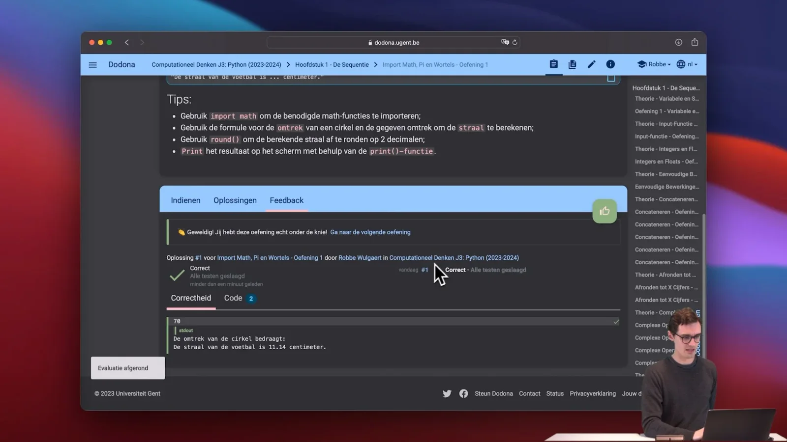
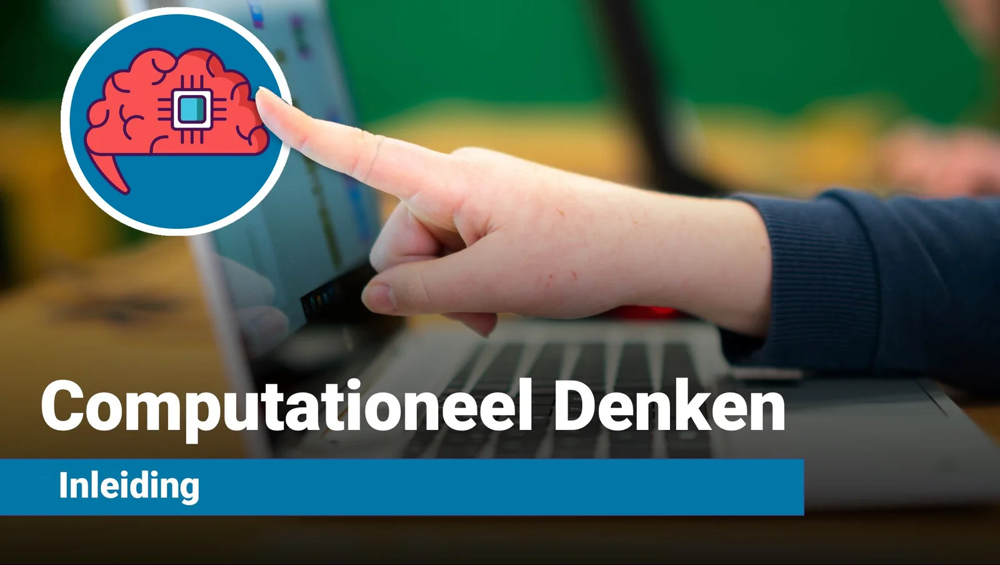

**Onze samenleving wordt steeds meer beïnvloed en gestuurd door computersystemen, apps en algoritmes. Talloze problemen, nu en in de toekomst, worden opgelost via die krachtige computers. Ook op school en in de klas voelen we die digitalisering. Wil jij meerwerken aan die toekomst, dan leer je best computationeel denken! Zelf algoritmes leren ontwerpen en die vertalen naar de programmeertaal Python! Maar hoe breng je dat nu in de klas? Daar kunnen mijn collega’s en ik jou bij helpen! Meer dan 150 kant-en-klare oefeningen, 20 uitgewerkte lesvideo’s, automatische feedback voor de leerling, correctiesleutels voor de docent, evaluatiereeksen … allemaal samengevat in één overzichtelijke lessenreeks op het opensourceplatform Dodona (UGent).**

### Bestond dit niet al?

Correct! Of toch ongeveer, want dit lesmateriaal gebruik ik nu vier schooljaren. Doorheen die periode merkte ik welke zaken niet vlot verliepen en waar het product beter kon. Zo geschiedde! Dit bouwt verder op dat lesmateriaal en het materiaal dat ik reeds maakte voor mijn klassen uit de eerste graad. Een overzichtje van die materialen en waar je ze kan vinden op KlasCement:

-   [Computationeel Denken - Inleiding](https://www.klascement.net/downloadbaar-lesmateriaal/158385/computationeel-denken-lessenreeks/?previous) (eerste graad)

-   [Computationeel Denken & JavaScript](https://www.klascement.net/downloadbaar-lesmateriaal/159321/computationeel-denken-javascript-lessenreeks/?previous) (eerste en tweede graad)

### Waarom Python?

Python is een relatief gebruiksvriendelijke en goed gedocumenteerde programmeertaal. Het is een taal die gebruikt kan worden in combinatie met diverse andere lesmaterialen en -inhouden, zoals een Micro:Bit, MakeCode Arcade van Microsoft, binnen wiskunde, statistiek … maar ook voor het aansturen van AI-modellen! Wanneer je je verdiept in andere lesmaterialen op deze onderwijsblog zoals ‘ontwerpen met AI-modellen’, ‘restauratie van Oudgriekse inscriptie’, taalanalyse … zal je merken dat deze gebruikmaken van, jawel, Python! Op deze manier kies je dus voor een programmeertaal die je kan verwerken in **verticale** **en** **horizontale** **leerlijnen**. Dus leerstof die opbouwend werkt over verschillende jaren heen (=verticaal) én met mogelijkheden binnen vakoverschrijdende projecten (=horizontaal).

Bijkomend werken we via dit lesmateriaal in de Dodona-omgeving van de UGent. Door deze keuze bereiden we leerlingen voor op de sprong naar het hoger onderwijs waar dit soort lesmateriaal ook op deze wijze wordt aangeboden.

### Wat is er nieuw?

### Herziene Volgorde Programmeerconcepten

Na enkele scholenjaren werken met eigen lesmateriaal en materiaal van uitgeverijen, merkte ik dat de volgorde van de leerstof niet altijd even goed ineen stak. Bepaalde programmeer- en wiskundeconcepten worden duidelijk uitgelegd, met nadien oefeningen. Andere concepten doken plotseling op en had je nodig om de oefening op te lossen. Dit maakte dat het lesgeven met duidelijk afgebakende instructiefase en oefenfase stroever verliep.

In de nieuwe versie van deze lessenreeks verdelen we de oefeningen nog steeds overheen **vier primaire programmeerconcepten**, namelijk:

-   sequentie

-   selectie

-   begrensde herhaling

-   voorwaardelijke herhaling

Binnen die **primaire programmeerconcepten** geven de namen van de hoofdstukken en de lesvideo’s duidelijker aan wanneer er nieuwe **wiskunde- en programmeerconcepten worden geïntroduceerd**. Dit vergroot de duidelijkheid voor zowel leerling als docent.

### Geïntegreerde Lesvideo’s

Binnen de cursus vind je oefeningen en **‘leesopdrachten’** terug. Die laatste bevatten de **geïntegreerde** **lesvideo’s**. Deze zijn korter in speelduur dan de voorgaande video’s en focussen specifiek op één bepaald concept. Elke video volgt dezelfde opbouw:

[Video on YouTube](https://www.youtube.com/embed/eF8Bm-KF0GE?feature=oembed)

-   Uitleg van het concept

-   Voorbeeldoefeningen die we ontleden

-   Schematiseren

-   Schema omzetten in Python-code

-   Oefening maken op Dodona

De video’s zijn ook gewoon te vinden op YouTube en kunnen gebruikt worden door zowel de docent als de leerling. Bijvoorbeeld om een les voor te bereiden, bij leerlingen die wat differentiatie in de tijd nodig hebben (=lees: voorop lopen), in een ‘Flipped Classroom’ aanpak, als remediëring, bij het instuderen …

### Geïntegreerde Autocorrectie

Op vraag van collega’s en leerlingen werken de oefeningen nu met een vorm van autocorrectie. Deze zal, indien de structuur van de oefening dat toelaat, het algoritme van de leerling controleren op twee niveau’s:

-   **Syntaxis**: klopt de code volgens de spelregels van Python?

-   **Inhoudelijk**: klopt de invoer en uitvoer?

Die laatste feature is volledig nieuw en te vinden bij het meerendeel van de 150+ oefeningen in de lessenreeks. Het stelt ons in staat om de leerling te voorzien van feedback en de leerkracht kan via het dashboard sneller zien of een leerling een **inhoudelijk** correcte oplossing heeft ingevoerd. Vroeger kon een leerling een algoritme schrijven zoals:

> print(‘Ik voer dit lekker in bij elke oefening. Hihi!”)

Dit is **syntax-gewijs** volledig correct. Hier staat een print-statement en het zal de string naar het scherm schrijven. Maar **inhoudelijk** slaat dit natuurlijk nergens op. In de vorige versie van deze lessenreeks werd er dus slechts één controle uitgevoerd. Nu zal Dodona opmerken dat die ene string niet past in ons vraagstuk. Eureka!

### Evaluatie, Overzicht en Feedback

Door te werken binnen Dodona, in tegenstelling tot bijvoorbeeld de Notebooks die we gebruiken voor de losstaande AI-projecten, bekom je enkele voordelen als docent en student. Deze zijn:

**Docent**

-   Dodona is een **open-source leeromgevin**g ontworpen door onderzoekers aan de UGent;

-   Het is **gratis** te gebruiken;

-   Je kan een **bestaande lessenreeks (zoals deze) integraal kopiëren** en gebruiken in de eigen klassen;

-   Je kan een volledig **eigen lessenreeks samenstellen** op basis van de oefeningen van tal van andere docenten;

-   Het platform is **bereikbaar via de browser** (dus geen installatie vereist);

-   De Python-code kan je **uitvoeren via de browser** en er is dus geen gegoochel nodig met ‘opslaan als’ en ‘run scripts’. Dit werkt drempelverlagend voor de leerlingen;

-   Je krijgt een handig overzicht van de **vooruitgang van elke leerling**, zowel op vlak van oefeningen als dagen van de week waarop de leerling werkt. Dit soort lesmateriaal krijg je enkel onder de knie (lees: werken aan automatisering) door geregeld te oefenen. Uiterst handig bij concrete en tijdige feedback aan de leerling en diens ouder(s);

-   Er is mogelijkheid tot **plagiaatcontrole**;

-   Je kan als docent per oefening geschreven **feedback** toevoegen;

-   Als docent heb je toegang tot de **correctiesleutel** die hoort bij elke opgave in jouw cursus.

**Student**

-   Alle oefeningen staan op **één platform**;

-   Je krijgt **feedback** op vlak van syntax en inhoud;

-   Je hebt **toegang tot lees- en kijkopdrachten** om de theorie op te frissen;

-   Je hoeft **niets te installeren**;

-   Je kan **aanmelden via Smartschool, Microsoft 365 …**

### Les- en Leerplandoelen

### Lesdoelen

-   **Leerlingen kunnen de stappen van het computationeel denken doorlopen en toepassen:**

    -   decompositie, patroonherkenning, abstraheren, algoritme maken, debuggen

-   **Leerlingen kunnen algemene programmeerconcepten toepassen. Concepten zoals:**

    -   verschillende datatypes (string, integers, float)

    -   sequentie

    -   selectie

    -   begrensde herhaling

    -   voorwaardelijke herhaling

-   **Leerlingen kunnen specifieke (verdiepende) programmeerconcepten toepassen. Concepten zoals:**

    -   afronden tot X decimalen

    -   importeren van bibliotheken

    -   vierkantswortel nemen van Y

    -   voorwaarden opstellen met diverse operatoren (<, >, >=, <=, ==, !=, and, or)

    -   opstellen van grafieken

    -   manipuleren van lijsten

    -   manipuleren van strings

-   **Leerlingen kunnen wiskundeconcepten toepassen. Concepten zoals:**

    -   eenvoudige bewerkingen

    -   bewerkingen met percentages

    -   verheffen tot een macht

    -   formules van omtrek en oppervlakte

    -   toepassen stelling van Pythagoras

    -   vermoeden van Collatz

### Leerplannen

Deze lessenreeks werd ontwikkeld met oog op de leerplandoelstellingen en tabellen van het Katholiek Onderwijs Vlaanderen. Gegeven de moderniseringen (meervoud, herhaaldelijk, onophoudelijk) en herziening van de leerplannen, vind je hieronder de doelstellingen zoals geformuleerd in o.a. Gemeenschappelijk Funderend Leerplan (D/2024/13.758/019), het leerplan ICT (D/2024/13.758/022), het leerplan informaticawetenschappen in de tweede graad (D/2024/13.758/048) en het leerplan informaticawetenschappen in de derde graad (D/2024/13.758/201). 

-   De leerlingen analyseren de impact van digitale systemen op de maatschappij vanuit principes van computationeel denken. (LPD 7 uit leerplan ICT, LPD 20 uit het GFL).

-   De principes van computationeel denken zijn: decompositie, patroonherkenning, abstractie en algoritmen. (uit het leerplan ICT en het GFL)

-   De leerlingen hanteren een systematiek bij het ontwerpen van oplossingen en implementeren van programma’s voor concrete problemen. (LPD 1 uit het leerplan informaticawetenschappen, 2de graad)

-   De leerlingen passen een gestructureerde programmeertaal toe bij het zelf ontwerpen van oplossingen voor concrete problemen. (LPD 2 uit het leerplan informaticawetenschappen, 2de graad)

-   De leerlingen gebruiken softwarebibliotheken bij het ontwikkelen van programma’s. (LPD 3 uit het leerplan informaticawetenschappen, 2de graad)

-   De leerlingen hanteren een systematiek bij het ontwerpen van oplossingen en implementeren van programma’s voor concrete problemen. (LPD 1 uit het leerplan informaticawetenschappen, 3de graad)

-   De leerlingen passen een gestructureerde programmeertaal toe bij het ontwerpen van een oplossing. (LPD 2 uit het leerplan informaticawetenschappen, 3de graad)

-   De leerlingen passen algoritmische technieken toe bij het programmeren van zelf ontworpen oplossingen. (LPD 5 uit het leerplan informaticawetenschappen, 3de graad)

_Bovenstaande leerplannen bouwen expliciet verder op de bouwstenen rond computationeel denken uit de eerste graad. Deze komen in de vernieuwde leerplannen aan bod binnen vakken wiskunde en/of techniek in de eerste graad. Je vindt lesmateriaal hiervoor via_ [_deze link_](/onderwijs/lessenreeks-computationeel-denken) _of de afbeelding hierboven!_ 

### Eindtermen

**De leerlingen ontwerpen algoritmen om problemen digitaal op te lossen.**

**Conceptuele kennis**

-   Concepten van computationeel denken: decompositie, patroonherkenning, abstractie, algoritme

-   Organisatie, modellering, simulatie en digitale representatie van informatie

-   Debuggen: testen en bijsturen

-   Principes van programmeren: sequentie, herhalingsstructuur, keuzestructuur

-   Ingebouwde functies

-   Elementen van programmeertalen: variabelen, datatypes, operatoren, parameters, condities, procedures of functies

**Procedurele kennis**

-   Toepassen van principes van computationeel denken: decompositie, patroonherkenning, abstractie, algoritme

-   Toepassen van principes van organisatie, modellering, simulatie en digitale representatie van informatie

-   Toepassen van principes om te debuggen

-   Toepassen van principes van programmeren: sequentie, herhalingsstructuur, keuzestructuur

-   Toepassen van controlestructuren en eenvoudige gegevensstructuren bij het formuleren van algoritmen

### **Ik wil dit in mijn klas! Wat moet ik doen?**

**Wil je hier zelf mee aan de slag in jouw klaslokaal? Super! Jongeren laten kennismaken met computationeel denken, programmeer- en wiskundeconcepten is belangrijk in een steeds meer digitale samenleving. Daar hoort het verkennen van- en verdiepen in Python zeker bij. Ik wil jou daar gerust bij helpen! De oefeningen, link naar Dodona en veel meer kan je vinden via onze Discord Community!**

<a class="content-button content-button--primary content-button--medium" href="/contact">Contact en Discord</a>

### Aan de slag met AI in de klas?

