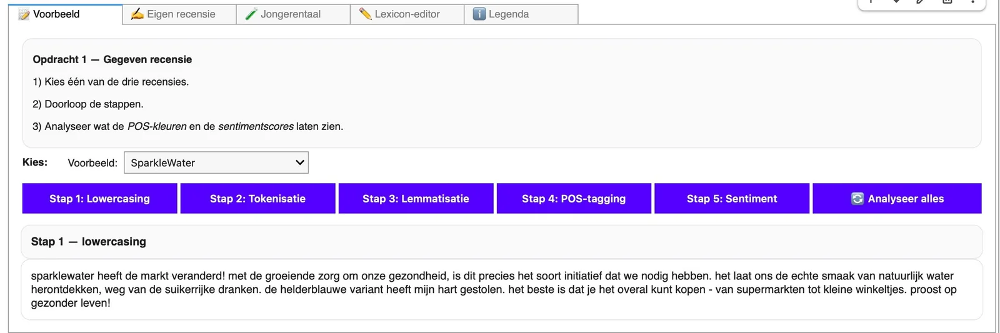
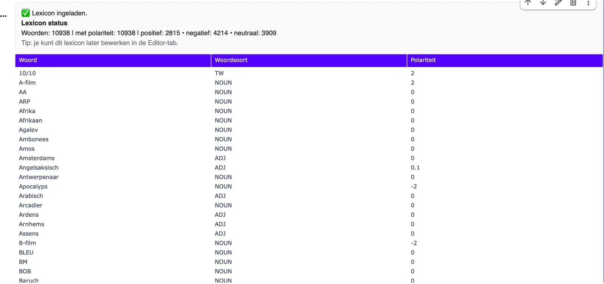
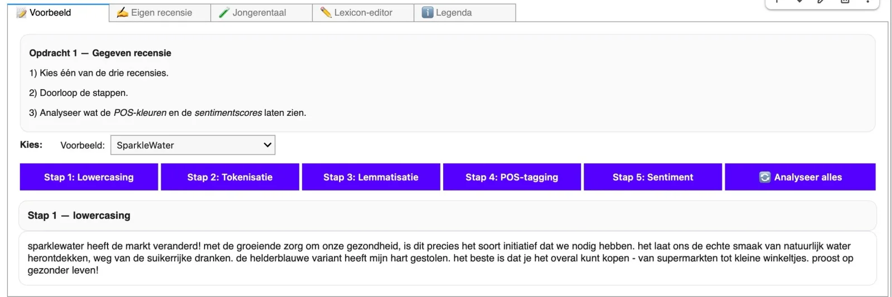
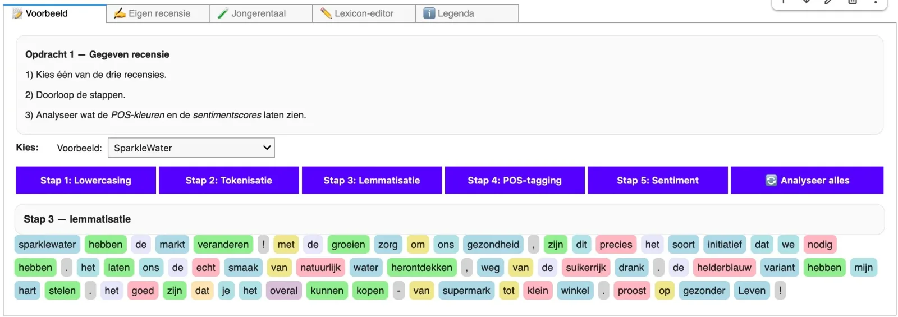
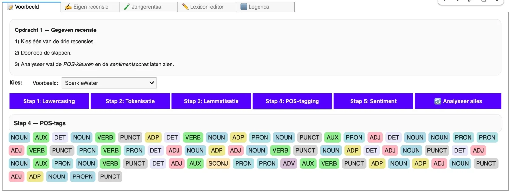
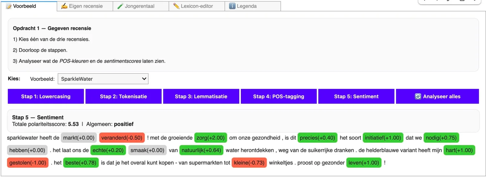
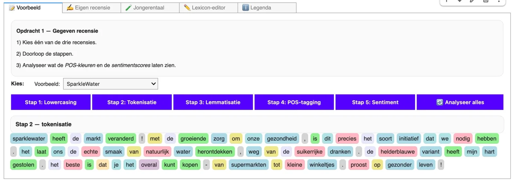
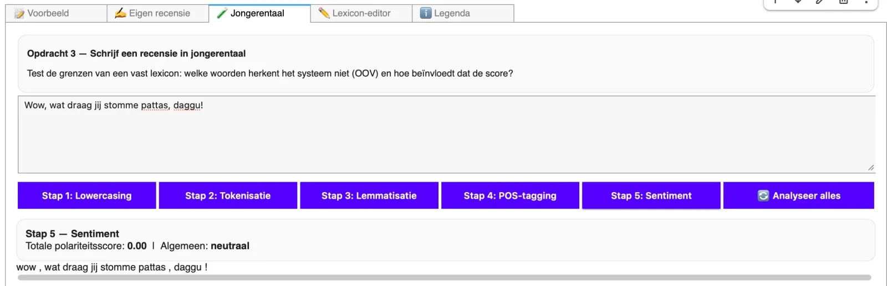
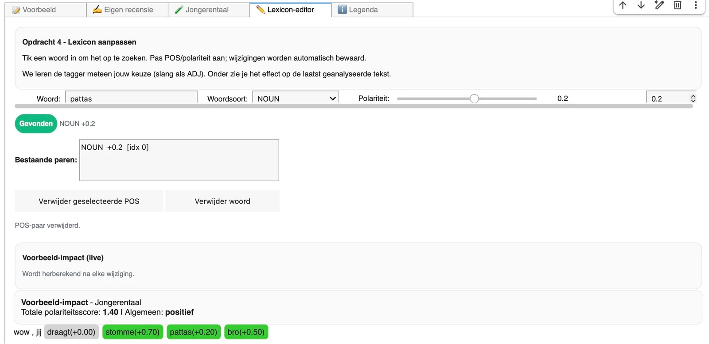
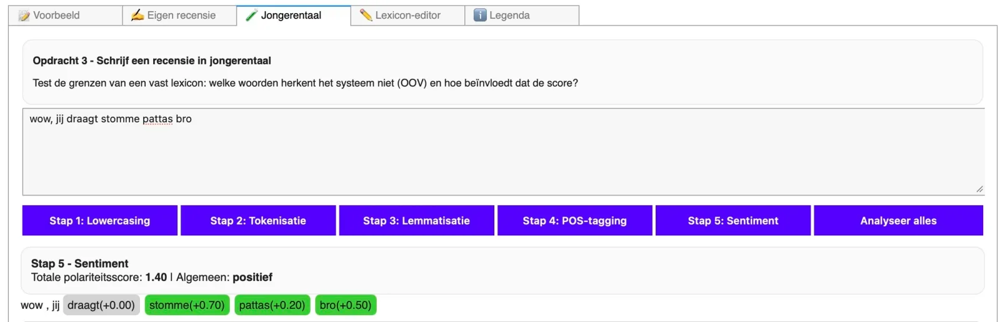

### Wie ooit op (school)reis een restaurant heeft proberen kiezen, kent het ritueel: telefoons gaan omhoog, Google Maps of Tripadvisor gaan open en plots staan er sterren, gemiddelden met twee cijfers na de komma, en soms tientallen tot duizenden recensies die “overwegend positief” of “teleurstellend” blijken. Achter die eenvoudige sterrenrij zit een computer die al die teksten op een of andere manier verwerkt, sorteert en samenvat. Maar hoe beslist zo’n systeem eigenlijk of een recensie positief of negatief is op basis van tekstanalyse? Welke rol spelen individuele woorden en scores in die berekening? En belangrijker nog: wat gebeurt er met nuance, ironie of typisch jongerentaal die op het eerste gezicht iets anders zegt dan ze bedoelt?

In deze lesreeks rond sentimentanalyse en taaltechnologie laten we leerlingen dat proces van dichtbij ontleden. We vertrekken vanuit herkenbare recensies die leerlingen zelf zouden kunnen geschreven hebben of lezen bij het zoeken naar een restaurant. Stap voor stap bouwen ze een eenvoudige analyse op, laten ze een computer de gevoelswaarde van een tekst inschatten en leggen ze die uitkomst naast hun eigen oordeel. Dit artikel hoort bij praktijkopdracht 1 van een drieluik. In **opdracht 1 analyseren leerlingen recensies** met een bestaand lexicon en een Nederlandstalige natural language processor. In **deel 2 verschuift de focus naar motivatie- en sollicitatiebrieven op de werkvloer**, in **deel 3 naar sociale media, jongerentaal en haatspraak.** Hier leggen we het fundament: hoe “leest” een computer een recensie, welke stappen doorloopt hij, waar gaat het goed en waar gaat het mis zodra context, nuance en jongerentaal in beeld komen.

[Video on YouTube](https://www.youtube.com/embed/f-uOnItkEzg?feature=oembed)

### Van recensie naar score

_Een gegeven fictieve recensie wordt door lowercasing ontdaan van hoofdletters._

In de eerste opdracht onthullen we de werking van taalalgoritmes. Dit doen we door leerlingen één recensie te laten volgen terwijl die door een vaste analyse gaat. De tekst wordt eerst technisch “opgekuist”: hoofdletters verdwijnen, zinnen worden in losse woordjes en leestekens geknipt en elk woord wordt teruggebracht tot zijn woordenboekvorm. Vervolgens kent een natural language processor aan elk van die tokens een woordsoort toe – zelfstandig naamwoord, werkwoord, adjectief – zodat de computer weet wat hij precies in handen heeft.

_Ons lexicon met woordsoorten en polariteitscores._

Pas daarna komt het lexicon in beeld: een grote woordenlijst waarin elk lemma een polariteitsscore tussen -2 en +2 heeft. De computer zoekt voor elk woord de bijhorende score op en telt al die waarden op tot één getal dat de globale gevoelswaarde van de recensie moet weergeven. Wat voor leerlingen op het scherm begint als een herkenbare tekst in de vorm van een eenvoudige recensie, eindigt zo als een som van individuele woordscores.

Klaar! … Toch? 

    

### Bro, dees chap is skeer!

_In een volgende opdracht voeren we een recensie in die volledig is geschreven in jongerentaal. Onze NLP bakt er niet veel van. He cooked._

Al snel wordt duidelijk dat onze aanpak niet neutraal of feilloos is. Omdat de computer losse woorden optelt, raakt hij vlot de weg kwijt zodra er nuance, ironie of jongerentaal in het spel is. Een formulering als “Ik heb mij niet verveeld” wordt gevaarlijk dicht tegen “verveeld” aangeplakt in de berekening, terwijl de mens hier net iets positiefs hoort. Sarcastische zinnen (“Fantastische service, als je graag een uur wacht”) vallen uit elkaar in “fantastische” en “service” met overwegend positieve scores. En in jongerentaal kan “domme patas” verrassend genoeg wél een compliment zijn, ook al staat “dom” in het lexicon stevig in het rood. Wat loopt er hier mis?

_Oplossing hier is om het lexicon aan te vullen met nieuwe woorden. Daarvoor moeten we ook aan de slag met woordsoorten en zelfgekozen polariteiten._

Het lexicon blijkt een momentopname van taal: woorden en betekenissen worden op een bepaald tijdstip vastgelegd, terwijl taal, zeker in leefwerelden van jongeren, sneller verandert dan de woordenlijst kan volgen. In de klas maken we dit zichtbaar door leerlingen hun favoriete restaurants te laten beoordelen in jongerentaal. Ze leggen hun beoordeling naast deze van de computer en verschieten zich een bult. 

_Nu krijgen we wel een score voor onze recensie in jongerentaal._

### Leerdoelen

Didactisch is dit geen gimmick-lesje “AI in de klas”, maar een oefening die concreet bouwt aan taal- én denkvaardigheden. Op inhoudelijk niveau leren leerlingen hoe een computer een tekst stap voor stap verwerkt: van lowercasing en tokenisatie over lemmatisering en part-of-speech-tagging tot het optellen van polariteitsscores in een lexicon. Ze kunnen die ketting benoemen, herkennen in de notebook en in eigen woorden terug uitleggen. Tegelijk blijft het niet bij technische beschrijving. Leerlingen leggen hun eigen oordeel naast de score van de machine, analyseren waarom er verschillen zijn en zien in dat dezelfde recensie anders kan “voelen” voor mens en model.

Dit lesmateriaal is dus het eerste deel van een reeks van drie lessen rond het analyseren van recensies. In deze eerste les ligt de focus op de basis van natural language processing (NLP): hoe een computer tekst technisch verwerkt, waar een lexicon in dat proces past en waarom dat tegelijk sterk en beperkt is. Die basis is nodig om in de volgende lessen met sollicitatiebrieven en sociale media aan de slag te kunnen.

### Aan het einde van dit eerste deel kan de leerling:

-   in eigen woorden uitleggen wat sentimentanalyse is en hoe een computer van tekst naar één sentimentsscore gaat;

-   de werking en de rol van een lexicon binnen sentimentanalyse duiden (polariteitsschaal van -2 tot +2, verdeling positief/negatief/neutraal, link met lemma’s);

-   de kernstappen van een NLP-ketting benoemen en herkennen in de notebook:

    -   lowercasing;

    -   tokenisering;

    -   part-of-speech-tagging;

    -   lemmatisering;

    -   bepalen van een polariteitsscore met behulp van een lexicon;

-   deze stappen toepassen op een korte recensie en daarbij aangeven wat er op elk niveau met de tekst gebeurt;

-   een eigen inschatting van het sentiment van een recensie vergelijken met de score van het model en op basis van concrete woorden uitleggen waar verschillen ontstaan;

-   aan de hand van voorbeelden (bv. jongerentaal, ironie, negatie) in eigen woorden de mogelijkheden én de beperkingen van deze vorm van taaltechnologie toelichten;

-   het idee van een lexicon als “momentopname van taal” uitleggen en koppelen aan de nood aan een human in the loop bij het interpreteren en bijsturen van de resultaten.

### Leerplandoelen:

Het leerplan dat het dichtst aansluit bij deze opdracht is het leerplan _Taalredactie en Taaltechnologie (KOV)_ uit de component specifieke vorming binnen de studierichting _Moderne Talen_. Binnen dat leerplan komen verschillende vormen van taaltechnologie aan bod, waaronder expliciet sentimentsanalyse. Dit lesmateriaal en de vervolglessen rond sollicitatiebrieven en sociale media werken onder meer rond onderstaande leerplandoelen.

-   **LPD 2: De leerlingen analyseren hoe de context de betekenis van een taaluiting beïnvloedt.**

    -   Deze opdracht laat leerlingen ervaren wat er gebeurt wanneer je context systematisch wegneemt. De gebruikte taaltechnologie knipt teksten in tokens en analyseert die één voor één, los van negaties, omliggende adjectieven of bredere tekststructuur. Leerlingen zien aan concrete voorbeelden (bv. “niet slecht”, ironische recensies) hoe snel betekenis verschuift wanneer de context wegvalt, en kunnen dat linken aan een van de kernbeperkingen van deze aanpak.

-   **LPD 4: De leerlingen gaan kritisch om met taaltechnologische hulpmiddelen.**

    -   Dit lesmateriaal is een directe oefening in kritische omgang met taaltechnologie. Leerlingen zien niet alleen de output van het systeem, maar ook de tussenstappen in de NLP-ketting. Ze vergelijken hun eigen lezing van recensies met de berekende scores en benoemen waar het model fouten maakt, bijvoorbeeld bij beeldspraak, ironie, negatie of jongerentaal. Daarbij krijgen ze inzicht in hoe deze technologie een tekst verwerkt in vergelijking met menselijke tekstverwerking en leren ze dat “hulpmiddel” nooit gelijkstaat aan “onfeilbaar oordeel”.

-   **LPD 5: De leerlingen lichten het maatschappelijke en wetenschappelijke belang van taaltechnologie toe.**

    -   Deze les zoomt in op een ogenschijnlijk alledaagse toepassing (reviews), maar legt tegelijk de link naar bredere inzet van sentimentanalyse en data-analyse. Vanuit het perspectief van de gebruiker kan je met leerlingen verkennen binnen welke maatschappelijke en wetenschappelijke domeinen deze methodes worden ingezet, welke mogelijkheden dat biedt en welke ethische vragen opduiken.

-   **LPD 6: De leerlingen illustreren hoe taaltechnologie hen in hun werk als taalprofessional kan ondersteunen.**

    -   Deze opdracht toont heel concreet waar de meerwaarde van NLP en lexicon-gebaseerde sentimentanalyse ligt voor toekomstige taalprofessionals. De computationele rekenkracht van natural language processors maakt het mogelijk betekenispatronen te halen uit grote hoeveelheden tekst: recensies, berichten, commentaren. Leerlingen ervaren op kleine schaal hoe zo’n systeem hen kan helpen trends te zien die je met de hand moeilijk zou vinden, maar ook dat de uitkomsten alleen bruikbaar zijn als je de beperkingen kent en resultaten kritisch kadert.

### Benodigdheden

Dit lesmateriaal is bewust ontworpen om organisatorisch laagdrempelig te houden. We houden rekening met drie praktische voorwaarden.

-   **Lage hardware-eisen**

    De notebooks draaien in de browser. De rekentaken gebeuren op een externe machine, niet op de schoollaptop. Een doorsnee laptop, Chromebook of desktop volstaat. Er zijn geen extra investeringen in “zwaardere” toestellen nodig.

-   **Uitvoerbaar binnen één lesuur**

    De opdracht is opgedeeld in duidelijke stappen, met één installatiestap aan het begin. Een demonstratie, een eigen recensie en de jongerentaaloefening passen binnen een standaard lesuur, zonder grote aanpassingen aan het lessenrooster.

-   **Iedere leerling aan de knoppen**

    Omdat alles in de browser draait, kan elke leerling op een eigen toestel werken. Het materiaal is expliciet niet geschreven voor één “pilootleerling” achter het toetsenbord en een passieve groep eromheen, maar voor individueel of duo-werk per notebook. Zo bouwt iedere leerling zelf ervaring op met de NLP-ketting in plaats van enkel mee te kijken.

### Ik wil dit in mijn klas! Wat moet ik doen?

Wil je hier zelf mee aan de slag in jouw klaslokaal? Super! Samen met jongeren werken rond AI-geletterdheid is fantastisch, maar ik ben wellicht een bevooroordeelde bron. Met de knoppen hieronder kan je mij contacteren. Of sluit je aan bij de Discord-server en vind daar het lesmateriaal en veel meer!
