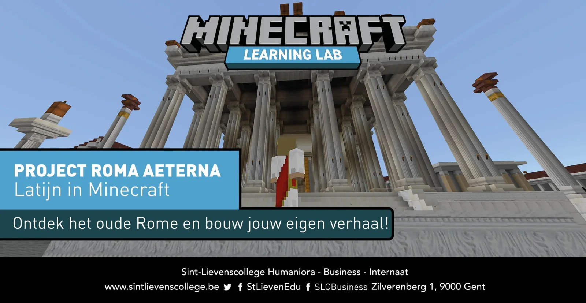
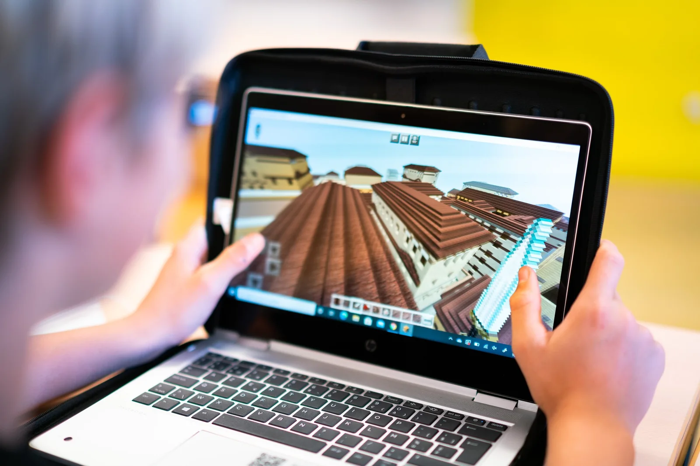
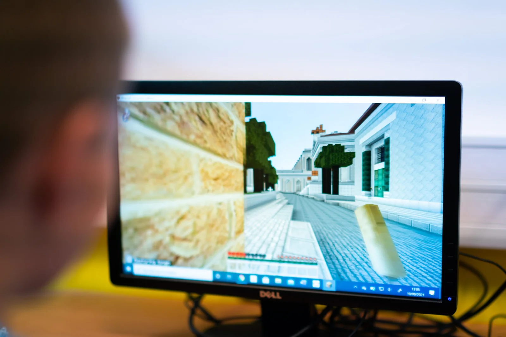
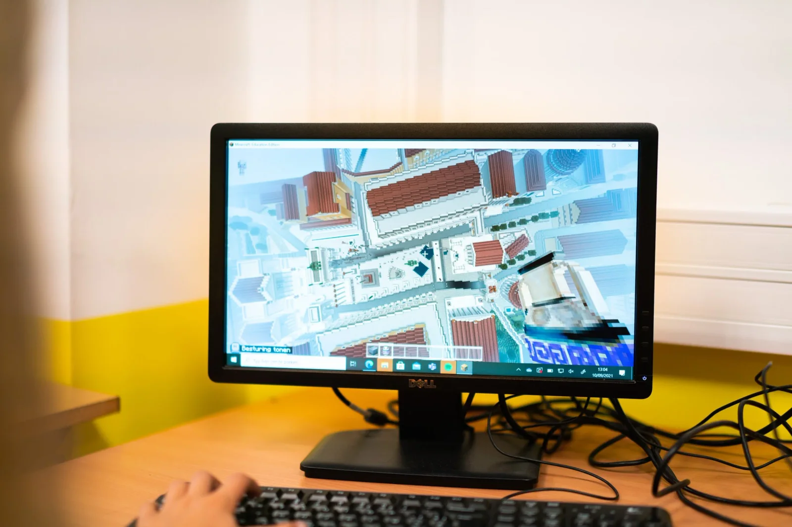
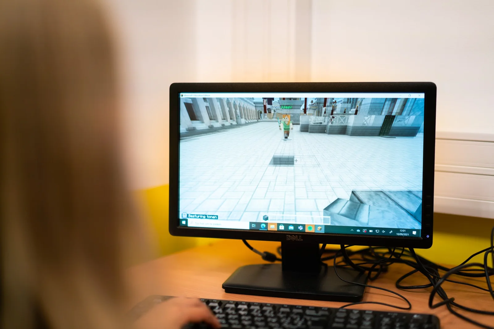
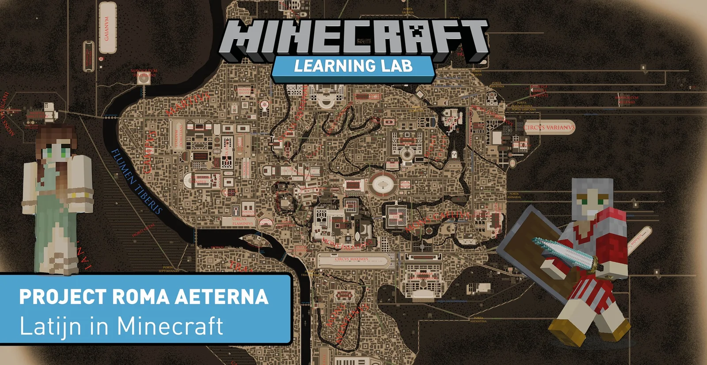

[Video on YouTube](https://www.youtube.com/watch?v=2A6adn9MUFw)

### Het initiatief

Bij dit project ontdekken we het oude Rome en de cultuur van de Romeinen in een Minecraft-wereld. In deze digitale wereld gaan leerlingen thematisch aan de slag. Ze ontdekken hoe de oude Romeinen wonen, gladiatorspelen en meer. Na de lesgebonden opdrachten kunnen de leerlingen de oude Romeinse binnenstad, het forum Romanum, Circus Maximus, de villa's rondom de stad ... vrij verkennen!

### De vernieuwing

Met dit project trachten we gekende lesinhouden (bijvoorbeeld hoe leefden de Romeinen, wat is een domus, een insula en een villa) aanschouwelijk te brengen via de game Minecraft. Deze game is door veel leerlingen gekend en geliefd. Zo proberen we een brug te slaan tussen lesinhoud en de interesses van de leerling.

### Waarom en hoe?

De grote Minecraft-wereld beslaat de volledige oude stad Rome. Binnenin die stad worden zones afgebakend. In deze zones worden lesinhouden ingericht. Personages om mee te spreken, dingen om te ontdekken, een quiz aan het einde van een avontuur ... Tijdens het verloop van de lesopdracht kunnen de leerlingen deze zones niet verlaten en worden hun mogelijkheden in de game beperkt. Eenmaal de einddoelstelling bereikt is, krijgen ze de vrijheid en middelen en zelf aan de slag te gaan in deze wereld. Zo kunnen ze, na het leren over de Romeinse domus, zelf een eigen domus bouwen en inrichten!

### Resultaten

Met dit project ontwikkelen we een nieuwe lesaanpak binnen het vak Latijn. Zo kunnen we gekende en bekende lesinhouden digitaal, aanschouwelijk en interactief brengen voor de leerlingen. Dit project richt zich op leerlingen Latijn in de eerste graad van het secundair onderwijs.

### Materiaal

Computer voor de leerlingen en leraar, Minecraft Education Edition, BookWidget (of gelijkaardig platform, optioneel) om de quiz te ontwerpen.

### Contact

Vragen, opmerkingen, feedback …? Daarvoor kan je terecht op de [contactpagina](/contact)!
