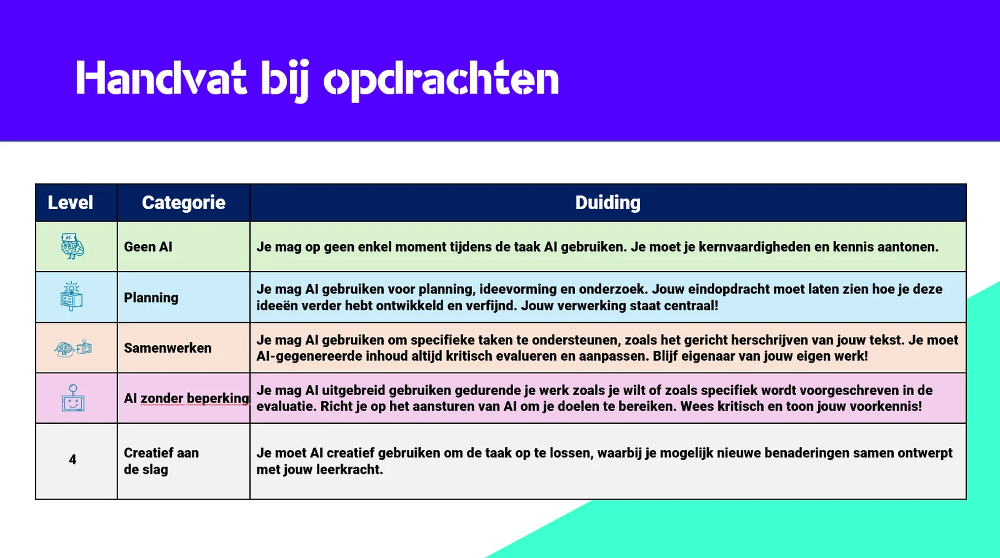
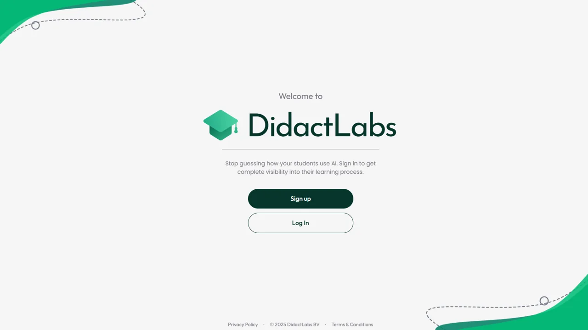
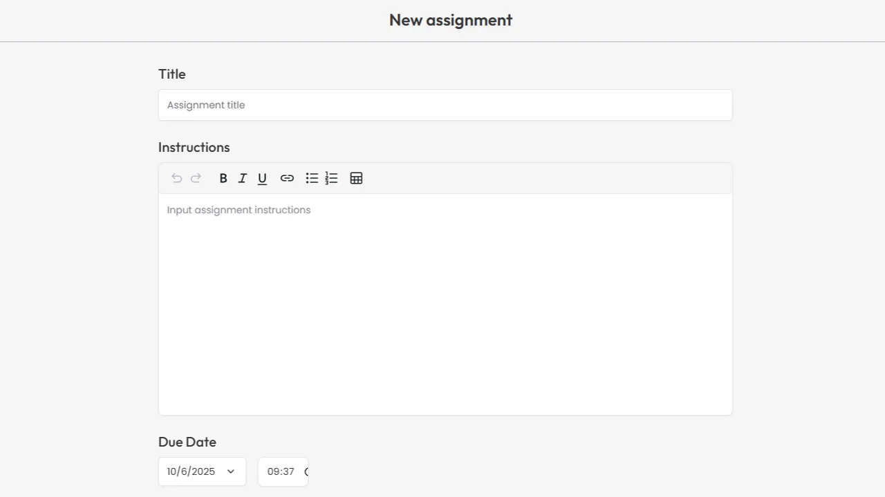
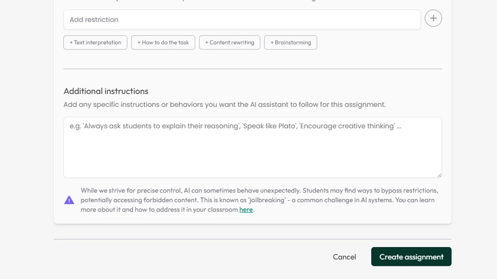
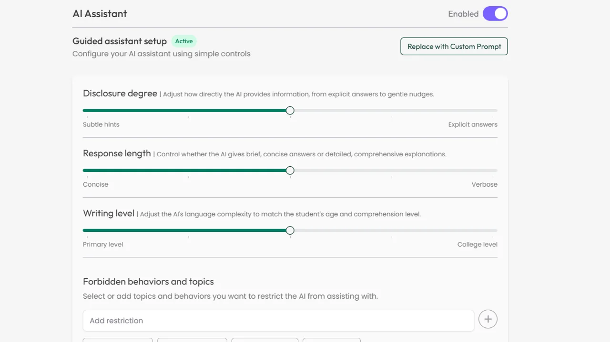

### Dat AI-technologie zijn intrede in de klas niet gemist heeft, is zoals een open deur intrappen. Helaas vloekt die technologie vaak met onze leerdoelen, betrouwbare evaluatie en didactische ondersteuning. Schrijven met pen en papier dus als enig antwoord op die AI-doorbraak? Daar proberen we in deze blogpost een toevoeging op de voorzien. We tonen hoe je [DidactLabs](https://didactlabs.com/) kan inzetten om schrijfinstructies, proces en bewijs te centraliseren, zonder onze bewust geplaatste scaffolds te verliezen. We vertrekken vanaf onze leerdoelen, bepalen wanneer AI-ondersteuning past, welke vorm deze ondersteuning via het AI-hantvat en serveren het resultaat via de Safe Exam Browser. Zo bewaken we onze doelen en verkrijgen inzicht in het leer en schrijfproces van de leerling.

[Video on YouTube](https://www.youtube.com/embed/3r_V2mXt4Tk?feature=oembed)

### Scaffolds en leerdoelen

Tijdens onze lessen werken we met leerlingen stap voor stap richting een welbepaald leerdoel. Bij het uitwerken van die tussenstappen ontwerpen we als lesgevers verschillende ‘scaffolds’ of leerondersteuning. Deze mag je zien als tussenstappen van een steiger. Scaffolding betekent vaak: eerst veel steun (voorbeeld, woordenlijst, structuur), daarna stelselmatig steeds minder, tot de leerling het leerdoel kan zonder houvast. Ongecontroleerde AI-hulp kan die bewuste opbouw kortsluiten. Tools zoals een chatbot laten toe dat leerlingen meteen een stuk tekst vragen om dat gewoonweg te kopiëren. Copy-paste van een chatbot is helaas géén goede leerstrategie. Daarom proberen we terug grip en inzicht te krijgen op dat leerproces door het formuleren we heldere afspraken, beperken van de afleiding tijdens het schrijven en maken we het leerproces zichtbaar via DidactLabs.

Overzicht van de vier levels van ondersteuning bij lesontwerp.

### Handvat voor AI bij lesontwerp

We hebben een **praktisch handvat** ([lees hier meer](/onderwijs/handvat-voor-lesmateriaal)) ontwikkeld om in te schatten hoeveel AI-ondersteuning op welk moment didactisch verantwoord is. Het handvat dwingt een keuze af vóór de opdracht start: welk leerdoel staat centraal, welke scaffold hoort daarbij, en wanneer helpt AI (of stoort AI) het leerproces? Zo vermijden we dat de tool de toon zet.

### De vier niveaus:

-   **Level 0: Geen AI.** Basisvaardigheden landen hier. AI zou het leerdoel ondermijnen.

-   **Level 1: Plannen.** AI mag bij de start (brainstorm, checklist). Verwerken, schrijven en aantonen doet de leerling zelf. Dus éénmaal gebruik bij het begin van het proces.

-   **Level 2: Middenin het proces.** AI kan gerichte, formatieve feedback geven. Begin en einde blijven leerlingwerk. Dus éénmaal ondersteuning middenin het leerproces.

-   **Level 3: Doorheen het traject.** Ruimere ondersteuning op meerdere momenten, maar transparant en verantwoord (leerling kan toelichten wat eigen is, wat herwerkt is en waarom).

Er kleeft geen waardeoordeel aan de niveaus. De keuze volgt het **leerdoel** en de **vordering in het leerproces** en de leeftijd van de leerling.

### DidactLabs als ondersteuning voor leerling en leraar

[DidactLabs](https://didactlabs.com/) is een online platform dat ontwikkeld wordt in België. **Het brengt opdracht, schrijfproces en bewijs samen onder één digitaal dak**. Tijdens het schrijven zien leerlingen de opdrachtinstructie en krijgen ze een vrij standaard schrijfomgeving te zien. Op het eerste zicht niets heel speciaal aan de hand dus.

Maar wanneer leerlingen rechts in beeld kijken, vinden ze daar een chatbot terug. Deze kan hen helpen bij de opdracht. Deze chatbot dient echter wel dezelfde spelregels te volgen als deze die we de leerlingen meegeven. Daarom is het mogelijk om binnen DidactLabs deze **chatbot te voorzien van onze zelfgemaakte instructies en beperkingen** via een ‘system prompt’. 

Na het indienen zien wij als leerkrachten hun **schrijfdynamiek** (tijd op taak, woorden per minuut, pauzes) en een **tijdlijn** **van** **bewerkingen**. Zo kunnen we achterhalen of leerlingen de afspraken van de opdracht hebben gevolgd en hoe hun schrijfproces verlopen is.

We krijgen ook zicht op de **verhouding eigen tekst, tekst die ze verkrijgen vanuit de ingebouwde assistent en externe bronnen**. Wil je nog meer informatie? Het **chatverloop** met de interne chatbot is ook **raadpleegbaar**. Tekst en procesrapport zijn exporteerbaar naar PDF. Zo evalueren we niet alleen het product, maar ook de werkwijze en kunnen we scaffolds gericht afbouwen. Of net gerichte feedback en ondersteuning bieden in een volgende opdracht. 

### **Twee soorten instructies**

Binnen het platform DidactLabs werken we met **twee instructies** wanneer we een schrijftaak ontwerpen. Een leerlinginstructie en een system prompt.

Eerst schrijven we de **leerlinginstructie**: opdracht, criteria en heldere afspraken voor de leerling. Hierin noteren we ook wat met AI wél en níet mag. Dit is een instructie waar elke leerkracht wel vertrouwd mee is. Tip: neem afspraken over toegelaten en verboden AI-ondersteuning op in jouw uitleg in de klas en op papier. Preventief werken is altijd beter.

Daarna formuleren we de **systemprompt**: onzichtbare richtlijnen voor de ingebouwde assistent (hoe direct antwoorden, hoe lang, welk taalregister, wat weigeren). Daarmee volgt de AI-assistent onze afspraken en kan het dienen als een **bewuste scaffold** in dienst van het leerdoel, geen sneltoets die het leerproces dwarsboomt.

 

**Opgelet:** een system prompt is niet waterdicht. Via emotionele chantage of technische handigheden kunnen de grootste sloebers toegang krijgen tot de system prompt en/of andere instructies forceren. Hier is men bij DidactLabs van bewust en men geeft die waarschuwing mee bij het ontwerpen van jouw taak. Maar net daarom: bij twijfel kan je even een kijkje nemen in de chatconversatie. 

### **Tool nummer 2: Safe Exam Browser**

Effectief leren en schrijven vergt focus. Zonder afleiding door een drukke klaschat of de verleiding van ChatGPT in een ander tabblad. Daarom laat ik leerlingen vaak oefenen in een Safe Exam Browser, zelfs als hier geen evaluatie aan is gekoppeld. Daarom koppel ik een schrijfopdracht binnen DidactLabs aan een SEB-bestand. Leerlingen starten zo meteen in de opdracht, zonder extra tabs of klembordomwegen. Het is niet volledig waterdicht, maar wel doelgericht: minder ruis, meer leren en sluiten veel mogelijkheid tot afleiding of omzeiling van onze scaffolds uit. 

### Conclusie

Scaffolds werken pas als we ze bewust plaatsen en tijdig afbouwen. Helaas gooit het ongelimiteerd en/of niet-toegelaten gebruik van AI-tools hier vaak roet in het eten. Met DidactLabs zien we niet alleen _wat_ er wordt geschreven, maar ook _hoe_ een tekst tot stand kwam. Inclusief hoe leerlingen aan de slag gingen met de toegelaten en ontworpen AI-ondersteuning. Het AI-handvat helpt ons vooraf de juiste keuze(s) te maken, de dubbele prompt houdt de assistent binnen de lijnen\* en het gebruik van SEB zorgt ervoor dat de focus bij de opdracht blijft. Zo kan je een schrijfopdracht ontwerpen die tot op een zekere hoogte valide is en heb je een extra antwoord in de toolbox naast ‘pen en papier in de klas’.
