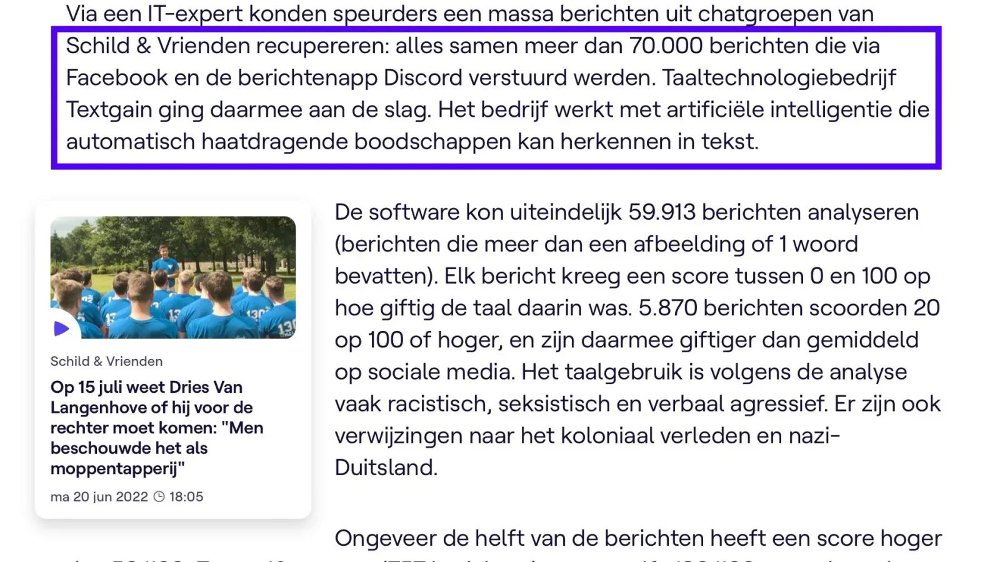
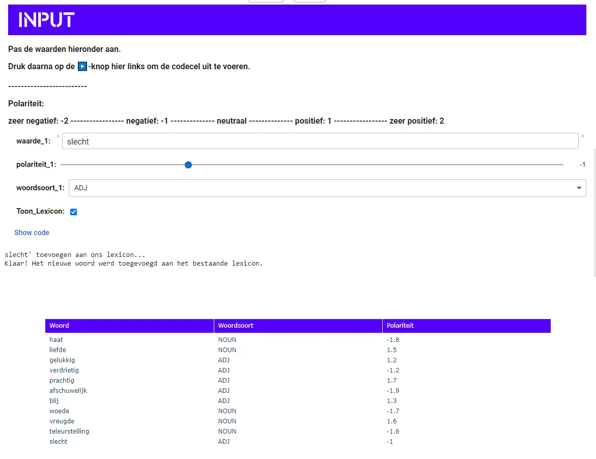
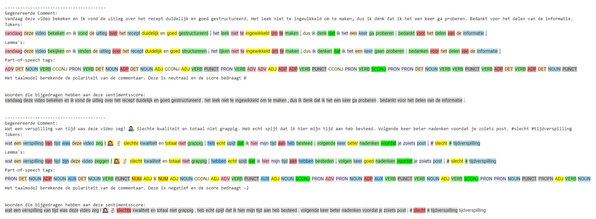
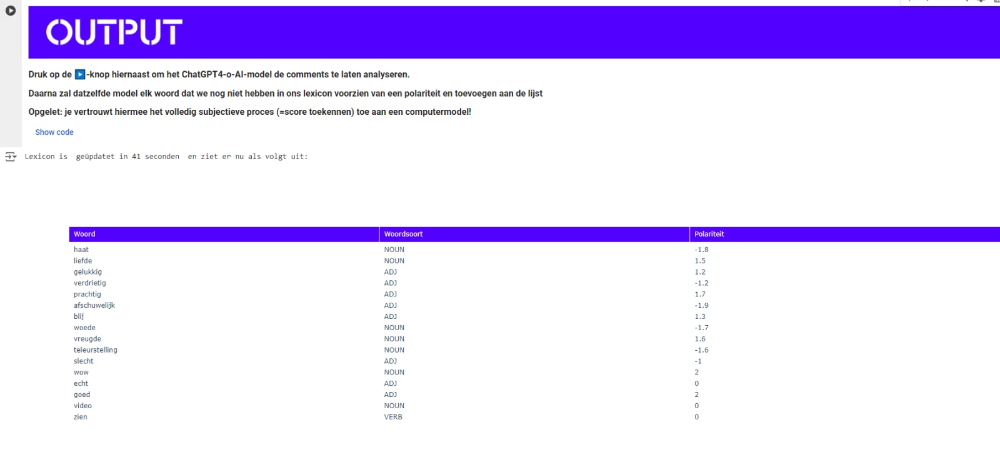
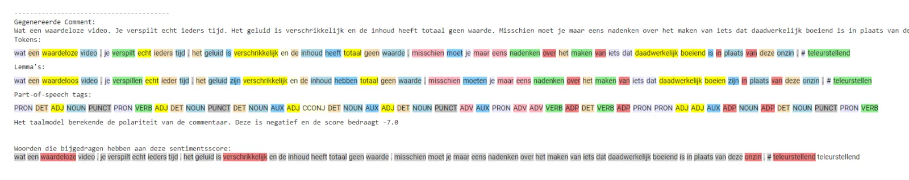
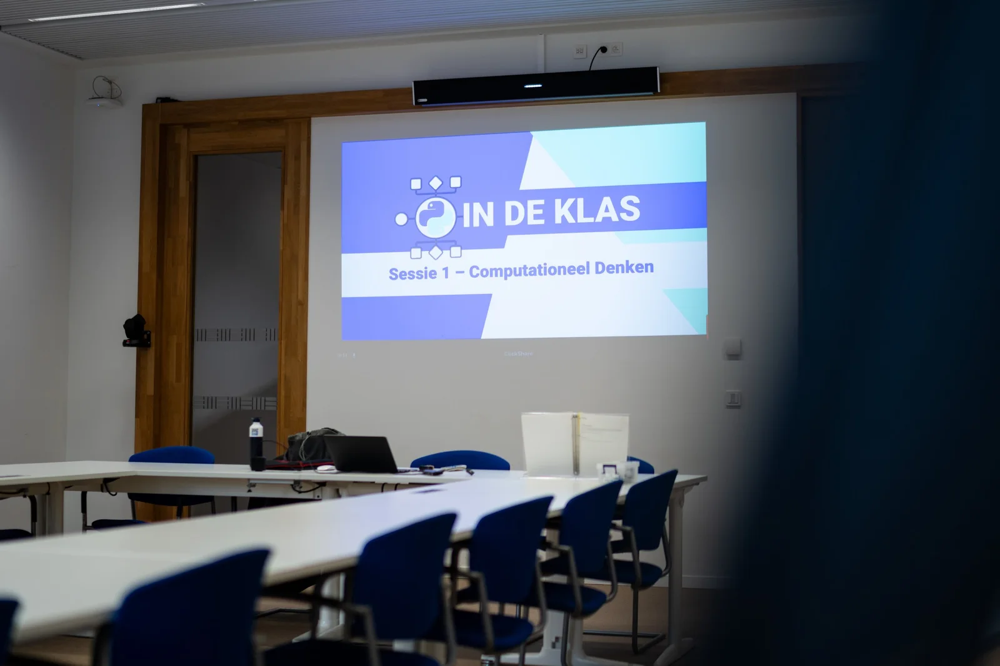

**Al jaren verdiepen computerwetenschappers zich in de complexiteit van menselijke taal, van vroege filosofische experimenten zoals de Turing Test en het 'Chinese Room Experiment' tot de ontwikkeling van regelgebaseerde chatbots. In november 2022 betekende de introductie van ChatGPT en generatieve AI-modellen een keerpunt in taaltechnologie. Maar moderne computers gaan verder dan alleen tekstgeneratie; ze zijn ook bekwaam in het analyseren van teksten. In dit artikel verkennen we deze tak van taaltechnologie. We beginnen met het analyseren van restaurantrecensies, verhogen de complexiteit door (zelfgeschreven) sollicitatiebrieven te beoordelen, en duiken tenslotte in sentimentanalyse van sociale media commentaren. Ga met ons mee op deze 'drie-traps raket' reis, ontdek hoe deze technologieën onze taal en toekomst beïnvloeden en waarom het belangrijk is om de ‘human in the loop’ en talige vakkennis te behouden. In dit artikel schakelen we naar level 3 van dit lesmateriaal. We onderzoeken hoe deze technologie kan worden toegepast bij het analyseren van online reacties op sociale media en hoe je zelf een lexicon kunt aanmaken, testen en evalueren.**

Dit is het **derde** **deel** van ons driedelige project. In[het eerste deel](/onderwijs/taalalgoritmes-en-sentimentsanalyse) heb je de grondbeginselen van sentimentanalyse en de werking van een ‘natural language processor’ verkend. In het [tweede deel](/onderwijs/taalalgoritmes-op-de-werkvloer) breidden we de omvang van onze analyse uit, zowel qua tekstlengte als het aantal teksten. We focusten niet meer op een korte recensie, maar op een zelfgeschreven motivatiebrieven. Met zijn voordelen maar ook duidelijke ethische nadelen.

In deze laatste fase van dit lesproject geven we de leerlingen bijna volledige controle over de woordenlijst die het AI-model gebruikt. Die woordenlijst zullen we gebruiken om social media posts te analyseren. In tegenstelling tot recensies en motivatiebrieven, is er op sociale media een bijna eindeloze hoeveelheid teksten beschikbaar. Door de potentiële dataset aan teksten enorm te vergroten, kunnen we de kracht van computermodellen beter illustreren. Dankzij hun enorme rekenkracht kunnen die modellen net grote hoeveelheden data verwerken, wat voor mensen moeilijk of onmogelijk is om handmatig te doen. 

[Screenshot uit het artikel van de VRT.](https://www.vrt.be/vrtnws/nl/2022/07/14/analyse-berichten-schild-vrienden/)

Die rekenkracht maakt AI bijzonder interessant voor social media bedrijven om in te zetten bij moderatievraagstukken. Een voorbeeld daarvan is de juridische wereld. Toen de data op de Discord-server van de Vlaamse jongerenorganisatie Schild & Vrienden werd geanalyseerd, bleken er meer dan zestigduizend berichten te staan. Om die berichten te filteren op hun vermeende haatdragende inhoud, werd artificiële intelligentie ingeschakeld.

### Bouw je eigen lexicon

In deze maatschappelijk relevante toepassing proberen we in de klas een woordenlijst (=lexicon) samen te stellen die negatieve en/of haatdragende berichten kan opsporen. Kunnen we überhaupt met een groep leerlingen een effectieve woordenlijst maken? Al snel merken ze dat dit een omvangrijke en tijdrovende taak is. Ze vullen de lijst aan, testen deze die op drie berichten (geschreven door een GPT-model) en evalueren de resultaten. Ontbreken er woorden in onze zelfgemaakte woordenlijst, dan moeten we die handmatig toevoegen. Dat proces herhaalt zich steeds opnieuw.

### Chatbot-teamwork

Stel dat een leerling begint met een basiswoordenlijst die woorden zoals ‘slecht’, ‘haat’ en ‘gevaarlijk’ bevat. Ze testen die woordenlijst op drie berichten:

-   Ik haat leugenachtige politici.

-   Dit voorstel is gevaarlijk voor kinderen.

-   Slechtste persoon die ik ooit heb gezien.

Als ze merken dat een negatief woord ontbreekt, zoals ‘vreselijk’, voegen ze dat toe aan de lijst. Dat proces wordt herhaald totdat de woordenlijst uitgebreid genoeg is om negatieve en haatdragende berichten effectief op te sporen.

Toevoegen van eigen woorden aan onze woordenlijst (=lexicon)

Op bovenstaande manier ons lexicon samenstellen is een tijdsrovende opdracht. Wat als we dat proces konden automatiseren met behulp van een AI-model? Plottwist: dat kan! Nadat we hebben vastgesteld dat het veel tijd kost om de woordenlijst aan te vullen, zetten we een _feedback-loop_ op met de leerlingen. We ontwerpen eerst een instructie waarmee een GPT-model drie social media posts genereert. Vervolgens gebruiken we een ander GPT-model dat die posts analyseert, naast ons lexicon legt en het zelfstandig lexicon aanvult. Dat proces herhalen we keer op keer! 

   

### Problem solved!

Je raadt het al, deze aanpak kent belangrijke beperkingen. Wanneer we het opstellen van ons lexicon volledig aan chatbots of _large language models_ overlaten, stuiten we opnieuw op ethische en technische grenzen van deze modellen.

-   **Context begrijpen**: chatbots vinden het vaak moeilijk om de context waarin woorden worden gebruikt te vatten. Zo kan een sarcastische uitdrukking zoals ‘Oh, geweldig!’ verkeerd foutief als positief worden geïnterpreteerd, terwijl de intentie negatief is. Dat tekort aan contextueel begrip leidt soms tot fouten in de berichtclassificatie.

-   **Snelle taalveranderingen:** de taal op sociale media evolueert snel met nieuwe woorden, afkortingen en memes die voortdurend verschijnen. Ondanks regelmatige updates, hebben chatbots moeite om die veranderingen bij te benen, wat resulteert in mogelijke misinterpretaties van moderne uitdrukkingen. Kortweg: chatbots zijn vaak niet mee met jongerentaal.

-   **Vooroordelen:** AI-modellen kunnen inherente vooroordelen vertonen als ze getraind zijn met bevooroordeelde data. Dat kan ertoe leiden dat onschuldige berichten als gemeen worden bestempeld, terwijl echt schadelijke opmerkingen worden gemist. Dergelijke vooroordelen ondermijnen de betrouwbaarheid van de analyse.

-   **Uniformiteit versus menselijke variabiliteit:** computers zijn consistent in hun beoordelingen, maar missen de nuance en flexibiliteit van menselijke interpretaties. Mensen begrijpen subtiele hints en culturele context beter, wat cruciaal is om complexe sociale media-content te beoordelen. Computers zijn daarentegen uniform, wat kan leiden tot systematische fouten.

-   **Toekennen van subjectieve waarden:** dit is misschien de belangrijkste bemerking. Wanneer we een woordenlijst aanmaken boordevol waarden, vinden we het dan oké dat die waardebepaling gedaan wordt door een ondoorzichtig taalmodel? Wanneer een GPT-model beslist dat ‘idioot’ een score van -1,.78 moet krijgen, wie bepaalt dat echt? Moeten we ons daarbij neerleggen?

Deze beperkingen maken het belang van een gezamenlijke aanpak van AI en menselijke controle heel duidelijk. Misschien zat het fout bij het ontwerp van onze oplossing, namelijk het volledig wegcijferen van alle menselijke input, denkwerk en verantwoordelijkheid. Ja, AI kan zware taken aan en grote datavolumes verwerken, maar mensen beoordelen best nog even zelf de nuances en contextuele details.

### Benodigdheden

Om aan de slag te gaan met een van deze lesprojecten rond sentimentanalyse heb je volgende zaken nodig:

-   Computer.

-   Stabiele internetverbinding.

-   Notebook met klaargemaakte Python-code per onderdeel van dit lesproject.

### Bereikte competenties

### Taalgebonden competenties

-   **Tekstanalyse**: leerlingen kunnen de werking van een lexicon en de stappen van de tekstanalyse duiden in het kader van automatische moderatie van berichten op social media.

-   **Kritisch denken en mediawijsheid**: leerlingen kunnen de beperkingen van NLPtechnologie in eigen woorden uitleggen en ontdekken de ethische implicaties en problemen die kunnen ontstaan bij het gebruik van AI in socialmediamoderatie.

-   **Toepassing van taaltechnologie**: leerlingen voeren hands-on activiteiten uit door NLP-stappen toe te passen en AI-modellen te evalueren bij het modereren van socialmediaposts.

### Volgens het EU DigComp-framework

-   **Professionele betrokkenheid**

    -   Leerlingen passen AI toe op praktische voorbeelden zoals social media posts en reflecteren op de ethische implicaties van die toepassingen.

-   **Lesgeven en leren**

    -   Leerlingen reflecteren op de impact van AI-resultaten en herkennen de vooroordelen in AI-modellen. Zo kunnen we stil staan bij de ontwikkeling van de gebruikte woordenlijsten en wie er sentimentscores heeft bepaald voor onze NLP.

-   **Evalueren**

    -   Leerlingen leren hoe AI-systemen kunnen worden gebruikt en hoe ze mogelijk kunnen worden misleid bij het modereren van social media posts.

-   **Ondersteunen van lerenden**

    -   Leerlingen begrijpen waarom AI wordt gebruikt voor social media moderatie, maar ook dat de resultaten constant moeten worden gemonitord en geëvalueerd.

-   **Ondersteunen van digitale competenties van leerlingenµ**

    -   Leerlingen worden ondersteund in het gebruik van AIsystemen, leren over ethische vraagstukken en begrijpen de basiswerking van AI-technologie.

### Volgens het Unesco-framework

-   **AI-geletterdheid**

    -   Leerlingen leren de basisprincipes van computationele tekstanalyse en ontdekken de mogelijkheden en beperkingen van AI-technologie door het analyseren van social media posts. Dat vullen ze aan door zelf een lexicon te ontwerpen om te gebruiken bij de analyse.

-   **AI-tools begrijpen**

    -   Leerlingen passen NLP-tools zoals een aangepast lexicon en AI-modellen toe om negatieve en haatdragende woorden in social media posts te identificeren en analyseren.

-   **Evaluatie van AI-invloed**

    -   Leerlingen vergelijken de resultaten van AI-analyses met hun eigen beoordelingen van social media posts.

-   **Ethiek en bewustzijn**

    -   Leerlingen bespreken de beperkingen van AI bij het analyseren van social media posts en begrijpen waarom menselijke controle en kritische evaluatie noodzakelijk zijn. Ze kunnen nadien duiden waarom een synthese van mens en machine te verkiezen is boven een strik binaire aanpak.

-   **Praktische ervaringen**

    -   Leerlingen voeren hands-on en actuele activiteiten uit door NLP-stappen zoals lowercasing, tokenisering, POS tagging en lemmatisering toe te passen op social media posts en evalueren het resultaat van de gebruikte AI-modellen.

* * *

### Hoe breng ik dit in mijn klas?

Wil je hier zelf mee aan de slag in jouw klaslokaal? Super! Jongeren laten kennismaken met taalalgoritmen en taaltechnologie, zeker binnen een richting met focus op de moderne talen, is een belangrijk onderdeel. Via de knop hieronder kan je aansluiten bij onze Discord Community waar je dit lesmateriaal en veel meer kan terugvinden!

<a class="content-button content-button--primary content-button--medium" href="/contact">Naar contact en Discord!</a>

## Nascholingen

Het lesmateriaal 'AI en Taaltechnologie: hoe breng je het effectief in de klas?' maakt deel uit van een nascholingsprogramma dat regelmatig wordt aangeboden door het Centrum Nascholing Onderwijs (CNO) van de Universiteit Antwerpen. Deze nascholing, die doorgaans plaatsvindt op de campus Boogkeers, heeft al meer dan 120 leerkrachten aangetrokken en is beoordeeld met een gemiddelde score van 4 op 5.

Heeft u interesse om deze nascholing op uw school te organiseren? Dat is zeker mogelijk. Voor meer informatie over het aanbod en de organisatie van deze nascholing kunt u de onderstaande link raadplegen.

<a class="content-button content-button--primary content-button--medium" href="/onderwijs/workshops-en-nascholingen" target="_blank" rel="noreferrer">Info en nascholingen</a>

### Meer informatie over dit soort AI-lesmateriaal en veel meer vind je in:

