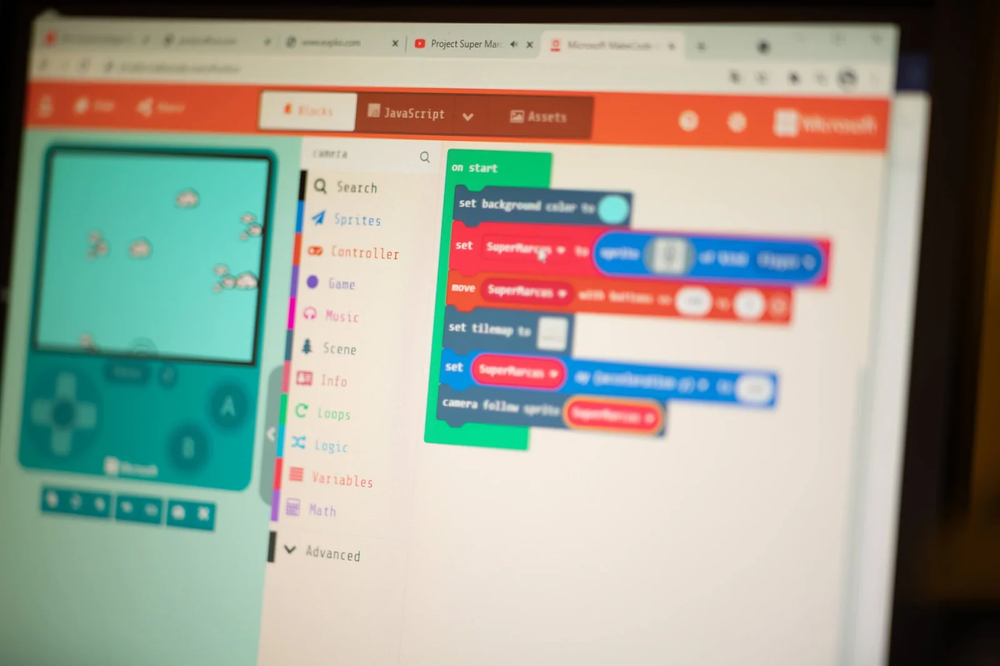
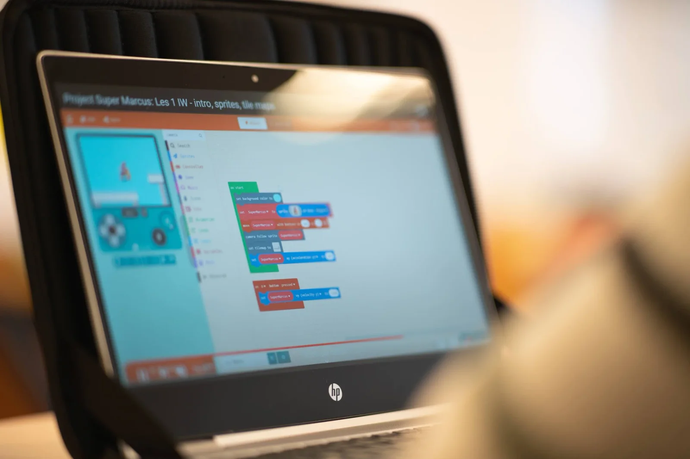
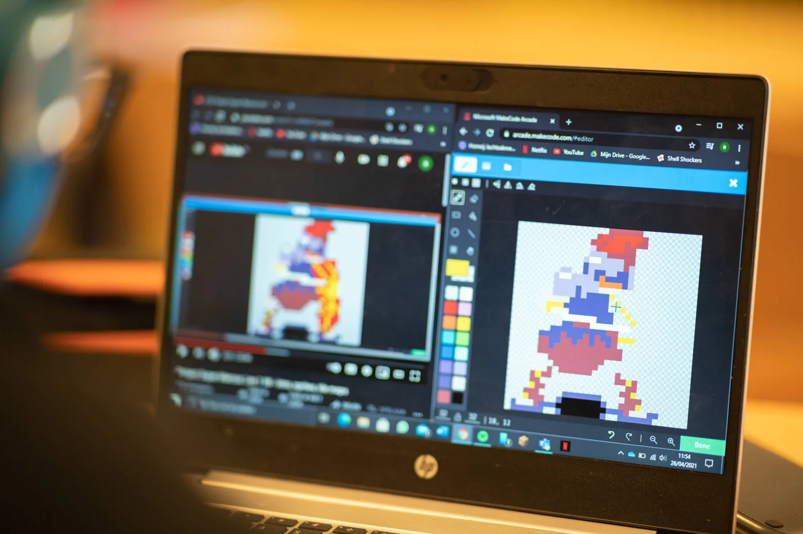
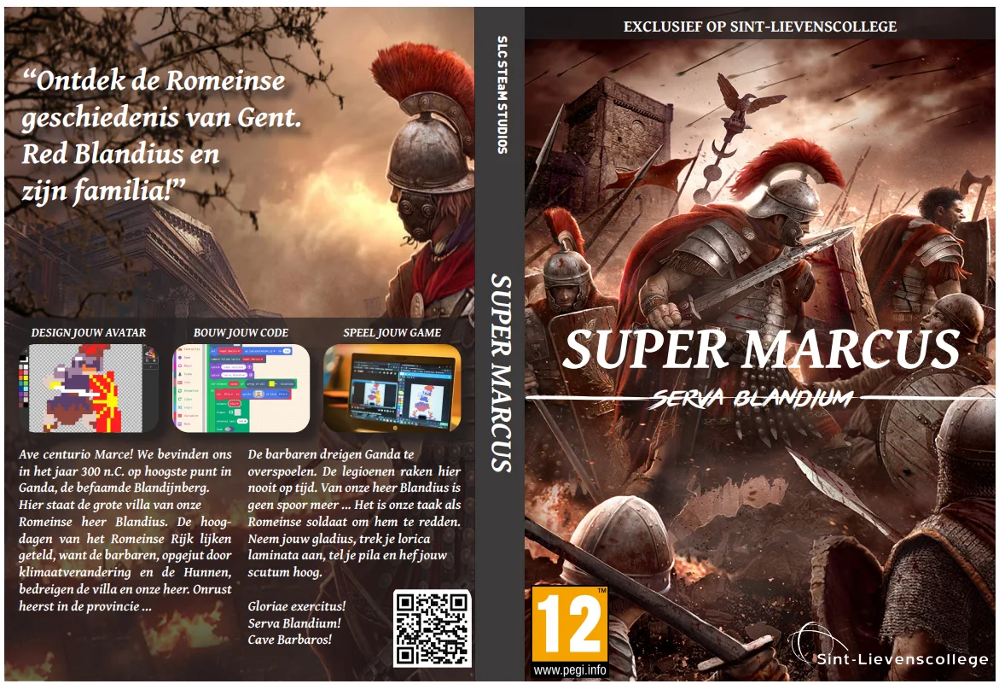

[Video on YouTube](https://www.youtube.com/watch?v=OdJOX-qU9QM)

### Ganda, 300 n.C.

We bevinden ons in het jaar 300 n.C. op hoogste punt in Gent (Ganda), de Blandijnberg. Daar staat de grote villa van de Romeinse heer Blandinius. De hoogdagen van het Romeinse Rijk lijken geteld, want de barbaren, opgejut door klimaatverandering en de hunnen, bedreigen de villa en onze heer. Het is onze taak, als Romeinse soldaat genaamd Super Marcus, om hem te redden. Welkom bij **Project Super Marcus!**

Tot daar de geschiedkundige en Latijnse achtergrond van dit project waarin we onze eigen game ontwikkelen! Binnenin de ontwikkelomgeving MakeCode bouwen we, met JavaScript, onze eigen platform-game.

In dit vakoverschrijdend project leer je meer over het Romeinse leger, de Latijnse cultuur, de geschiedenis van Gent, computationeel denken en programmeren.

### Vakoverschrijdend project

Dit is een vakoverschrijdend project die kennis en vaardigheden uit de lessen **ICT**, **programmeren**, **geschiedenis** en **Latijn** combineert. Tijdens dit project krijgen leerlingen ook de kans om samen te werken met leerlingen uit een andere richting.

Dit project heeft als doel dat de leerlingen meer leren over de geschiedenis van Gent, de cultuur van de Romeinen en hedendaagse computervaardigheden. Dit kunnen ze volledig digitaal doen!

### Waarom en hoe?

Dit project bestaat uit zeven lessen. Een les Latijn, een les geschiedenis en vijf lessen programmeren. We maken gebruik van o.a. de MakeCode - omgeving van Microsoft om de game te maken. Deze game kan gespeeld worden op de computer, maar ook geïnstalleerd worden op kleine gameconsoles.

### Resultaten uit de klas!

Leerlingen leren de vaardigheden om, binnen een gegeven context en achtergrond, een game te maken. Hierna kunnen ze deze vaardigheden verder gebruiken om een eigen game te ontwerpen!

[Video on YouTube](https://www.youtube.com/watch?v=mtVEjSB3-Tk)

[Video on YouTube](https://www.youtube.com/watch?v=yVgRABtoDFI)

[Video on YouTube](https://www.youtube.com/watch?v=woPtWQ3KaZw)

[Video on YouTube](https://www.youtube.com/watch?v=ulY6xzpMJGo)

### Zelf aan de slag!

Dit project bestaat uit een zevental lessen. Deze zijn ook beschikbaar als videolessen (opgenomen tijdens de eerste lockdown). Les 1 kan je hieronder meepikken!

[Video on YouTube](https://www.youtube.com/watch?v=MNKZ7oJka0U)

### Speel de Super Marcus game!

Klik op de afbeelding om de game te starten!

### Vragen, opmerkingen …

Vragen of opmerkingen over dit project of een van mijn andere projecten? Dan kan je hieronder terecht!

<a class="content-button content-button--primary content-button--medium" href="/contact">Meer informatie</a>

