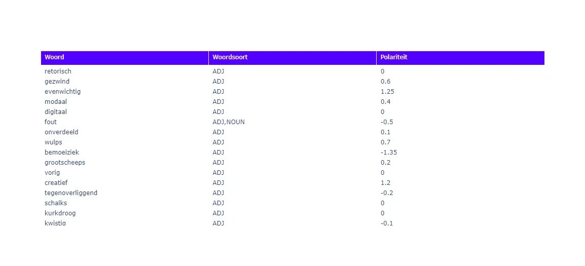
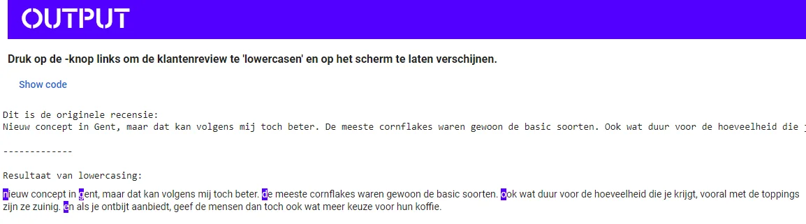
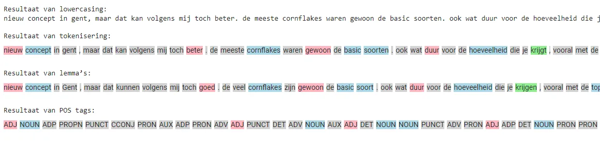
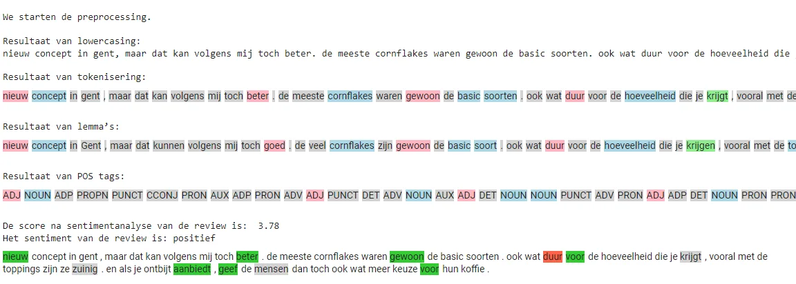
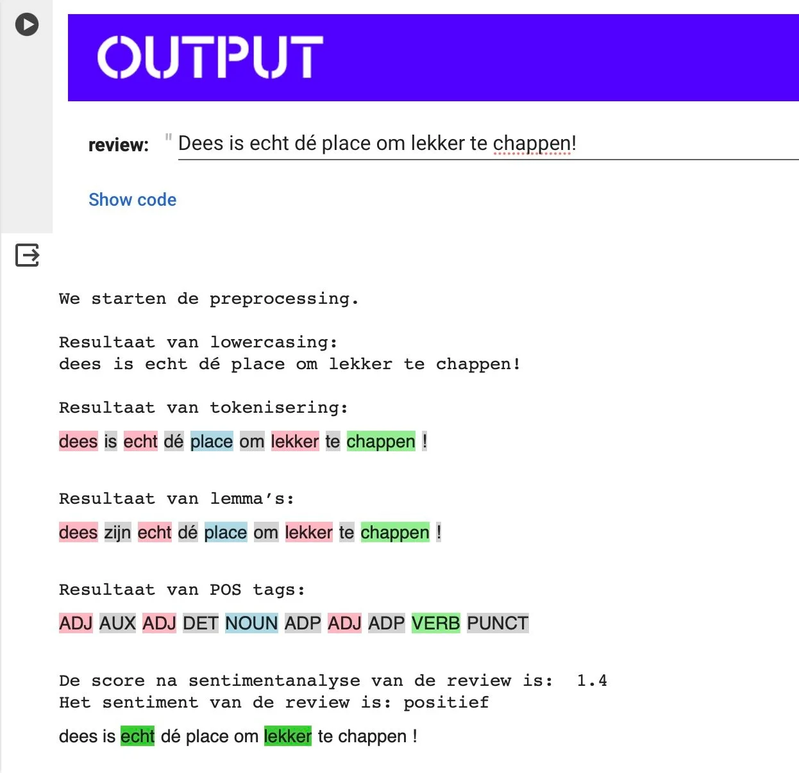
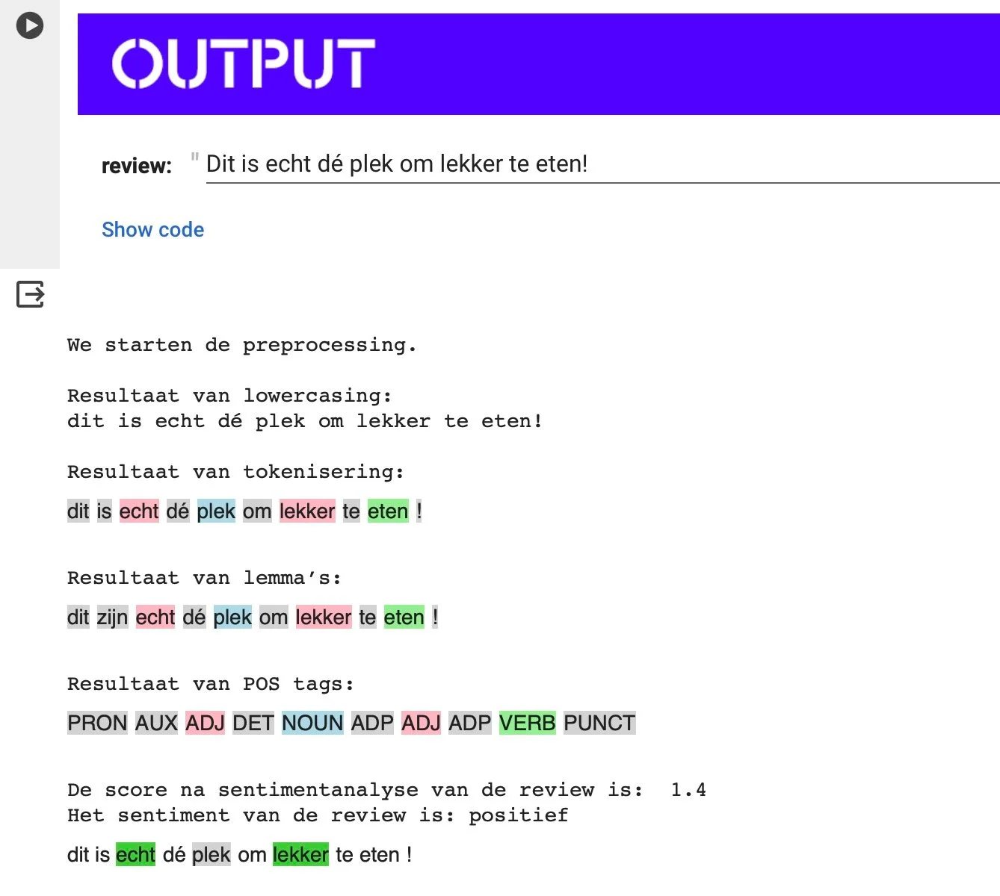
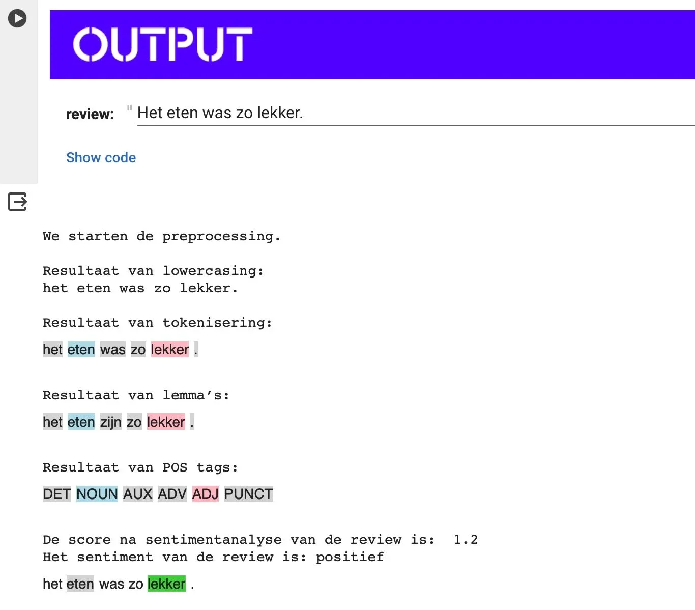
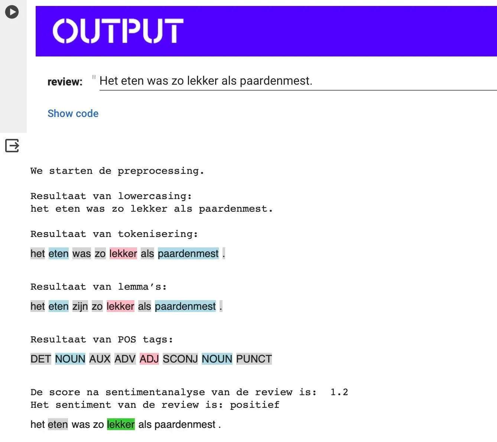

**Al jaren verdiepen computerwetenschappers zich in de complexiteit van menselijke taal, van vroege filosofische experimenten zoals de Turing Test en het 'Chinese Room Experiment' tot regelgebaseerde chatbots. Eind 2022 markeerde een keerpunt met de introductie van ChatGPT, een geavanceerde taaltechnologie die diverse sectoren tot reflectie aanzette. Maar moderne computers gaan verder dan alleen tekstgeneratie; ze zijn ook bekwaam in het analyseren van teksten. In dit artikel duiken we in deze tak van taaltechnologie. We starten klein met het analyseren van restaurantrecensies, verhogen dan de complexiteit met het beoordelen van (zelfgeschreven) sollicitatiebrieven, en verkennen tenslotte sentimentanalyse in sociale media commentaren. Ga met ons mee op deze 'drie-traps raket' reis, ontdek hoe deze technologieën onze taal en toekomst vormgeven en waarom we best die ‘human in the loop’ en talige vakkennis behouden. We starten eenvoudig met het analyseren van één recensie en een bestaande woordenlijst.** 


### Hoe kijkt een computer naar tekst?

Wanneer we het willen hebben over sentimentsanalyse, moeten we eerst stilstaan bij hoe computers “taal lezen”. Terwijl mensen tekst interpreteren door middel van context, emotie en taalnuances, benaderen computers tekst op een fundamenteel andere manier. In de wereld van computationele tekstverwerking worden teksten voorgesteld als **strings**, een **reeks van karakters die door de computer kunnen worden geanalyseerd en verwerkt**. Deze strings zijn voor de computer niets meer dan data: letters, cijfers en symbolen die op een objectieve manier worden bekeken, zonder de subjectieve interpretatie die mensen er van nature aan geven. Dit **verschil in benadering** vormt de kern van sentimentanalyse en andere vormen van tekstverwerking door computers. Ze **missen de menselijke inslag** van emotieherkenning, maar **compenseren dit met het vermogen om grote hoeveelheden tekst snel en consistent te analyseren.**

print("Hoi, ik ben zo een string. Aangename kennismaking!")

In de wereld van programmeren is een tekst niets meer dan een string, een reeks van karakters zoals letters, leestekens en spaties. Strings zijn eenvoudig te herkennen: ze staan altijd tussen aanhalingstekens, ofwel dubbele " " of enkele ' '. Belangrijk is om consequent te blijven in het gebruik van één soort aanhalingsteken; een mix is niet toegestaan! Om een string zichtbaar te maken op een computerscherm, gebruiken programmeurs een speciale tool genaamd een functie. Een veelgebruikte functie hiervoor is `print()`. Wanneer je `print('Ik geef de bediening een acht op tien, maar het eten was zeker een tien waard!')` intypt, vertel je de computer om de zin tussen de aanhalingstekens op het scherm weer te geven. In dit geval is 'Ik geef de bediening een acht op tien, maar het eten was zeker een tien waard!' de string die we zichtbaar maken.

### Pre-processing of voorbereiding

Nu we begrijpen hoe een string werkt en hoe we deze kunnen weergeven met de `print()` functie, laten we eens kijken naar de volgende stap in dit project, namelijk het **preprocessing**. **Preprocessing** is een cruciale fase waarin ruwe tekst, oftewel onze strings, wordt **omgezet in een formaat dat geschikt is voor analyse door een computermodel.** Dit omvat taken zoals het verwijderen van overbodige spaties, leestekens scheiden van woorden, en het omzetten van alle tekens naar eenzelfde formaat, zoals kleine letters. Dit is vergelijkbaar met het voorbereiden van ingrediënten voor het koken: net zoals je groenten snijdt en kruiden klaarzet, zo bereid je ook tekst voor om te 'koken' in de machine voor sentimentanalyse. Deze stap is essentieel, omdat het de basis legt voor de computer om nauwkeurig en efficiënt het **sentiment in een tekst te beoordelen.** Maar om zo een tekst te kunnen beoordelen, moet de computer een **lexicon** krijgen. 

### Wat is een lexicon?

Dit lexicon, een gigantische woordenlijst, specifiek ontworpen voor sentimentanalyse, bevat duizenden woorden, waarbij elk woord een polariteitswaarde heeft die loopt van -2 tot +2. Deze waarden zijn een maatstaf voor de emotionele toon van de woorden: -2 duidt op een sterk negatieve emotie, 0 is neutraal, en +2 betekent een sterk positieve emotie. Dit lijkt op het eerste zicht vreemd, maar onthoud dat een computer taal niet _begrijpt_ zoals wij mensen dat doen. De betekenis en de waarde van woorden is een vreemd concept voor computers.



Met behulp van dit **lexicon** kan de computer de emotionele lading van de gehele tekst systematisch evalueren. Het is daarbij **cruciaal dat de woorden in de te analyseren tekst exact overeenkomen met hoe ze in het lexicon staan vermeld.** Deze overeenstemming zorgt ervoor dat de computer, met de beschikbare rekenkracht, de polariteitswaarden snel en correct kan toewijzen en zo een nauwkeurige sentimentanalyse kan uitvoeren. Maar woorden in een tekst staan nu eenmaal niet in hun woordenboekvorm … Dus we zullen de tekst moeten voorbereiden voordat onze razendsnelle computer deze kan analyseren. Dit zullen we doen aan de hand van een aantal stappen, namelijk: 

-   Lowercasing

-   Tokeniseren

-   Part-of-speech-tagging

-   Lemmatisering

### Lowercasing

Voor een effectieve sentimentanalyse moet de computer onze tekst kunnen vergelijken met de informatie in het **lexicon**. Een belangrijke stap hierbij is het verwijderen van hoofdletters, bekend als 'lowercasing'. In het Nederlands gebruiken we hoofdletters voor eigennamen en aan het begin van zinnen. Hoewel dit grammaticaal correct is, kan het voor een computer verwarring veroorzaken.

Neem bijvoorbeeld de zinnen '**Lekker** was het eten zeker.' en 'Het eten was zeker **lekker**.'

Hoewel beide zinnen dezelfde betekenis hebben, varieert het gebruik van de hoofdletter 'L' in het woord 'lekker'. Voor een consistente analyse moeten we daarom de tekst omzetten naar alleen kleine letters. Dit proces van lowercasing (tegenovergesteld van 'uppercase', wat hoofdletters betekent) helpt om de tekst te standaardiseren, waardoor de computer effectiever kan zoeken in het lexicon.

We nemen de volgende recensie: “_Nieuw concept in Gent, maar dat kan volgens mij toch beter. De meeste cornflakes waren gewoon de basic soorten. Ook wat duur voor de hoeveelheid die je krijgt, vooral met de toppings zijn ze zuinig. En als je ontbijt aanbiedt, geef de mensen dan toch ook wat meer keuze voor hun koffie.”_



### Tokeniseren

Wanneer wij een woord zien, interpreteert de computer dit als een reeks karakters, ofwel een string. Bij het analyseren van teksten is het echter nodig om de zinsstructuur te doorbreken, zodat de computer elk woord afzonderlijk kan analyseren. Dit proces helpt om woorden van leestekens te scheiden, waardoor duidelijk wordt dat een leesteken geen onderdeel is van het woord zelf. Dit leidt echter tot uitdagingen, omdat woorden vaak hun betekenis ontlenen aan de context van de zin. Neem bijvoorbeeld de zinnen _'Het eten was lekker'_ en _'Het eten was_ **_niet_** _lekker.'_ Hoewel de woorden grotendeels hetzelfde zijn, verandert de toevoeging van 'niet' de betekenis volledig. Bij het analyseren van taal op woordniveau, zoals computers doen, kan deze nuance verloren gaan. Dit vormt een significante beperking van de technologie, een aspect waar zowel taalkundigen als informaticawetenschappers zich van bewust moeten zijn.

Na het tokeniseren ziet onze tekst er als volgt uit:

```
['nieuw', 'concept', 'in', 'gent', ',', 'maar', 'dat', 'kan', 'volgens', 'mij', 'toch', 'beter', '.', 'de', 'meeste', 'cornflakes', 'waren', 'gewoon', 'de', 'basic', 'soorten', '.', 'ook', 'wat', 'duur', 'voor', 'de', 'hoeveelheid', 'die', 'je', 'krijgt', ',', 'vooral', 'met', 'de', 'toppings', 'zijn', 'ze', 'zuinig', '.', 'en', 'als', 'je', 'ontbijt', 'aanbiedt', ',', 'geef', 'de', 'mensen', 'dan', 'toch', 'ook', 'wat', 'meer', 'keuze', 'voor', 'hun', 'koffie', '.']
```

### Part-of-speech-tagging

De kennis van de woordsoort waartoe een woord behoort, is cruciaal voor de volgende stap: lemmatisering. Dit proces transformeert woorden naar hun basisvorm, zoals die in het woordenboek staat. Bijvoorbeeld, het is belangrijk om te onderscheiden of '**spelen**' in een tekst fungeert als een **werkwoord** of als het **meervoud van het zelfstandig naamwoord 'spel'**. Deze onderscheiding is niet alleen noodzakelijk voor efficiënt opzoeken in het lexicon, maar ook omdat de betekenis en emotionele lading van een woord kan variëren afhankelijk van de woordsoort.

### Lemmatisering

Nadat de woorden zijn ontdaan van hoofdletters, losgemaakt van leestekens en geïdentificeerd naar woordsoort, komt de laatste stap: **lemmatiseren**. Voor een snelle en efficiënte zoekopdracht in het lexicon is het van groot belang dat de woorden in hun basisvorm, oftewel woordenboekvorm, worden omgezet. Dit betekent dat we vervoegde of verbogen woorden terugbrengen naar hun oorspronkelijke vorm: bijvoorbeeld, 'was' wordt 'zijn' en 'steaks' wordt 'steak'. Zo zorgen we ervoor dat elk woord in de meest standaard en herkenbare vorm wordt gepresenteerd.

"**Het eten was lekker” wordt zo: “‘het’, ‘eten’, ‘zijn’, ‘lekker’, ‘.’”**

Wanneer we alle stappen na elkaar nemen krijgen we volgende:



### Som van individuele scores

Samenvattend, het preprocessing-proces van tekstanalyse bestaat uit verschillende essentiële stappen. We beginnen met het zuiveren van de tekst door het **verwijderen van hoofdletters** en het **scheiden van woorden van leestekens.** Vervolgens **identificeren we de woordsoorten** en voeren **lemmatisering** uit om de **woorden naar hun basisvorm terug te brengen**.

Met deze voorbereide tekst gebruiken we vervolgens de computationele rekenkracht om elk woord of token te analyseren. Hier komt het **lexicon** in het spel, waarbij de **polariteit van elk afzonderlijk woord wordt bepaald**. Door de **polariteitswaarden van alle woorden op te tellen, verkrijgen we uiteindelijk een totaalscore die de algemene sentimentwaarde van de hele recensie weergeeft.** Zo transformeert een complexe reeks van computationele stappen ruwe tekst in een begrijpelijke sentimentanalyse, waarbij we vanuit individuele woorden een volledig beeld van de tekst kunnen schetsen.



In bovenstaande voorbeeld berekent de computer de polariteit van elk woord en telt de scores op. Woorden die positief bijdragen, worden in het groen gekleurd. Negatieve woorden krijgen de rode kleur. De slotsom is 3.78, dus een positieve recensie!

### Voila, objectiviteit door automatisatie! Toch …?

De aanpak van sentimentanalyse door middel van computationele methoden en lexicons heeft enkele duidelijke beperkingen die het noodzakelijk maken om nog **steeds een menselijke factor, of 'human in the loop', te betrekken.** Hier zijn drie significante beperkingen:

1.  **Contextgevoeligheid**: Een van de grootste uitdagingen is het vermogen van computers om de context van tokens of woorden te begrijpen. Wanneer woorden los van hun context worden geanalyseerd, kan de werkelijke betekenis verloren gaan. Bijvoorbeeld, een woord kan verschillende betekenissen of sentimenten hebben afhankelijk van de omliggende woorden of de algehele context van de zin. Zonder dit inzicht kan de sentimentanalyse misleidend zijn.

2.  **Omgaan met Negatie en Dubbelzinnigheid**: Computers hebben moeite met het correct interpreteren van negaties en dubbelzinnige zinsconstructies. Een zin als "Ik vond het **_niet_** slecht" kan bijvoorbeeld verkeerd worden geïnterpreteerd als een negatief sentiment, terwijl het in werkelijkheid een subtiele vorm van positiviteit uitdrukt. Het identificeren en correct interpreteren van dergelijke nuances blijft een uitdaging voor puur computationele methoden.

3.  **Ironie, Sarcasme en Figuurlijke Taal**: Ironie en sarcasme zijn bijzonder moeilijk te detecteren voor computers. Deze vormen van figuurlijk taalgebruik vereisen vaak een diepgaand begrip van culturele context, toon en de onderliggende betekenis achter de woorden. Bovendien zijn computers niet altijd in staat om bij te blijven met de constante evolutie van taal, zoals het gebruik van nieuwe woorden, slang en jongerentaal (die ontbreken in hun vast lexicon), wat de effectiviteit van sentimentanalyse verder beperkt.









**Deze beperkingen onderstrepen het belang van het behouden van menselijke betrokkenheid bij sentimentanalyse, vooral bij het interpreteren van complexe, subtiele of figuurlijke taaluitingen. Mensen kunnen nuances, context en culturele betekenissen begrijpen die voor computers vaak ontoegankelijk blijven.**

### Lesdoelen

Dit lesmateriaal is het eerste deel van een serie van drie lessen, gericht op het analyseren van recensies. In deze eerste les zullen we ons verdiepen in de basisconcepten en kennis die nodig zijn om te begrijpen hoe computers taal verwerken, een fundament van **natural** **language** **processing** **(NLP)**. Dit inzicht helpt ons niet alleen de mogelijkheden van deze technologie te verkennen, maar ook de beperkingen ervan te begrijpen.

Aan het einde van dit hoofdstuk zal de leerling in staat zijn om:

-   de werking en inhoud van een lexicon binnen de sentimentsanalyse duiden;

-   de stappen binnen de NLP duiden. Deze stappen zijn:

    -   tokenisering;

    -   lowercasing;

    -   part-of-speech-tagging;

    -   lemmatisering;

    -   polariteitsscore bepalen

-   Bovenstaande stappen duiden door deze zelf toe te passen op een heel kort stukje tekst.

-   Mogelijkheden van dit soort technologie in eigen woorden uitleggen;

-   Beperkingen van dit soort technologie in eigen woorden uitleggen.

### Leerplandoelen

Het leerplan dat logischerwijs het dichtst bij aansluit is het leerplan ‘Taalredactie en Taaltechnologie’ uit de component specifieke vorming binnen de studierichting ‘Moderne Talen’. Binnen dat leerplan komen verschillende vormen van taaltechnologie aan bod, maar specifiek verwijst men ook naar sentimentsanalyse als onderdeel binnen het ruim spectrum aan taaltechnologieën.

Volgende leerplandoelen en wenken kan je linken aan dit lesmateriaal (en de lesmaterialen die volgen op deze oefening rond het analyseren van recensies):

-   **LPD 2: De leerlingen analyseren hoe de context de betekenis van een taaluiting beïnvloedt.**

    -   Bovenstaand leerplandoel kan je koppelen aan het gegeven dat deze vorm van taaltechnologie de tekst opdeelt in tokens en deze een-voor-een, dus los van de bijhorende adjectieven, negaties, context … analyseert. Het ontbreken van de context is een van de beperkingen van deze vorm van taalanalyse.

-   **LPD 4: De leerlingen gaan kritisch om met taaltechnologische hulpmiddelen.**

    -   Een heel logische leerplandoelstelling om te koppelen aan dit lesmateriaal. Hier kan je het dus hebben over:

    -   de moeilijke verwerking van bijvoorbeeld beeldspraak doordat we tekst token per token analyseren;

    -   het nodige inzicht in hoe dit soort technologie een tekst verwerkt (in vergelijking met de menselijke tekstverwerking);

-   **LPD 5: De leerlingen lichten het maatschappelijke en wetenschappelijke belang van taaltechnologie toe.**

    -   Je kan leerlingen inzicht bieden in verschillende methodologieën en hun werking vanuit het perspectief van de gebruiker: binnen welke maatschappelijke en wetenschapsdomeinen zijn deze methodes inzetbaar, wat zijn **mogelijkheden** en **beperkingen** van een methode, ethische vragen bij inzetbaarheid …

    -    De leerlingen lichten toe hoe data-analyse of **sentimentanalyse** nuttige informatie kan opleveren voor politici, socio-culturele organisaties of bedrijven. Datascreening van sociale media kan leiden tot een ‘politieke barometer’ die aangeeft met welk sentiment er over een politicus of politieke partij wordt gecommuniceerd.
        Een ander voorbeeld is het **geautomatiseerd** **analyseren** **van** **tekstberichten**. Daardoor kan een bedrijf of organisatie zien hoe er over hun merk, product of dienst wordt gedacht en kunnen ze op basis van die gegevens voorspellen in welke richting de meningen zich verder ontwikkelen.

    -   Taaltechnologie kan via artificiële intelligentie haatberichten op sociale media traceren. De software past zichzelf bovendien voortdurend aan, want de retoriek evolueert.

-   **LPD 6: De leerlingen illustreren hoe taaltechnologie hen in hun werk als taalprofessional kan ondersteunen.**

    -   Deze technologie heeft naast beperkingen ook mogelijkheden. Zo biedt de computationele rekenkracht van natural language processors een schaalvoordeel. Zo zal deze technologie het mogelijk maken een betekenissen te halen uit grote datasets aan teksten en berichten. Leerlingen dienen oog te hebben voor de beperkingen en mogelijkheden.


### Benodigdheden

Dit lesmateriaal is ontworpen om eenvoudig in de klas te brengen. Om hieraan te voldoen houden we rekening met een drietal vereisten, namelijk:

-   **Lage** **hardwareisen**: de Python-code moet te draaien zijn op allerlei computers en toestellen en vergt dus geen grote investeringen van de school.

-   **Snelle** **uitvoer**: het uitvoeren van een opdracht met dit lesmateriaal moet lukken binnen één lesuur. Zo dienen er geen organisatorische aanpassingen te gebeuren (schuiven binnen een bestaand lessenrooster) om dit te doen slagen;

-   **Iedereen** **kan** **deelnemen**: doordat de code wordt uitgevoerd in de browser, kunnen alle leerlingen de opdracht uitvoeren. Menig pedagogisch expert kan je wel vertellen dat grotere groepjes leerlingen laten samenwerken aan één computer niet altijd de meeste leerwinst oplevert. Dit lesmateriaal kan uitgevoerd worden door elke leerling in de klasgroep op zijn/haar/hun eigen toestel.


Deel 2 van dit drieluik: hoe combineren we deze taaltechnologie met de arbeidsmarkt?

### Wat hierna?

Dit lesmateriaal is ontworpen als een soort drieluik. In dit eerste luik maakte je kennis met:

-   basisinzichten van sentimentsanalyse;

-   een lexicon;

-   tokenisering;

-   lowercasing;

-   part-of-speech-tagging;

-   lemmatisering;

-   polariteitsscore bepalen

In deze les hebben we ons gefocust op de basisprincipes van computer-taalverwerking, oftewel natural language processing (NLP). We hebben deze principes toegepast op een praktijkvoorbeeld: het analyseren van een enkele recensie met behulp van een bestaand lexicon.

In de volgende delen van deze driedelige serie zullen we de toepassingen en beperkingen van NLP binnen verschillende maatschappelijke domeinen onderzoeken. We gaan bijvoorbeeld kijken naar het gebruik van NLP in het wervingsproces op de arbeidsmarkt en bij het analyseren van haatberichten. **Bij elke volgende stap vergroten we de omvang van de analyse, hetzij door meer teksten te bekijken, hetzij door langere teksten te gebruiken. Ook zullen we evolueren van het gebruik van een kant-en-klaar lexicon naar een meer op maat gemaakt lexicon, waarbij de leerlingen steeds meer eigen input kunnen leveren.**


### Hoe breng ik dit in mijn klas?

Wil je hier zelf mee aan de slag in jouw klaslokaal? Super! Jongeren laten kennismaken met taalalgoritmen en taaltechnologie, zeker binnen een richting met focus op de moderne talen, is een belangrijk onderdeel. Via de knoppen hieronder kan je aansluiten bij onze Discord Community waar je dit en veel meer lesmateriaal kan downloaden!

<div class="content-button-row content-button-row--center"><a class="content-button content-button--primary content-button--medium" href="/contact">Uitgebreide Notebook</a></div>

## Nascholing?


Het lesmateriaal 'AI en Taaltechnologie: hoe breng je het effectief in de klas?' maakt deel uit van een nascholingsprogramma dat regelmatig wordt aangeboden door het Centrum Nascholing Onderwijs (CNO) van de Universiteit Antwerpen. Deze nascholing, die doorgaans plaatsvindt op de campus Boogkeers, heeft al meer dan 100 leerkrachten aangetrokken en is beoordeeld met een gemiddelde score van 4 uit 5.

Heeft u interesse om deze nascholing op uw school te organiseren? Dat is zeker mogelijk. Voor meer informatie over het aanbod en de organisatie van deze nascholing kunt u de onderstaande link raadplegen.

<div class="content-button-row content-button-row--center"><a class="content-button content-button--primary content-button--medium" href="https://cno.uantwerpen.be/nl/opleiding/ai-en-taaltechnologie-hoe-ga-je-er-effectief-mee-aan-de-slag-in-je-taalles-herhaling-1-79376" target="_blank" rel="noreferrer">Nascholing CNO</a></div>

<div class="content-button-row content-button-row--center"><a class="content-button content-button--primary content-button--medium" href="/onderwijs/workshops-en-nascholingen" target="_blank" rel="noreferrer">Naar info over nascholingen</a></div>
