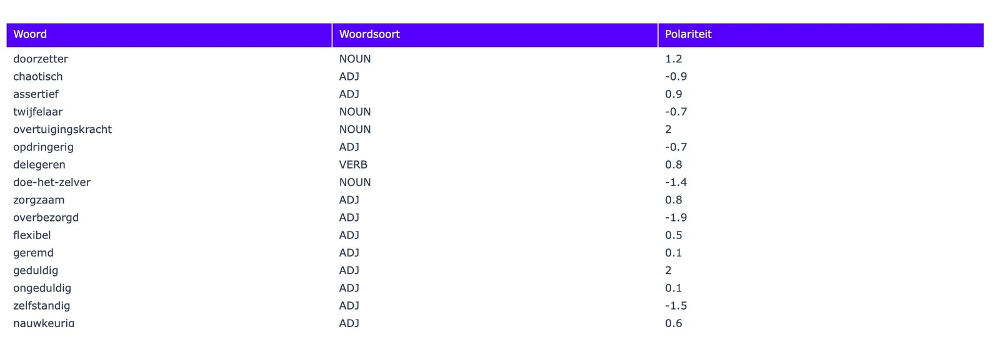
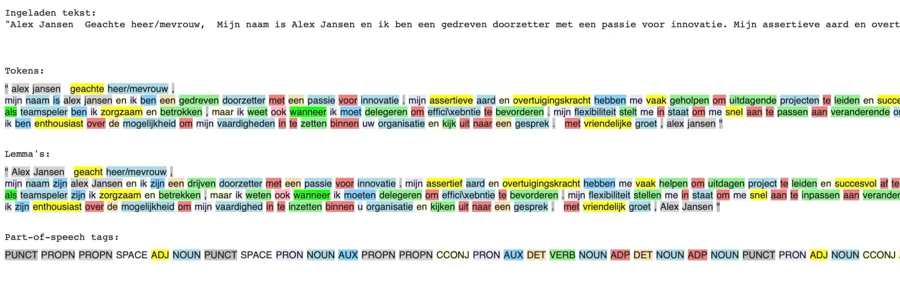
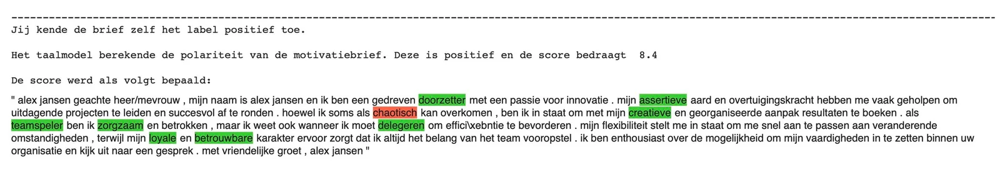
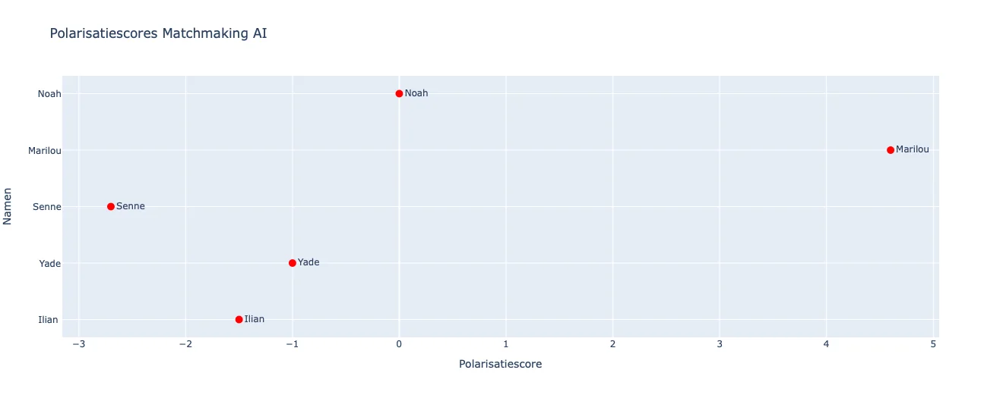
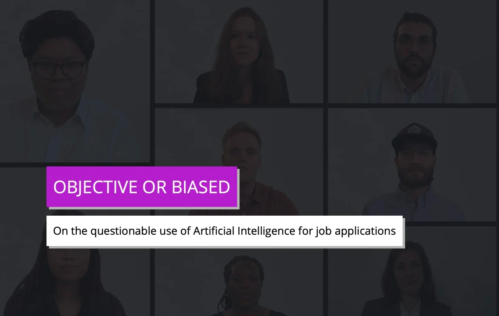
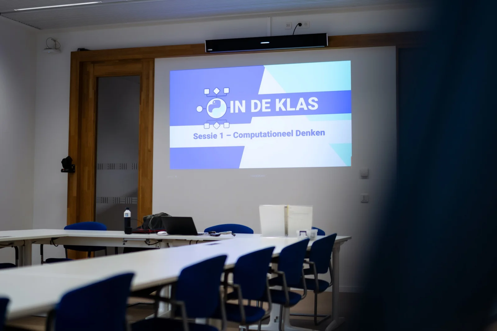

**Al jaren verdiepen computerwetenschappers zich in de complexiteit van menselijke taal, van vroege filosofische experimenten zoals de Turing Test en het 'Chinese Room Experiment' tot regelgebaseerde chatbots. Eind 2022 markeerde een keerpunt met de introductie van ChatGPT, een geavanceerde taaltechnologie die diverse sectoren tot reflectie aanzette. Maar moderne computers gaan verder dan alleen tekstgeneratie; ze zijn ook bekwaam in het analyseren van teksten. In dit artikel duiken we in deze tak van taaltechnologie. We starten klein met het analyseren van restaurantrecensies, verhogen dan de complexiteit met het beoordelen van (zelfgeschreven) sollicitatiebrieven, en verkennen tenslotte sentimentanalyse in sociale media commentaren. Ga met ons mee op deze 'drie-traps raket' reis, ontdek hoe deze technologieën onze taal en toekomst vormgeven en waarom we best die ‘human in the loop’ en talige vakkennis behouden. In dit artikel schakelen we naar level 2 uit dit lesmateriaal. Een level waarin we kijken hoe deze technologie kan toegepast worden bij het analyseren van sollicitatiebrieven … en waarom je maar best voldoende kritisch kijkt naar dit soort AI-oplossingen.**

Dit is het tweede deel van ons driedelige project. In [het eerste deel](/onderwijs/taalalgoritmes-en-sentimentsanalyse) heb je de grondbeginselen van sentimentanalyse en de werking van een ‘natural language processor’ verkend. Belangrijke stappen zoals tokenisering, lemmatisering en part-of-speech-tagging zouden nu duidelijk moeten zijn. We pasten deze toe om recensies van restaurants of bedrijven te analyseren met behulp van een bestaand lexicon.

In dit tweede deel breiden we de omvang van onze analyse uit, zowel qua tekstlengte als het aantal teksten. We focussen niet meer op een korte recensie, maar op een zelfgeschreven motivatiebrief - een onderwerp dat veel voorkomt in de derde graad van het secundair onderwijs. Hierbij introduceren we een aangepast lexicon, gebaseerd op concepten van het arbeidsmarktbureau Tempo Team. Met deze benadering analyseren we de motivatiebrieven van leerlingen en voorzien deze van een score. De hoogst scorende brieven, bepaald door onze computermodellen, worden geselecteerd voor een vervolggesprek. Dit brengt ons bij de vraag: is dit een ideale en objectieve methode, of zijn er beperkingen?

### Aangepast Lexicon

In dit tweede deel van het project is het nodig om een aangepast lexicon te creëren. In plaats van een standaard lexicon dat bijna alle woorden bevat, zullen we werken met een meer gespecialiseerd en beperkt lexicon dat specifiek is voor deze taak. Dit nieuwe lexicon stelt ons in staat om elementen zoals de woorden, hun woordsoorten en de polariteitswaarden naar behoefte aan te passen.

We laten ons hierbij inspireren door [een lijst met trefwoorden en eigenschappen van het uitzendbureau Tempo Team.](https://www.tempo-team.nl/sollicitatie/eigenschappen) Deze trefwoorden, vaak gebruikt in motivatie- en sollicitatiebrieven, waren onderdeel van hun eerdere trainingen. We zullen deze trefwoorden voorzien van een **woordsoort-tag** en een **polariteit**. Beide waarden kunnen aangepast worden.

### Stappen van de preprocessing (herhaling)

Wanneer we willen dat een computer tekst analyseert, is het noodzakelijk om de tekst voor te bereiden. Zoals we in het eerste deel van dit lesmateriaal zagen, interpreteert een computer taal anders dan mensen. Om de tekst toegankelijk te maken voor de computer, dienen we deze aan te passen, inclusief het toevoegen van strategische spaties en het uitvoeren van tokenisering. Dit maakt het voor de computer mogelijk om de tekst efficiënt te lezen, te analyseren en te vergelijken met ons aangepaste lexicon. De stappen die de computer doorloopt, zijn:

-   Lowercasing

-   Tokenisering

-   Part-of-speech-tagging

-   Lemmatisering

Voor meer gedetailleerde informatie over wat er bij elke stap gebeurt en waarom deze noodzakelijk zijn, verwijs ik je naar het eerste deel van ons lesmateriaal.

### Invoeren van onze motivatiebrief

Voor dit artikel maken we gebruik van een vrij eenvoudige motivatiebrief. Dit lesmateriaal leent zich echter uitstekend om te gebruiken binnen een uitgewerkt taalcurriculum waarin leerlingen eerste leren over de bouwstenen van een goede brief, er zelf een schrijven, vergelijken … Waardoor ze binnen dit lesproject aan de slag kunnen gaan met hun eigen brief en die van de klasgenoten. Steekt dit soort opdracht nog niet in jouw curriculum? Dan krijg je hieronder een voorbeeldopgave mee! 

-   ### Voorbeeldopdracht Motivatiebrief + AI

    -   1) Bespreek met leerlingen het waarom van een vacature en een motivatiebrief. Duid ook enkele goede en slechte voorbeelden. Zoek zo naar de ingrediënten van een goede brief.

    -   2) Laat leerlingen een vacature opzoeken via bestaande databanken. Deze vacature dient aan te sluiten bij hun talenten, interesses en studierichting.

    -   3) Laat leerlingen de tekst van de online vacature gebruiken, in combinatie met bv. ChatGPT, om een motivatiebrief te schrijven.

    -   4) Gebruik dit AI-gegenereerd voorbeeld om te laten herwerken door de leerling. Voeg persoonlijke kenmerken en talenten toe. Herschrijf aan de hand van de evaluatiecriteria (=ingrediënten) uit de eerste stap. De aanpassingen die de leerling aanbrengt duidt de leerling aan met kleur.

    -   5) Verdeel de brieven onder de andere leerlingen in de klas. Wissel uit en geef zo peer feedback aan de hand van de op voorhand bepaalde criteria.

Wij starten voor  deze opdracht van deze eenvoudige voorbeeldbrief: 

"Alex Jansen Geachte heer/mevrouw, Mijn naam is Alex Jansen en ik ben een gedreven doorzetter met een passie voor innovatie. Mijn assertieve aard en overtuigingskracht hebben me vaak geholpen om uitdagende projecten te leiden en succesvol af te ronden. Hoewel ik soms als chaotisch kan overkomen, ben ik in staat om met mijn creatieve en georganiseerde aanpak resultaten te boeken. Als teamspeler ben ik zorgzaam en betrokken, maar ik weet ook wanneer ik moet delegeren om efficiëntie te bevorderen. Mijn flexibiliteit stelt me in staat om me snel aan te passen aan veranderende omstandigheden, terwijl mijn loyale en betrouwbare karakter ervoor zorgt dat ik altijd het belang van het team vooropstel. Ik ben enthousiast over de mogelijkheid om mijn vaardigheden in te zetten binnen uw organisatie en kijk uit naar een gesprek. Met vriendelijke groet, Alex Jansen"

### Motivatiebrief analyseren

Wanneer we deze brief voorbereiden, dus de hoofdletters weghalen, tokeniseren … bekomen we onderstaande resultaat. Hier zie je duidelijk de veranderingen binnen de tekst tussen de verschillende stappen. Je leest de kleurcodes het best van onder naar boven. Dit wil zeggen dat de kleuren bepaald worden door de **woordsoort** van het woord. Deze woordsoorten vinden we bij de ‘part-of-speech tags’. Hier kritisch naar kijken kan helpen om de eerste duidelijke fouten en beperkingen van deze taaltechnologie op te sporen. Bepaalde eigennamen, jongerentaal, nieuwe woorden, neologismen … kent het taalmodel niet en zullen soms een verkeerde tag krijgen!

Vervolgens berekenen we de polariteitswaarde van de brief. Dit doen we door het computermodel de verwerkte brief naast ons lexicon te leggen. Woorden die bijdragen tot een **positieve score** zullen een **groene kleur** krijgen. Omgekeerd krijgen woorden met een **negatieve score** een **rode kleur**. Zo krijg je snel en eenvoudig een overzicht van welke woorden in de brief bepalend waren voor het eindresultaat.

### Meerdere brieven analyseren

De kracht computermodellen zit hem niet alleen in het snel kunnen analyseren van data, maar ook het kunnen visualiseren van de resultaten. Zo kunnen we de scores van verschillende brieven naast elkaar leggen en via een grafiek tonen welke kandidaten we weerhouden of welke niet.

### Maatschappelijke Relevantie

Gefeliciteerd! Na deze twee lesprojecten (analyseren van recensies en motivatiebrieven) hebt u met succes een taalmodel, lexicon en competenties van de arbeidsmarkt samengebracht om de computer te laten helpen bij het selecteren van teamleden aan de hand van hun zelfgeschreven motivatiebrieven.

Dit roept wellicht de vraag op: "_Wordt deze technologie al gebruikt in de arbeidsmarkt?_" Het antwoord is ja. Er wordt geëxperimenteerd door zowel grote als kleine bedrijven, met name in Duitsland en de VS, waar AI steeds vaker wordt ingezet voor het beoordelen van motivatiebrieven en interviews. Deze streven naar objectiviteit is prijzenswaardig, vooral omdat er bij menselijke beoordelaars vaak onbewuste vooroordelen spelen.

Toch is het **uiterst** **belangrijkheid** dat dit streven naar objectiviteit gepaard gaat met **kennis** **en** **transparantie**. Het is cruciaal om ons af te vragen: meet de AI daadwerkelijk wat we willen meten? En kunnen we zijn beoordelingen echt als objectief beschouwen?

### Amazon

Een bekend experiment in dit domein werd uitgevoerd door Amazon, waarbij een AI-systeem werd ontwikkeld om sollicitaties voor programmeerfuncties te beoordelen. Dit systeem werd getraind met gegevens van bestaande medewerkers om een specifiek lexicon en een 'gewenste-waarden-profiel' te ontwikkelen. Na verloop van tijd werd echter geconstateerd dat de AI voornamelijk kandidaten selecteerde die overeenkwamen met de demografische kenmerken van het huidige personeelsbestand - overwegend witte mannen van ongeveer 30 jaar. Dit wees op een onbedoelde bias: aangezien het getraind was op basis van een homogene groep, reproduceerde het de bestaande demografische samenstelling. Bovendien bleek dat het systeem mannelijke voornaamwoorden positief en vrouwelijke voornaamwoorden negatief beoordeelde, wat aantoont hoe bestaande maatschappelijke vooroordelen onbewust in AI-systemen kunnen infiltreren.

Dit voorbeeld toont duidelijk het belang van inzicht in dergelijke systemen, kennis en transparantie aan en behoedt ons van een misplaatst gevoel van objectiviteit dat vaak rondom deze technologie hangt. Maar er zijn nog dergelijke voorbeelden te vinden!

### Hoe robuust is AI-videosollicitatie dan?

Een team van Duitse journalisten heeft in Beieren een onderzoek uitgevoerd naar de objectiviteit van een AI-systeem dat video-interviews beoordeelt ([zie hier](https://interaktiv.br.de/ki-bewerbung/en/)). Hun bevindingen waren opmerkelijk. Zo ontdekten ze dat de score van de sollicitant veranderde als deze een bril droeg of voor een achtergrond zat die een boekenkast voorstelde (denk aan een Teams-achtergrond).

-   Bij het testen van de beoordeling van het Engelsniveau voerden ze twee experimenten uit:

-   Eerst beantwoordde de journalist de vragen in het Engels, wat resulteerde in een score van 8.5 uit 9.

-   Vervolgens las de journalist een Duitse Wikipedia-pagina voor over psychoanalyse, wat een score van 6 uit 9 opleverde.

Opmerkelijk genoeg kreeg de journalist zelfs bij het spreken van de verkeerde taal nog steeds een hoge score. Dit roept de vraag op: hoe objectief beoordeelt de AI werkelijk het niveau van Engels? Voor meer informatie over dit en soortgelijke experimenten, luister naar de uitstekende podcast uit de MIT-reeks 'In Machines We Trust'.

### Belgisch voorbeeld

De opkomst van AI-technologie in de zoektocht naar nieuwe medewerkers is niet beperkt tot het buitenland; ook in België zien we deze ontwikkelingen. Bijvoorbeeld, sommige Belgische bedrijven zetten de chatfunctie van ChatGPT in om motivatiebrieven te analyseren, feedback te geven of een beoordelingsscore toe te kennen. Deze aanpak heeft gemengde reacties opgeroepen, waaronder kritiek van informaticawetenschapper Jeroen Baert.

Hoewel het gebruik van AI met als doel discriminatie te verminderen nobel is en de eerste resultaten bemoedigend lijken, roept de overmatige afhankelijkheid van deze technologie - die vaak niet volledig wordt begrepen - en het gebrek aan transparantie vanuit de ontwikkelaars vragen op.

Meer informatie over hoe deze technologie binnen België wordt ingezet kan je hier lezen.

### Fouten in onze eigen aanpak

De aanpak binnen dit educatieve project kent ook zijn beperkingen, met name door de 'bag-of-words'-methode. Bij deze methode worden de woorden los van hun context behandeld. Dit betekent dat een brief vol met ik-vormen en grammaticale fouten dezelfde score kan behalen als een beter geschreven brief, omdat de AI zich vooral richt op specifieke kernwoorden uit het lexicon en de bredere context negeert. Deze smalle benadering van tekstinterpretatie moet in overweging genomen worden bij het gebruik van dergelijke tools in sollicitatieprocessen. Ze kunnen dienen ter ondersteuning, maar zouden niet als enige factor in een belangrijke beslissing moeten worden gebruikt.

Deze oefening belicht echter wel de mogelijkheden van deze technologie, waar deze reeds wordt toegepast en de uitdagingen waar we ons bewust van moeten zijn.

**Objectiviteit en transparantie zijn essentieel!**

### Lesdoelen

Dit lesmateriaal is het tweede deel van een serie van drie lessen, gericht op het analyseren van motivatiebrieven bij een sollicitatie. In deze tweede les gebruiken we een aangepast, specifiek, lexicon voor deze opdracht. Dit lexicon combineerden we met zelfgeschreven motivatiebrieven. Door dit in te bedden in een bestaand curriculum waar het schrijven van dit soort brieven reeds is ingebed (en dit element dus te versterken), kunnen we volgende lesdoelen bereiken:

-   We herhalen de basisprincipes van computationele tekstanalyse;

-   We herhalen de stappen die de Natural Language Processor dient uit te voeren om de tekst klaar te maken voor analyse, namelijk:

    -   tokenisering

    -   lowercasing

    -   part-of-speech-tagging

    -   lemmatisering

-   We passen deze stappen toe op een zelfgeschreven stuk tekst (=de motivatiebrief);

-   We bepalen en ontwerpen een eigen lexicon waarbij we de gekozen woorden, woordsoorten en polariteitsscores zelf kunnen aanpassen;

-   Door dit toe te passen om een eigen tekst ontdekken we de mogelijkheden en beperkingen van dit soort AI-technologie.

-   Door deze ervaringen naast actuele voorbeelden te plaatsen, kan je de beperkingen en mogelijkheden ook op maatschappelijke schaal duiden.

### Leerplandoelen

Het leerplan dat logischerwijs het dichtst bij aansluit is het leerplan ‘Taalredactie en Taaltechnologie’ uit de component specifieke vorming binnen de studierichting ‘Moderne Talen’. Binnen dat leerplan komen verschillende vormen van taaltechnologie aan bod, maar specifiek verwijst men ook naar sentimentsanalyse als onderdeel binnen het ruim spectrum aan taaltechnologieën.

Volgende leerplandoelen en wenken kan je linken aan dit lesmateriaal:

**LPD 2: De leerlingen analyseren hoe de context de betekenis van een taaluiting beïnvloedt.**

-   Bovenstaand leerplandoel kan je koppelen aan het gegeven dat deze vorm van taaltechnologie de tekst opdeelt in tokens en deze een-voor-een, dus los van de bijhorende adjectieven, negaties, context … analyseert. Het ontbreken van de context is een van de beperkingen van deze vorm van taalanalyse. 

-   Bovenstaande kan je illustreren door een negatie te koppelen met een negatief kenmerk in een brief. “Ik ben niet ongeduldig” of “ik ben allesbehalve chaotisch” zijn moeilijk te interpreteren voor het AI-model en zullen dus niet de correcte score krijgen.

**LPD 4: De leerlingen gaan kritisch om met taaltechnologische hulpmiddelen.**

-   Door de ervaringen in deze en de vorige les krijgen leerlingen inzicht in de beperkingen van dit soort analyse.

-   Door de combinatie met de actuele voorbeelden kunnen we ook een groter, maatschappelijk, kader schetsen rondom deze klaservaring.

**LPD 5: De leerlingen lichten het maatschappelijke en wetenschappelijke belang van taaltechnologie toe.**

-   Je kan leerlingen inzicht bieden in verschillende methodologieën en hun werking vanuit het perspectief van de gebruiker: binnen welke maatschappelijke en wetenschapsdomeinen zijn deze methodes inzetbaar, wat zijn **mogelijkheden** en **beperkingen** van een methode, ethische vragen bij inzetbaarheid …

-   De leerlingen lichten toe hoe data-analyse of sentimentanalyse nuttige informatie kan opleveren voor politici, socio-culturele organisaties of **bedrijven**.

**LPD 6: De leerlingen illustreren hoe taaltechnologie hen in hun werk als taalprofessional kan ondersteunen.**

-   Deze technologie heeft naast beperkingen ook mogelijkheden. Zo biedt de computationele rekenkracht van natural language processors een schaalvoordeel. Zo zal deze technologie het mogelijk maken een betekenissen te halen uit grote datasets aan teksten en berichten. Leerlingen dienen oog te hebben voor de beperkingen en mogelijkheden.

### Benodigdheden

Dit lesmateriaal is ontworpen om eenvoudig in de klas te brengen. Om hieraan te voldoen houden we rekening met een drietal vereisten, namelijk:

-   **Lage** **hardwareisen**: de Python-code moet te draaien zijn op allerlei computers en toestellen en vergt dus geen grote investeringen van de school.

-   **Snelle** **uitvoer**: het uitvoeren van een opdracht met dit lesmateriaal moet lukken binnen één lesuur. Zo dienen er geen organisatorische aanpassingen te gebeuren (schuiven binnen een bestaand lessenrooster) om dit te doen slagen;

-   **Iedereen** **kan** **deelnemen**: doordat de code wordt uitgevoerd in de browser, kunnen alle leerlingen de opdracht uitvoeren. Menig pedagogisch expert kan je wel vertellen dat grotere groepjes leerlingen laten samenwerken aan één computer niet altijd de meeste leerwinst oplevert. Dit lesmateriaal kan uitgevoerd worden door elke leerling in de klasgroep op zijn/haar/hun eigen toestel.

### Wat hierna?

Dit lesmateriaal is ontworpen als een tweede deel in een drieluik. In deze les hebben we ons gefocust op het toepassen van de eerder geleerde basisprincipes op een zelfgeschreven tekst. Hierbij hebben we ook afscheid genomen van het kant-en-klare lexicon en dit ingeruild voor een lexicon waar wij, of de leerlingen, aanpassingen bij kunnen aanbrengen.

In het volgende deel van deze reeks vergroten we de diversiteit en aantal teksten terwijl we de grootte van het lexicon opnieuw verkleinen. We zullen dit namelijk toepassen op het analyseren van negatieve berichten op sociale media.

### Hoe breng ik dit in mijn klas?

Wil je hier zelf mee aan de slag in jouw klaslokaal? Super! Jongeren laten kennismaken met taalalgoritmen en taaltechnologie, zeker binnen een richting met focus op de moderne talen, is een belangrijk onderdeel. Via de knoppen hieronder kan je surfen naar onze Discord Community waar je dit lesmateriaal en veel meer kan vinden! 

<a class="content-button content-button--primary content-button--medium" href="/contact">Naar contact en de Discord!</a>

## Nascholing?

Het lesmateriaal 'AI en Taaltechnologie: hoe breng je het effectief in de klas?' maakt deel uit van een nascholingsprogramma dat regelmatig wordt aangeboden door het Centrum Nascholing Onderwijs (CNO) van de Universiteit Antwerpen. Deze nascholing, die doorgaans plaatsvindt op de campus Boogkeers, heeft al meer dan 100 leerkrachten aangetrokken en is beoordeeld met een gemiddelde score van 4 op 5.

Heeft u interesse om deze nascholing op uw school te organiseren? Dat is zeker mogelijk. Voor meer informatie over het aanbod en de organisatie van deze nascholing kunt u de onderstaande link raadplegen.

<a class="content-button content-button--primary content-button--medium" href="https://cno.uantwerpen.be/nl/opleiding/ai-en-taaltechnologie-hoe-ga-je-er-effectief-mee-aan-de-slag-in-je-taalles-herhaling-1-79376" target="_blank" rel="noreferrer">Nascholing CNO</a>

<a class="content-button content-button--primary content-button--medium" href="/onderwijs/workshops-en-nascholingen" target="_blank" rel="noreferrer">Info over Nascholingen</a>

