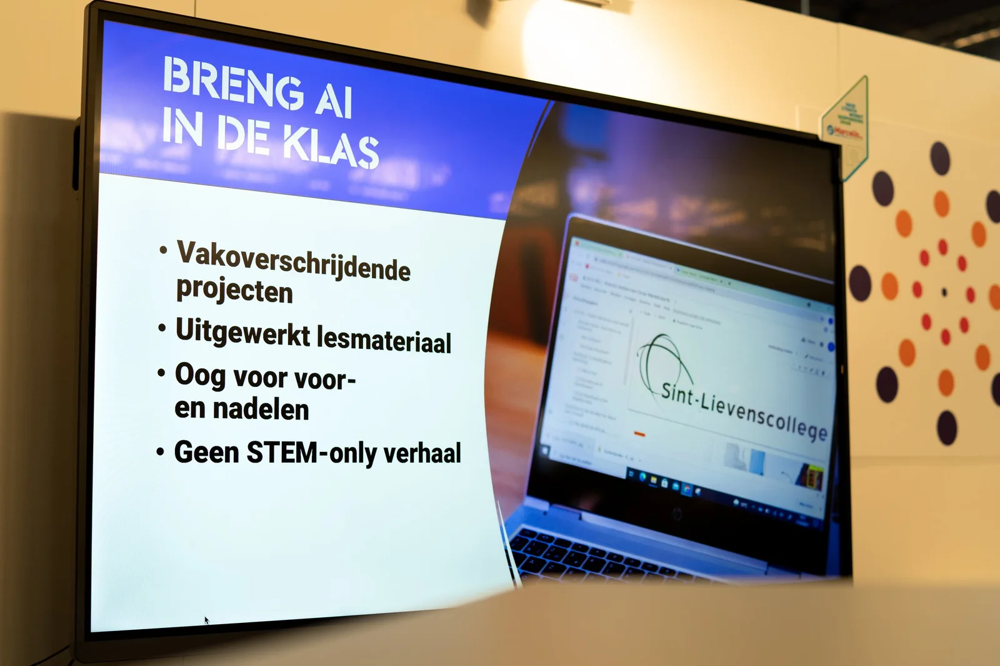

**Taalalgoritmes veroverden afgelopen schooljaar de media en de lerarenkamer. Generatieve artificiële intelligentie zoals ChatGPT kunnen je bijstaan bij het herwerken van teksten, opstellen van vraagstukken of voor leerlingen bij het stiekem maken van huistaken. Maar hoe kan je die nieuwe taaltechnologieën binnenbrengen in de klas of zelfs een redactie? Combineren met podcasting, redigeren van teksten, automatisch genereren van socialmediaposts? Dat kan via een eenvoudig samenspel van Python-code en verschillende AI-modellen. Om te onderzoeken of dat perfect verloopt of eerder een veredeld spelletje ‘chinees fluisteren’ blijkt, is een snuifje kritische onderzoeksjournalistiek nodig!**

[Video on YouTube](https://www.youtube.com/embed/4zh-AYSQ_7I?feature=oembed)

### Automatisch Transcriberen

We beginnen ons project bij een gekende uitdaging voor journalisten of makers van podcasts: het uitschrijven van een volledige transcriptie, een taak die best wat tijd kan vergen. Vaak komt het neer op aandachtig luisteren naar een audiofragment, pauzeren, noteren, terugspoelen … Rinse and repeat. Been there, done that and got the T-shirt.

Goed nieuws, dit is een repetitief karwei dat best eenvoudig te automatiseren valt door Python-code en AI-modellen! Het AI-model genaamd ‘Whisper’, ontwikkeld door OpenAI, kan een audiofragment inladen en, aan een tempo dat hoger ligt dan de menselijke verwerking, deze uitschrijven.

Dit audiofragment kan uit verschillende bronnen komen, namelijk:

-   **YouTube-videofragment**: een videofragment dat te vinden is via URL op de videosite YouTube. Dit videofragment wordt door een stukje Python-code gesplitst in twee delen: audio en video. Enkel het audiogedeelte wordt verwerkt door het Whisper-model.

-   **Via upload**: een bestand dat u staan heeft op uw eigen device. Dat kan een interview zijn dat een leerling heeft afgenomen, maar ook een stukje podcast dat ze hebben leren opnemen. U ziet, dit lesmateriaal is gemakkelijk te combineren met een lesproject rond podcasting.

-   **Audiofragment in de Notebook:** hierbij verwijzen we naar een pad binnen onze online Notebook om te laten verwerken.

### Beperkingen

-   **Tijdsduur**: wanneer je een fragment automatisch wil laten transcriberen via het Whisper-model, is het aangewezen om een fragment uit te zoeken dat minder dan 15 minuten duurt. Fragmenten die deze duurtijd overschrijden kunnen tegen een beperking in het werkgeheugen binnen de Notebook aanlopen, of meer tekens genereren dan de volgende stappen in onze sequentie kunnen verwerken.

-   **Fouten**: bij het verwerken van een audiospoor kan het gebeuren dat het AI-model bepaalde zaken verkeerd noteert. Dit komt vaker voor in het Nederlands, zeker wanneer verschillende personen door elkaar spreken of er omgevingslawaai te horen is. Soms zijn deze fouten dodelijk om een boodschap goed te begrijpen, soms slaagt het AI-model in de volgende stap er goed in om, ietwat gelijkend op de mens, toch de betekenis uit de tekst te halen. We moeten ons wel bewust zijn dat deze ‘ruis’ voor problemen kan zorgen!

### Voorbeeld:

In dit voorbeeld werd een videofragment van het YouTube-kanaal Kurzgesagt ingeladen in het AI-model. Door middel van Python-code werden het audio- en videospoor gescheiden, waarna Whisper het audiospoor omzette in tekst. Het is ook mogelijk om een Nederlandstalig audiofragment via Whisper direct om te zetten naar Engelstalige transcriptie, maar de resultaten zijn doorgaans wisselend.

[Video on YouTube](https://www.youtube.com/embed/wmP3MBjsx20?feature=oembed)

-   ### Resultaat transcriptie

    Mr. President, nuclear missiles will strike our country in 14 minutes.

    I know it's your first day in office, I'm going to walk you through it,

    but you're the only one who can authorize our nuclear retaliation in response

    and you've only got a few minutes to make a decision.

    As you know, tensions have escalated rapidly in the past few days.

    Today's Joint Allied Aerial Defense Exercise began just minutes before we detected the launch.

    A simple misunderstanding, maybe.

    We assume the sudden attack is meant to neutralize as many of our nuclear forces as possible.

    But that doesn't matter now, missiles are in the air and we can't shoot all of them down.

    Why? Because intercontinental ballistic missiles are basically rockets launched into space

    before re-entering the atmosphere over their targets and releasing many different warheads.

    Higher and faster than anything you can send after them.

    We need to get you to the bunker.

    Here's what we know.

    Four minutes ago, our new infrared monitoring satellites detected 112 bursts

    consistent with ICBM launches from the enemy's inner territories.

    For some reason, only 20 of their 80 underground nuclear silos seemed to have fired,

    so we suspect most of them were transporter erector launches.

    You know, trucks with big missiles on them.

    It's unclear why they didn't use all their silos.

    They might just not work after more than 30 years or they might be keeping them in reserve.

    The fog of war is keeping many things unclear.

    Aerospace Command thinks the ICBMs are targeting our nuclear command centers,

    silos and major air force and navy bases ending this war before we have a chance to act.

    The enemy's strategic doctrine prioritizes military targets and our nuclear weapons systems.

    But their secondary targets are our industry and infrastructure.

    All refineries, power stations and deep water ports.

    All located near or in major population centers.

    We won't know the exact casualty count for a few weeks.

    Deaths from the blast and burns may be a few million today.

    It's morning rush hour and there's not much to be done for people stuck in traffic.

    People in major metro areas can't really evacuate,

    but emergency broadcasts are being sent out to shelter in place and away from windows.

    Radiation exposure for intact population centers is highly dependent on the weather over the next week.

    We might be looking at dozens of millions of deaths by the end of the month.

    For the next few minutes we can still respond, but you need to decide.

    We've got 1,500 warheads across our silos, bombers and submarines.

    The 400 in silos need to be launched now before they get taken out.

    46 nuclear capable bombers on high alert can be ready to take off in two minutes,

    although we need to transmit the order right away to get them out of the blast radius

    if you want to consider using them.

    Of our 40 nuclear submarines, five are presently at sea.

    While they're submerged, they're undetectable,

    so that's our backup for a nuclear retaliation if we lose our silos and bombers.

    We could try to use them to bomb out their remaining silo fields before they can launch them.

    The sooner you commit to it, the better the chance we have of preventing a further exchange after our retaliation.

    Updates.

    We have radar confirmation that the enemy ICBMs have completed their burn and deployed their warheads.

    Our best guess is that each missile will deploy at least six re-entry vehicles,

    about 600 in total, which is the part that carries a warhead back into the atmosphere

    during its terminal descent onto the target,

    and with many more decoys on top of that,

    infatable balloons meant to waste any anti-missiles.

    We're now tracking nearly 4,000 potential targets.

    Our anti-ballistic missiles have been launched and will begin their intercept in another minute.

    We'll do our best to protect the capital, although there really is no defense.

    Wait, confirming a partial radar blackout, our systems seem to be glitchy.

    The enemy must have anticipated we'd launch our interceptors

    and predeterminate a few warheads at high altitude.

    That ionizes the atmosphere and creates radar interference.

    Our interceptors should still operate OK, they've had a 55% success rate in tests,

    but never with this many decoys, or with radar interference this intense.

    We might shoot down 50 objects, but there's no guarantee they're warheads.

    It looks like most bombs are going to get through.

    This is our last chance to counter-attack. We're out of time.

    Our silo launch sequence takes five minutes.

    We have to transmit and confirm a launch order,

    and the missile needs time to clear the blast radius of the incoming bomb.

    This is a lot to take in, but the war plan is made.

    You just need to enter the launch authorization codes

    and push this button to transmit them.

    You can't do anything else to save more of our people.

    If you don't launch now, then this war will be over before it even begins.

    You understand, this is our one chance, right?

    The effect.

    Enemy civilian casualties are hard to estimate, but should be similar to ours.

    A few million right away, perhaps a few tens of million by the end of the month.

    The total fallout from their attacks and ours might trigger a nuclear winter

    potentially killing billions around the world,

    but that might happen even if we don't retaliate.

    I'm sure you have questions, but you have to give orders without expecting answers right now.

    With an attack of this scale, there's no guarantee communications or assets

    will be intact in a few minutes.

    We're out of time. We need a decision, sir.

    Can we launch?

    Nuclear wars aren't regular wars.

    They only last minutes, and in times of crisis,

    small conflicts can rapidly spiral out of control.

    Anything from small communication lengths to sensor errors to just uncertainty in the fog of war

    mean that no leader will ever have a complete idea of what's happening as a crisis unfolds.

    When tensions are high, accidents or misunderstandings can steer leaders,

    even those with good intentions, to launch a nuclear attack.

    Confused and with incomplete information, a single person, yes,

    it's really just one single person who decides can literally make civilization-ending decisions

    killing hundreds of millions of people in the time it takes to watch a YouTube video.

    This story is fiction, but the world came very close to this several times.

    In 1995, Russian radar detected a submarine launch missile,

    and their nuclear forces went on full alert,

    except it was actually a scientific rocket to study auroras.

    In 1979, US computers reported a full-scale Soviet attack with only minutes to respond,

    except it was a training tape being incorrectly loaded into a computer.

    In 1983, the Soviet satellite alert system showed five ICBMs launched from the US,

    but it was a false alarm, caused by sunlight reflected on clouds.

    During the Cuban missile crisis, a Soviet submarine with no contact to Moscow for several days

    concluded that nuclear war had begun and decided to launch a nuclear torpedo.

    Luckily, the authorization of three officers was required.

    One of them, Vasily Ashipov, opposed it.

    But what if he hadn't?

    Any safeguard can fail no matter how carefully designed it might be.

    And decisions are being made right now to build new weapons and missile systems

    that commit the world to another century of nuclear stalemate,

    complicated further by China's emergence as a new nuclear superpower.

    Simply accepting that the existence of nuclear weapons is inevitable

    might mean their use is inevitable.

    But the world doesn't have to be this way.

    Even incremental steps taking apart one bomb at a time

    will eventually result in a world with none.

    During the Cold War, the world had over 70,000 nuclear weapons.

    Through arms reduction treaties, that number is now about 12,500.

    Progress is not guaranteed, but it's also not impossible.

    Governments and militaries are not separate from their nations,

    they're part of them, just like you.

    You have the power to make demands of your leaders

    and often this begins with just being aware of an issue.

## Transcriptie samenvatten

De volgende stap in ons proces is het samenvatten van het interview of de podcast. Ook dit proces kan best wat tijd vergen. Een letterlijke weergave van een podcastaflevering is niet hetzelfde als een samenvatting en vice versa.

Voor deze taak sturen we de transcriptie, die we maakten aan de hand van het Whisper-model, door naar ChatGPT. Deze spreken we aan via de **API** of **‘application programming interface’**. Dit is een soort achterdeur waardoor twee applicaties met elkaar kunnen spreken. Denk aan de integratie van jouw favoriete socialmedianetwerk in een bepaalde tool, of het direct kunnen uploaden van een video uit een videobewerkingsprogramma naar YouTube.

Via die API kunnen we het ChatGPT-model, opnieuw van OpenAI, twee **instructies** ofwel **prompts** meegeven als **input**, namelijk:

-   **Input**:

    -   een **instructie** voor het AI-model. Om deze instructie vorm te geven baseerde ik me op [onderzoek van de Universiteit van Colombia](https://arxiv.org/pdf/2309.04269.pdf) waar men onderzocht hoe GPT-tools gebruikt kunnen worden om samenvattingen te genereren. Ze onderzochten de ideale balans tussen **leesbaarheid** en de **dichtheid** van informatie en ontwikkelden daarom een prompt dat, **iteratief**, het model samenvattingen liet schrijven.

    -   de **transcriptie** die we hebben gemaakt via WhisperAI en wordt doorgestuurd door een variabele (= plaats in het geheugen van de computer waar we data, zoals een tekst, kunnen opslaan) te gebruiken via de API.

-   **Output**:

    -   een samenvatting geschreven via ChatGPT, rechtstreeks in de Notebook.

-   ### Input: Instructie

    Jij bent SamenvatterBot\_3000, een chatbot die automatisch Nederlandse samenvattingen kan maken van een gegeven transcriptie van een video of podcast. Het is jouw taak om een steeds beknoptere samenvatting te maken van het gegeven transcriptie, volgens een proces van twee stappen, vier keer opnieuw. In stap 1 identificeer je 1 tot 3 informatieve entiteiten uit de gegeven transcriptie die niet in de vorige samenvatting zijn opgenomen; deze moeten worden gescheiden door puntkomma's. Maak voor stap 2 een nieuwe samenvatting van identieke lengte die elk detail uit de vorige samenvatting plus de nieuwe geïdentificeerde entiteiten bevat. Elke entiteit moet relevant zijn voor het hoofdverhaal, specifiek maar beknopt (5 woorden of minder), nieuw, aanwezig in de transcriptie en kan overal in de transcriptie worden gevonden. Richtlijnen: De eerste samenvatting moet lang zijn (10-15 zinnen) maar vaag, met weinig informatie buiten de nieuwe entiteiten. Gebruik breedsprakige taal en opvullingen zoals "de transcriptie van de video bespreekt" om rond de 200 woorden te komen. Laat elk woord ertoe doen: herzie de vorige samenvatting om de doorstroming te verbeteren en plaats te bieden aan extra entiteiten. Creëer ruimte door ideeën samen te voegen, informatie te comprimeren en niet-informatieve zinnen zoals "de transcriptie bespreekt" te elimineren. De samenvattingen moeten een hoge dichtheid en beknoptheid krijgen en toch op zichzelf blijven staan, wat betekent dat ze kunnen worden begrepen zonder terug te verwijzen naar de transcriptie. Nieuwe entiteiten kunnen overal in de herziene samenvatting geplaatst worden. Laat nooit entiteiten uit de vorige samenvatting weg. Als de ruimte beperkt is, neem dan minder nieuwe entiteiten op. Zorg ervoor dat elke samenvatting exact hetzelfde aantal woorden bevat. Een samenvatting bevat een inleiding, midden en slot. Duid deze delen aan door de signaalwoorden INLEIDING, MIDDEN en SLOT te gebruiken.

-   ### Input: Transcriptie

    Mr. President, nuclear missiles will strike our country in 14 minutes.

    I know it's your first day in office, I'm going to walk you through it,

    but you're the only one who can authorize our nuclear retaliation in response

    and you've only got a few minutes to make a decision.

    As you know, tensions have escalated rapidly in the past few days.

    Today's Joint Allied Aerial Defense Exercise began just minutes before we detected the launch.

    A simple misunderstanding, maybe.

    We assume the sudden attack is meant to neutralize as many of our nuclear forces as possible.

    But that doesn't matter now, missiles are in the air and we can't shoot all of them down.

    Why? Because intercontinental ballistic missiles are basically rockets launched into space

    before re-entering the atmosphere over their targets and releasing many different warheads.

    Higher and faster than anything you can send after them.

    We need to get you to the bunker.

    Here's what we know.

    Four minutes ago, our new infrared monitoring satellites detected 112 bursts

    consistent with ICBM launches from the enemy's inner territories.

    For some reason, only 20 of their 80 underground nuclear silos seemed to have fired,

    so we suspect most of them were transporter erector launches.

    You know, trucks with big missiles on them.

    It's unclear why they didn't use all their silos.

    They might just not work after more than 30 years or they might be keeping them in reserve.

    The fog of war is keeping many things unclear.

    Aerospace Command thinks the ICBMs are targeting our nuclear command centers,

    silos and major air force and navy bases ending this war before we have a chance to act.

    The enemy's strategic doctrine prioritizes military targets and our nuclear weapons systems.

    But their secondary targets are our industry and infrastructure.

    All refineries, power stations and deep water ports.

    All located near or in major population centers.

    We won't know the exact casualty count for a few weeks.

    Deaths from the blast and burns may be a few million today.

    It's morning rush hour and there's not much to be done for people stuck in traffic.

    People in major metro areas can't really evacuate,

    but emergency broadcasts are being sent out to shelter in place and away from windows.

    Radiation exposure for intact population centers is highly dependent on the weather over the next week.

    We might be looking at dozens of millions of deaths by the end of the month.

    For the next few minutes we can still respond, but you need to decide.

    We've got 1,500 warheads across our silos, bombers and submarines.

    The 400 in silos need to be launched now before they get taken out.

    46 nuclear capable bombers on high alert can be ready to take off in two minutes,

    although we need to transmit the order right away to get them out of the blast radius

    if you want to consider using them.

    Of our 40 nuclear submarines, 5 are presently at sea.

    While they're submerged, they're undetectable,

    so that's our backup for a nuclear retaliation if we lose our silos and bombers.

    We could try to use them to bomb out their remaining silo fields before they can launch them.

    The sooner you commit to it, the better the chance we have of preventing a further exchange after our retaliation.

    We have radar confirmation that the enemy ICBMs have completed their burn and deployed their warheads.

    Our best guess is that each missile will deploy at least 6 reentry vehicles,

    about 600 in total, which is the part that carries a warhead back into the atmosphere

    during its terminal descent onto the target,

    and with many more decoys on top of that,

    infatable balloons meant to waste any anti-missiles.

    We're now tracking nearly 4,000 potential targets.

    Our anti-ballistic missiles have been launched and will begin their intercept in another minute.

    We'll do our best to protect the capital, although there really is no defense.

    Wait, confirming a partial radar blackout, our systems seem to be glitchy.

    The enemy must have anticipated we'd launch our interceptors

    and predeterminate a few warheads at high altitude.

    That ionizes the atmosphere and creates radar interference.

    Our interceptors should still operate okay, they've had a 55% success rate in tests,

    but never with this many decoys, or with radar interference this intense.

    We might shoot down 50 objects, but there's no guarantee they're warheads.

    It looks like most bombs are going to get through.

    This is our last chance to counterattack. We're out of time.

    Our silo launch sequence takes 5 minutes.

    We have to transmit and confirm a launch order,

    and the missile needs time to clear the blast radius of the incoming bomb.

    This is a lot to take in, but the war plan is made.

    You just need to enter the launch authorization codes and push this button to transmit them.

    You can't do anything else to save more of our people.

    If you don't launch now, then this war will be over before it even begins.

    You understand, this is our one chance, right?

    The effect.

    Enemy civilian casualties are hard to estimate, but should be similar to ours.

    A few million right away, perhaps a few tens of million by the end of the month.

    The total fallout from their attacks and ours might trigger a nuclear winter,

    potentially killing billions around the world, but that might happen even if we don't retaliate.

    I'm sure you have questions, but you have to give orders without expecting answers right now.

    With an attack of this scale, there's no guarantee communications or assets will be intact in a few minutes.

    We're out of time. We need a decision, sir.

    Can we launch?

    Nuclear wars aren't regular wars.

    They only last minutes, and in times of crisis, small conflicts can rapidly spiral out of control.

    Anything from small communication lengths to sensor errors to just uncertainty in the fog of war

    mean that no leader will ever have a complete idea of what's happening as a crisis unfolds.

    When tensions are high, accidents or misunderstandings can steer leaders,

    even those with good intentions, to launch a nuclear attack.

    Confused and with incomplete information, a single person, yes, it's really just one single person who decides,

    can literally make civilization-ending decisions, killing hundreds of millions of people in the time it takes to watch a YouTube video.

    This story is fiction, but the world came very close to this several times.

    In 1995, Russian radar detected a submarine launch missile, and their nuclear forces went on full alert,

    except it was actually a scientific rocket to study auroras.

    In 1979, US computers reported a full-scale Soviet attack with only minutes to respond,

    except it was a training tape being incorrectly loaded into a computer.

    In 1983, the Soviet satellite alert system showed five ICBMs launched from the US,

    but it was a false alarm, caused by sunlight reflected on clouds.

    During the Cuban missile crisis, a Soviet submarine with no contact to Moscow for several days

    concluded that nuclear war had begun and decided to launch a nuclear torpedo.

    Luckily, the authorization of three officers was required.

    One of them, Vasily Ashipov, opposed it.

    But what if he hadn't?

    Any safeguard can fail no matter how carefully designed it might be.

    And decisions are being made right now to build new weapons and missile systems

    that commit the world to another century of nuclear stalemate,

    complicated further by China's emergence as a new nuclear superpower.

    Simply accepting that the existence of nuclear weapons is inevitable

    might mean their use is inevitable.

    But the world doesn't have to be this way.

    Even incremental steps taking apart one bomb at a time

    will eventually result in a world with none.

    During the Cold War, the world had over 70,000 nuclear weapons.

    Through arms reduction treaties, that number is now about 12,500.

    Progress is not guaranteed, but it's also not impossible.

    Governments and militaries are not separate from their nations,

    they're part of them, just like you.

    You have the power to make demands of your leaders

    and often this begins with just being aware of an issue.

    If you want to learn more, we've compiled a number of resources for you

    in the video description and our sources.

    This video was supported by Open Philanthropy.

    Did you know that there are countless more Kurzgesagt videos

    that we upload on TikTok, YouTube Shorts and Instagram Reels,

    bite-sized information, animated facts and inspiring thought experiments.

    After all, you also need videos you can watch quickly in a bathroom break.

    Our longer, more in-depth videos are happening here on YouTube.

    Short form is a completely different challenge

    that we're trying to do as well as possible.

    Check them out if you're curious.

    And if you want to discuss and share your thoughts about science

    with other like-minded people, why don't you check out

    our Discord community with over 80,000 verbs.

    We have channels where you can chat about STEM topics,

    participate in events and the academic question of the week.

    And we have the best emotes.

    After all, we want to spark your curiosity,

    but it's always more fun to be curious together.

    See you over there.

-   ### Output: Samenvatting

    INLEIDING: De president wordt geconfronteerd met een dreigende nucleaire aanval en moet snel beslissen over een vergeldingsactie.

    De vijand heeft intercontinentale ballistische raketten gelanceerd en er is weinig tijd over om te reageren.

    De president heeft informatie ontvangen over het aantal gelanceerde raketten en mogelijke doelwitten.

    MIDDEN: De vijand heeft 112 ICBM-lanceringen gedetecteerd, maar slechts 20 van hun 80 ondergrondse nucleaire silo's zijn afgevuurd.

    Het is onduidelijk waarom ze niet al hun silo's hebben gebruikt.

    De vijand richt zich op onze nucleaire commandocentra, silo's en belangrijke luchtmacht- en marinebases.

    Ze hebben ook onze industrie en infrastructuur als secundaire doelen.

    Er worden nooduitzendingen gedaan om mensen te waarschuwen om te schuilen en weg te blijven van ramen.

    De exacte dodentallen zullen pas over enkele weken bekend zijn, maar het kan in de miljoenen lopen.

    De president heeft verschillende opties om te reageren, waaronder het lanceren van nucleaire raketten vanuit silo's, bommenwerpers en onderzeeërs.

    SLOT: De president moet snel beslissen of hij tot actie wil overgaan.

    Als er niet wordt gereageerd, zal de oorlog snel voorbij zijn en zullen er enorme verliezen zijn.

    Het is een angstaanjagende verantwoordelijkheid om een nucleaire oorlog te beslissen, maar het is belangrijk om te beseffen dat zelfs kleine misverstanden of fouten tot grote rampen kunnen leiden.

    Het is mogelijk om de wereld te veranderen en nucleaire wapens te verminderen, maar dit vereist bewustzijn en actie van individuen.

## Van samenvatting naar social media!

We gingen al van het ene medium naar het andere (audio naar tekst) en van de ene tekstsoort naar de andere (transcriptie naar samenvatting). Maar een samenvatting is nu eenmaal niet zo eenvoudig te posten op sociale media zoals Instagram, TikTok of de microblogsite X (voorheen Twitter, thanks Elon …). Daarvoor gaan we, opnieuw via een AI-model, onze samenvatting omzetten naar een post voor sociale media. Met dit medium en deze tekstsoort zijn de leerlingen doorgaans goed vertrouwd.

We nemen het voorbeeld van een TikTok-post. Die zijn heel kort en krachtig, bevatten veel emoji’s zodat ze goed opvallen en doorgaans ook een ‘call to action’. Een oproep aan je volgers om mee te doen. We voeren hier een vergelijkbare stap uit als bij de vorige opdracht.

-   ### Input: Instructie

    Schrijf een interessante social media post voor TikTok. De doelgroep van de post zijn jongeren. Schrijf maximaal drie zinnen, gebruik veel emoji's en gebruik een duidelijke call to action.

-   ### Input: Samenvatting

    INLEIDING: De president wordt geconfronteerd met een dreigende nucleaire aanval en moet snel beslissen over een vergeldingsactie.

    De vijand heeft intercontinentale ballistische raketten gelanceerd en er is weinig tijd over om te reageren.

    De president heeft informatie ontvangen over het aantal gelanceerde raketten en mogelijke doelwitten.

    MIDDEN: De vijand heeft 112 ICBM-lanceringen gedetecteerd, maar slechts 20 van hun 80 ondergrondse nucleaire silo's zijn afgevuurd.

    Het is onduidelijk waarom ze niet al hun silo's hebben gebruikt.

    De vijand richt zich op onze nucleaire commandocentra, silo's en belangrijke luchtmacht- en marinebases.

    Ze hebben ook onze industrie en infrastructuur als secundaire doelen.

    Er worden nooduitzendingen gedaan om mensen te waarschuwen om te schuilen en weg te blijven van ramen.

    De exacte dodentallen zullen pas over enkele weken bekend zijn, maar het kan in de miljoenen lopen.

    De president heeft verschillende opties om te reageren, waaronder het lanceren van nucleaire raketten vanuit silo's, bommenwerpers en onderzeeërs.

    SLOT: De president moet snel beslissen of hij tot actie wil overgaan.

    Als er niet wordt gereageerd, zal de oorlog snel voorbij zijn en zullen er enorme verliezen zijn.

    Het is een angstaanjagende verantwoordelijkheid om een nucleaire oorlog te beslissen, maar het is belangrijk om te beseffen dat zelfs kleine misverstanden of fouten tot grote rampen kunnen leiden.

    Het is mogelijk om de wereld te veranderen en nucleaire wapens te verminderen, maar dit vereist bewustzijn en actie van individuen.

-   ### Output: TikTok Post

    🚨🌍💣 Hey jongeren! De wereld staat op het spel en de president moet NU beslissen over een nucleaire aanval! 😱🔥 We moeten ons bewust zijn van de gevolgen en actie ondernemen om nucleaire wapens te verminderen! 🙌💪 Wat kunnen wij doen om een positieve verandering teweeg te brengen? Laat het ons weten in de comments en laten we samen een verschil maken! 💙🌍 #NuclearAwareness #TakeAction #ChangeTheWorld

### Voila! Journalisten zonder werk … toch?

Toch niet! Doorheen dit lesproject verwerken we een audio- of videofragment door drie AI-modellen. Dit kan snelle resultaten opleveren, maar soms ook lijken op een spelletje ‘fluisteren’ bij de jeugdbeweging. Doordat elke verwerking informatie weglaat, verlies je ook een deel van de betekenis. Het zijn bovendien de individuele AI-modellen die beslissen welke elementen weggelaten worden, niet de mens. Dit kan ervoor zorgen dat de uiteindelijke boodschap, bijvoorbeeld die ‘call to action’, helemaal niet meer aansluit bij de originele betekenis van het videofragment. Zo kan het gebeuren dat vermelding van de sponsor van de video opduikt in de samenvatting en in de uiteindelijke social media post!

Vertrouw niet blindelings op de objectiviteit van AI-modellen, ook al werken deze op basis van kansberekening. Kijk kritisch naar de output, beluister het audiofragment toch zelf eens, lees de samenvatting na, herschrijf deze, controleer en herschrijf de socialmediapost voor je deze online gooit …

### Benodigdheden

Binnen dit lesproject kan je vrij ruim gaan in het lesmateriaal dat je gebruikt. Dit wordt vooral bepaald door het belang dat je zelf hecht aan het audiobestand en de kwaliteit ervan in het begin van ons proces. Dit kan een bestaande opname (van het internet) zijn, een opname in de klas of een opname waarvoor de leerlingen zelf een microfoon dienen te ontlenen. Dit bepaal je best zelf binnen het curriculum dat je uitbouwt binnen jouw school.

-   Microfoon via laptop, smartphone of extern;

-   Audiofragment of videofragment;

-   (School)laptop;

-   Notebook;

-   API-token voor ChatGPT van OpenAI.

Vooral deze laatste stap vergt wat werk en daarbij help ik je graag verder. Gebruik je dit liever niet, dan kan je alsnog gebruikmaken van de web interface van ChatGPT.

### Leerplandoelstellingen

Voor onderstaande selectie aan leerplandoelstellingen werd gekeken naar het ontwerpleerplan ‘Taaltechnologie en Taalredactie’ binnen de richting Moderne Talen in de doorstroomfinaliteit. Dit leerplan werd gemaakt binnen de koepelvereniging ‘Katholiek Onderwijs Vlaanderen’.

-   **LPD 1: De leerlingen herformuleren doelgericht schriftelijke en mondelinge teksten in functie van de doelgroep, kanaal of medium.**
    **Wenk**: binnen deze lesopdracht dienen leerlingen een prompt te formuleren voor de AI-modellen en te reflecteren over het resultaat. Wanneer ze een samenvatting willen vragen aan een AI-model, welke kenmerken heeft zo een tekst? Wat is de doelgroep van een TikTok-post? Wanneer de output op het scherm verschijnt, bevat dit dan alle gevraagde elementen? Zo neen, moeten ze deze herschrijven.

-   **LPD 2: De leerlingen analyseren hoe de context de betekenis van een taaluiting beïnvloedt.
    Wenk:** Je kan met de leerlingen stilstaan bij verschillende vormelementen die in een taaluiting gebruikt worden, bv. interpunctie, emoji’s, hoofdletters, klemtoon … en die de betekenis kunnen beïnvloeden, zoals bij het opstellen van de prompt voor de social media post en het evalueren van de output.

-   **LPD 3: De leerlingen redigeren schriftelijke teksten op taalgebruik, consistentie en doelgerichtheid.**
    **Wenk**: Bij het verwerken van een transcriptie kunnen fouten in de tekst sluipen. Bij het genereren van een samenvatting of social media post, kunnen inconsistente zinnen opduiken of kan de output het doel van de opdracht volledig missen. Vertrouw niet blindelings op de output van deze machines en herschrijf waar nodig!
    **Wenk:** Het is zinvol om de leerlingen vertrouwd te maken met de mogelijkheden van actuele technologische ontwikkelingen, zoals ondersteunende (ver)taalprogramma’s of -software. Leerlingen kunnen bij dit leerplandoel dan ook gepast taaltechnologische hulpmiddelen inzetten. Je kan de leerlingen uitnodigen om beschikbare hulpmiddelen kritisch in te zetten.

-   **LP4: De leerlingen gaan kritisch om met taaltechnologische hulpmiddelen.**
    **Wenk**: In dit lesmateriaal komen leerlingen in contact met twee verschillende taalalgoritmen binnen drie opdrachten. Telkens zal een computermodel beslissingen maken over welke de precieze tekstinhoud en -vorm. Het is belangrijk om de output steeds te toetsen aan voorafbepaalde doelen en tekstkenmerken. Controleer de inhoud! Dit veronderstelt vakkennis aan de kant van de leerling.
    **Wenk:** Bij schrijf- en uitspraakondersteuning en bij spraaktechnologie ontdekken leerlingen wat goed en minder goed werkt en in welke situatie het interessant kan zijn om taaltechnologie te gebruiken. Je kan een koppeling maken met taalredactie door bv. een gedicteerde tekst (zie ons audiospoor en het Whisper-model) te controleren.

-   **LPD 5: De leerlingen lichten het maatschappelijk en wetenschappelijk belang van taaltechnologie toe.
    Wenk:** De leerlingen lichten toe hoe taaltechnologie het grote publiek toegang kan bieden tot informatie, cultuur en entertainment, bv. automatische vertaling van webpagina’s van overheidsdiensten, automatische ondertiteling van plenaire debatten. Hier kan je het nut van taalalgoritmes zoals het gebruikte Whisper-model toelichten.

Aan dit lesmateriaal kunnen mogelijk nog meer leerplandoelstellingen gekoppeld worden, maar bovenstaande geeft alvast een duidelijke indicatie.

### Bonus: genereer automatisch toetsvragen!

In dit lesmateriaal, en het proces dat we samen met de leerlingen doorlopen, steekt ook een handige tool voor docenten. Het is namelijk mogelijk om de **prompt** of **instructie** voor het GPT-taalmodel dusdanig aan te passen om automatisch toetsvragen te genereren bij een audio- of videofragment. Uiteraard blijft de kritische reflectie nodig!

-   ### Input: Transcriptie

    Mr. President, nuclear missiles will strike our country in 14 minutes.

    I know it's your first day in office, I'm going to walk you through it,

    but you're the only one who can authorize our nuclear retaliation in response

    and you've only got a few minutes to make a decision.

    As you know, tensions have escalated rapidly in the past few days.

    Today's Joint Allied Aerial Defense Exercise began just minutes before we detected the launch.

    A simple misunderstanding, maybe.

    We assume the sudden attack is meant to neutralize as many of our nuclear forces as possible.

    But that doesn't matter now, missiles are in the air and we can't shoot all of them down.

    Why? Because intercontinental ballistic missiles are basically rockets launched into space

    before re-entering the atmosphere over their targets and releasing many different warheads.

    Higher and faster than anything you can send after them.

    We need to get you to the bunker.

    Here's what we know.

    Four minutes ago, our new infrared monitoring satellites detected 112 bursts

    consistent with ICBM launches from the enemy's inner territories.

    For some reason, only 20 of their 80 underground nuclear silos seemed to have fired,

    so we suspect most of them were transporter erector launches.

    You know, trucks with big missiles on them.

    It's unclear why they didn't use all their silos.

    They might just not work after more than 30 years or they might be keeping them in reserve.

    The fog of war is keeping many things unclear.

    Aerospace Command thinks the ICBMs are targeting our nuclear command centers,

    silos and major air force and navy bases ending this war before we have a chance to act.

    The enemy's strategic doctrine prioritizes military targets and our nuclear weapons systems.

    But their secondary targets are our industry and infrastructure.

    All refineries, power stations and deep water ports.

    All located near or in major population centers.

    We won't know the exact casualty count for a few weeks.

    Deaths from the blast and burns may be a few million today.

    It's morning rush hour and there's not much to be done for people stuck in traffic.

    People in major metro areas can't really evacuate,

    but emergency broadcasts are being sent out to shelter in place and away from windows.

    Radiation exposure for intact population centers is highly dependent on the weather over the next week.

    We might be looking at dozens of millions of deaths by the end of the month.

    For the next few minutes we can still respond, but you need to decide.

    We've got 1,500 warheads across our silos, bombers and submarines.

    The 400 in silos need to be launched now before they get taken out.

    46 nuclear capable bombers on high alert can be ready to take off in two minutes,

    although we need to transmit the order right away to get them out of the blast radius

    if you want to consider using them.

    Of our 40 nuclear submarines, 5 are presently at sea.

    While they're submerged, they're undetectable,

    so that's our backup for a nuclear retaliation if we lose our silos and bombers.

    We could try to use them to bomb out their remaining silo fields before they can launch them.

    The sooner you commit to it, the better the chance we have of preventing a further exchange after our retaliation.

    We have radar confirmation that the enemy ICBMs have completed their burn and deployed their warheads.

    Our best guess is that each missile will deploy at least 6 reentry vehicles,

    about 600 in total, which is the part that carries a warhead back into the atmosphere

    during its terminal descent onto the target,

    and with many more decoys on top of that,

    infatable balloons meant to waste any anti-missiles.

    We're now tracking nearly 4,000 potential targets.

    Our anti-ballistic missiles have been launched and will begin their intercept in another minute.

    We'll do our best to protect the capital, although there really is no defense.

    Wait, confirming a partial radar blackout, our systems seem to be glitchy.

    The enemy must have anticipated we'd launch our interceptors

    and predeterminate a few warheads at high altitude.

    That ionizes the atmosphere and creates radar interference.

    Our interceptors should still operate okay, they've had a 55% success rate in tests,

    but never with this many decoys, or with radar interference this intense.

    We might shoot down 50 objects, but there's no guarantee they're warheads.

    It looks like most bombs are going to get through.

    This is our last chance to counterattack. We're out of time.

    Our silo launch sequence takes 5 minutes.

    We have to transmit and confirm a launch order,

    and the missile needs time to clear the blast radius of the incoming bomb.

    This is a lot to take in, but the war plan is made.

    You just need to enter the launch authorization codes and push this button to transmit them.

    You can't do anything else to save more of our people.

    If you don't launch now, then this war will be over before it even begins.

    You understand, this is our one chance, right?

    The effect.

    Enemy civilian casualties are hard to estimate, but should be similar to ours.

    A few million right away, perhaps a few tens of million by the end of the month.

    The total fallout from their attacks and ours might trigger a nuclear winter,

    potentially killing billions around the world, but that might happen even if we don't retaliate.

    I'm sure you have questions, but you have to give orders without expecting answers right now.

    With an attack of this scale, there's no guarantee communications or assets will be intact in a few minutes.

    We're out of time. We need a decision, sir.

    Can we launch?

    Nuclear wars aren't regular wars.

    They only last minutes, and in times of crisis, small conflicts can rapidly spiral out of control.

    Anything from small communication lengths to sensor errors to just uncertainty in the fog of war

    mean that no leader will ever have a complete idea of what's happening as a crisis unfolds.

    When tensions are high, accidents or misunderstandings can steer leaders,

    even those with good intentions, to launch a nuclear attack.

    Confused and with incomplete information, a single person, yes, it's really just one single person who decides,

    can literally make civilization-ending decisions, killing hundreds of millions of people in the time it takes to watch a YouTube video.

    This story is fiction, but the world came very close to this several times.

    In 1995, Russian radar detected a submarine launch missile, and their nuclear forces went on full alert,

    except it was actually a scientific rocket to study auroras.

    In 1979, US computers reported a full-scale Soviet attack with only minutes to respond,

    except it was a training tape being incorrectly loaded into a computer.

    In 1983, the Soviet satellite alert system showed five ICBMs launched from the US,

    but it was a false alarm, caused by sunlight reflected on clouds.

    During the Cuban missile crisis, a Soviet submarine with no contact to Moscow for several days

    concluded that nuclear war had begun and decided to launch a nuclear torpedo.

    Luckily, the authorization of three officers was required.

    One of them, Vasily Ashipov, opposed it.

    But what if he hadn't?

    Any safeguard can fail no matter how carefully designed it might be.

    And decisions are being made right now to build new weapons and missile systems

    that commit the world to another century of nuclear stalemate,

    complicated further by China's emergence as a new nuclear superpower.

    Simply accepting that the existence of nuclear weapons is inevitable

    might mean their use is inevitable.

    But the world doesn't have to be this way.

    Even incremental steps taking apart one bomb at a time

    will eventually result in a world with none.

    During the Cold War, the world had over 70,000 nuclear weapons.

    Through arms reduction treaties, that number is now about 12,500.

    Progress is not guaranteed, but it's also not impossible.

    Governments and militaries are not separate from their nations,

    they're part of them, just like you.

    You have the power to make demands of your leaders

    and often this begins with just being aware of an issue.

-   ### Input: Instructie

    Jij bent ToetsBot en helpt bij het schrijven van toetsvragen om te gebruiken in het onderwijs. Je krijgt een transcriptie van een YouTube-video. Je gaat die doorlezen en verzint vijf vragen om te gebruiken in een klas vijftienjarigen. Bouw de moeilijkheidsgraad vraag per vraag op. Hou de instructie kort en bondig.

-   ### Output: Toetsvragen

    1\. Wat is de reden dat de president moet beslissen over een nucleaire vergelding?

    2\. Wat zijn de mogelijke doelwitten van de vijandelijke ICBM's?

    3\. Wat zijn de mogelijke gevolgen van een nucleaire oorlog?

    4\. Hoeveel nucleaire wapens zijn er momenteel in de wereld?

    5\. Wat kunnen individuen doen om nucleaire ontwapening te bevorderen?

### Ik wil dit in mijn klas! Wat moet ik doen?

**Wil je hier zelf mee aan de slag in jouw klaslokaal? Super! Jongeren laten kennismaken met taalalgoritmen en taaltechnologie, zeker binnen een richting met focus op de moderne talen, is een belangrijk onderdeel. Via de knop hieronder kan je aansluiten bij de Discord Community waar je dit en ander lesmateriaal kan vinden!**

<a class="content-button content-button--primary content-button--medium" href="/contact" target="_blank" rel="noreferrer">Naar de contact en Discord!</a>

