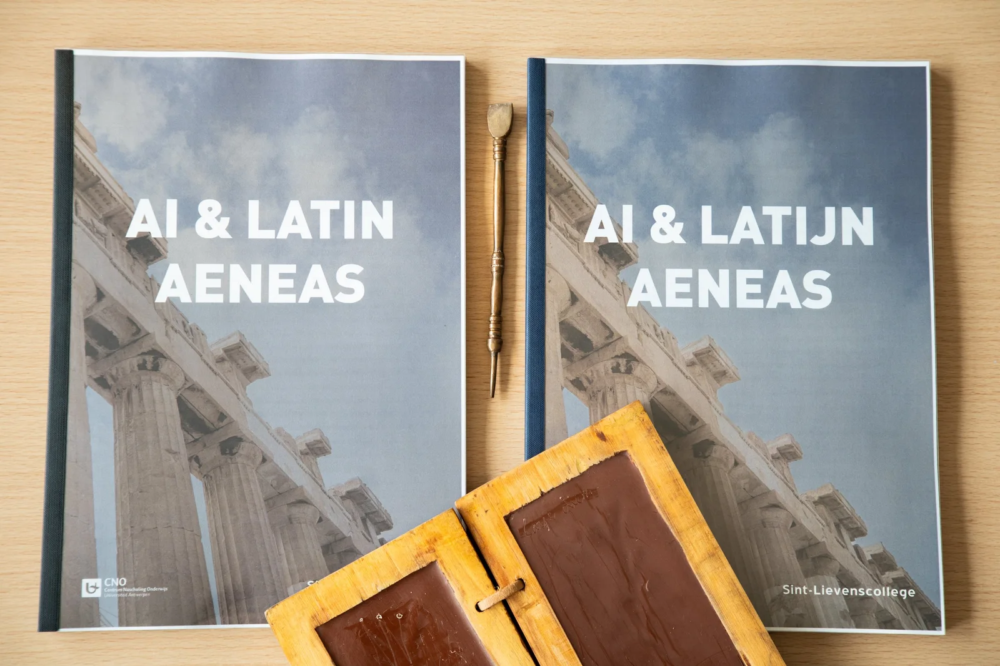

### De recente Digimeter van imec bewees het al: generatieve AI en specifiek taalmodellen zijn in Vlaanderen de snelst groeiende en meest breed toegepaste technologie van onze tijd. We gaan ermee aan de slag op het werk, maar ook in de klas is AI niet weg te denken. In een steeds sneller veranderend digitaal landschap is de vraag niet _of_ AI het (geschiedenis)onderwijs zal veranderen, maar eerder _hoe_ en _hoe we historici en docenten kunnen helpen_ om hun weg te vinden in dit nieuwe landschap. Maak kennis met Aeneas! Aeneas is een AI-model dat historici en classici helpt bij het contextualiseren en restaureren van Latijnse inscripties. Samen met dit AI-model lanceren we onze [onderzoeksresultaten in het wetenschapsblad Nature](https://www.nature.com/articles/s41586-025-09292-5) waarin we historicus versus AI plaatsten, voorzien we een tweetalige syllabus en organiseren we een nascholingsaanbod waarin we de brug slaan tussen klassieke talen en AI-geletterdheid. _‘State of the art’_ onderzoek en AI rechtstreeks in jouw klas dus! 

_Onze volledige onderzoekspaper kan je lezen_ [_via Nature._](https://www.nature.com/articles/s41586-025-09292-5)_Het persbericht (ENG) vanuit het team kan je lezen via_ [_deze link._](https://deepmind.google/discover/blog/aeneas-transforms-how-historians-connect-the-past/)
_Het artikel in De Standaard kan je lezen via_ [_deze link._](https://www.standaard.be/binnenland/gentse-leerkracht-ontwierp-mee-baanbrekend-ai-model-om-latijnse-teksten-te-analyseren/78702879.html)

### Voorgaande Projecten - Ithaca en Pythia

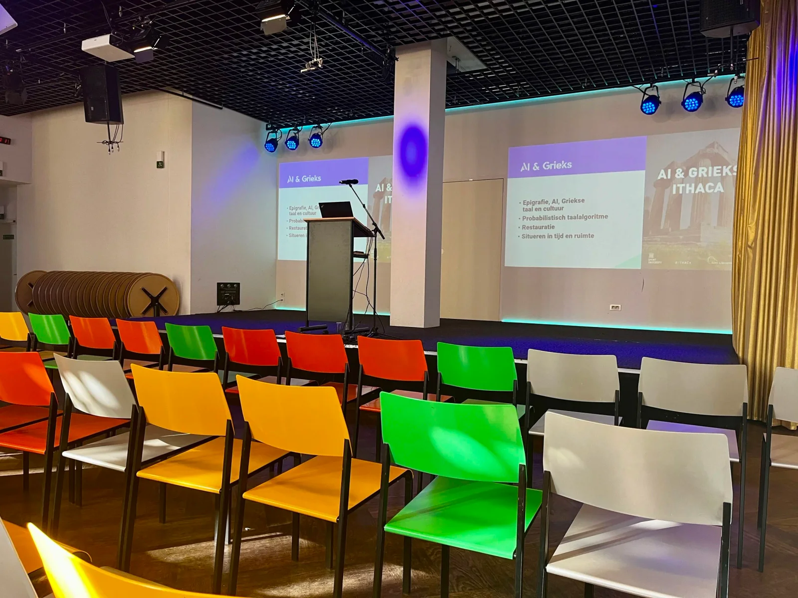

_Presentatie van het Ithaca-lesmateriaal bij het SOM evenement in Leuven, België. (2024)_

Voortbouwend op het succes van de Oudgriekse taalmodellen Pythia en Ithaca ([publicatie in Nature](https://www.nature.com/articles/s41586-022-04448-z), [AI for Education Award](/education/ai-for-education-awards), [publicatie in het vakblad Teaching History)](/education/ithaca-teaching-history-journal), hebben we educatieve middelen en opleidingen voor leraren ontwikkeld die de kracht van samenwerking tussen mens en AI laten zien. Ons doel bij die opleidingen was om leraren en bijgevolg leerlingen laten zien dat AI-technologie niet beperkt is tot STEM-vakgebieden en het menselijke expertise niet zal vervangen. In plaats daarvan is het een verrijking van de wetenschappen wanneer historici en taalkundigen kritisch kijken naar door AI gegenereerde restauraties en zo Oudgriekse inscripties analyseren, vertalen en interpreteren.

Tijdens mijn colleges aan het CNO van de Universiteit Antwerpen om docenten Grieks vertrouwd te maken met AI en ons Ithaca-model, stelden deelnemers herhaaldelijk volgende vraag: _“Kan dit ook in het Latijn?”_

In Vlaanderen studeren leerlingen van 13 tot 18 jaar doorgaans eerder Latijn in plaats van de Oudgrieks. Ithaca, dat uitsluitend is getraind op basis van Oudgriekse inscripties uit de database van het Packard Humanities Institute, kon Latijnse teksten niet rechtstreeks ondersteunen. Om onze aanpak uit te breiden, hadden we een nieuwe dataset en een herziene neurale architectuur nodig, specifiek voor het Latijn.

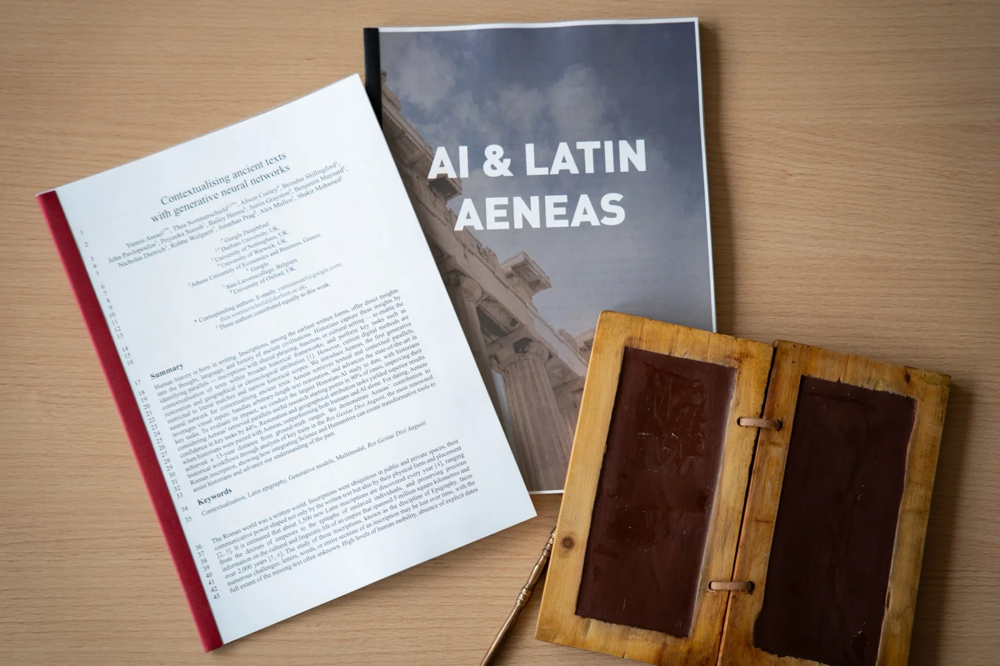

Enter Aeneas. We hebben dit nieuwe AI-model getraind op basis van de uitgebreide Latin Epigraphic Database (LED). LED bevat 176.861 inscripties uit de periode van de 7e eeuw v.Chr. tot de 8e eeuw n.Chr., verspreid over het hele Romeinse Rijk, van Brittannië tot Mesopotamië. In totaal omvat deze dataset ongeveer 16 miljoen tekens. Aeneas weerspiegelt de kernfuncties van Ithaca: karakterherstel, historische datering en geografische toewijzing. Bovendien voegt het innovatieve mogelijkheden toe, zoals het verwerken van inscripties met onbekende ontbrekende tekstlengtes en het leveren van parallelle teksten. Die functies zijn ontwikkeld om historici verder te ondersteunen in het herstellen en contextualiseren van beschadigde teksten. 

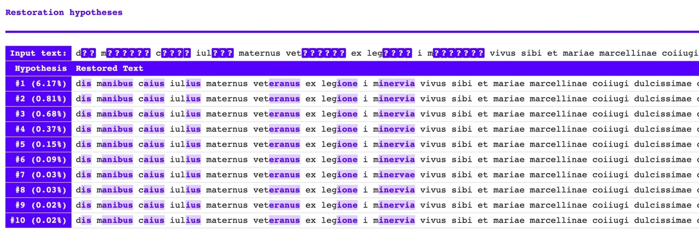 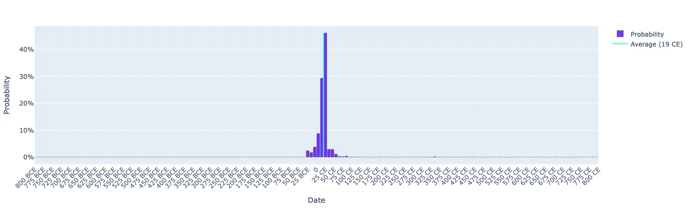 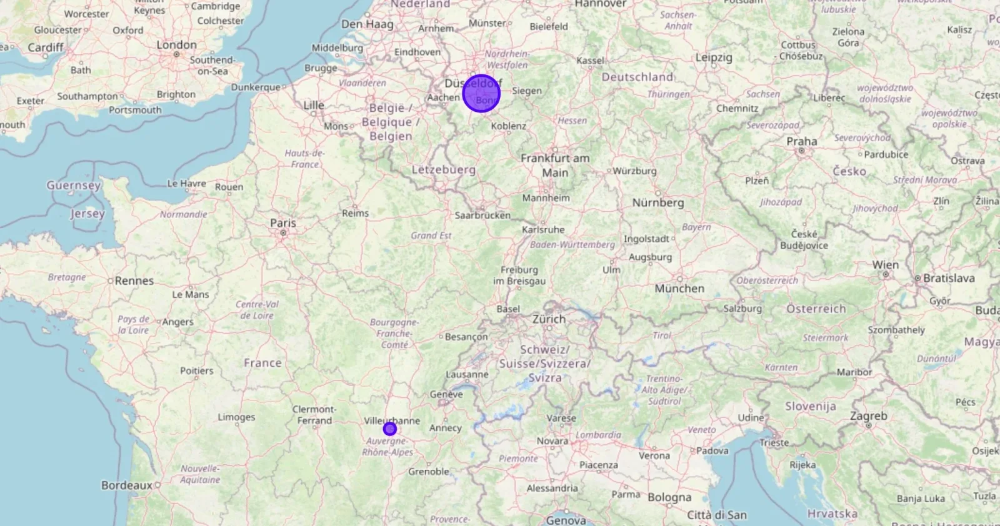

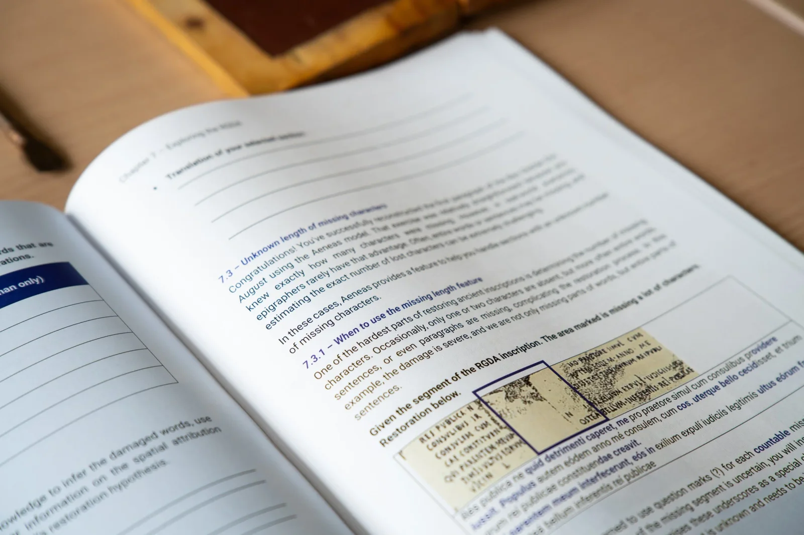

Om Aeneas grondig te evalueren, hebben we een van de grootste vergelijkende studies tot nu toe uitgevoerd. Daarbij waren 23 historici betrokken. We hebben onze AI uitgedaagd met een van de meest iconische inscripties uit de Romeinse geschiedenis, de _Res Gestae Divi Augusti_ van keizer Augustus. Daarna hebben we een expert de resultaten laten verifiëren. 

De resultaten overtroffen onze verwachtingen. Historici alleen hadden een foutenpercentage van 39,0% en bereikten slechts in 27,0% van de gevallen de juiste geografische toewijzing, met dateringsfouten van gemiddeld 31,3 jaar. Aeneas alleen behaalde een aanzienlijk lager foutenpercentage van 23,1%, identificeerde 66,7% van de locaties correct en verminderde dateringsfouten. Wanneer mensen en Aeneas samenwerkten, daalde het percentage fouten in tekens nog verder tot 21,4%, verbeterde de ruimtelijke nauwkeurigheid tot 68,3% en nam de nauwkeurigheid van de datering drastisch toe, met een gemiddelde afwijking van slechts 14,1 jaar ten opzichte van de historische werkelijkheid.

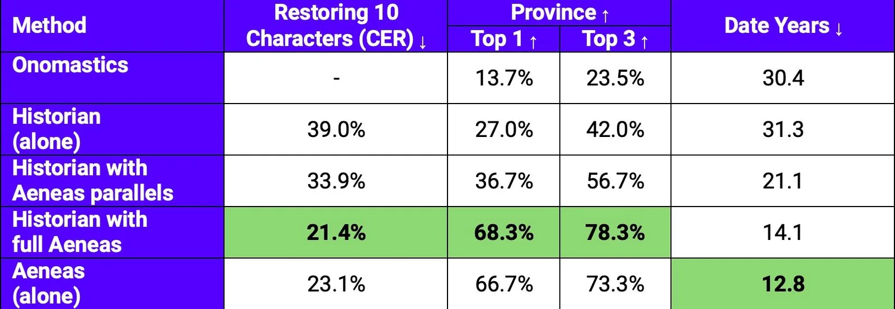

Deze resultaten laten een consistent patroon zien: geschoolde historici die AI vakkundig integreren, behalen de beste resultaten bij het interpreteren van beschadigde inscripties. We kwamen in ons eerder onderzoek bij Pythia en Ithaca tot eenzelfde conclusie. Maar hoe versterken we de AI-geletterdheid van onze toekomstige historici om het grootste voordeel te halen uit die synergie tussen mens en machine?

### AI in ons onderwijs

Om de volgende generatie historici op te leiden, verplaatsen we ons werk van puur onderzoek naar de klaslokalen, waar we rechtstreeks bijdragen aan hedendaagse discussies over AI-geletterdheid. Zoals we eerder beschreven, behoren generatieve neurale netwerken en taalmodellen tot de snelst verspreide technologieën in de huidige samenleving. Scholen, die traditioneel en etymologisch (σχολή betekent ‘vrije tijd’) enigszins los van maatschappelijke trends werden gezien, ontsnappen niet aan deze technologische- en maatschappelijke veranderingen. 

In 2023 gaf bijna de helft (49%) van de Vlaamse middelbare scholieren aan AI te gebruiken bij hun schoolwerk (_zie Vlaamse Scholierenkoepel_). In 2024 constateerde imec dat dit cijfer sterk was gestegen: 72% van de Vlaamse hogeschool- en universiteitsstudenten gebruikte generatieve AI bij hun studie. Een wijdverbreid gebruik garandeert echter niet automatisch een correct of efficiënt gebruik. Volgens een onderzoek van academische uitgeverij Acco (2024) gaf 75% van de Vlaamse studenten aan generatieve AI voornamelijk te gebruiken als vervanging voor traditionele zoekmachines. Dit specifieke gedrag illustreert een verkeerd begrip van de juiste rol en het potentieel van generatieve AI.

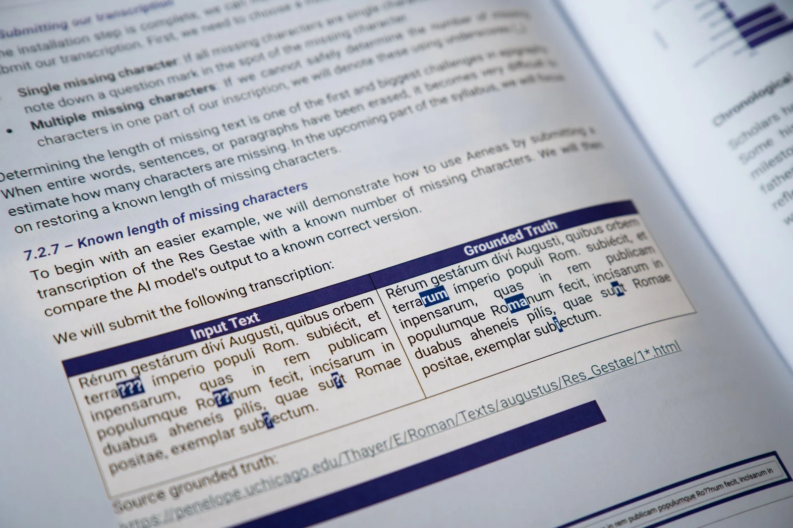

Deze misvatting komt overeen met de pedagogische mythe van de ‘_digital_ _native_’, die ervan uitgaat dat kinderen van nature superieure digitale vaardigheden verwerven doordat ze al op jonge leeftijd in aanraking komen met technologie. In werkelijkheid leidt louter vertrouwdheid met apparaten zoals computers of smartphones niet automatisch tot computationeel denken of vaardig gebruik van geavanceerde digitale hulpmiddelen. Vergelijkbaar leidt een hoge acceptatiegraad van generatieve AI op populatieniveau niet automatisch tot een effectieve toepassing ervan in onderwijssituaties of specifieke disciplines. Correcte toepassing vereist geletterdheid. Geletterdheid op haar beurt vereist vakkennis en gerichte training.

Om deze uitdaging aan te gaan, heb ik een inleidende syllabus uitgewerkt met uitgebreid lesmateriaal op basis van ons onderzoek naar Ithaca en Aeneas. Deze syllabus laat docenten kennismaken met het bredere gebied van de epigrafie, geeft een duidelijke uitleg over de structuur en functie van ons AI-model, presenteert belangrijke fundamenten en resultaten uit ons onderzoek en biedt begeleiding bij praktische toepassingen in de klas. Docenten leren Aeneas toe te passen op historisch belangrijke inscripties, maar ook op meer persoonlijke of geheimzinnige teksten, zoals liefdesbetoveringen en vloektabletten (=_defixiones_).

Onze 150 pagina's tellende syllabus biedt docenten dus uitgebreide achtergrondinformatie, praktische oefeningen, antwoordsleutels en duidelijk omschreven leerdoelen, zodat ze met vertrouwen historisch en taalkundig onderzoek kunnen onderwijzen met behulp van AI-technologie.

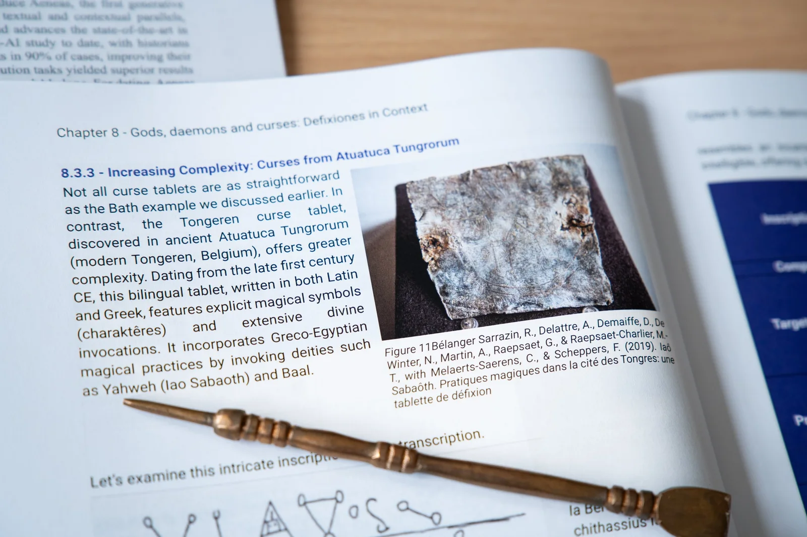

### **Impact en AI-geletterdheid**

Ons werk aan Aeneas laat een alternatieve benadering zien van hoe historici omgaan met Latijnse inscripties, waardoor hun nauwkeurigheid, efficiëntie en betrouwbaarheid worden versterkt. De resultaten van onze vergelijkende studies bevestigen dat de beste resultaten worden behaald wanneer menselijke expertise wordt gecombineerd met de mogelijkheden van Aeneas. Net zoals bij ons eerder onderzoek rond Pythia en Ithaca, toont dit de rol van AI als essentiële partner in plaats van de vervanging van menselijk handelen en denken.

In het onderwijs richten onze uitgebreide syllabus en sessies voor leraren zich actief op de competenties die zijn vastgelegd in onderwijskaders voor AI-geletterdheid, zoals het UNESCO AI Literacy Framework, DigComp 2.2 van de EU en het AI Literacy Framework van de Europese Commissie en de OESO. Op die manier werken we met docenten en leerlingen rond AI-geletterdheid en bevorderen we het begrip van hoe ze op verantwoorde wijze met generatieve neurale netwerken kunnen omgaan. Leerlingen leren niet alleen om AI-output kritisch te beoordelen, maar ook de technische onderbouw van onze AI-model, de gebruikte datasets en om AI-ondersteunde restauraties transparant te documenteren, waarbij ze expliciet gebruikmaken van gestandaardiseerde methodologieën zoals de Leiden Conventions.

Bovendien benadrukt onze afstemming op eerdergenoemde internationale onderwijskaders een mensgerichte benadering van AI. We pakken actief kwesties aan die inherent zijn aan het gebruik van AI, zoals het ‘black box’-fenomeen, door tools zoals saliency maps en gerangschikte hypothesen te integreren om de transparantie te verbeteren en menselijke besluitvorming te ondersteunen. Dit versterkt de idee dat, ondanks de geavanceerde mogelijkheden van AI, menselijk toezicht en controle belangrijk blijven. 

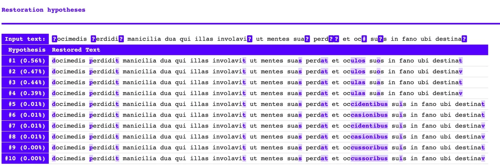

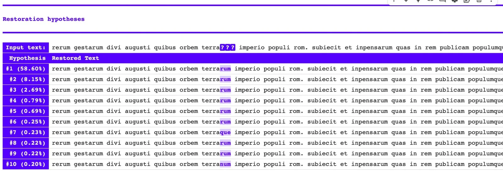

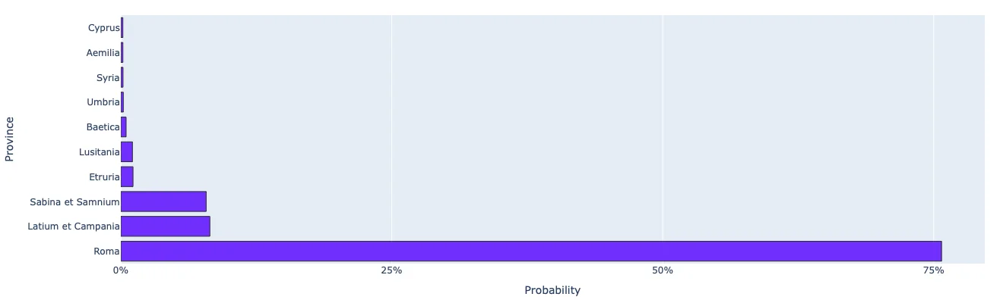

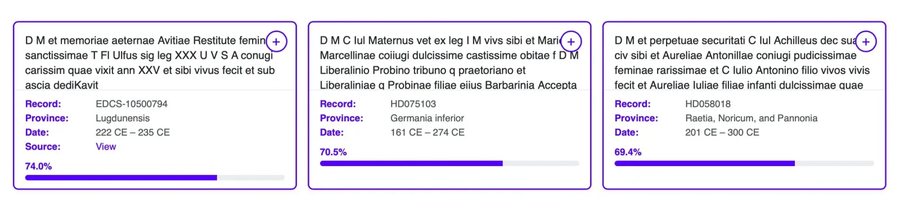

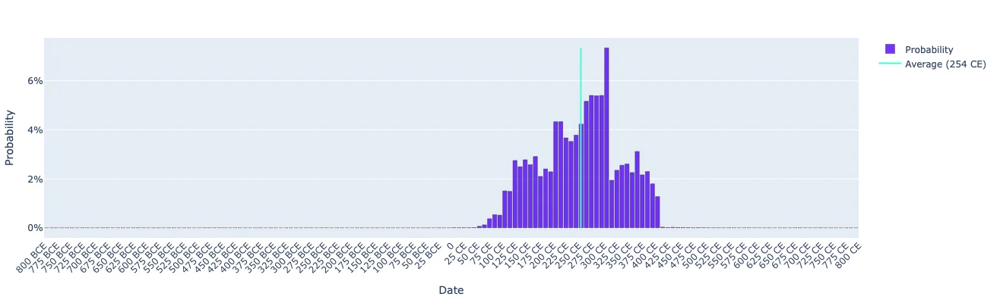

     

Om verder bij te dragen aan de integratie van AI-geletterdheid in het onderwijs, werken we samen met de Universiteit Antwerpen - Centrum Nascholing Onderwijs. Binnen het CNO staan er voor het academiejaar 2025-2026 opnieuw bijscholingen op het programma over dit lesmateriaal en ons onderzoek. 

### En wat met Grieks?

Hier komen we ‘full circle’. We begonnen enkele jaren geleden ons wetenschappelijk avontuur met de AI-modellen Pythia en Ithaca om Oudgriekse inscripties te herstellen en contextualiseren. Het onderzoek verscheen in Nature, het bijhorende lesmateriaal werd [tweemaal bekroont bij de AI for Education Awards](/onderwijs/ai-for-education-awards-tweemaal-prijs). Met de ontwikkeling van Aeneas maakten we niet alleen een AI-model dat feature compleet is met Ithaca, maar architecturale verbeteringen bevat en zelfs meer functies biedt dan z’n voorgangers. Wanneer we zowel Aeneas als Ithaca trainen op onze dataset aan Latijnse inscripties (LED) kan je deze architecturale verbeteringen duidelijk zien. Dan rijst natuurlijk de vraag: wat met Ithaca en onze Griekse inscripties?

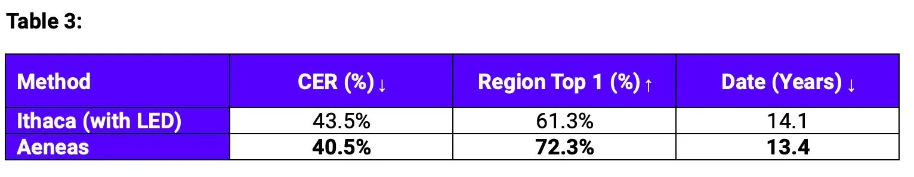

Aeneas biedt niet alleen de mogelijkheid om te redeneren met een Latijnse dataset, maar kan ook switchen naar het Grieks. Met een eenvoudige knop schakel je als gebruiker naar het de Griekse versie (met eigen checkpoint, dataset en embeddings). Vanaf daar mag je dezelfde workflow en functies verwachten als wanneer we aan de slag gaan met Latijnse inscripties. Aeneas biedt geografische en chronologische toewijzingen, restaureert inscripties met bekende en onbekende ontbrekende tekenlengtes, biedt saliency mappings en kan parallelle Griekse inscripties berekenen.

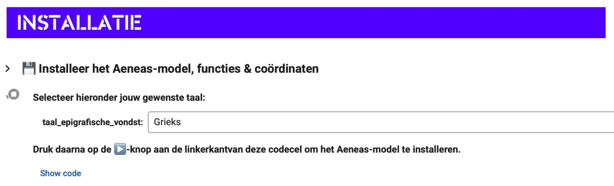

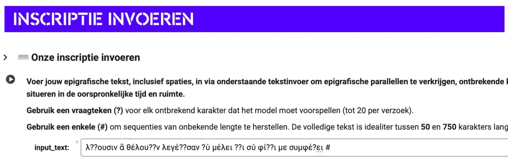

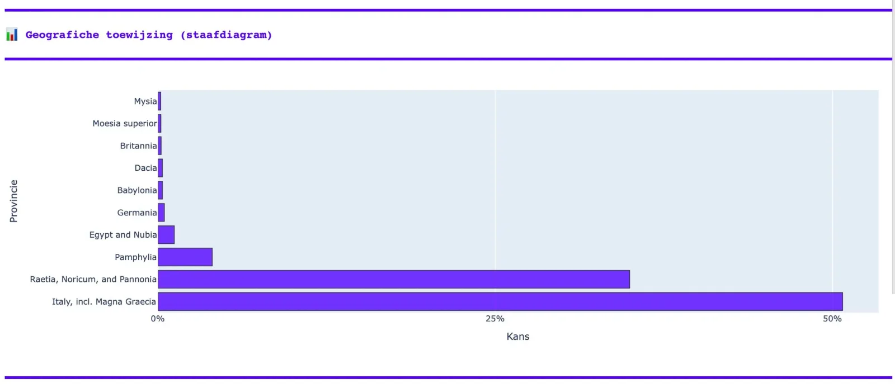

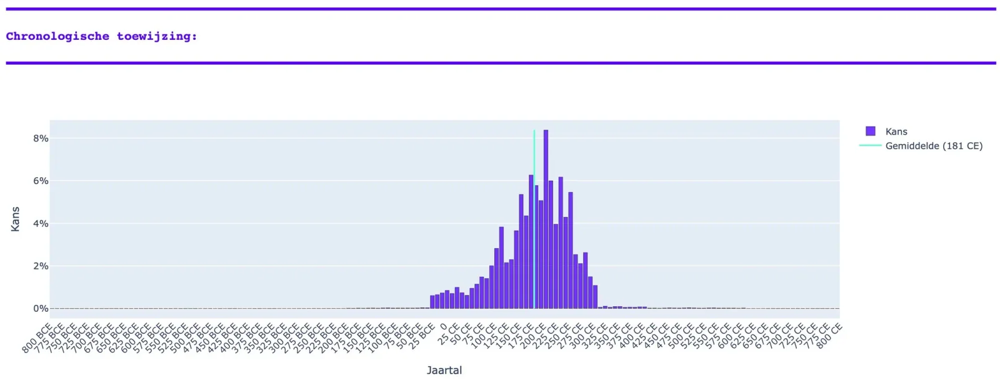

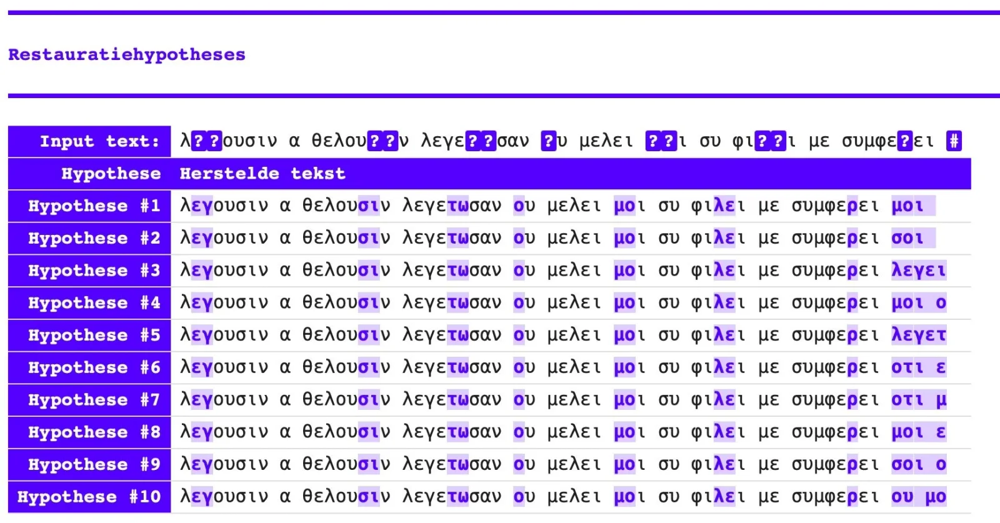

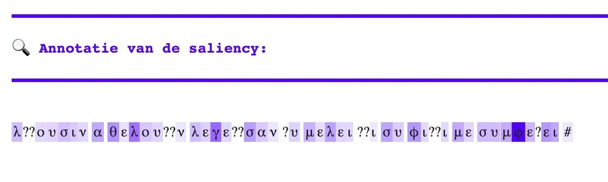

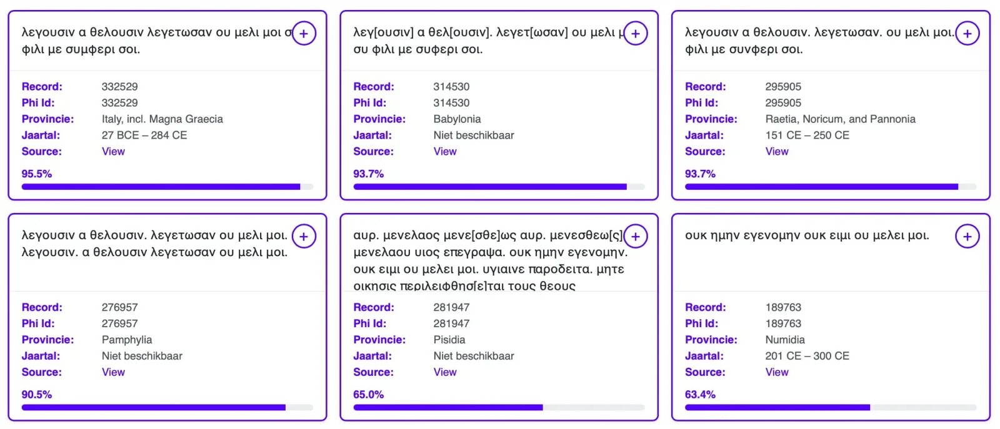

      

Ook de syllabus en lesmaterialen die we maakten met Ithaca krijgen een update. In de aangepaste syllabus maken we een reis langsheen verschillende inscripties. We hebben het niet over vervloekingen, maar over muzen, liefde en wat eigenwijze poëzie. Meer hierover kan je lezen in onze publicatie voor het [vakblad ‘Teaching History’.](/onderwijs/ithaca-teaching-history-journal) 

### **Reflectie**

Ons werk aan Aeneas, net als eerdere projecten zoals Pythia en Ithaca, laat zien hoe generatieve neurale netwerken, mits verantwoord gebruikt, een versterking kunnen betekenen voor geschiedkundig- en taalkundig onderzoek. Bij elk project was ons doel eenduidig: tools, onderzoek en educatieve middelen bieden waarmee mensen hun AI-geletterdheid kunnen versterken en ze AI effectief kunnen integreren in hun specifieke academische en professionele werkprocessen.

We hopen dat deze inspanningen historici en classici ondersteunen om nauwkeuriger en inzichtelijker onderzoek te doen. Voor docenten tonen onze materialen dat klassieke talen en informaticawetenschappen elkaar verrijken in plaats van los van elkaar staan. Voor leerlingen willen we de achterliggende werking van AI-technologie ontrafelen en de onmisbare rol duiden die menselijke kennis, vaardigheden en kritisch denken blijven spelen binnen die AI-geletterdheid. 

### Bronnen

-   Assael, Y.,\* Sommerschield, T.,\* Cooley, A., Shillingford, B., Pavlopoulos, J., Suresh, P., Herms, B., Grayston, J., Maynard, B., Dietrich N., Wulgaert, R., Prag, J., Mullen, A., Mohamed, S. (2025). “Contextualising ancient texts with generative neural networks”. In Nature [https://www.nature.com/articles/s41586-025-09292-5](https://www.nature.com/articles/s41586-025-09292-5)

-   Assael, Y.,\* Sommerschield, T.,\* Shillingford, B., Bordbar, M., Pavlopoulos, J., Chatzipanagiotou, M., Androutsopoulos, I., Prag, J., de Freitas, N. (2022). “Restoring and attributing ancient texts with deep neural networks”. In Nature, 603(7900): 280–283. https://www.nature.com/articles/s41586-022-04448-z

-   Booms, D. (2016). Latin Inscriptions (Getty Publications - British Museum Press).

-   Cooley, A. (2012). The Cambridge Manual of Latin Epigraphy (Cambridge University Press).

-   European Commission, European Education and Culture Executive Agency, (2023). AI report: by the European Digital Education Hub’s Squad on artificial intelligence in education, Publications Office of the European Union. https://data.europa. eu/doi/10.2797/828281

-   Liddel, P. (2025). Greek Inscriptions (Getty Publications - British Museum Press).

-   Miao, F., & Shiohira, K. (2024). AI competency framework for students. UNESCO. [https://doi.org/10.54675/JKJB9835](https://doi.org/10.54675/JKJB9835)

-   Miao, F., & Cukurova, M. (2024). AI competency framework for teachers. UNESCO. [https://doi.org/10.54675/ZJTE2084](https://doi.org/10.54675/ZJTE2084)

-   OECD (2025). Empowering learners for the age of AI: An AI literacy framework for primary and secondary education (Review draft). OECD. Paris. [https://ailiteracyframework.org](https://ailiteracyframework.org/)

-   Urbanová, D. (2017). Latin curse texts: Mediterranean tradition and local diversity. Acta Antiqua Academiae Scientiarum Hungaricae, 57(1), 57–82. [https://doi.org/10.1556/068.2017.57.1.5](https://doi.org/10.1556/068.2017.57.1.5)

-   Wulgaert, R. (2023). "Ithaca AI meets ancient Greek: Muses and robots in the classroom". In Teaching History, 57(3), 16–20.

-   Wulgaert, R. (2023). AI & Greek – Ithaca syllabus - [https://www.robbewulgaert.be/education/ai-and-greek-epigraphy-with-a-robot](/education/ai-and-greek-epigraphy-with-a-robot)

-   Wulgaert, R. (2025). AI & Latin Aeneas - syllabus

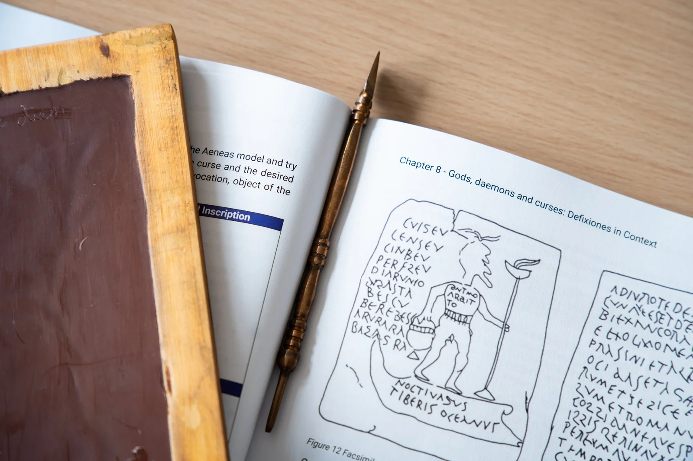

### Ik wil dit ook in mijn klas!

Artificiële intelligentie is niet meer weg te denken uit onze samenleving. Maar hoe zet je dit gericht en efficiënt in? Hoe werk je binnen jouw vakdomein aan die AI-geletterdheid? Ons werk probeert jou daarbij te helpen!

1) Dit lesmateriaal is een aanzet, een ‘_work in progress_’ en dient te worden uitgetest door echte professionals: leraren Latijn en hun klasgroepen. Wil jij **meeschrijven** aan dit verhaal? Neem dan hieronder contact op!

2) Ben je gewoon benieuwd naar de Nederlandstalige versie van de **syllabus**? Dan kan je die hieronder in PDF-formaat downloaden. 

3) Ben je op zoek naar een **nascholing** om jou vertrouwd te maken met dit lesmateriaal en de achterliggende AI-technieken? Dan ben je bij het CNO van de Universiteit Antwerpen aan het juiste adres!

<a class="content-button content-button--primary content-button--medium" href="https://raw.githubusercontent.com/RobbeW/aiindeklas/main/aeneas/syllabus/NL_Syllabus_Epigrafie_Aenaes.pdf" target="_blank" rel="noreferrer">Download de syllabus</a>

<a class="content-button content-button--primary content-button--medium" href="/contactinfo">Schrijf mee aan dit verhaal!</a>

<a class="content-button content-button--primary content-button--medium" href="https://www.uacno.be/25LAT018A" target="_blank" rel="noreferrer">Is er een nascholing? Ja hoor!</a>

