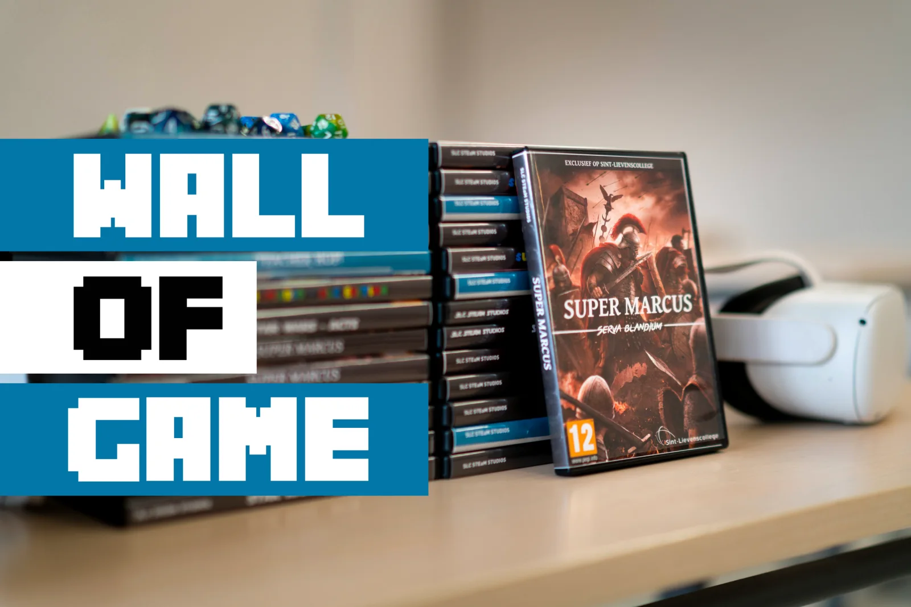

Het zal je misschien verbazen, maar film of muziek zijn niet de grootste sectoren in het medialandschap. Dat blijken games te zijn! Van computer games tot mobile games, consoles en streamers … Het is een gigantische markt. Ook veel jongeren gamen, [gemiddeld zelfs 11 uur per week!](https://www.vrt.be/vrtnws/nl/2019/06/14/11-uur-per-week-zoveel-gamen-jongeren-gemiddeld/)Maar wat als je jouw eigen game kon ontwerpen? Van sprites tot spelregels volledig zelf uitwerken? Dit combineren met programmeerconcepten of jouw kennis Latijn en Grieks?

Wel, dat kan! Elk jaar krijgen mijn leerlingen de kans om zich uit te dagen en in te leven via een introductie game design. De beste ontwerpen worden beloond met een plaats in de **‘Wall of Game’**. Dat is niet één fysieke muur, maar op verschillende plekken op de campus hangen affiches en zijn DVD boxen te vinden van hun game. Via een eenvoudige QR-code kunnen medeleerlingen hun game testen, uitspelen en trachten dé highscore neer te zetten!

Hieronder vind je de huidige selectie van games in de **‘Wall of Game 2022-2023’**. Dit zijn de covers die werden ontworpen voor de DVD-doosjes om de games van de leerlingen te promoten.

[Volledige grootte weergeven 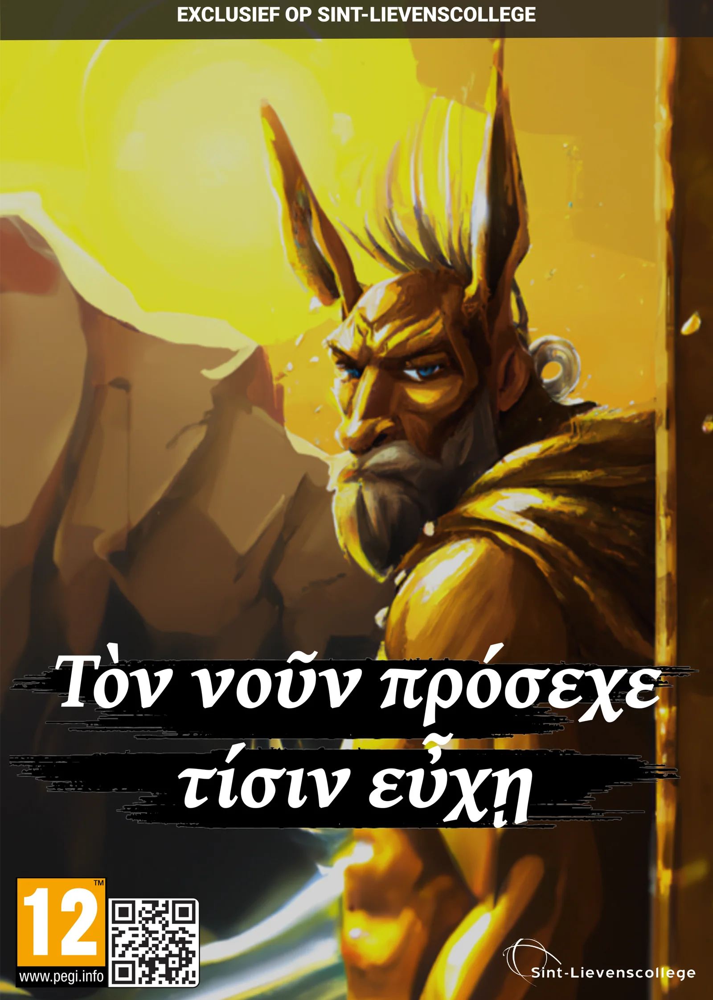](https://images.squarespace-cdn.com/content/v1/6026af223ff1970db5c08fb8/1671449175322-24O429X2W70KGL7ENF55/Affiche+King+Midas.png)

[Volledige grootte weergeven 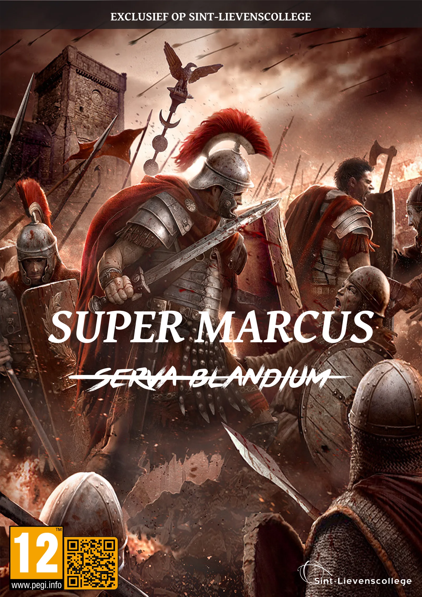](https://images.squarespace-cdn.com/content/v1/6026af223ff1970db5c08fb8/1671532006839-PZRTD154UGQFKB1V0H4Z/Affiche+Super+Marcus+-+Super+Marcus+A3.png)

[Volledige grootte weergeven 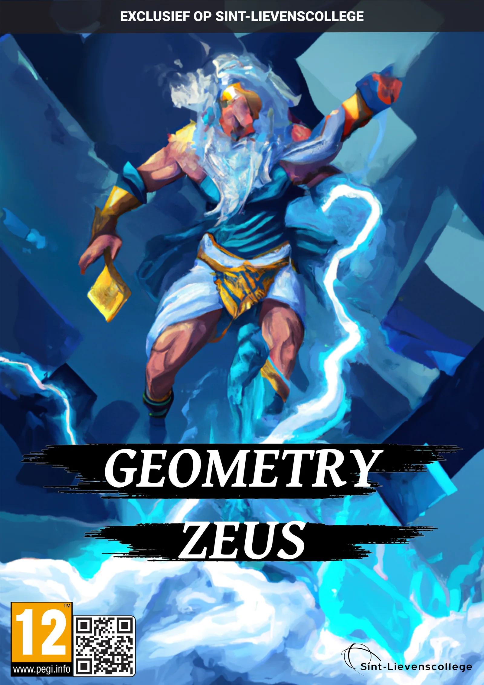](https://images.squarespace-cdn.com/content/v1/6026af223ff1970db5c08fb8/1671531735129-O2QE3PB3KIW20OMUX61T/Affiche+Geometry+Zeus.png)

[Volledige grootte weergeven 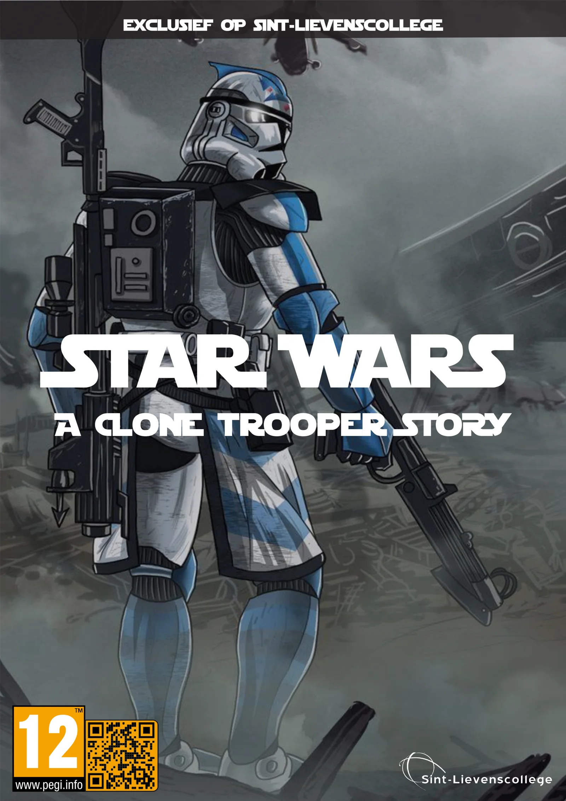](https://images.squarespace-cdn.com/content/v1/6026af223ff1970db5c08fb8/1671531649009-AB5FQXU0UJSMQJY0ON0V/Affiche+Super+Marcus+-+Star+Wars+A3.png)

[Volledige grootte weergeven 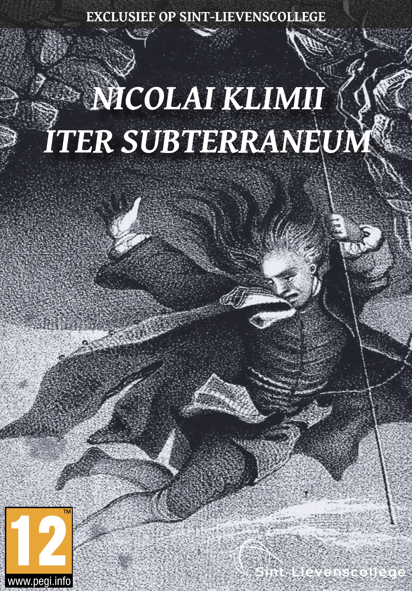](https://images.squarespace-cdn.com/content/v1/6026af223ff1970db5c08fb8/1671531675931-4D2XBP6ZLD0OWT52Q3PV/DVD+Game+Cover+-+Nicolai+klimii.png)

[Volledige grootte weergeven 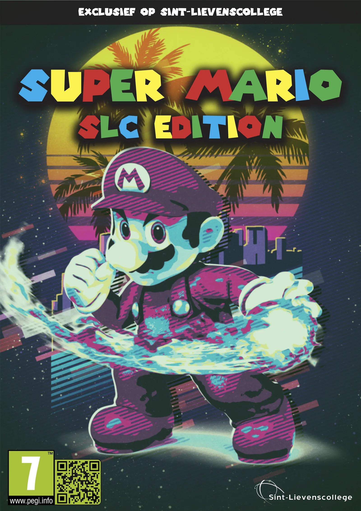](https://images.squarespace-cdn.com/content/v1/6026af223ff1970db5c08fb8/1671531691037-3GC3LXECOZ6H3ZFYUODN/Affiche+Super+Marcus+-+Super+Mario.png)

[Volledige grootte weergeven 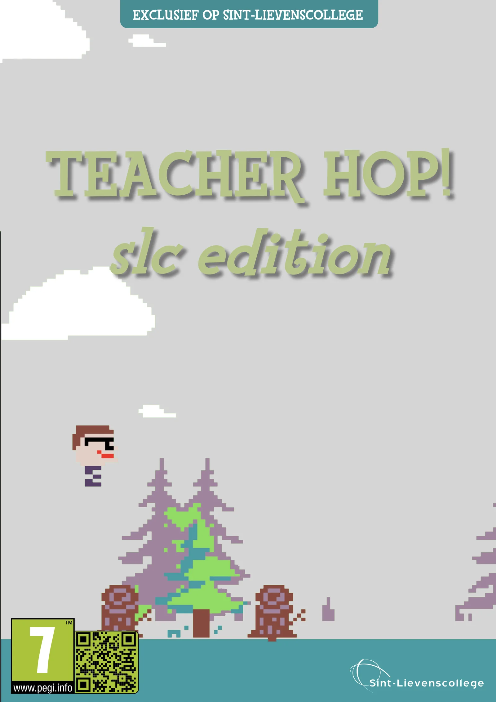](https://images.squarespace-cdn.com/content/v1/6026af223ff1970db5c08fb8/1671531655187-MPD0ORTEQL8TU5Y18M5T/Affiche+Teacher+Hop+-+A3.png)

[Volledige grootte weergeven 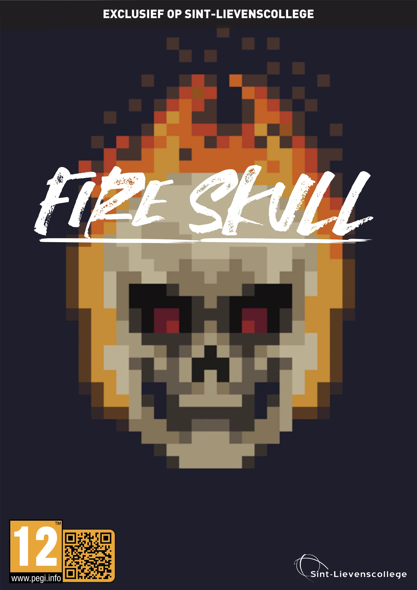](https://images.squarespace-cdn.com/content/v1/6026af223ff1970db5c08fb8/1671531730895-WEDCMYFSNH568ZKR4XK1/Affiche+Super+Marcus+-+Fire+Skull.png)

[Volledige grootte weergeven 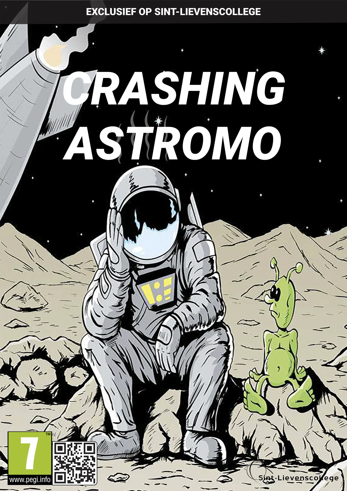](https://images.squarespace-cdn.com/content/v1/6026af223ff1970db5c08fb8/1671531726436-5DVWJ0OELEWVBKCMQ7CO/Affiche+Crashing+Astromo.png)

[Volledige grootte weergeven 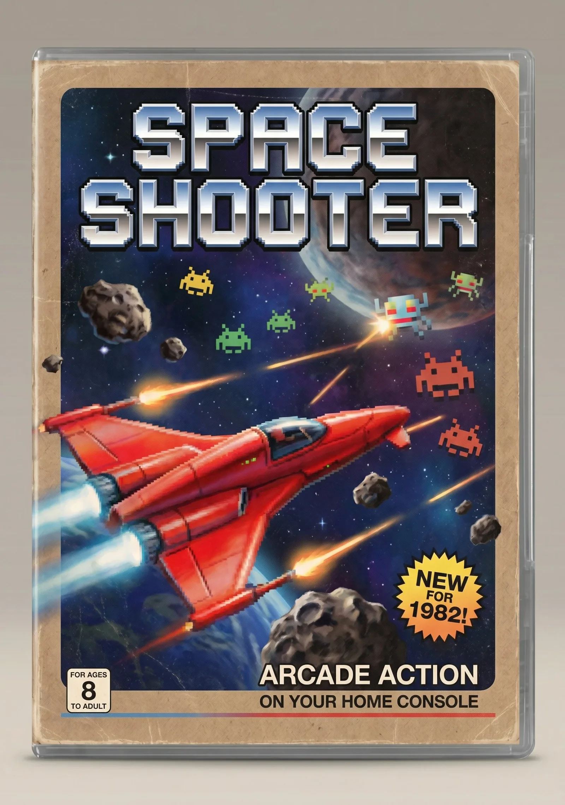](https://images.squarespace-cdn.com/content/v1/6026af223ff1970db5c08fb8/1776589916306-4154PNYGRMC5VTBXR3JN/space_shooter_2.jpg)

### Ik wil dit in mijn klas! Wat moet ik doen?

De lessenreeks ‘Game Design’ is maar één onderdeel in onze verticale leerlijn informaticawetenschappen, computationeel denken en programmeren. Het is een onderdeel waar we al mooie resultaten mee hebben geboekt. Zo maakten we een game over de Romeinse geschiedenis van de Blandijnberg in Gent. Sofie Baeckelandt en Laura Naeye van de UGent gebruik van deze methode om een game te maken rond een post-klassieke Latijnse tekst.

<a class="content-button content-button--primary content-button--medium" href="/onderwijs/latijn-en-game-design">Latijn en Game Design</a>

<a class="content-button content-button--primary content-button--medium" href="/onderwijs/super-marcus">Romeinse Geschiedenis van Gent</a>

