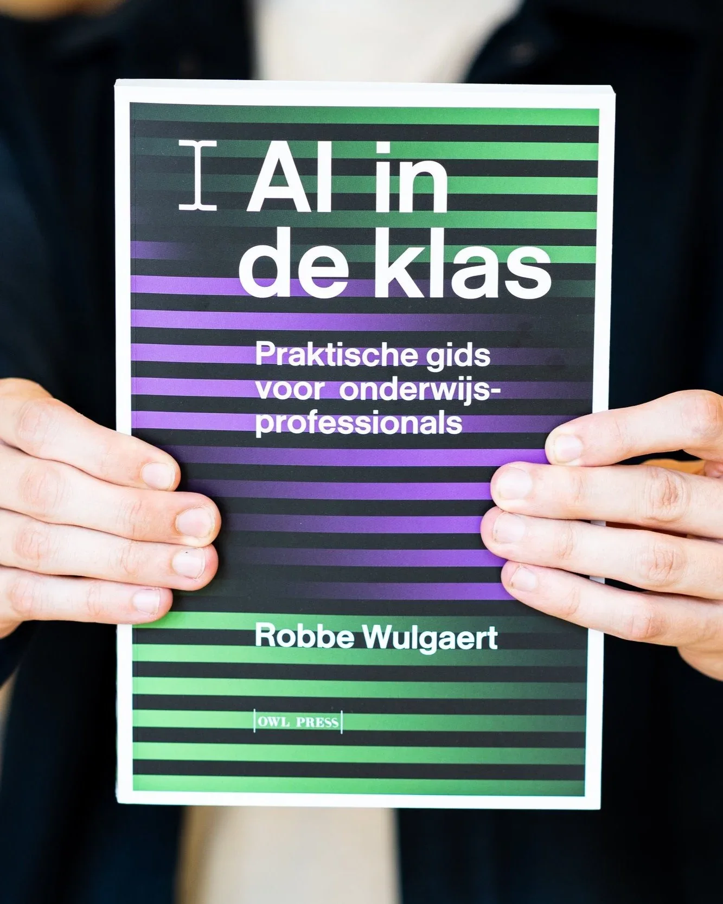

## AI in de klas

### Praktische gids voor onderwijsprofessionals

-   _“AI zal onze jobs overnemen”_                                                                                                 

-   _“Leerlingen maken hun huiswerk met ChatGPT”_                                                               

-   _“Leerkrachten maken hun lessen met ChatGPT”_                                                                               

-   _“Punten scoren via AI-samenvattingen”_                                                      

Eén voor één voorbeelden van koppen waarmee je tegenwoordig om de oren wordt geslagen. AI is overal en blijkt vooral in het onderwijs een eindeloos discussiepunt. Dit boek tracht orde te scheppen in de chaos en verkent de manieren waarop we leerlingen essentiële AI-comptenties kunnen bijbrengen, van concreet lesmateriaal tot volledige leerlijnen.

Gebaseerd op Europese richtlijnen, beleidsnota’s en recent onderzoek, biedt _AI in de klas_ kant-en-klare lessen en didactische inzichten om met AI in het secundair onderwijs  en/of in lerarenopleidingen aan de slag te gaan. Het behandelt de integratie van AI binnen diverse vakgebieden; van kunst over moderne talen tot Tacitus en Oudgriekse epigrafie. Telkens met oog voor de voordelen, maar ook voor de vooroordelen, valkuilen en (gevaren voor de) leerwinst.

Ontdek hoe AI ons onderwijs steeds meer beïnvloedt en hoe je deze technologie kunt inzetten om belangrijke competenties te ontwikkelen en beschermen. AI zal de job niet snel overnemen, integendeel, goed geïnformeerde leerkrachten zullen onmisbaar worden in dit nieuwe, spannende AI-tijdperk!

**Robbe Wulgaert**, leerkracht informaticawetenschappen en AI aan het Sint-Lievenscollege in Gent en gastdocent aan de Universiteit Antwerpen, deelt zijn ervaring via praktische toepassingen en concrete lessen. Hij is ook bekend van zijn bijdragen aan podcasts en VRT-programma’s over AI in ons onderwijs.

<a class="content-button content-button--primary content-button--medium" href="https://www.borgerhoff-lamberigts.be/owl-press/shop/boeken/ai-in-de-klas?variant=179580" target="_blank" rel="noreferrer">Bestel / reserveer hier!</a>

<a class="content-button content-button--primary content-button--medium" href="/contact">Contacteer de auteur</a>

