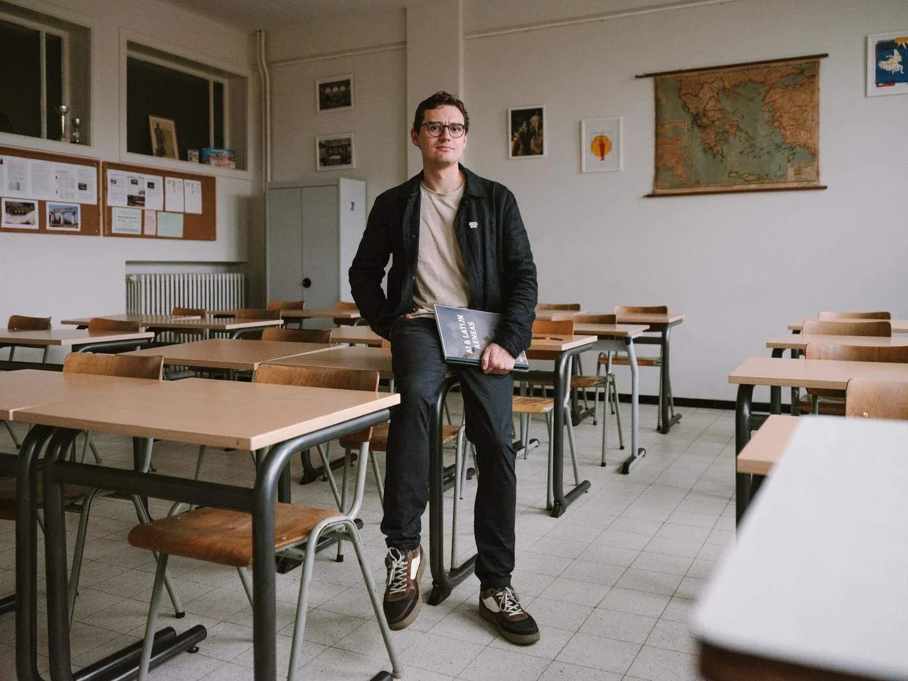
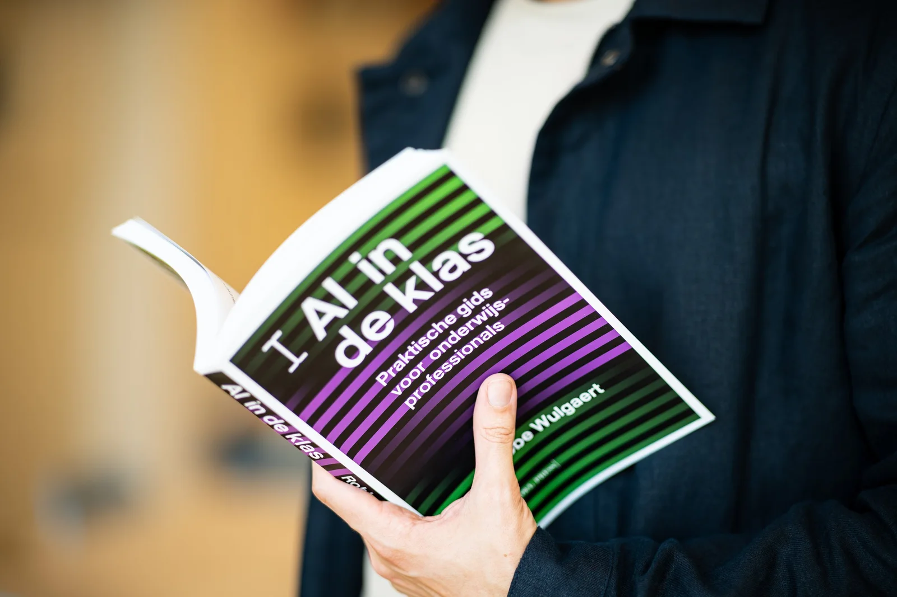

# Hoi, ik ben Robbe!

Ik ben leraar programmeren, artificiële intelligentie en Design Thinking in Gent. Meestal sta ik voor de klas op het Sint-Lievenscollege, geef ik les bij het Centrum Nascholing Onderwijs van de Universiteit Antwerpen of ben ik druk aan het schrijven als AI-onderzoeker in een Gentse koffiebar. Daarnaast ben ik auteur van het boek [**_AI in de klas – Praktische gids voor onderwijsprofessionals_**](/boek) en van het onderzoek [_‘_**_Contextualizing ancient texts with generative neural networks’._**](https://www.nature.com/articles/s41586-025-09292-5)

Ben je gepassioneerd door of nieuwsgierig naar onderwijs over programmeren, computationeel denken en AI-geletterdheid? Op mijn website vind je tal van voorbeelden van concreet lesmateriaal, dat ik ook graag in boekvorm of persoonlijk bij jou op school of in jouw organisatie toelicht.

<a class="content-button content-button--primary content-button--medium" href="/boek">Meer info over mijn boek!</a>

<a class="content-button content-button--primary content-button--medium" href="/onderwijs/workshops-en-nascholingen">Aanbod nascholingen</a>

<a class="content-button content-button--primary content-button--medium" href="/onderwijs">Mijn lesmateriaal</a>

<a class="content-button content-button--primary content-button--medium" href="/contact">Neem contact op!</a>

